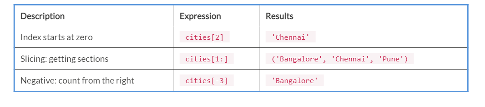

Lab 1. Python Scripting Overview
---------------------------------------------


This lab will cover the following topics:


-   Python scripting
-   Installing and using Python and various tools
-   Variables, numbers, and strings
-   Python supported data structures and how to use all of these
    concepts in a script
-   Decision making; that is, the `if` statement
-   Looping statements; that is, the `for` and `while` loops
-   Functions
-   Modules


### Starting the interactive console


Run the following command to start Python\'s interactive console:


```
$ python
```

This will start the default Python interactive console.

In Linux, if we write `Python` in the Terminal,
the `python2.7` console starts. If you want to start
the `python3` console, then enter `python3` in the
Terminal and press [*Enter*].


### Writing scripts with the Python interactive console


The Python interactive console starts from `>>> prefix`. This
console will accept the Python commands,
which you\'ll write after `>>> prefix`. Refer to the following
screenshot:


 

Now, we will see how to assign values to the variable, as in the
following example:


```
>>> name = John
```

Here, we\'ve assigned a character value of `John` to the
`name` variable. We pressed [*Enter*] and received
a new line with `>>> prefix`:


```
>>> name = John
```

Now, we will see an example of assigning values to variables and
then we will perform a math operation to get
the values:


```
>>> num1 = 5000
>>> num2 = 3500
>>> num3 = num1 + num2
>>> print (num3)
8500
>>> num4 = num3 - 2575
>>> print (num4)
5925
>>>
```

Here, we assigned values to variables, added two variables, stored the
result in a third variable, and printed the result on to the Terminal.
Next, we subtracted one variable from the result variable, and the
output will get stored in the fourth variable. Then, we printed the
result on to the Terminal. So this tells us that we can also use the
Python interpreter as a calculator:


```
>>> 509 / 22
23.136363636363637
>>>
```

Here, we performed a division operation. We divided `509` by
`22` and the result we got is `23.136363636363637.`


### Multiple lines


When we write multiple lines of code in the Python interpreter (for example, the `If` statement
and `for` and `while` loop functions), then the
interpreter uses three dots (`...`) as a secondary prompt for
line continuation. To come out of these lines, you have to press
the [*Enter*] key twice. Now we will look at the following
example:


```
>>> val1 = 2500
>>> val2 = 2400
>>> if val1 > val2:
... print("val1 is greater than val2")
... else:
... print("val2 is greater than val1")
...
val1 is greater than val2
>>>
```

In this example, we\'ve assigned integer values to two
variables, `val1` and `val2`, and we\'re checking
whether `val1` is greater than `val2` or not. In
this case, `val1` is greater than `val2`, so the
statement in the `if` block gets printed. Remember, statements
in `if` and `else` blocks are indented. If you
don\'t use indentation, you will get the following error:


```
>>> if val1 > val2:
... print("val1 is greater than val2")
File "<stdin>", line 2
print("val1 is greater than val2")
^
IndentationError: expected an indented block
>>>
```


### Importing modules through the Python interpreter


If you are importing any module, then the Python interpreter checks if that module is available or not. You
can do this by using the `import` statement. If that module is
available, then you will see the `>>>` prefix after pressing
the [*Enter*] key. This indicates that the execution was
successful. If that module doesn\'t exist, the Python interpreter will
show an error:


```
>>> import time
>>>
```

After importing the `time` module, we get the `>>>`
prefix. This means that the module exists and this command gets executed
successfully:


```
>>> import matplotlib
```

If the module doesn\'t exist, then you will get `Traceback`
error:


```
File "<stdin>", line 1, in <module>
ImportError: No module named 'matplotlib'
```

So here, `matplotlib` isn\'t available, so it gives an error:
`ImportError: No module named 'matplotlib'.`

To solve this error, we will have to install `matplotlib` and
then again try to import `matplotlib`. After installing
`matplotlib`, you should be able to import the module, as
follows:


```
>>> import matplotlib
>>>
```


#### The keyboard shortcut


The keyboard shortcut, [*Ctrl + D,*] will give you the
following code:


```
>>> val1 = 5000
>>> val2 = 2500
>>>
>>> val3 = val1 - val2
>>> print (val3)
2500
>>>
student@ubuntu:~$
```


#### Using the quit() or exit() functions


`quit()` will take you out of Python\'s
interactive console. It will also take you to
the original Terminal you were previously in:


```
>>> Lion = 'Simba'
>>> quit()
student@ubuntu$
```


### Indentation and tabs


We use indentation to indicate the block of code in Python programs. To
indent a block of code, you can use spaces or tabs. Refer to the
following example:


```
if val1 > val2:
    print ("val1 is greater than val2")
print("This part is not indented")
```

In the preceding example, we indented the `print` statement
because it comes under the `if` block. The next print
statement doesn\'t come under the `if` block and that\'s why
we didn\'t indent it.


### Variables


In Python, the value of a variable may change during the program
execution, as well as the type. In the following line of code, we assign
the value `100` to a variable:


```
n = 100
Here are assigning 100 to the variable n. Now, we are going to increase the value of n by 1:
>>> n = n + 1
>>> print(n)
101
>>>
```

The following is an example of a type of variable that can change during
execution:


```
a = 50 # data type is implicitly set to integer
a = 50 + 9.50 # data type is changed to float
a = "Seventy" # and now it will be a string
```

Python takes care of the representation for the different data types;
that is, each type of value gets stored in different memory locations. A
variable will be a name to which we\'re going to assign a value:


```
>>> msg = 'And now for something completely different'
>>> a = 20
>>> pi = 3.1415926535897932
```

This example makes three assignments. The first assignment is a string
assignment to the variable named `msg`. The second assignment
is an integer assignment to the variable named `a` and the
last assignment is a `pi` value assignment.

The type of a variable is the type of the value it refers to. Look at
the following code:


```
>>> type(msg)
<type 'str'>
>>> type(a)
<type 'int'>
>>> type(pi)
<type 'float'>
```


#### Creating and assigning values to variables


Consider the following example:


```
#!/usr/bin/python3
name = 'John'
age = 25
address = 'USA'
percentage = 85.5
print(name)
print(age)
print(address)
print(percentage)

Output:
John
25
USA
85.5
```

In the preceding example, we assigned `John` to
the `name` variable, `25` to the `age`
variable, `USA` to the `address` variable, and
`85.5` to the `percentage` variable.

We don\'t have to declare them first as we do in other languages. So,
looking at the value interpreter will get the type of that variable. In
the preceding example, `name` and `address` are
`strings`, age is an integer, and percentage is a floating
type.

 

 

Multiple assignments for the same value can be done as follows:


```
x = y = z = 1
```

In the preceding example, we created three variables and assigned an
integer value `1` to them, and all of these three variables
will be assigned to the same memory location.

In Python, we can assign multiple values to multiple variables in a
single line:


```
x, y, z = 10, 'John', 80
```

Here, we declared one string variable, `y`, and assigned the
value `John` to it and two integer variables, `x`
and `z`, and assigned values `10` and `80`
to them, respectively.

### Numbers


The Python interpreter can also act as a
calculator. You just have to type an expression and it will return the
value. Parentheses `( )` are used to do the grouping, as shown
in the following example:


```
>>> 5 + 5
10
>>> 100 - 5*5
75
>>> (100 - 5*5) / 15
5.0
>>> 8 / 5
1.6
```

The integer numbers are of the `int`type and a fractional part
is of the `float` type.


### Note

In Python, the division (`/`) operation always returns a float
value. The `floor` division (`//`) gets an integer
result. The `%` operator is used to calculate the remainder.


Consider the following example:


```
>>> 14/3
4.666666666666667
>>>
>>> 14//3
4
>>>
>>> 14%3
2
>>> 4*3+2
14
>>>
```

To calculate powers, Python has the `**` operator, as shown in
the following example:


```
>>> 8**3
512
>>> 5**7
78125
>>>
```

The equal sign (`=`) is used for assigning a value to a
variable:


```
>>> m = 50
>>> n = 8 * 8
>>> m * n
3200
```

If a variable does not have any value and we still try to use it, then
the interpreter will show an error:


```
>>> k
Traceback (most recent call last):
File "<stdin>", line 1, in <module>
NameError: name 'k' is not defined
>>>
```

If the operators have mixed types of operands, then the value we get
will be of a floating point:


```
>>> 5 * 4.75 - 1
22.75
```

In the Python interactive console, `_` contains the last
printed expression value, as shown in the following example:


```
>>> a = 18.5/100
>>> b = 150.50
>>> a * b
27.8425
>>> b + _
178.3425
>>> round(_, 2)
178.34
>>>
```

Number data types store numeric values, which are immutable data types.
If we do this, Python will allocate a new object for the changed data
type.

We can create number objects just by assigning a value to them, as shown
in the following example:


```
num1 = 50
num2 = 25
```

The `del` statement is used to delete single or multiple
variables. Refer to the following example:


```
del num
del num_a, num_b
```


#### Number type conversion


In some situations, you need to convert a
number explicitly from one type to another to satisfy some requirements.
Python does this internally in an expression


-   Type `int(a)` to convert `a` into an integer
-   Type `float(a)` to convert `a` into a
    floating-point number
-   Type `complex(a)` to convert `a` into a complex
    number with real part `x` and imaginary part
    `zero`
-   Type `complex(a, b)` to convert `a` and
    `b` into a complex number with real part `a` and
    imaginary part `b`. `a` and `b` are
    numeric expressions


Strings
-------------------------


Like numbers, strings are also one of the
data structures in Python. Python can manipulate strings. Strings can be
expressed as follows:


-   Enclosed in single quotes (`'...'`)
-   Enclosed in double quotes (`"..."`)


See the following example:


```
>>> 'Hello Python'
'Hello Python'
>>> "Hello Python"
'Hello Python'
```

A string is a set of characters. We can access the characters one at a
time, as follows:


```
>>> city = 'delhi'
>>> letter = city[1]
>>> letter = city[-3]
```

In the second statement, we are selecting the character number
`1` from `city` and assigning it to
`letter`. The number in those square brackets is an index. The
index indicates which character you want to access. It starts from
`0`. So, in the preceding example, when you will execute
`letter = city[1]`, you will get the following output:


```
city d e l h i
index 0 1 2 3 4
-5 -4 -3 -2 -1

Output:
e
l
```


### Concatenation (+) and repetition (\*)


Next, comes concatenation and repetition.
Refer to the following code:


```
>>> 3 * 'hi' + 'hello'
'hihihihello'
```

In the preceding example, we are doing string concatenation and
repetition. `3 * 'hi'` means `hi` gets printed
`3` times and, using the `+` sign, we are joining
the `hello` string next to `hi`.

We can automatically concatenate two strings just by writing them next
to each other. These two strings must be enclosed between quotes, as
shown here:


```
>>> 'he' 'llo'
'hello'
```

This feature is really helpful when you have long strings and you want
to break them. Here is an example:


```
>>> str = ('Several strings'
... 'joining them together.')
>>> str
'Several strings joining them together.'
```


### String slicing


Strings support slicing, which means getting characters by a specified
range from your string. Let\'s take a look at the
following example. Note that starting index
value is always included and an end value is always excluded.

Consider a string, `str = "Programming":`


```
>>> str[0:2]
'Pr'
>>> str[2:5]
'ogr'
```

Now, the default of an omitted first index is zero, as in the example:


```
>>> str[:2] + str[2:]
'Python'
>>> str[:4] + str[4:]
'Python'
>>> str[:2]
'Py'
>>> str[4:]
'on'
>>> str[-2:]
'on'
```


### Accessing values in strings


We can access characters from strings using slicing by using square
brackets. We can also access characters from strings between the
specified range. Refer to the following
example:


```
#!/usr/bin/python3
str1 = 'Hello Python!'
str2 = "Object Oriented Programming"
print ("str1[0]: ", str1[0])
print ("str2[1:5]: ", str2[1:5])

Output:
str1[0]: H
str2[1:5]: bjec
```


### Updating strings


We can update a string by reassigning a new value to the specified
index. Refer to the following example:


```
#!/usr/bin/python3
str1 = 'Hello Python!'
print ("Updated String: - ", str1 [:6] + 'John')

Output:
Updated String: - Hello John
```


### Escape characters


Python supports escape characters that are non-printable and can be
represented with a backslash notation. An
escape character gets interpreted in both single and double quoted
strings:


### Special string operators


The following table shows string\'s special
operators. Consider `a` is `Hello` and `b`
is `World`:


### %  string formatting operator


`%` is a string formatting operator in Python. Refer to the
following example:


```
#!/usr/bin/python3
print ("Hello this is %s and my age is %d !" % ('John', 25))


Output:
Hello this is John and my age is 25 !
```

The following table shows a list of symbols used along with
`%`:


### Triple quotes in Python


Python\'s triple quotes functionality for strings is used to span
multiple lines, including newlines and tabs. The syntax for triple
quotes consists of three consecutive single or double quotes. Refer to
the following code: 


```
#!/usr/bin/python3

para_str = """ Python is a scripting language which was created by
Guido van Rossum in 1991, t which is used in various sectors such as Game Development, GIS Programming, Software Development, web development,
Data Analytics and Machine learning, System Scripting etc.
"""
print (para_str)
```

It produces the following output. Note the tabs and newlines:


```
Output:
Python is a scripting language which was created by
Guido van Rossum in 1991, which is used in various sectors such as
Game Development, GIS Programming, Software Development, web development,
Data Analytics and Machine learning, System Scripting etc.
```


### Strings are immutable


Strings are immutable, meaning we can\'t change the values. Refer to the given example:


```
>>> welcome = 'Hello, John!'
>>> welcome[0] = 'Y'
TypeError: 'str' object does not support item assignment
```

As the strings are immutable; we cannot change an existing string. But
we can create a new string that will be different from the original:


```
>>> str1 = 'Hello John'
>>> new_str = 'Welcome' + str1[5:]
>>> print(str1)
Hello John
>>> print(new_str)
Welcome John
>>>
```


Understanding lists
-------------------------------------


Python supports a data structure called `list`, which is a
mutable and ordered sequence of elements.
Each element in that list is called as item. Lists are defined by
inserting values between square brackets `[ ]`. Each element
of `list` is given a number, which we call as a position or
index. The index starts from zero; that is, the first index is zero, the
second index is 1, and so on. We can perform the following operations on
lists: indexing, slicing, adding, multiplying, and checking for
membership.

Python\'s built-in `length` function returns the length of
that list. Python also has function for finding the largest and smallest
item of `list`. Lists can be numbered lists, string lists, or
mixed list.

The following is the code for creating a list:


```
l = list()
numbers = [10, 20, 30, 40]
animals = ['Dog', 'Tiger', 'Lion']
list1 = ['John', 5.5, 500, [110, 450]]
```

Here, we\'ve created three lists: the first is `numbers`, the
second is `animals`, and the third is `list1`. A
list within another list is called as nested list. Our `list1`
is a nested list. A list containing no elements is called an empty list;
you can create one with empty brackets, `[]`.

As you might expect, you can assign list values to variables:


```
>>> cities = ['Mumbai', 'Pune', 'Chennai']
>>> numbers_list = [75, 857]
>>> empty_list = []
>>> print (cities, numbers_list, empty_list)
['Mumbai', 'Pune', 'Chennai'] [75, 857] []
```


### Accessing values in lists


We can access the values from a list by using index values. We will specify the index number
in `[ and ]`. Index starts from `0`. Refer to the
given example:


```
#!/usr/bin/python3
cities = ['Mumbai', 'Bangalore', 'Chennai', 'Pune']
numbers = [1, 2, 3, 4, 5, 6, 7 ]
print (cities[0])
print (numbers[1:5])


Output:
Mumbai
[2, 3, 4, 5]
```


### Updating lists


You can update elements of lists, as shown in
the following code:


```
#!/usr/bin/python3
cities = ['Mumbai', 'Bangalore', 'Chennai', 'Pune']
print ("Original Value: ", cities[3])
cities[3] = 'Delhi'
print ("New value: ", cities[3])


Output:
Original Value: Pune
New value: Delhi
```


### Deleting list elements


To remove a list element, you can use either the `del`
statement if you know exactly which
element(s) you are deleting. You can use the `remove()` method
if you do not know exactly which items to delete. Refer to the following
example:


```
#!/usr/bin/python3
cities = ['Mumbai', 'Bangalore', 'Chennai', 'Pune']
print ("Before deleting: ", cities)
del cities[2]
print ("After deleting: ", cities)

Output:
Before deleting: ['Mumbai', 'Bangalore', 'Chennai', 'Pune']
After deleting: ['Mumbai', 'Bangalore', 'Pune']
```


### Basic list operations


There are five basic list operations:


-   Concatenation
-   Repetition
-   Length
-   Membership
-   Iteration


### List operations


In this section, we are going to learn about basic list operations: concatenation and repetition.

The `+` operator concatenates lists:


```
>>> a = [30, 50, 60]
>>> b = ['Hello', 75, 66 ]
>>> c = a + b
>>> print c
[30,50,60,'Hello',75,66]
```

Similarly, the `*` operator repeats a list a given number of
times:


```
>>> [0] * 4
[0, 0, 0, 0]
>>> ['Python'] * 3
['python', 'python', 'python']
```


### Indexing, slicing, and matrices


List indices work the same way as string
indices. Values can be accessed using
`index`. If you try to read or write an element that does not
exist, you get `IndexError`. If an index has a negative value,
it counts backward from the end of the list. 

Now, we will create a list named `cities` and we will see the
index operations:

`cities = ['Mumbai', 'Bangalore', 'Chennai', 'Pune']`


Tuples
------------------------


Python\'s tuple data structure is immutable,
meaning we cannot change the elements of the tuples. Basically, a tuple
is a sequence of values that are separated by commas and are enclosed in
parentheses `( )`. Like lists, tuples are an ordered sequence
of elements:


```
>>> t1 = 'h', 'e', 'l', 'l', 'o'
```

Tuples are enclosed in parentheses `( )`:


```
>>> t1 = ('h', 'e', 'l', 'l', 'o')
```

You can also create a tuple with a single element. You just have to put
a final comma in the tuple:


```
>>> t1 = 'h',
>>> type(t1)
<type 'tuple'>
```

A value in parentheses is not a tuple:


```
>>> t1 = ('a')
>>> type(t1)
<type 'str'>
```

We can create an empty tuple using the `tuple()` function:


```
>>> t1 = tuple()
>>> print (t1)
()
```

If the argument is a sequence (string, list, or tuple), the result is a
tuple with the elements of the sequence:


```
>>> t = tuple('mumbai')
>>> print t
('m', 'u', 'm', 'b', 'a', 'i')
```

Tuples have values between parentheses `( )` separated by
commas:


```
>>> t = ('a', 'b', 'c', 'd', 'e')
>>> print t[0]
'a'
```

The slice operator selects a range of elements.


```
>>> print t[1:3]
('b', 'c')
```


### Accessing values in tuples


To access values in a tuple, use the square brackets for slicing along with the index or indices to obtain the
value available at that index or indices, as shown in the following
example:


```
#!/usr/bin/python3
cities = ('Mumbai', 'Bangalore', 'Chennai', 'Pune')
numbers = (1, 2, 3, 4, 5, 6, 7)
print (cities[3])
print (numbers[1:6])

Output:
Pune
(2, 3, 4, 5)
```

 

 


### Updating tuples


Tuple updating is not possible in Python, as tuples are immutable. But
you can create a new tuple with an existing
tuple, as shown in the following example:


```
#!/usr/bin/python3
cities = ('Mumbai', 'Bangalore', 'Chennai', 'Pune')
numbers = (1,2,3,4,5,6,7)
tuple1 = cities + numbers
print(tuple1)

Output:
('Mumbai', 'Bangalore', 'Chennai', 'Pune', 1, 2, 3, 4, 5, 6, 7)
```


### Deleting tuple elements


We cannot remove individual tuple elements.
So, to remove an entire tuple explicitly, use the `del`
statement. Refer to the following example:


```
#!/usr/bin/python3
cities = ('Mumbai', 'Bangalore', 'Chennai', 'Pune')
print ("Before deleting: ", cities)
del cities
print ("After deleting: ", cities)

Output:
Before deleting: ('Mumbai', 'Bangalore', 'Chennai', 'Pune')
Traceback (most recent call last):
File "01.py", line 5, in <module>
print ("After deleting: ", cities)
NameError: name 'cities' is not defined
```


### Basic tuple operations


Like lists, there are five basic tuple
operations:


-   Concatenation
-   Repetition
-   Length
-   Membership
-   Iteration


### Indexing, slicing, and matrices


Tuple indices work the same way as list
indices. Values can be accessed using index. If you try to
read or write an element that does not exist,
you get `IndexError`. If an index has a
negative value, it counts backward from the
end of the list. 

Now, we will create a tuple named `cities` and perform some
index operations:

`cities = ('Mumbai', 'Bangalore', 'Chennai', 'Pune')`



### max() and min()


Using the `max()` and `min()` functions, we can
find the highest and lowest values from the
tuple. These functions allow us to find out
information about quantitative data. Let\'s look at an example:


```
>>> numbers = (50, 80,98, 110.5, 75, 150.58)
>>> print(max(numbers))
150.58
>>>
```

Using `max(),` we will get the highest value in our tuple.
Similarly, we can use the `min()` function:


```
>>> numbers = (50, 80,98, 110.5, 75, 150.58)
>>> print(min(numbers))
50
>>>
```

So, here we are getting the minimum value.


Sets
----------------------


A set is an unordered collection of elements
with no duplicates. The basic use of a set is to check membership
testing and eliminate duplicate entries. These set objects support
mathematical operations, such as union, intersection, difference, and
symmetric difference. We can create a set using curly braces or the
`set()` function. If you want create an empty set, then use
`set()`, not `{}`.

Here is a brief demonstration:


```
>>> fruits = {'Mango', 'Apple', 'Mango', 'Watermelon', 'Apple', 'Orange'}
>>> print (fruits)
{'Orange', 'Mango', 'Apple', 'Watermelon'}
>>> 'Orange' in fruits
True
>>> 'Onion' in fruits
False
>>>
>>> a = set('abracadabra')
>>> b = set('alacazam')
>>> a
{'d', 'c', 'r', 'b', 'a'}
>>> a - b
{'r', 'd', 'b'}
>>> a | b
{'d', 'c', 'r', 'b', 'm', 'a', 'z', 'l'}
>>> a & b
{'a', 'c'}
>>> a ^ b
{'r', 'd', 'b', 'm', 'z', 'l'}
```

 

 

Set comprehensions are also supported in Python. Refer to the following
code:


```
>>> a = {x for x in 'abracadabra' if x not in 'abc'}
>>> a
{'r', 'd'}
```


Dictionaries
------------------------------


A dictionary is a data type in Python, which consists of key value pairs and is enclosed in curly braces
`{}`. Dictionaries are unordered and indexed by keys, where
each key must be unique. These keys must be immutable type. Tuples can
be used as keys if they contain only strings, numbers, or tuples.

Just a pair of braces creates an empty dictionary: `{ }`. The
main operations on a dictionary are storing a value with some key and
extracting the value given to the key. It is also possible to delete a
key value pair with `del`. If you store using a key that is
already in use, the old value associated with that key is forgotten. It
is an error to extract a value using a non-existent key. Here is a small
example using a dictionary:


```
>>> student = {'Name':'John', 'Age':25}
>>> student['Address'] = 'Mumbai'
>>> student
student = {'Name':'John', 'Age':25, 'Address':'Mumbai'}
>>> student['Age']
25
>>> del student['Address']
>>> student
student = {'Name':'John', 'Age':25}
>>> list(student.keys())
['Name', 'Age']
>>> sorted(student.keys())
['Age', 'Name']
>>> 'Name' in student
True
>>> 'Age' not in student
False
```

Arbitrary key and value expressions along with dictionary comprehensions
are used to create dictionaries:


```
>>> {x: x**2 for x in (4, 6, 8)}
{4: 16, 6: 36, 8: 64}
```

 

 

When the keys are simple strings, it is sometimes easier to specify
pairs using keyword arguments:


```
>>> dict(John=25, Nick=27, Jack=28)
{'Nick': 27, 'John': 25, 'Jack': 28}
```


Parsing command-line arguments
------------------------------------------------


In this section, we are going to learn about
parsing arguments and the module used to parse arguments.


### Command-line arguments in Python


We can start a program with additional
arguments, in the command line. Python programs can start with
command-line arguments. Let\'s look at an example:


```
$ python program_name.py img.jpg
```

Here, `program_name.py` and `img.jpg` are arguments.

Now, we are going to use modules to get the arguments:


### Sys.argv


The `sys` module is used to access command-line parameters. The
`len(sys.argv)` function contains the number of arguments. To
print all of the arguments, simply execute `str(sys.argv)`.
Let\'s have a look at an example: 


```
01.py
import sys
print('Number of arguments:', len(sys.argv))
print('Argument list:', str(sys.argv))

Output:
Python3 01.py img
Number of arguments 2
Arguments list: ['01.py', 'img']
```


Decision making
---------------------------------


When we want to execute a code block when the
condition is `true`, decision making comes to the rescue. The
`if...elif...else` statement is used in Python for decision
making.


### Python if statement syntax


The following is the syntax for the
`if` statement:


```
if test_expression:
    statement(s)
```

Here, the program evaluates the test expression and will execute
`statement(s)` only if the text expression is
`true`. If the text expression is `false`,
`statement(s)` isn\'t executed.

In Python, the body of the `if` statement is indicated by the
indentation. The body starts with an indentation and the first
unindented line marks the end. Let\'s look at an example:


```
a = 10
if a > 0:
    print(a, "is a positive number.")
print("This statement is always printed.")

a = -10
if a > 0:
    print(a, "is a positive number.")

Output:
10 is a positive number.
This statement is always printed.
```


### Python if\...else statement syntax


In this section, we are going to learn about
the `if..else` statement. The `else` block will get
executed only when the `if` condition is `false`.
Refer to the following syntax:


```
if test expression:
    if block
else:
    else block
```

The `if..else` statement evaluates the test expression and
will execute the body of `if` only when the test condition is
`true.` If the condition is `false,` the body of
`else` is executed. Indentation is used to separate the
blocks. Refer to the following example:


```
a = 10
if a > 0:
    print("Positive number")
else:
    print("Negative number")

Output:
Positive number
```


### Python if\...elif\...else statement


The `elif` statement checks multiple statements for a `true` value. Whenever the value
evaluates to `true`, that code block gets executed. Refer to
the following syntax: 


```
if test expression:
    if block statements
elif test expression:
    elif block statements
else:
    else block statements
```

`elif` is short for `else if`. It allows us to check
for multiple expressions. If the condition written in the `if`
statement is `false`, then it will check the condition of the
next `elif` block, and so on. If all of the conditions are
`false`, the body of `else` is executed.

Only one block among the several `if...elif...else` blocks is
executed according to the condition. The `if` block can have
only one else block. But it can have multiple `elif` blocks.
Let\'s take a look at an example:


```
a = 10
if a > 50:
 print("a is greater than 50")
elif a == 10:
 print("a is equal to 10")
else:
 print("a is negative")

Output:
a is equal to 10
```


Loops
-----------------------


To handle all of the looping requirements in
your script, Python supports two loops:


-   `for loop`
-   `while loop`


Now, we are going to learn about `for loop` and
`while loop`.


### for loop


`for loop` iterates over each item of the
sequence or any other iterable object and it
will execute the statements in the for block each time. Refer to the
following syntax:


```
for i in sequence:
    for loop body
```

Here, `i` is the variable that takes the value of the item
inside the sequence on each iteration. This loop continues until we
reach the last item in the sequence. This is illustrated in the
following diagram:


Refer to the following example:


```
numbers = [6, 5, 3, 8, 4, 2, 5, 4, 11]
sum = 0
for i in numbers:
 sum = sum + i
 print("The sum is", sum)

Output:
The sum is 6
The sum is 11
The sum is 14
The sum is 22
The sum is 26
The sum is 28
The sum is 33
The sum is 37
The sum is 48
```


### The range() function


The Python `range()` function will generate a
sequence of numbers. For example,
`range(10)` will generate numbers from `0` to
`9` (10 numbers).

We can also define the start, stop, and step size as parameters
and `range()` will be as follows:


```
range(start, stop, step size).
Step size defaults to 1 if not provided.
For loop example using range() function:
```

Let\'s take a look at an example:


```
for i in range(5):
 print("The number is", i)

Output:
The number is 0
The number is 1
The number is 2
The number is 3
The number is 4
```


### while loop


`while` is a looping statement that will iterate over a block of code until the entered test
expression is `true`. We use this loop when we don\'t know how
many times the iterations will go on. Refer to the following syntax:


```
while test_expression:
    while body statements
```

In the while loop, first we will check the test expression. The
`while` block will get executed only if the test expression is
`true`. After one iteration, the expression will be checked
again and this process continues until `test_expression`
evaluates to `false`. This is illustrated in the following
diagram: 


The following is an example of the `while` loop:


```
a = 10
sum = 0
i = 1
while i <= a:
    sum = sum + i
    i = i + 1
    print("The sum is", sum)


Output:
The sum is 1
The sum is 3
The sum is 6
The sum is 10
The sum is 15
The sum is 21
The sum is 28
The sum is 36
The sum is 45
The sum is 55
```


Iterators
---------------------------


In Python, an iterator is an object that can be iterated upon. It is an
object that will return data, one element at
a time. Python\'s iterator object implements two methods,
`__iter__()` and `__next__()`. Mostly, iterators are
implemented within loops, generators, and comprehensions.

In the following example, we are using the `next()` function,
which will iterate through all of the items. After reaching the end and
there is no more data to be returned, it will raise
`StopIteration`, as shown in the following example:


```
numbers = [10, 20, 30, 40]

numbers_iter = iter(numbers)

print(next(numbers_iter))
print(next(numbers_iter))
print(numbers_iter.__next__())
print(numbers_iter.__next__())

next(numbers_iter)

Output:
10
20
30
40
Traceback (most recent call last):
  File "sample.py", line 10, in <module>
    next(numbers_iter)
StopIteration
```


Generators
----------------------------


We can create iterators using Python generators. In Python, a
generator is a function that returns an
object that we can iterate over.


### How to create a generator in Python?


Creating a generator is easy in Python. You
can create a generator just by defining a
function with a `yield` statement instead of a
`return` statement. If a function contains at least one
`yield` statement, it becomes a generator function.
`yield` and `return` statements will return some
value from a function. Here is an example:


```
def my_gen():
    n = 1
    print('This is printed first')
    yield n
    n += 1
    print('This is printed second')
    yield n
    n += 1
    print('This is printed at last')
    yield n
for item in my_gen():
        print(item)

Output:
This is printed first
1
This is printed second
2
This is printed at last
3
```


Functions
---------------------------


A function is a set of statements that perform a specific task. Using functions helps in breaking our
program into smaller parts. Programs will be more organized if we use
functions as it avoids repetition and makes code reusable. Look at the
following syntax:


```
def function_name(parameters):
    statement(s)
```

 

Refer to the following example:


```
def welcome(name):
    print("Hello " + name + ", Welcome to Python Programming !")

welcome("John")

Output:
Hello John, Welcome to Python Programming !
```


### The return statement


The `return` statement is used to
exit a function. Refer to the following syntax:


```
return [expression_list]
```

This statement may contain an expression where a value has to be
returned. If there is no expression, then the function will return
a None object, as shown in the following example:


```
def return_value(a):
    if a >= 0:
        return a
    else:
        return -a
print(return_value(2))
print(return_value(-4))

Output:
2
4
```


### Lambda functions


In Python, an anonymous function is a function that is defined without a
name and is called a `lambda` function, as it is defined using
a keyword `lambda`. We use these functions whenever we require
a function for a short period of time.

Lambda functions are used along with built-in
functions, such as `filter()`, and `map()`.

The filter() function returns a list of elements and has only one
iterable as input. The following shows an example using
`filter():`


```
numbers = [10, 25, 54, 86, 89, 11, 33, 22]
new_numbers = list(filter(lambda x: (x%2 == 0) , numbers))
print(new_numbers)

Output:
[10, 54, 86, 22]
```

In this example, the `filter()` function is taking a
`lambda` function and a list as an argument.

The `map()` function returns a list of results after applying
the specified function. Now, let\'s look at an example using
`map():`


```
my_list = [1, 5, 4, 6, 8, 11, 3, 12]
new_list = list(map(lambda x: x * 2 , my_list))
print(new_list)

Output:
[2, 10, 8, 12, 16, 22, 6, 24]
```

Here, the `map()` function is taking a `lambda`
function and a list.


Modules
-------------------------

Let\'s create a module and import it. We will create two
scripts: `sample.py` and `add.py`. We will import a
sample module in our `add.py`. Now, save the following code as
`sample.py`. Let\'s take a look with the following example:


```
sample.py
def addition(num1, num2):
    result = num1 + num2
    return result
```


### Importing modules


Now, after creating a module, we will learn how to import that module. In the previous example, we created a sample
module. Now we will import the sample module in
`add.py script`:


```
add.py
import sample
sum = sample.addition(10, 20)
print(sum)

Output:
30
```


Summary
-------------------------


In this lab, we\'ve given an overview of the Python scripting
language. We have learned about how to install Python and various tools.
We also learned about the Python interpreter and how to use it. We
learned about Python-supported data types, variables, numbers and
strings, decision-making statements, and looping statements in Python.
We also learned about functions and how to use them in scripts and
modules and how to create and import them.


Questions
---------------------------


1.  What are iterators and generators ?
2.  Are lists mutable or immutable ?
3.  What are the data structures in Python ?
4.  How to access values in a list ?
5.  What are modules ?
