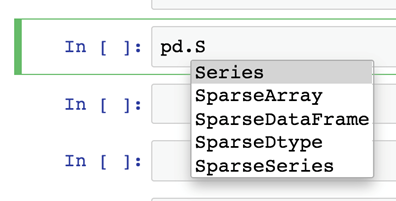
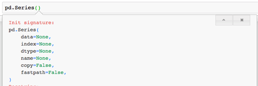

The Series object
===================

### This lab covers:

- Instantiating `Series` objects from lists, dictionaries, and more
- Creating a custom index for a `Series`
- Accessing attributes and invoking methods on a `Series`
- Performing mathematical operations on a `Series`
- Passing the `Series` to Python\'s built-in functions


Overview of a Series
------------------------------


Let\'s create some `Series` objects, shall we? We\'ll begin with
an import of `Pandas` and [numpy]; the latter library will
be used later to generate some random data. The popular community
aliases for `Pandas` and [numpy] are [pd] and
[np].


```
In  [1] import pandas as pd
        import numpy as np
```


#### Modules, Classes, and Instances


[pd] holds the top-level exports of `Pandas` , a combination
of 100+ classes, functions, exceptions, constants and more.


Think of [pd] as the \"lobby\" to the library. Any of the
package\'s attributes can be accessed with the dot syntax seen below.


```
package.attribute
```


Jupyter Notebook provides a convenient way to search through an
object\'s attributes. Place a dot after the object and press the Tab
key. The Notebook will display a modal of the object\'s attributes and
methods. As we type additional characters, the results will be filtered
to those that match our search term. Note that the search is
case-sensitive.


The next example reveals all [pd] attributes that begin with the
capital letter [\"S\"]. The `Series` class is directly
available at the top-level of the library.


##### Figure: Using Jupyter Notebook\'s Autocomplete Features

{width="396" height="201"}


Use the keyboard\'s arrow keys to select `Series` from the
dropdown list and press the Enter key to autocomplete the name.


Let\'s instantiate a `Series` object from the `Series`
class. As a reminder, this is accomplished with a pair of opening and
closing parentheses after the class name.


```
In  [2] pd.Series()
 
Out [2] Series([], dtype: object)
```


We\'ve successfully created our first `Pandas` object!
Unfortunately, it\'s an empty one that holds no values. Let\'s see if we
can populate it with some data.


#### Populating the Series with Values


When an object is instantiated, it can be passed initial values for some
or all of its attributes. This represents its *starting state*, its
condition at the beginning of its existence in the program. The values
are passed to the class **constructor**, a special method that
instantiates an object from a class. We saw an example of a constructor
a moment ago with [pd.Series()]. The constructor arguments can be
passed sequentially or with explicit keyword arguments. Every two
subsequent arguments must be separated by a comma.


The first argument to the `Series` constructor is an object whose
values can be used as the data source for the `Series`. The
constructor plays friendly with a variety of inputs including lists,
dictionaries, and tuples. Let\'s create a `Series` object from a
Python list. We\'ll pass the argument sequentially to the constructor.


```
In  [3] ice_cream_flavors = ["Chocolate", "Vanilla",
                             "Strawberry", "Rum Raisin"]
 
        pd.Series(ice_cream_flavors)
 
Out [3] 0     Chocolate
        1       Vanilla
        2    Strawberry
        3    Rum Raisin
        dtype: object
```


Our latest `Series` has 4 values. Notice that the order of the
list values is preserved in the `Series`. We\'ll come back to the
numbers on the left in just a moment.


Each constructor argument corresponds to a **parameter,** a name given
to an expected input. When we instantiated our last `Series`
object, the [ice\_cream\_flavors] list was passed as an argument
to a parameter called [data]. We can view the complete list of
constructor parameters in Jupyter Notebook.


In a new cell, write out [pd.Series()], then place the mouse
cursor in between the parentheses, and press the Shift + Tab keys. A
small modal with documentation will appear. Each additional press of the
two keys will reveal more information.


#### The parameters and the default arguments for the Series class

{width="512" height="172"}


The `Series` constructor defines six total parameters: [data,
index, dtype, name, copy,] and [fastpath]. The values to the
right of the equal signs represent the default arguments for each
parameter, the inputs that `Pandas` will provide if an argument is
not passed explicitly for that parameter during instantiation. A
parameter with a default argument is inherently *optional* because it
has a fallback value to rely on. We were able to create an empty
`Series` object earlier because all six of its class
constructor\'s parameters are optional.


The first parameter passed to the `Series` constructor,
[data], represents the object whose values will populate the
`Series`. When arguments are passed without a qualifying parameter
name, Python assumes they are being passed sequentially. In the previous
example, our [ice\_cream\_flavors] list was passed as the first
argument and thus Python assigned it to [data], the first
parameter. Python also fell back to default arguments of [None]
for the [index, dtype], and [name] parameters and False for
the [copy] and [fastpath] parameters.


Parameters and arguments can also be tied together explicitly. Write the
name of the parameter followed by an equal sign and its argument.


```
In  [4] pd.Series(data = ice_cream_flavors)
 
Out [4] 0     Chocolate
        1       Vanilla
        2    Strawberry
        3    Rum Raisin
        dtype: object
```


**Keyword arguments** like the one above are advantageous for several
reasons. They provide context on what each argument in the constructor
represents and they also permit arguments to be passed in any order. In
comparison, sequential arguments must always be passed in the order they
are defined.


#### Customizing the Index


Let\'s take a look at our `Series` object again.


The incrementing list of numbers on the left-side is called the
**index**. It serves the same purpose as an index position in a list: a
numeric indicator of the element\'s place in line. We can also view it
as comparable to a key in a dictionary: an identifier or name connected
to each value. The `Series` combines the best features of both
data structures. A `Pandas` index can hold **both** an element\'s
position and a label for it. Index labels can consist of any immutable
data type.


The `Series` constructor defines an [index] parameter whose
argument will serve as the data source for the index. If an explicit
argument is not passed, `Pandas` will default to a numeric index
starting at 0. The last index number will always be one less than the
total number of values in the column. In our current example, there are
4 ice cream flavors, so the index counts up to 3. This is an important
distinction between `Pandas` and Excel; in most spreadsheet
applications, the first row of data starts counting at 1.


Let\'s explicitly pass a collection of values for `Pandas` to
build its `Series` index from. This time around, we\'ll create a
tuple of strings that stores a few days of the week. The objects passed
to the [data] and [index] parameters *can* be of different
data types, but they **must** be of the same length. In the example
below, [ice\_cream\_flavors] is a list and [days\_of\_week]
is a tuple, but both objects have a length of 4.


```
In  [5] ice_cream_flavors = ["Chocolate", "Vanilla",
                             "Strawberry", "Rum Raisin"]
        days_of_week = ("Monday", "Wednesday", "Friday", "Saturday")
 
        pd.Series(data = ice_cream_flavors, index = days_of_week)
 
Out [5] Monday        Chocolate
        Wednesday       Vanilla
        Friday       Strawberry
        Saturday     Rum Raisin
        dtype: object
```


Notice that `Pandas` associates the values from
[ice\_cream\_flavors] and [days\_of\_week] based on shared
index positions. For example, \"Strawberry\" and \"Friday\" are both
found at index position 2 in their respective objects and are thus tied
together.

One feature that distinguishes a `Series` index from a list index
or dictionary keys is that it permits duplicates. In the next example,
the string \"Wednesday\" appears twice in the [days\_of\_week]
tuple and twice among the `Series` index labels.


```
In  [6] ice_cream_flavors = ["Chocolate", "Vanilla",
                             "Strawberry", "Rum Raisin"]
        days_of_week = ("Monday", "Wednesday", "Friday", "Wednesday")
 
        # The two lines below are equivalent
        pd.Series(ice_cream_flavors, days_of_week)
        pd.Series(data = ice_cream_flavors, index = days_of_week)
 
Out [6] Monday        Chocolate
        Wednesday       Vanilla
        Friday       Strawberry
        Wednesday    Rum Raisin
        dtype: object
```


As mentioned earlier, keyword arguments permit values to be passed in
any order. Thus, the line of code below offers yet another way to return
the same `Series` as the one above.


```
1pd.Series(index = days_of_week, data = ice_cream_flavors)
```


There\'s one more important piece of information left to analyze in the
output: [dtype]. This reflects the data type of the *values* in
the `Series`. If an explicit value is not passed to the
[dtype] (data type) parameter, `Pandas` will default to an
argument of [None] and infer an appropriate data type.


A slight point of confusion is that `Pandas` will show [dtype:
object] for string values. For other data types, we\'ll typically
see more precise outputs. The examples below create some `Series`
objects from floating point, Boolean, and integer values. Practice
writing them out in Jupyter Notebook.


```
In  [7] stock_prices = [985.32, 950.44]
        times = ["Open", "Close"]
        pd.Series(data = stock_prices, index = times)
 
Out [7] Open     985.32
        Close    950.44
        dtype: float64
 
In  [8] bunch_of_bools = [True, False, False]
        pd.Series(bunch_of_bools)
 
Out [8] 0     True
        1    False
        2    False
        dtype: bool
 
In  [9] lucky_numbers = [4, 8, 15, 16, 23, 42]
        pd.Series(lucky_numbers)
 
Out [9] 0     4
        1     8
        2    15
        3    16
        4    23
        5    42
        dtype: int64
```


In the last example, notice that integers are used for both the index
labels and the values of the `Series`. `Pandas` will always
display the index on the left-hand side and the values on the right.


#### Creating a Series with Missing Values

In the example below, we create a Series from a list that includes one
\"missing value\". In the visual output, we can see [NaN] at index
position 2. Get used to this trio of letters; we\'re going to be seeing
them a lot throughout the text.


```
In  [10] temperatures = [94, 88, np.nan, 91]
         pd.Series(data = temperatures)
 
Out [10] 0    94.0
         1    88.0
         2     NaN
         3    91.0
         dtype: float64
```


Note that the data type has been converted from integers in the list to
floating-point values in the `Series`. `Pandas` will make
this conversion automatically if and when it spots a [nan] value;
this is an internal requirement to allow the library to store both
present and missing values in the same homogenous `Series`.


Create a Series from Python Objects
---------------------------------------------


The [data] parameter in the `Series` constructor accepts a
variety of inputs, including many native Python objects. Let\'s create a
few sample `Series`.


#### Dictionaries


When passed a dictionary, `Pandas` will use each key as the
corresponding index label in the `Series`.


```
In  [11] calorie_info = {
             "Cereal": 125,
             "Chocolate Bar": 406,
             "Ice Cream Sundae": 342
         }
 
         diet = pd.Series(calorie_info)
 
         diet
 
Out [11] Cereal              125
         Chocolate Bar       406
         Ice Cream Sundae    342
         dtype: int64
```


A `Series` is *composed* *of* or *constructed* *from* several
smaller objects, each of which is delegated a specific responsibility.
We can think of these as objects as puzzle pieces that join together to
make the greater whole. A `Series` is amalgamation of objects like
the [numpy] library's [ndarray] (which stores the values)
and the `Pandas`\' library\'s [Index] object (which stores
the index). `Pandas` ships with more than a dozen index objects to
support indices of  various data types like integers, intervals, or
datetimes.


The nested objects are available as attributes on our `Series`.
For example, the [values] attribute returns the [ndarray]
object that stores the values.


```
In  [12] diet.values
 
Out [12] array([125, 406, 342])
```


We can pass any object to Python\'s built-in [type] function to
see the class it is constructed from. Notice the [ndarray] is
coming from NumPy, not from Pandas. The [ndarray] object optimizes
for speed and efficiency by relying on the lower-level C programming
language for many of its calculations.


```
In  [13] type(diet.values)
 
Out [13] numpy.ndarray
```


Similarly, the [index] attribute returns the [Index] object
that the `Series` stores internally.


```
In  [14] diet.index
 
Out [14] Index(['Cereal', 'Chocolate Bar', 'Ice Cream Sundae'],   
         dtype='object')
 
In  [15] type(diet.index)
 
Out [15] pandas.core.indexes.base.Index
```


Some object attributes reveal helpful characteristics. For example, the
[size] attribute counts the number of values in the
`Series`.


```
In  [16] diet.size
 
Out [16] 3
```


A complementary attribute, [shape], returns a tuple of the
dimensions of any `Pandas` data structure. For a 1-dimensional
object like the `Series`, the tuple\'s only value will be its
size. The comma after the 3 is a standard visual output for one-element
tuples in Python.


```
In  [17] diet.shape
 
Out [17] (3,)
```


The [is\_unique] attribute returns True if there are no duplicate
values in the `Series`.


```
In  [18] diet.is_unique
 
Out [18] True
 
In  [19] pd.Series(data = [3, 3]).is_unique
 
Out [19] False
```


The [is\_monotonic] attribute return True if all of the values are
increasing.


```
In  [20] pd.Series(data = [1, 3, 6]).is_monotonic
 
Out [20] True
 
In  [21] pd.Series(data = [1, 6, 3]).is_monotonic
 
Out [21] False
```


#### Tuples


A `Series` can accept a tuple as its data source as well. As a
reminder, a tuple is a similar data structure to a list but it is
immutable. Elements cannot be added, removed or replaced in a tuple once
it has been declared.


```
In  [22] pd.Series(data = ("Red", "Green", "Blue"))
 
Out [22] 0      Red
         1    Green
         2     Blue
         dtype: object
```


To use one or more tuples as actual `Series` values, wrap them in
a larger container such a list.


```
In  [23] pd.Series(data = [("Red", "Green", "Blue"), ("Orange", "Yellow")])
 
Out [23] 0    (Red, Green, Blue)
         1      (Orange, Yellow)
         dtype: object
```


#### Sets

A **set** is an unordered collection of unique values. As a reminder,
the curly brace syntax for declaring a set is identical to that for
declaring a dictionary.


```
In  [24] my_set = { "Ricky", "Bobby" }
         pd.Series(my_set)
 
---------------------------------------------------------------------------
TypeError                                 Traceback (most recent call last)
<ipython-input-25-bf85415a7772> in <module>
      1 my_set = { "Ricky", "Bobby" }
----> 2 pd.Series(my_set)
 
TypeError: 'set' type is unordered
```


If your program involves a set, transform it into an ordered data
structure like a Python list before passing it to the `Series`
constructor.


```
In  [25] pd.Series(list(my_set))
 
Out [25] 0    Ricky
         1    Bobby
         dtype: object
```


#### NumPy Arrays


The [data] parameter of the `Series` constructor also
accepts a [ndarray] object as its argument. In the example below,
we use the [randint] method to generate a 1-dimensional array of
10 random values between 1 and 101.


```
In  [26] data = np.random.randint(1, 101, 10)
         data
 
Out [26] array([27, 16, 13, 83,  3, 38, 34, 19, 27, 66])
 
In  [27] pd.Series(data)
 
Out [27] 0    27
         1    16
         2    13
         3    83
         4     3
         5    38
         6    34
         7    19
         8    27
         9    66
         dtype: int64
```


The `Series` is a one-dimensional data structure that only
supports a single \"column\" of data. Thus, if we attempt to pass a
multi-dimensional [ndarray] to the constructor, such as the 5x10
grid generated by the [randn] method below, `Pandas` will
raise a helpful \"Data must be 1-dimensional\" [Exception].


```
In  [28] pd.Series(np.random.randn(5, 10))
 
---------------------------------------------------------------------------
Exception                                 Traceback (most recent call last)
<ipython-input-16-917a11418a68> in <module>
----> 1 pd.Series(np.random.randn(5, 10))
 
Exception: Data must be 1-dimensional
```


Retrieving the First and Last Rows
-----------------------------------

Let\'s create a healthy-sized `Series` with data from Python\'s
[range] function. [range] generates a sequence of numbers
between two points. Its first argument is the lower bound, its second
argument is the upper bound, and its third argument is the step
sequence, the difference between every two numbers. In the example
below, we generate a range of all numbers between of 0 and 500, with
every two subsequent values separated by 5.


```
In  [29] values = range(0, 500, 5)
         nums = pd.Series(data = values)
         nums
 
Out [29] 0       0
         1       5
         2      10
         3      15
         4      20
              ...
         95    475
         96    480
         97    485
         98    490
         99    495
         Length: 100, dtype: int64
```


We now have a `Series` with 100 values \-- pretty fancy! Take note
of the ellipses (the three dots) that appear in the middle of the data.
To avoid blowing up the Jupyter Notebook, `Pandas` conveniently
truncates the `Series` to show only the first five and the last
five rows of data.


Let's begin our exploration with one of the simplest methods available
on a `Series`. The [head] method returns one or more rows
from the *beginning* or the *top of* the dataset.  It accepts a single
argument [n] that represents the number of rows to extract.


```
In  [30] nums.head(3)
 
Out [30] 0     0
         1     5
         2    10
         dtype: int64
```


The code above is equivalent to [nums.head(n = 3).]


Much like parameters in class constructors, method parameters can
declare default arguments. In this scenario, the [n] parameter has
a default argument of 5. If a [head] method invocation does not
explicitly pass an argument for [n], five rows will be returned.


```
In  [31] nums.head()
 
Out [31] 0     0
         1     5
         2    10
         3    15
         4    20
         dtype: int64
```


[tail] is the sibling method to [head]. It returns a
`Series` consisting of a specified number of rows from the
*bottom* or the *end* of the dataset. The [tail] method also
assigns a default argument of 5 to its [n] parameter.


```
In  [32] nums.tail(3)
 
Out [32] 97    485
         98    490
         99    495
         dtype: int64
 
In  [33] nums.tail()
 
Out [33] 95    475
         96    480
         97    485
         98    490
         99    495
         dtype: int64
```


Mathematical Operations
---------------------------------


The `Series` object includes a myriad of methods for mathematical
and statistical operations. Many of these are optimized and configured
to deal with missing values.


Let's begin by defining a `Series` from a list of ascending
numbers. In the middle, we\'ll sneak-in a [np.nan] to represent a
missing value. We\'ll assign the variable [s], a common
one-character variable for a `Series`.


```
In  [34] s = pd.Series([1, 2, 3, np.nan, 4, 5])
```


The [sum] method returns the sum of all of the values. Missing
values are excluded.


```
In  [35] s.sum()
 
Out [35] 15.0
```


Most methods include a [skipna] parameter that can be set to False
to include missing values. Because a null value cannot be added to any
other, the return value will be another null value.


```
In  [36] s.sum(skipna = False)
 
Out [36] nan
```


The [min\_count] parameter sets a minimum number of non-null
values that must be present for the `Series` sum to be calculated.
The six-element [s Series] above holds 5 valid numeric values. In
the first two examples below, the threshold is met. In the third one,
there is an insufficient number of values to add so [sum] returns
[nan].


```
In  [37] s.sum(min_count = 3)
 
Out [37] 15.0
 
In  [38] s.sum(min_count = 5)
 
Out [38] 15.0
 
In  [39] s.sum(min_count = 6)
 
Out [39] nan
```


The [product] method multiplies the `Series` values
together. Like [sum], it accepts [skipna] and
[min\_count] parameters.


```
In  [40] s.product()
 
Out [40] 120.0
```


The [cumsum] (cumulative sum) method returns a new `Series`
with a rolling sum of values. Each index position is tied to a sum of
values *up to and including* the value at that index. This is helpful
for determining which values contribute the most to the final total.


```
In  [41] s.cumsum()
 
Out [41] 0     1.0
         1     3.0
         2     6.0
         3     NaN
         4    10.0
         5    15.0
         dtype: float64
```


For example, the [s] `Series` holds the values 1 at index
position 0 and 2 at index position 1. Thus, at index 1, the cumulative
sum of all values is 3 (1 + 2). The cumulative sum at the final index
position will be equal to the return value of the [sum] method.


Notice that [NaN] values are included in the returned
`Series`. At index position 4, the cumulative sum adds the
previous tally of 6 with the current value of 4 for a grand total of 10.
If the [skipna] parameter is passed an argument of False here, the
returned `Series` will have a cumulative sum *up to* the index
with the first missing value, then [nan] for the remaining values.


```
In  [42] s.cumsum(skipna = False)
 
Out [42] 0    1.0
         1    3.0
         2    6.0
         3    NaN
         4    NaN
         5    NaN
         dtype: float64
```


The [pct\_change] method returns the percentage differences from
one `Series` value to the next. The mathematical formula is equal
to adding the current value and previous value, and then diving the
result by the current value. Two points of comparison are needed for a
difference to be calculated. Here\'s a reminder of what the [s]
`Series` looks like.


```
In  [43] s
 
Out [43] 0    1.0
         1    2.0
         2    3.0
         3    NaN
         4    4.0
         5    5.0
         dtype: float64
```


The [pct\_change] method defaults to a \"forward fill\" solution
for missing values. This means the last *valid* observation is
substituted when a [NaN] value is encountered. Let\'s walk through
a few calculations:


- At index 0, the value of 1.0 cannot be compared with any previous
    value. Thus, the returned `Series` has a [NaN] value in
    index 0.
- At index 1, the value of 2.0 is compared with the previous value of
    1.0. The percentage change is 100%, which translates to 1.00000 at
    index 1 in the returned `Series`.
- At index 3, we run into a [NaN]. The last valid value (3.0
    from index 2) is substituted in its place. The percentage change
    between 3.0 at index 3 and 3.0 at index 2 is 0.
- At index 4, the value of 4.0 is compared to the previous row\'s
    value. Once again, the [NaN] at index 3 is replaced with 3.0,
    the last valid value we encountered. The percentage change between 4
    and 3 is 0.333333 (i.e. a 33% increase).


```
In  [44] s.pct_change()
 
Out [44] 0         NaN
         1    1.000000
         2    0.500000
         3    0.000000
         4    0.333333
         5    0.250000
         dtype: float64
```


We can use the [fill\_method] parameter customize the logic that
the [pct\_change] method uses to substitute [NaN] values.
This parameter is available for many methods, so it\'s worth taking the
time to study. The default strategy is a \"forward fill\" solution where
the *last* valid observation is substituted when a [NaN] value is
encountered. We can pass the [fill\_method] parameter an explicit
value of [\"pad\"] or [\"ffill\"] to see the same result as
above.


```
In  [45] s.pct_change()                      # is the same as
         s.pct_change(fill_method = "pad")   # is the same as
         s.pct_change(fill_method = "ffill")
 
Out [45] 0         NaN
         1    1.000000
         2    0.500000
         3    0.000000
         4    0.333333
         5    0.250000
         dtype: float64
```


The alternate strategy for dealing with missing values is a backfill
solution. When backfilling, the *next* valid observation is substituted
when a [NaN] value is encountered. Let\'s pass the
[fill\_method]  parameter a value of [\"bfill\"] or
[\"backfill\"] to see the results, then walk through them step by
step.


```
In  [46] s.pct_change(fill_method = "bfill")    # is the same as
         s.pct_change(fill_method = "backfill")
 
Out [46] 0         NaN
         1    1.000000
         2    0.500000
         3    0.333333
         4    0.000000
         5    0.250000
         dtype: float64
```


Notice the values at index positions 3 and 4 are different compared to
the forward fill solution. Here\'s how `Pandas` arrives at these
calculations:


- At index 3, we run into a [NaN] in the [s]
    `Series`. The *next* valid value (4.0 at index 4) is
    substituted in its place. The percentage change between 4.0 at index
    3 and 3.0 at index 2 is 0.33333.
- At index 4, the value of 4.0 is compared to the previous row\'s
    value. The [NaN] at index 3 is again replaced with 4.0, the
    *next* valid value available in the [s] `Series`. The
    percentage change between 4 and 4 is 0.0.


The [mean] method returns the average of the [Series\'s]
values. The average is calculated by diving the sum of values by the
number of values (in this case, 15 divided by 5).


```
In  [47] s.mean()
 
Out [47] 3.0
```


The [median] method returns the \"middle number\" in a sorted list
of values. Half of the values will fall above the median and half of the
values will fall below the median.


```
In  [48] s.median()
 
Out [48] 3.0
```


The [std] method returns the standard deviation of the values, a
statistical measure of the amount of variation in the data.


```
In  [49] s.std()
 
Out [49] 1.5811388300841898
```


The [max] and [min] methods retrieve the largest and
smallest value from the `Series`.


```
In  [50] s.max()
 
Out [50] 5.0
 
In  [51] s.min()
 
Out [51] 1.0
```


If the `Series` consists of strings, the values will be
alphabetically sorted. The \"largest\" value will be the one closest to
the end of the alphabet and the \"smallest\" value will be the one
closest to the start of the alphabet.


```
In  [52] animals = pd.Series(["koala", "aardvark", "zebra"])
         animals.max()
 
Out [52] 'zebra'
 
In  [53] animals.min()
 
Out [53] 'aardvark'
```


`Pandas` is remarkably flexible. There are often multiple ways to
solve the same problem. For example, the `Series` object can be
passed to Python\'s built-in [max] and [min] functions to
arrive at the same results.


If you\'re searching for a single method to effectively summarize a
`Series`, the powerful [describe] method does the trick. It
returns a `Series` of common statistical evaluations including
count, mean, standard deviation, and more.


```
In  [54] s.describe()
 
Out [54] count    5.000000
         mean     3.000000
         std      1.581139
         min      1.000000
         25%      2.000000
         50%      3.000000
         75%      4.000000
         max      5.000000
         dtype: float64
```


The [sample] method selects a random collection of values from a
`Series`. Its return value is another `Series` object. The
random assortment makes it likely that the order of values in the new
`Series` will not match the order of values in the original
`Series`. In the next example, notice that the lack of [NaN]
values allows `Pandas` to return a `Series` of integers
rather than floats.


```
In  [55] s.sample(3)
 
Out [55] 1    2
         3    4
         2    3
         dtype: int64
```


The [sample] method accepts a [n] parameter with a default
argument of 1. A `Series` with one row of data will be returned
when [sample] is invoked without an explicit argument.


```
In  [56] s.sample()
 
Out [56] 0    1
         dtype: int64
```


The [unique] method returns a [ndarray] object of unique
values from the `Series`. In the example below, the string
[\"Orwell\"] appears twice in the `Series` but only once in
the [ndarray].


```
In  [57] authors = pd.Series(["Hemingway", "Orwell", "Dostoevsky",  
                              "Fitzgerald", "Orwell"])
         authors.unique()
 
Out [57] array(['Hemingway', 'Orwell', 'Dostoevsky', 'Fitzgerald'],
         dtype=object)
```


The [nunique] method returns the *number* of unique values in the
`Series`.


```
In  [58] authors.nunique()
 
Out [58] 4
```


#### Arithmetic Operations


Let\'s create a new `Series` with a few values. As a reminder, any
[NaN] value will coerce the values in a `Series` into
floating point numbers.


```
In  [59] s1 = pd.Series(data = [5, np.nan, 15], index = ["A", "B", "C"])
>         s1
Out [59] A     5.0
         B     NaN
         C    15.0
         dtype: float64
```


Standard arithmetic operations like addition, subtraction,
multiplication, and division can be applied to every value in a
`Series`. Treat the `Series` as a regular operand on one
side of a mathematical example. In the next example, we add 3 to each
value in [s1]. `Pandas` returns a *new* `Series`
object.


```
In  [60] s1 + 3
 
Out [60] A     8.0
         B     NaN
         C    18.0
         dtype: float64
```


Any [NaN] values remain unchanged. The same rules apply for
subtraction, multiplication, and division.


```
In  [61] s1 - 5
 
Out [61] A     0.0
         B     NaN
         C    10.0
         dtype: float64
 
In  [62] s1 * 2
 
Out [62] A    10.0
         B     NaN
         C    30.0
         dtype: float64
 
In  [63] s1 / 2
 
Out [63] A    2.5
         B    NaN
         C    7.5
         dtype: float64
```


The floor division operator ( [//] ) removes any digits after the
decimal point following a division. For example, the plain division of
15.0 by 4 yields a result of 3.75. In comparison, floor division chops
off the .75, leading to a final result of 3.


```
In  [64] s1 // 4
 
Out [64] A    1.0
         B    NaN
         C    3.0
         dtype: float64
```


The modulo operator ( [%] ) returns the remainder of a division.
In the example below, the value of 5 at index label A leaves a remainder
of 2 when divided by 3.


```
In  [65] s1 % 3
 
Out [65] A    2.0
         B    NaN
         C    0.0
         dtype: float64
```


#### Broadcasting


Mathematical operations can also be applied across multiple Series
objects. As a general rule of thumb, `Pandas` will always seek to
align data values by a shared index label. In the example below, the
[s1] and [s2 Series] have the same three-element index. The
elements at index A (1 and 4), index B (2 and 5), and index C (3 and 6)
are thus added together.


```
In  [66] s1 = pd.Series([1, 2, 3], index = ["A", "B", "C"])
         s2 = pd.Series([4, 5, 6], index = ["A", "B", "C"])
        
         s1 + s2
 
Out [66] A    5
         B    7
         C    9
         dtype: int64
```


Python\'s equality ( == ) and inequality ( != ) operators can compare
values at the same index across two `Series`. In the example
below, two `Series` are constructed with the default numeric
index. The return value will be a new `Series` of Booleans. Note
that [NaN] values are considered unequal.


```
In  [67] s1 = pd.Series(data = [3, 6, np.nan, 12])
         s2 = pd.Series(data = [2, 6, np.nan, 12])
 
            s1 == s2
 
Out [67] 0    False
         1     True
         2    False
         3     True
         dtype: bool
 
In  [68] s1 != s2
 
Out [68] 0     True
         1    False
         2     True
         3    False
         dtype: bool
```


In the [numpy] documentation, **broadcasting** is defined as \"how
[numpy] treats arrays with different shapes during arithmetic
operations\". Operations between `Series` become trickier when
there are differences between indices. One index may have more or less
values than the other, or there may be a mismatch between the values
themselves.


In the next example, only two index labels (**B** and **C**) are shared
between the two `Series`. For the remaining indices (**A**, **D**,
and **E**), `Pandas` returns [NaN] values. That is a result
of attempting to add a number to a missing value at the same index label
in the other `Series`**.**


```
In  [69] s1 = pd.Series(data = [5, 10, 15], index = ["A", "B", "C"])
         s2 = pd.Series(data = [4, 8, 12, 14], index=["B", "C", "D", "E"])   
    
         s1 + s2
 
Out [69] A     NaN
         B    14.0
         C    23.0
         D     NaN
         E     NaN
         dtype: float64
```


Passing the Series to Python\'s Built-In Functions
------------------------------------------------------------


Python\'s developer community likes to rally around certain design
principles to ensure consistency across different codebases. One example
of this is object integration with Python\'s built-in functions.


Let\'s create a small `Series` of strings representing cities in
the United States.


```
In  [70] cities = pd.Series(data = ["San Francisco", "Los Angeles",
                                    "Las  Vegas", np.nan])
```


The [len] function returns the number of rows in a `Series`.


```
In  [71] len(cities)
 
Out [71] 3
```


[NaN] values will be included in the count.


```
In  [72] mixed_data = [1, np.nan]
         series_with_missing_values = pd.Series(data = mixed_data)
         len(series_with_missing_values)
 
Out [72] 2
```


The [type] function returns the class than an object is
constructed from.


```
In  [73] type(cities)
 
Out [73] pandas.core.series.Series
```


The [dir] (directory) function returns a list of the attributes
and methods on an object. The names are listed as strings. The next
example shows a preview of the output. Execute the code in your Jupyter
Notebook to see the complete output \-- there are over 400 values.


```
In  [74] dir(cities)
 
Out [71] ['T',
          '_AXIS_ALIASES',
          '_AXIS_IALIASES',
          '_AXIS_LEN',
          '_AXIS_NAMES',
          '_AXIS_NUMBERS',
          '_AXIS_ORDERS',
          '_AXIS_REVERSED',
          '_HANDLED_TYPES',
          '__abs__',
          '__add__',
          '__and__',
          '__annotations__',
          '__array__',
          '__array_priority__',
          '__array_ufunc__',
          '__array_wrap__',
          '__bool__', #...]
```


The [list] function / class returns a Python list with the values
of the `Series`.


```
In  [75] list(cities)
 
Out [75] ['San Francisco', 'Los Angeles', 'Las  Vegas']
```


The [dict] function / class converts the `Series` into a
dictionary. The index labels are used as the dictionary keys.


```
In  [76] dict(cities)
 
Out [76] {0: 'San Francisco', 1: 'Los Angeles', 2: 'Las  Vegas' }
```


The [max] function returns the greatest value from the
`Series`. If the `Series` consists of strings, [max]
returns the last alphabetically sorted value.


```
In  [77] max(cities)
 
Out [77] 'San Francisco'
```


The [min] function returns the smallest value from the
`Series`. If the `Series` consists of strings, [min]
returns the first value in alphabetical order.


```
In  [78] min(cities)
 
Out [78] 'Las Vegas'
```


The [in] keyword returns True if the given value is found in the
index labels of the `Series`. This can be a point of confusion for
beginners, who might expect inclusion to check in the *values* instead.


```
In  [79] "Las Vegas" in cities
 
Out [79] False
 
In  [80] 2 in cities # The value 2 is found in the index
 
Out [80] True
```


To check for inclusion among the *values* of the `Series`, use in
the [in] keyword with the [ndarray] object returned from the
[values] attribute.


```
In  [81] "Las Vegas" in cities.values
 
Out [81] True
```


The [not in] operator confirms that an element is *not contained*
in a `Series`.


```
In  [82] 100 not in cities
 
Out [82] True
 
In  [83] "Paris" not in cities.values
 
Out [83] True
```


Coding Challenges / Exercises
---------------------------------------


- Declare a [colors] list with 4 strings representing your
    favorite colors. Instantiate a `Series` object with the values
    from the [colors] list.


```
In  [84] colors = ["Red", "Blue", "White", "Navy"]
         pd.Series(colors)
 
Out [84] 0      Red
         1     Blue
         2    White
         3     Navy
         dtype: object
```


- Instantiate the `Series` object with an index set to the
    [colors] list. Populate it 4 arbitrary numeric values.


```
In  [85] pd.Series(data = [1, 2, 3, 4], index = colors)
 
Out [85] Red      1
         Blue     2
         White    3
         Navy     4
         dtype: int64
```


 Summary
-----------------


- A `Series` is a one-dimensional labelled array that consists
    of values and an index.
- A `Series` can be constructed from lists, dictionaries,
    tuples and [NumPy] arrays.
- The [head] and [tail] methods retrieve the first and
    last rows of the `Series`.
- The `Series` supports common mathematical operations like
    sum, mean, median, max, min and standard deviation.
- Arithmetic operations across `Series` are based on shared
    index labels.
- The `Series` plays friendly with Python\'s built-in functions
    like [len] and operators like the [in] keyword.

