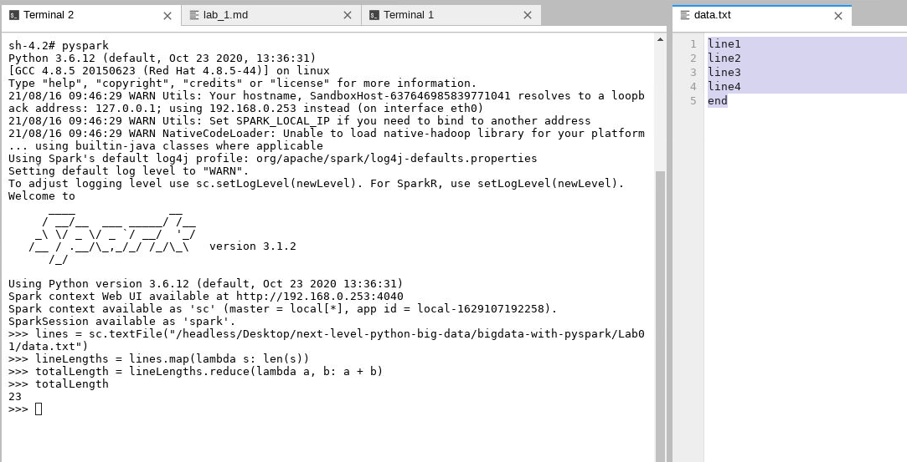

Filtering a DataFrame
=======================

### This lab covers:

- Reducing the memory usage of a `DataFrame`
- Extracting a subset of rows from a `DataFrame` based on
    one or more conditions
- Filtering for rows that include or exclude null values
- Selecting values that fall between a range
- Removing duplicate and null values from a
    `DataFrame`


Optimizing A Dataset for Memory Usage
-------------------------------------------

Let\'s begin with the usual import of our favorite data analysis library.


```
In  [1] import pandas as pd
```


The `employees.csv` dataset for this lab is a fictional collection
of employees at a company. Each record includes the employee\'s first
name, gender, start date at the firm, salary, management status (True or
False), and team. Let\'s take a peek...


```
In  [2] pd.read_csv("employees.csv")
 
Out [2]
 
     First Name  Gender Start Date    Salary   Mgmt          Team
0       Douglas    Male     8/6/93       NaN   True     Marketing
1        Thomas    Male    3/31/96   61933.0   True           NaN
2         Maria  Female        NaN  130590.0  False       Finance
3         Jerry     NaN     3/4/05  138705.0   True       Finance
4         Larry    Male    1/24/98  101004.0   True            IT
  …           …       …          …         …      …             …
996     Phillip    Male    1/31/84   42392.0  False       Finance
997     Russell    Male    5/20/13   96914.0  False       Product
998       Larry    Male    4/20/13   60500.0  False  Business Dev
999      Albert    Male    5/15/12  129949.0   True         Sales
1000        NaN     NaN        NaN       NaN    NaN           NaN
```


It turns out the dataset is quite messy. We have missing values in every
column. In fact, our last row consists of *only* `NaN` values. Data in
the real world is subject to a lot of variation depending on the system
it is exported from. Blank lines are a common occurrence.


Is there a way that we can increase the utility of our dataset? Our
first optimization is one we should feel pretty comfortable with by now.
The text values in the **Start Date** column can be converted to
datetime objects with the `parse_dates` parameter.


```
In  [3] pd.read_csv("employees.csv", parse_dates = ["Start Date"]).head()
 
Out [3]
 
  First Name  Gender Start Date    Salary   Mgmt       Team
0    Douglas    Male 1993-08-06       NaN   True  Marketing
1     Thomas    Male 1996-03-31   61933.0   True        NaN
2      Maria  Female        NaT  130590.0  False    Finance
3      Jerry     NaN 2005-03-04  138705.0   True    Finance
4      Larry    Male 1998-01-24  101004.0   True         IT
```


Now that we\'re in a good place with the import, let\'s assign the
`DataFrame` object to a descriptive variable like `employees`.


```
In  [4] employees = pd.read_csv("employees.csv",
                                parse_dates = ["Start Date"])
```


#### Converting Data Types with the as\_type Method


There are a few options available for improving the speed and efficiency
of operations on the `DataFrame`. The `info` method is particularly
helpful here. It returns a big-picture summary of the dataset, including
column names, data types, missing values, and memory consumption.


```
In  [5] employees.info()
 
<class 'pandas.core.frame.DataFrame'>
RangeIndex: 1001 entries, 0 to 1000
Data columns (total 6 columns):
First Name    933 non-null object
Gender        854 non-null object
Start Date    999 non-null datetime64[ns]
Salary        999 non-null float64
Mgmt          933 non-null object
Team          957 non-null object
dtypes: datetime64[ns](1), float64(1), object(4)
memory usage: 47.0+ KB
```


The `RangeIndex` at the top of the output tells us there are 1001 rows
in the dataset. We can identify the number of present (non-null) values
in each column from the output. All six columns have missing data.


First up, `Pandas` has imported our **Mgmt** column as a sequence of
text values even though it is fundamentally a collection of Booleans.
Notice that the designation of the column\'s values is `object` in the
output from the `info` method. `object` is the library\'s internal lingo
for strings.


The `astype` method converts the values of a `Pandas` object to a
different data type. Let\'s extract the **Mgmt** `Series` object from
our `DataFrame`, then invoke its `astype` method. The argument to the
method represents the data type to convert *to*. We\'ll pass `bool`, a
built-in keyword in Python. The return value will be a new `Series`
object. Note that the `NaN` values have been converted to True values.


```
In  [6] employees["Mgmt"].astype(bool)
 
Out [6] 0        True
        1        True
        2       False
        3        True
        4        True
                ... 
        996     False
        997     False
        998     False
        999      True
        1000     True
        Name: Mgmt, Length: 1001, dtype: bool
```


Looks good! It\'s now time to replace our existing **Mgmt** column.


Overwriting an existing column or creating a new one in a `DataFrame`
works similarly to adding a key-value pair to a dictionary. If a column
with the specified name exists, `Pandas` will overwrite it with the new
`Series`. If the column does not exist, `Pandas` will append the new
`Series` to the right of the `DataFrame`, matching by common index
labels across the two data structures.


Let\'s overwrite our **Mgmt** column with our new `Series` of Booleans.
As a reminder, the right side of the assignment operator ( = ) is always
evaluated first.


```
In  [7] employees["Mgmt"] = employees["Mgmt"].astype(bool)
```


Column assignment does not return a value, so we have to output the
`DataFrame` again to see the results.


```
In  [8] employees.tail()
 
Out [8]
 
     First Name Gender Start Date    Salary   Mgmt          Team
996     Phillip   Male 1984-01-31   42392.0  False       Finance
997     Russell   Male 2013-05-20   96914.0  False       Product
998       Larry   Male 2013-04-20   60500.0  False  Business Dev
999      Albert   Male 2012-05-15  129949.0   True         Sales
1000        NaN    NaN        NaT       NaN   True           NaN
```


With the exception of the last row of missing values, there are no
visual changes to the look and feel of the `DataFrame`. But what about
our memory usage? Let\'s invoke `info` again.


```
In  [9] employees.info()
 
#...
memory usage: 40.2+ KB
```


Ah-ha! We\'ve reduced the memory usage by almost 15%. That\'s a pretty
good start!


Next, let\'s take a look at the **Salary** column. If we open the raw
CSV file, we\'ll see that the column\'s values are actually stored as
whole numbers. For technical reasons, `Pandas` needs to convert them
from integers to floating point values to support the `NaN` values
scattered throughout. If we try to coerce the column\'s values to
integers, a `ValueError` exception will be raised.


```
In  [10] employees["Salary"].astype(int)
 
---------------------------------------------------------------------------
ValueError                                Traceback (most recent call last)
<ipython-input-99-b148c8b8be90> in <module>
----> 1 employees["Salary"].astype(int)
 
ValueError: Cannot convert non-finite values (NA or inf) to integer
```


Later in the lab, we\'ll discuss how we can remove this last row
entirely. For now, we can use `fillna` method to return a new `Series`
where `NaN` values have been replaced with a specified argument. Let\'s
provide an arbitrary value of 0 hero. Take a look at the last row.


```
In  [11] employees["Salary"].fillna(0).tail()
 
Out [11] 996      42392.0
         997      96914.0
         998      60500.0
         999     129949.0
         1000         0.0
         Name: Salary, dtype: float64
```


Now that the **Salary** column has no missing values, we\'re clear to
convert its values to integers...


```
In  [12] employees["Salary"].fillna(0).astype(int).head()
 
Out [12] 0         0
         1     61933
         2    130590
         3    138705
         4    101004
         Name: Salary, dtype: int64
```


...and overwrite the existing `Series` in the `employees` `DataFrame`.


```
In  [13] employees["Salary"] = employees["Salary"].fillna(0).astype(int)
```


OK, so we\'ve converted our **Start Date** and **Mgmt** columns to store
more appropriate data types than strings. Is there anything left to
optimize? Absolutely!


`Pandas` includes a special data type called a category, which is ideal
when a column includes a small number of *unique* values relative to its
total size. Common examples of data points with a limited number of
values include gender, weekdays, blood types, planets, income groups,
and more. Behind the scenes, categorical values are stored as plain
Python objects instead of NumPy `ndarrays` and are optimized for speed.


The `nunique` method can tell us the number of unique values in each
column of a `DataFrame`. Note that missing values (`NaN`) will be
excluded by default; you can add a `dropna = False` argument to the
`nunique` method to include them in the count.


```
In  [14] employees.nunique()
 
Out [14] First Name    200
         Gender          2
         Start Date    971
         Salary        994
         Mgmt            2
         Team           10
         dtype: int64
```


Two columns stand out as good candidates for categorical values:
**Gender** and **Team**. In 1001 rows of data, they only have 2 and 10
unique values respectively.


Let\'s practice the `astype` syntax again. First, we\'ll test that a
column\'s values can be converted to a categorical data type.


```
In  [15] employees["Gender"].astype("category")
 
Out [15] 0         Male
         1         Male
         2       Female
         3          NaN
         4         Male
                  ... 
         996       Male
         997       Male
         998       Male
         999       Male
         1000       NaN
         Name: Gender, Length: 1001, dtype: category
         Categories (2, object): [Female, Male]
```


Excellent! `Pandas` has identified two unique values, i.e. two
categories \-- Male and Female. We\'re good to overwrite our existing
**Gender** column and check the memory usage. It has dropped
significantly once again because `pandas` only has to keep track of
*two* values instead of 1001.


```
In  [16] employees["Gender"] = employees["Gender"].astype("category")
         employees.info()
 
#...
memory usage: 33.5+ KB
```


Let\'s repeat the same process for the **Team** column. There are only
ten unique values among 1001 rows.


```
In  [17] employees["Team"] = employees["Team"].astype("category")
         employees.info()
 
#...
memory usage: 27.0+ KB
```


Thanks to these simple methods, we\'ve reduced the memory usage by over
40%! Imagine that impact on datasets with millions of rows!


Filtering by a Single Condition
-------------------------------------

As a reminder, the equal sign ( == ) is used to compare the equality of
two objects in Python. For example, we can check if two strings are
equal.


```
In  [18] "Maria" == "Maria"
 
Out [18] True
```


One might think that using the equality operator with a `Series` and a
string as operands would lead to an error. After all, they are
fundamentally different objects. However, `pandas` is smart enough to
recognize that we want to compare *each* value in the `Series` with the
specified string. The code below returns a new `Series` of Booleans
where a value of True indicates a string of \"Maria\" at that index
position in the **First Name** column. For example, Maria is found in
the row with index position 2.


```
In  [19] employees["First Name"] == "Maria"
 
Out [19] 0       False
         1       False
         2        True
         3       False
         4       False
                 ... 
         996     False
         997     False
         998     False
         999     False
         1000    False
         Name: First Name, Length: 1001, dtype: bool
```


If we can get all the rows with a value of True in the `Series` above
selected from our original `employees DataFrame`, we would have all the
\"Maria\" records in the dataset. To accomplish this, pass the Boolean
Series in between a pair of square brackets following the `employees`
variable.


```
In  [20] employees[employees["First Name"] == "Maria"]
 
Out [20]
 
    First Name  Gender Start Date  Salary   Mgmt          Team
2        Maria  Female        NaT  130590  False       Finance
198      Maria  Female 1990-12-27   36067   True       Product
815      Maria     NaN 1986-01-18  106562  False            HR
844      Maria     NaN 1985-06-19  148857  False         Legal
936      Maria  Female 2003-03-14   96250  False  Business Dev
984      Maria  Female 2011-10-15   43455  False   Engineering
```


Excellent! If the syntax is slightly confusing due to the use of
multiple square brackets, we can also assign the Boolean `Series` to a
descriptive variable, then pass *that* variable into the square brackets
instead. The code below will yield the same subset of rows as the code
above.


```
In  [21] marias = employees["First Name"] == "Maria"
         employees[marias]
```


The most common beginner error here is using the wrong number of equal
signs. Remember, a single equal sign assigns an object to a variable
while two equal signs check for equality between objects.


Let\'s try another example. What if we wanted to pull out all employees
who are *not* on the HR team? We need to generate a Boolean `Series`
that checks which values in the **Team** column are *not equal* to
\"HR\".


Python\'s inequality operator is ideal for comparing that two values are
not equal.


```
In  [22] "Engineering" != "HR"
 
Out [22] True
```


The `Series` object plays friendly with the inequality operator as well.
In the output below, a True indicates that the **Team** value for a
given row is *not* \"HR\", while a False indicates the **Team** value
*is* \"HR\".


```
In  [23] (employees["Team"] != "HR").head()
 
Out [23] 0     True
         1    False
         2     True
         3     True
         4     True
         Name: Team, dtype: bool
```


Again, we can pass the `Series` into square brackets to extract the
`DataFrame` rows in which an index position has a value of True. Below,
we can see that row 1 has been *excluded* because the Team value there
*is* \"HR\".


```
In  [24] employees[employees["Team"] != "HR"]
 
Out [24]
 
    First Name  Gender Start Date  Salary   Mgmt          Team
0      Douglas    Male 1993-08-06       0   True     Marketing
2        Maria  Female        NaT  130590  False       Finance
3        Jerry     NaN 2005-03-04  138705   True       Finance
4        Larry    Male 1998-01-24  101004   True            IT
5       Dennis    Male 1987-04-18  115163  False         Legal
  …          …       …          …       …      …             …
995      Henry     NaN 2014-11-23  132483  False  Distribution
996    Phillip    Male 1984-01-31   42392  False       Finance
997    Russell    Male 2013-05-20   96914  False       Product
998      Larry    Male 2013-04-20   60500  False  Business Dev
999     Albert    Male 2012-05-15  129949   True         Sales
 
866 rows × 6 columns
```


Note that the results will exclude rows with missing values. A `NaN`
value is considered neither equal nor unequal to a string.


What if we wanted to retrieve all of our managers? Do we need to execute
`employees["Mgmt"] == True`? We *could* do that but there is no need
because we *already* have a `Series` of Booleans. We can just pass the
column itself inside the square brackets.


```
In  [25] employees[employees["Mgmt"]].head()
 
Out [25]
 
  First Name  Gender Start Date  Salary  Mgmt       Team
0    Douglas    Male 1993-08-06       0  True  Marketing
1     Thomas    Male 1996-03-31   61933  True        NaN
3      Jerry     NaN 2005-03-04  138705  True    Finance
4      Larry    Male 1998-01-24  101004  True         IT
6       Ruby  Female 1987-08-17   65476  True    Product
```


We can also filter columns based on mathematical condition. As long as
we provide a Boolean `Series`, `pandas` will be able to filter the
`DataFrame`. Let\'s see which employees earn a six-figure salary.


```
In  [26] high_earners = employees["Salary"] > 100000
         employees[high_earners].head()
 
Out [26]
 
  First Name  Gender Start Date  Salary   Mgmt          Team
2      Maria  Female        NaT  130590  False       Finance
3      Jerry     NaN 2005-03-04  138705   True       Finance
4      Larry    Male 1998-01-24  101004   True            IT
5     Dennis    Male 1987-04-18  115163  False         Legal
9    Frances  Female 2002-08-08  139852   True  Business Dev
```


Filtering by Multiple Conditions
--------------------------------------

A `DataFrame` can also be filtered by multiple conditions. The strategy
is to create two or more Boolean `Series`, then specify the logical
criteria that must be met between them.


#### The AND Condition

Our next ask is to find all female employees working in business
development. There are two conditions that must be met for a given row
to be selected: a value of \"Female\" in the **Gender** column and a
value of \"Business Dev\" in the **Team** column. The best strategy here
is to construct out one `Series` at a team. We can begin by isolating
the \"Female\" values in the **Gender** column.


```
In  [27] is_female = employees["Gender"] == "Female"
```


Next up, we\'ll target *all* employees working on the \"Business\" Dev
team.


```
In  [28] in_biz_dev = employees["Team"] == "Business Dev"
```


Finally, we need to calculate the intersection of the two `Series`, the
rows in which *both* of them have a value of True. Pass *both* of the
`Series` into the square brackets and place an ampersand (`&`) symbol in
between them. The `&` specifies an AND criteria. Both `Series` must have
a True value at the same index position in order for a row to be
selected.


```
In  [29] employees[is_female & in_biz_dev].head()
 
Out [29]
 
   First Name  Gender Start Date  Salary   Mgmt          Team
9     Frances  Female 2002-08-08  139852   True  Business Dev
33       Jean  Female 1993-12-18  119082  False  Business Dev
36     Rachel  Female 2009-02-16  142032  False  Business Dev
38  Stephanie  Female 1986-09-13   36844   True  Business Dev
61     Denise  Female 2001-11-06  106862  False  Business Dev
```


We can pass as many `Series` in the square brackets as we want as long
as we separate every subsequent two with a `&` symbol. The next example
retrieves all female managers on the \"Business Dev\" team.


```
In  [30] is_manager = employees["Mgmt"]
         employees[is_female & in_biz_dev & is_manager].head()
 
Out [30]
 
    First Name  Gender Start Date  Salary  Mgmt          Team
9      Frances  Female 2002-08-08  139852  True  Business Dev
38   Stephanie  Female 1986-09-13   36844  True  Business Dev
66       Nancy  Female 2012-12-15  125250  True  Business Dev
92       Linda  Female 2000-05-25  119009  True  Business Dev
111     Bonnie  Female 1999-12-17   42153  True  Business Dev
```


#### The OR Condition


Rows can also be extracted if they fit one of *several* conditions. For
example, what if we wanted to find all employees whose **Salary** is
below 40,000 *or* whose **Start Date** was after January 1^st^, 2015? We
can use mathematical operators like \< and \> to arrive at two separate
Boolean `Series`.


```
In  [31] earning_below_40k = employees["Salary"] < 40000
         started_after_2015 = employees["Start Date"] > "2015-01-01"
```


To specify an OR criteria, use a pipe symbol ( `|` ). In the next
example, a row will be selected if *either* of the Boolean `Series` at
that index position holds a True.


```
In  [32] employees[earning_below_40k | started_after_2015].tail()
 
Out [32]
 
     First Name  Gender Start Date  Salary   Mgmt         Team
958      Gloria  Female 1987-10-24   39833  False  Engineering
964       Bruce    Male 1980-05-07   35802   True        Sales
967      Thomas    Male 2016-03-12  105681  False  Engineering
989      Justin     NaN 1991-02-10   38344  False        Legal
1000        NaN     NaN        NaT       0   True          NaN
```


The rows at index positions 958, 964, and 989 fit the first condition
while the row at index 967 fits the second condition. Note that rows
that fit both conditions will be included in the subset as well. Once
again, it looks like the pesky 0 in the last row is distorting our data
a little bit. We\'ll see how we can solve this issue soon.


#### Inversion with \~


The tilde symbol ( `~` ) inverts the values in a `Series` of Booleans.
All True values become False, and all False values become True. Here\'s
a simple example.


```
In  [33] my_series = pd.Series([True, False, True])
         my_series
 
Out [33] 0     True
         1    False
         2     True
         dtype: bool
 
In  [34] ~my_series
 
Out [34] 0    False
         1     True
         2    False
         dtype: bool
```


This is helpful when we want to invert or reverse a condition. For
example, if we wanted to isolate employees earning less than 100,000, we
could write `employees["Salary"] < 100000`


```
In  [35] employees[employees["Salary"] < 100000].head()
        
Out [35]
 
  First Name  Gender Start Date  Salary  Mgmt         Team
0    Douglas    Male 1993-08-06       0  True    Marketing
1     Thomas    Male 1996-03-31   61933  True          NaN
6       Ruby  Female 1987-08-17   65476  True      Product
7        NaN  Female 2015-07-20   45906  True      Finance
8     Angela  Female 2005-11-22   95570  True  Engineering
```


...or we could *invert* the results set of employees who earn *more*
than (or equal to) 100,000. The results will be identical.


```
In  [36] employees[~(employees["Salary"] >= 100000)].head()
 
Out [36]
 
  First Name  Gender Start Date  Salary  Mgmt         Team
0    Douglas    Male 1993-08-06       0  True    Marketing
1     Thomas    Male 1996-03-31   61933  True          NaN
6       Ruby  Female 1987-08-17   65476  True      Product
7        NaN  Female 2015-07-20   45906  True      Finance
8     Angela  Female 2005-11-22   95570  True  Engineering
```


Note that we wrapped our greater-than operation inside a parenthesis.
This ensures that the Boolean `Series` is *first* generated before its
values are inverted. In general, you should always use parentheses
whenever the order of evaluation may be unclear.


#### Methods for Booleans


An alternative syntactical option is available for those who prefer
methods over mathematical operators. The table below outlines six
built-in methods that all return `Boolean Series`. Note that categorical
values do *not* support any mathematical operations besides equality.




Filtering by Condition
----------------------------

Some filtering operations are more complex than a simple equality or
inequality check. Luckily, `Pandas` ships with many helper methods that
return Boolean `Series`.


#### The isin Method


What if we wanted to isolate all employees on *either* the Sales, Legal,
or Marketing teams? We *could* declare three separate `Series` and use
them all inside the square brackets with the OR criteria.


```
In  [37] sales = employees["Team"] == "Sales"
         legal = employees["Team"] == "Legal"
         mktg  = employees["Team"] == "Marketing"
         employees[sales | legal | mktg].head()
 
Out [37]
 
   First Name  Gender Start Date  Salary   Mgmt       Team
0     Douglas    Male 1993-08-06       0   True  Marketing
5      Dennis    Male 1987-04-18  115163  False      Legal
11      Julie  Female 1997-10-26  102508   True      Legal
13       Gary    Male 2008-01-27  109831  False      Sales
20       Lois     NaN 1995-04-22   64714   True      Legal
```


This approach works but it isn\'t really scalable. What if the report
called for 15 teams instead of 3? Declaring a `Series` for each one is
laborious.


A better solution is the `isin` method, which accepts a list of
elements. It returns a Boolean `Series` in which a True indicates that a
row\'s value is found amongst the list\'s values. Once we have the
`Series`, we can use it to filter in the usual manner. The next example
accomplishes the exact same result as above.


```
In  [38] all_star_teams = ["Sales", "Legal", "Marketing"]
         in_team = employees["Team"].isin(all_star_teams)
         employees[in_team].head()
 
Out [38]
 
   First Name  Gender Start Date  Salary   Mgmt       Team
0     Douglas    Male 1993-08-06       0   True  Marketing
5      Dennis    Male 1987-04-18  115163  False      Legal
11      Julie  Female 1997-10-26  102508   True      Legal
13       Gary    Male 2008-01-27  109831  False      Sales
20       Lois     NaN 1995-04-22   64714   True      Legal
```


#### The between Method


Another common challenge, especially when dealing with numeric data, is
extracting values that fall within a range. For example, what if we
wanted to extract a list of all employees with a salary between 80,000
and 90,000?


Once again, we could use *two* separate `Series`.


```
In  [39] higher_than_80 = employees["Salary"] >= 80000
         lower_than_90  = employees["Salary"] < 90000
         employees[higher_than_80 & lower_than_90].head()
 
Out [39]
 
   First Name  Gender Start Date  Salary   Mgmt         Team
19      Donna  Female 2010-07-22   81014  False      Product
31      Joyce     NaN 2005-02-20   88657  False      Product
35    Theresa  Female 2006-10-10   85182  False        Sales
45      Roger    Male 1980-04-17   88010   True        Sales
54       Sara  Female 2007-08-15   83677  False  Engineering
```


There\'s a better way, however. A `Series` object includes a convenient
`between` method that accepts a lower bound and upper bound. It returns
a Boolean `Series` where a True indicates that a row\'s value falls
between the specified interval. Note that the first argument, the lower
bound, is inclusive while the second argument, the upper bound, is
exclusive.  The code below accomplishes the same result as the code
above.


```
In  [40] between_80k_and_90k = employees["Salary"].between(80000, 90000)
         employees[between_80k_and_90k].head()
 
Out [40]
 
   First Name  Gender Start Date  Salary   Mgmt         Team
19      Donna  Female 2010-07-22   81014  False      Product
31      Joyce     NaN 2005-02-20   88657  False      Product
35    Theresa  Female 2006-10-10   85182  False        Sales
45      Roger    Male 1980-04-17   88010   True        Sales
54       Sara  Female 2007-08-15   83677  False  Engineering
```


The `between` method also works on columns of datetime values. We can
pass strings representing the start and end dates of our time range. The
respective parameters are `left` and `right`. Below, we find all
employees who started with the company in the 1980s.


```
In  [41] eighties_folk = employees["Start Date"].between(
                             left = "1980-01-01",
                             right = "1990-01-01"
                         )
 
         employees[eighties_folk].head()
 
Out [41]
 
   First Name  Gender Start Date  Salary   Mgmt     Team
5      Dennis    Male 1987-04-18  115163  False    Legal
6        Ruby  Female 1987-08-17   65476   True  Product
10     Louise  Female 1980-08-12   63241   True      NaN
12    Brandon    Male 1980-12-01  112807   True       HR
17      Shawn    Male 1986-12-07  111737  False  Product
```


Finally, we can apply the `between` method to string columns. Let\'s
extract all employees whose first name starts with \"R\". We\'ll start
with a capital \"R\" as our inclusive lower bound and go up to the
non-inclusive upper bound of \"S\".


```
In  [42] name_starts_with_r = employees["First Name"].between("R", "S")
         employees[name_starts_with_r].head()
 
Out [42]
 
   First Name  Gender Start Date  Salary   Mgmt          Team
6        Ruby  Female 1987-08-17   65476   True       Product
36     Rachel  Female 2009-02-16  142032  False  Business Dev
45      Roger    Male 1980-04-17   88010   True         Sales
67     Rachel  Female 1999-08-16   51178   True       Finance
78      Robin  Female 1983-06-04  114797   True         Sales
```


#### The isnull and notnull Methods


Our dataset includes plenty of missing values. We can see a few of them
in our first five rows.


```
In  [43] employees.head()
 
Out [43]
 
  First Name  Gender Start Date  Salary   Mgmt       Team
0    Douglas    Male 1993-08-06       0   True  Marketing
1     Thomas    Male 1996-03-31   61933   True        NaN
2      Maria  Female        NaT  130590  False    Finance
3      Jerry     NaN 2005-03-04  138705   True    Finance
4      Larry    Male 1998-01-24  101004   True         IT
```


Missing values are marked with a `NaN` (not a number) designation. The
one exception is datetime values, which have a `NaT` (not a time)
designation. You can see an example in the **Start Date** column at
index position 2.


We can use several methods to isolate rows with either null or present
values in a given column. The `isnull` method returns a Boolean `Series`
where a True indicates that a row\'s value is absent.


```
In  [44] employees["Team"].isnull().head(2)
 
Out [44] 0    False
         1     True
         2    False
         Name: Team, dtype: bool
```


`NaT` values will be considered null as well.


```
In  [45] employees["Start Date"].isnull().head(3)
 
Out [45] 0    False
         1    False
         2     True
         Name: Start Date, dtype: bool
```


The `notnull` method returns the inverse `Series`, one in which a True
indicates a row\'s value is present.


```
In  [46] employees["Team"].notnull().head(2)
 
Out [46] 0     True
         1    False
         Name: Team, dtype: bool
```


This produces the exact same results set as inverting the `Series`
returned by the `isnull` method with the tilde (`~`) character. Either
approach works, but `notnull` is a bit more descriptive and thus
recommended.


```
In  [47] (~employees["Team"].isnull()).head(2)
 
Out [47] 0     True
         1    False
         Name: Team, dtype: bool
```


Once again, we can use these Boolean `Series` to select specific rows
from the `DataFrame`.


```
In  [48] no_team = employees["Team"].isnull()
         employees[no_team].head()
 
Out [48]
 
   First Name  Gender Start Date  Salary   Mgmt Team
1      Thomas    Male 1996-03-31   61933   True  NaN
10     Louise  Female 1980-08-12   63241   True  NaN
23        NaN    Male 2012-06-14  125792   True  NaN
32        NaN    Male 1998-08-21  122340   True  NaN
91      James     NaN 2005-01-26  128771  False  NaN
 
In  [49] has_name = employees["First Name"].notnull()
         employees[has_name].tail()
 
Out [49]
 
    First Name Gender Start Date  Salary   Mgmt          Team
995      Henry    NaN 2014-11-23  132483  False  Distribution
996    Phillip   Male 1984-01-31   42392  False       Finance
997    Russell   Male 2013-05-20   96914  False       Product
998      Larry   Male 2013-04-20   60500  False  Business Dev
999     Albert   Male 2012-05-15  129949   True         Sales
```


#### Dealing with Null Values


Since we\'re on the topic of null values, let\'s discuss some options
for dealing with them. Earlier, we saw how we could use the `fillna`
method to replace missing values with a constant. Let\'s bring our
dataset back to its original shape by reimporting the CSV. Here\'s a
reminder of what it looks like:


```
In  [50] employees = pd.read_csv("employees.csv",
                                 parse_dates = ["Start Date"])
 
In  [51] employees
 
Out [51]
 
     First Name  Gender Start Date    Salary   Mgmt          Team
0       Douglas    Male 1993-08-06       NaN   True     Marketing
1        Thomas    Male 1996-03-31   61933.0   True           NaN
2         Maria  Female        NaT  130590.0  False       Finance
3         Jerry     NaN 2005-03-04  138705.0   True       Finance
4         Larry    Male 1998-01-24  101004.0   True            IT
  …           …       …          …         …      …             …
996     Phillip    Male 1984-01-31   42392.0  False       Finance
997     Russell    Male 2013-05-20   96914.0  False       Product
998       Larry    Male 2013-04-20   60500.0  False  Business Dev
999      Albert    Male 2012-05-15  129949.0   True         Sales
1000        NaN     NaN        NaT       NaN    NaN           NaN
 
1001 rows × 6 columns
```


By default, the `drop_na` method will remove all rows from the
`DataFrame` that hold *any* `NaN` values. It doesn't matter if the row
has one missing value or six; `dropna` will exclude them all.


```
In  [52] employees.dropna()
 
Out [52]
 
    First Name  Gender Start Date    Salary   Mgmt          Team
4        Larry    Male 1998-01-24  101004.0   True            IT
5       Dennis    Male 1987-04-18  115163.0  False         Legal
6         Ruby  Female 1987-08-17   65476.0   True       Product
8       Angela  Female 2005-11-22   95570.0   True   Engineering
9      Frances  Female 2002-08-08  139852.0   True  Business Dev
  …          …       …          …         …      …             …
994     George    Male 2013-06-21   98874.0   True     Marketing
996    Phillip    Male 1984-01-31   42392.0  False       Finance
997    Russell    Male 2013-05-20   96914.0  False       Product
998      Larry    Male 2013-04-20   60500.0  False  Business Dev
999     Albert    Male 2012-05-15  129949.0   True         Sales
 
761 rows × 6 columns
```


Improperly exported datasets can often contain blank lines. We can pass
an argument of \"all\" to the `how` parameter of the `dropna` method to
remove rows where *all* values are `NaN` or `NaT`. Only one row (our
last one at index 1000) satisfies this condition.


```
In  [53] employees.dropna(how = "all").tail()
 
Out [53]
 
    First Name Gender Start Date    Salary   Mgmt          Team
995      Henry    NaN 2014-11-23  132483.0  False  Distribution
996    Phillip   Male 1984-01-31   42392.0  False       Finance
997    Russell   Male 2013-05-20   96914.0  False       Product
998      Larry   Male 2013-04-20   60500.0  False  Business Dev
999     Albert   Male 2012-05-15  129949.0   True         Sales
```


The `subset` parameter is used to remove rows with a missing value in a
specific column. The next example returns a new `DataFrame` consisting
only rows that *do* *not* have a missing value in the **Gender** column.


```
In  [54] employees.dropna(subset = ["Gender"]).tail()
 
Out [54]
 
    First Name Gender Start Date    Salary   Mgmt          Team
994     George   Male 2013-06-21   98874.0   True     Marketing
996    Phillip   Male 1984-01-31   42392.0  False       Finance
997    Russell   Male 2013-05-20   96914.0  False       Product
998      Larry   Male 2013-04-20   60500.0  False  Business Dev
999     Albert   Male 2012-05-15  129949.0   True         Sales
```


We can also pass the `subset` parameter a list of several strings. A row
will be removed if it has a missing value in *any* of the specified
columns. The next example returns a new `DataFrame` that removes rows
with missing values in *either* the **Start Date** column or the
**Salary** column.


```
In  [55] employees.dropna(subset = ["Start Date", "Salary"]).head()
 
Out [55]
 
  First Name  Gender Start Date    Salary   Mgmt     Team
1     Thomas    Male 1996-03-31   61933.0   True      NaN
3      Jerry     NaN 2005-03-04  138705.0   True  Finance
4      Larry    Male 1998-01-24  101004.0   True       IT
5     Dennis    Male 1987-04-18  115163.0  False    Legal
6       Ruby  Female 1987-08-17   65476.0   True  Product
```


The `thresh` parameter specifies a minimum threshold of non-null values
that a row must have in order to be kept. The next example selects only
the rows with at least 4 present values.


```
In  [56] employees.dropna(how = "any", thresh = 4).head()
 
Out [56]
 
  First Name  Gender Start Date    Salary   Mgmt       Team
0    Douglas    Male 1993-08-06       NaN   True  Marketing
1     Thomas    Male 1996-03-31   61933.0   True        NaN
2      Maria  Female        NaT  130590.0  False    Finance
3      Jerry     NaN 2005-03-04  138705.0   True    Finance
4      Larry    Male 1998-01-24  101004.0   True         IT
```


Dealing with Duplicates
-----------------------------


#### The duplicated Method


`Pandas` includes several methods to identify duplicate and unique
values in a dataset. The `duplicated` method returns a Boolean `Series`
where a True indicates that a value has previously been encountered
(i.e. a duplicate). In the next example, \"Finance\" is the value for
the **Team** column for the rows at index positions 2 and 3. `Pandas`
marks the first occurrence at index 2 as a non-duplicate (with a False)
and all subsequent occurrences as duplicates (with a True).


```
In  [57] employees["Team"].head()
 
Out [57] 0    Marketing
         1          NaN
         2      Finance
         3      Finance
         4           IT
         Name: Team, dtype: object
 
Out [58] employees["Team"].duplicated().head()
 
Out [58] 0    False
         1    False
         2    False
         3     True
         4    False
         Name: Team, dtype: bool
```


Conversely, we can ask `Pandas` to mark the *last* occurrence of a value
in a column as a non-duplicate. Pass a string of \"last\" to the `keep`
parameter to overwrite its default argument of \"first\".


```
In  [59] employees["Team"].duplicated(keep = "last")
 
Out [59] 0        True
         1        True
         2        True
         3        True
         4        True
                 ... 
         996     False
         997     False
         998     False
         999     False
         1000    False
         Name: Team, Length: 1001, dtype: bool
```


Let\'s say we wanted to extract one employee from each team. One
solution is to pull out the first encountered row for each value in the
**Team** column. Our existing `duplicated` method returns a `Series`
where a True marks all duplicate values after the first encounter. If we
*invert* those results, we\'ll get a `Series` where a True marks the
*first* time a value is encountered.


```
In  [60] (~employees["Team"].duplicated()).head()
 
Out [60] 0     True
         1     True
         2     True
         3    False
         4     True
         Name: Team, dtype: bool
```


Now we can extract exactly one employee per team. This time around, a
`NaN` will be considered a unique value.


```
In  [61] first_one_in_team = ~employees["Team"].duplicated()
         employees[first_one_in_team]
 
Out [61]
 
   First Name  Gender Start Date    Salary   Mgmt          Team
0     Douglas    Male 1993-08-06       NaN   True     Marketing
1      Thomas    Male 1996-03-31   61933.0   True           NaN
2       Maria  Female        NaT  130590.0  False       Finance
4       Larry    Male 1998-01-24  101004.0   True            IT
5      Dennis    Male 1987-04-18  115163.0  False         Legal
6        Ruby  Female 1987-08-17   65476.0   True       Product
8      Angela  Female 2005-11-22   95570.0   True   Engineering
9     Frances  Female 2002-08-08  139852.0   True  Business Dev
12    Brandon    Male 1980-12-01  112807.0   True            HR
13       Gary    Male 2008-01-27  109831.0  False         Sales
40    Michael    Male 2008-10-10   99283.0   True  Distribution
```


#### The drop\_duplicates Method


A `DataFrame`\'s `drop_duplicates` method provides a convenient shortcut
to accomplish the operations above. By default, it will remove any rows
where *all* values are shared with a previously encountered row. Because
the combination of 6 values in each row is unique in our dataset, it
won\'t accomplish anything on its own.


```
In  [62] employees.drop_duplicates()
 
Out [62]
 
     First Name  Gender Start Date    Salary   Mgmt          Team
0       Douglas    Male 1993-08-06       NaN   True     Marketing
1        Thomas    Male 1996-03-31   61933.0   True           NaN
2         Maria  Female        NaT  130590.0  False       Finance
3         Jerry     NaN 2005-03-04  138705.0   True       Finance
4         Larry    Male 1998-01-24  101004.0   True            IT
  …           …       …          …         …      …             …
996     Phillip    Male 1984-01-31   42392.0  False       Finance
997     Russell    Male 2013-05-20   96914.0  False       Product
998       Larry    Male 2013-04-20   60500.0  False  Business Dev
999      Albert    Male 2012-05-15  129949.0   True         Sales
1000        NaN     NaN        NaT       NaN    NaN           NaN
```


Much like with the `duplicated` method, the `subset` parameter can
specify a list of columns whose values will be used to determine a
row\'s uniqueness. The next example again finds the *first* occurrence
of each value in the **Team** column.


```
In  [63] employees.drop_duplicates(subset = ["Team"])
 
Out [63]
 
   First Name  Gender Start Date    Salary   Mgmt          Team
0     Douglas    Male 1993-08-06       NaN   True     Marketing
1      Thomas    Male 1996-03-31   61933.0   True           NaN
2       Maria  Female        NaT  130590.0  False       Finance
4       Larry    Male 1998-01-24  101004.0   True            IT
5      Dennis    Male 1987-04-18  115163.0  False         Legal
6        Ruby  Female 1987-08-17   65476.0   True       Product
8      Angela  Female 2005-11-22   95570.0   True   Engineering
9     Frances  Female 2002-08-08  139852.0   True  Business Dev
12    Brandon    Male 1980-12-01  112807.0   True            HR
13       Gary    Male 2008-01-27  109831.0  False         Sales
40    Michael    Male 2008-10-10   99283.0   True  Distribution
```


The `drop_duplicates` method also accepts a `keep` parameter. We can
pass in an argument of \"last\" to keep the rows with the *last*
occurrence of each encountered value.


```
In  [64] employees.drop_duplicates(subset = ["Team"], keep = "last")
 
Out [64]
 
     First Name  Gender Start Date    Salary   Mgmt          Team
988       Alice  Female 2004-10-05   47638.0  False            HR
989      Justin     NaN 1991-02-10   38344.0  False         Legal
990       Robin  Female 1987-07-24  100765.0   True            IT
993        Tina  Female 1997-05-15   56450.0   True   Engineering
994      George    Male 2013-06-21   98874.0   True     Marketing
995       Henry     NaN 2014-11-23  132483.0  False  Distribution
996     Phillip    Male 1984-01-31   42392.0  False       Finance
997     Russell    Male 2013-05-20   96914.0  False       Product
998       Larry    Male 2013-04-20   60500.0  False  Business Dev
999      Albert    Male 2012-05-15  129949.0   True         Sales
1000        NaN     NaN        NaT       NaN    NaN           NaN
```


The `keep` parameter accepts one other argument, False, which will
discard *all* rows that have duplicate values. The next example select
allrows in the dataset where the value in the **First Name** column is
unique.


```
In  [65] employees.drop_duplicates(subset = ["First Name"], keep = False)
 
Out [65]
 
    First Name  Gender Start Date    Salary   Mgmt          Team
5       Dennis    Male 1987-04-18  115163.0  False         Legal
8       Angela  Female 2005-11-22   95570.0   True   Engineering
33        Jean  Female 1993-12-18  119082.0  False  Business Dev
190      Carol  Female 1996-03-19   57783.0  False       Finance
291      Tammy  Female 1984-11-11  132839.0   True            IT
495     Eugene    Male 1984-05-24   81077.0  False         Sales
688      Brian    Male 2007-04-07   93901.0   True         Legal
832      Keith    Male 2003-02-12  120672.0  False         Legal
887      David    Male 2009-12-05   92242.0  False         Legal
```


If the list passed to the `subset` parameter includes two or more
strings, `Pandas` will consider the combo of those values across a row
when identifying a duplicate. For example, here is a list of all
employees with a **First Name** of \"Douglas\" and a **Gender** of
\"Male\".


```
In  [66] name_is_douglas = employees["First Name"] == "Douglas"
         is_male = employees["Gender"] == "Male"
         employees[name_is_douglas & is_male]
 
Out [66]
 
    First Name Gender Start Date    Salary   Mgmt         Team
0      Douglas   Male 1993-08-06       NaN   True    Marketing
217    Douglas   Male 1999-09-03   83341.0   True           IT
322    Douglas   Male 2002-01-08   41428.0  False      Product
835    Douglas   Male 2007-08-04  132175.0  False  Engineering
```


If we pass a list of `["Gender", "Team"]` to the `subset` parameter of
the `drop_duplicates` method, the combination of values across those two
columns will be used to determine duplicates. The row at index 0
represents the first occurrence of \"Douglas\" as a **First Name** value
and \"Male\" as a **Gender** value. If a row had a **First Name** value
of \"Douglas\" and a **Gender** value that was *not* \"Male\", it would
be included. Similarly, if had a row had a **Gender** value of \"Male\"
but a **First Name** value that was *not equal* to \"Douglas\", it would
be included as well. It is the *combination* of the two that `Pandas`
uses to identify duplicates. Thus, the first row from the output above
will be included while the others will be excluded.


```
In  [67] employees.drop_duplicates(subset = ["Gender", "Team"]).head()
 
Out [67]
 
  First Name  Gender Start Date    Salary   Mgmt       Team
0    Douglas    Male 1993-08-06       NaN   True  Marketing
1     Thomas    Male 1996-03-31   61933.0   True        NaN
2      Maria  Female        NaT  130590.0  False    Finance
3      Jerry     NaN 2005-03-04  138705.0   True    Finance
4      Larry    Male 1998-01-24  101004.0   True         IT
```


Coding Challenge
----------------------

#### The Problem


We\'ve tackled some heavy data work for our company\'s HR department.
Now\'s your chance to tackle something a bit less corporate. The
`netflix.csv` file is a collection of almost 6,000 titles available to
watch in November 2019 on the popular online video streaming service
Netflix. The **director** and **date\_added** columns contain missing
values (we can see examples in the rows at index positions 0, 2, and
5836 below).


```
In  [68] pd.read_csv("netflix.csv")
 
Out [68]
 
                      title        director date_added     type
0               Alias Grace             NaN   3-Nov-17  TV Show
1            A Patch of Fog  Michael Lennox  15-Apr-17    Movie
2                  Lunatics             NaN  19-Apr-19  TV Show
3                 Uriyadi 2     Vijay Kumar   2-Aug-19    Movie
4         Shrek the Musical     Jason Moore  29-Dec-13    Movie
   …                      …               …          …        …
5832            The Pursuit     John Papola   7-Aug-19    Movie
5833       Hurricane Bianca   Matt Kugelman   1-Jan-17    Movie
5834           Amar's Hands  Khaled Youssef  26-Apr-19    Movie
5835  Bill Nye: Science Guy  Jason Sussberg  25-Apr-18    Movie
5836           Age of Glory             NaN        NaN  TV Show
```


Using the skills in This lab, answer the following questions about
the dataset.


1.   How we can we optimize the dataset for speed and
    utility?
2.  [ Find all rows with a title of \"Limitless\"
3.  [ Find all rows with a director of \"Robert Rodriguez\" and a type
    of \"Movie\"
4.  [ Find all rows with *either* a date\_added of \"2019-07-31\" or a
    director of \"Robert Altman\"
5.  [ Find all rows with a director of \"Orson Welles\", \"Aditya
    Kripalani\" or \"Sam Raimi\".
6.  [ Find all rows that have a date\_added value between May 1^st^,
    2019 and June 1^st^, 2019
7.  [ Drop all rows with a NaN value in the director column.
8.  [ Identify all days when only *one* movie was added to the Netflix
    catalog


#### Solutions


Let\'s tackle the questions!


1.   How we can we optimize the dataset for speed and
    utility?


For utility, it\'s optimal to store the values in the **date\_added**
column as datetime objects. We can force this type coercion on CSV
import.


```
In  [69] netflix = pd.read_csv("netflix.csv", parse_dates = ["date_added"])
```


Let\'s take a look at the current memory usage.


```
In  [70] netflix.info()
 
<class 'pandas.core.frame.DataFrame'>
RangeIndex: 5837 entries, 0 to 5836
#...
memory usage: 182.5+ KB
```


Can any column\'s values be converted to categorical values? Let\'s use
the `nunique` method to count the number of unique values per column.


```
In  [71] netflix.nunique()
 
Out [71] title         5780
         director      3024
         date_added    1092
         type             2
         dtype: int64
```


The **type** column is about as perfect a candidate as possible. In a
dataset of 5837 rows, there are only two unique values in **type**:
\"Movie\" and \"TV Show\". Let\'s convert its values with the `astype`
method.


```
In  [72] netflix["type"] = netflix["type"].astype("category")
```


How much this has reduced our memory usage? A whopping 22%!


```
In  [73] netflix.info()
 
#...
memory usage: 142.7+ KB
```


2.   Find all rows with a [title] of
    \"Limitless\"


To solve this one, we need to compare each value in the **title** column
to the string of \"Limitless\". Then, we can select the rows for which
that evaluation returns True.


```
In  [74] netflix[netflix["title"] == "Limitless"]
 
Out [74]
 
          title         director date_added     type
1559  Limitless      Neil Burger 2019-05-16    Movie
2564  Limitless              NaN 2016-07-01  TV Show
4579  Limitless  Vrinda Samartha 2019-10-01    Movie
```


3.   Find all rows with a [director] of
    \"Robert Rodriguez\" and a [type] of \"Movie\"


This problem requires *two* `Series`, one comparing the values in the
**title** column to the string of \"Robert Rodriguez\" and the other
comparing the values in the **type** column to the string \"Movie\". The
`&` symbol can be used to apply AND logic.


```
In  [75] directed_by_rr = netflix["director"] == "Robert Rodriguez"
         is_movie = netflix["type"] == "Movie"
         netflix[directed_by_rr & is_movie]
 
Out [75]
 
                                  title          director date_added   type
1384    Spy Kids: All the Time in the …  Robert Rodriguez 2019-02-19  Movie
1416                  Spy Kids 3: Game…  Robert Rodriguez 2019-04-01  Movie
1460  Spy Kids 2: The Island of Lost D…  Robert Rodriguez 2019-03-08  Movie
2890                           Sin City  Robert Rodriguez 2019-10-01  Movie
3836                             Shorts  Robert Rodriguez 2019-07-01  Movie
3883                           Spy Kids  Robert Rodriguez 2019-04-01  Movie
```


4.  Find all rows with *either* a
    [date\_added] of \"2019-07-31\" or a
    [director] of \"Robert Altman\"


This problem is similar to the previous one but requires a `|` symbol
for OR logic.


```
In  [76] added_on_july_31 = netflix["date_added"] == "2019-07-31"
         directed_by_altman = netflix["director"] == "Robert Altman"
         netflix[added_on_july_31 | directed_by_altman]
 
Out [76]
 
                                title       director date_added     type
611                            Popeye  Robert Altman 2019-11-24    Movie
1028        The Red Sea Diving Resort    Gideon Raff 2019-07-31    Movie
1092                     Gosford Park  Robert Altman 2019-11-01    Movie
3473  Bangkok Love Stories: Innocence            NaN 2019-07-31  TV Show
5117                       Ramen Shop      Eric Khoo 2019-07-31    Movie
```


5.   Find all rows with a [director] of
    \"Orson Welles\", \"Aditya Kripalani\" or \"Sam Raimi\".


One option here is to create three separate Boolean `Series`, each one
comparing the values of the **director** column with one of the three
strings. But the better strategy is to use the `isin` method on the
**director** column and pass in a list with the values. It\'s more
concise and scalable.


```
In  [77] directors = ["Orson Welles", "Aditya Kripalani", "Sam Raimi"]
         target_directors = netflix["director"].isin(directors)
         netflix[target_directors]
 
Out [77]
 
                           title          director date_added   type
946                 The Stranger      Orson Welles 2018-07-19  Movie
1870                    The Gift         Sam Raimi 2019-11-20  Movie
3706                Spider-Man 3         Sam Raimi 2019-11-01  Movie
4243        Tikli and Laxmi Bomb  Aditya Kripalani 2018-08-01  Movie
4475  The Other Side of the Wind      Orson Welles 2018-11-02  Movie
5115    Tottaa Pataaka Item Maal  Aditya Kripalani 2019-06-25  Movie
```


6.   Find all rows that have a
    [date\_added] value between May 1^st^, 2019 and June
    1^st^, 2019


The most concise way to solve this problem is to use the `between`
method with the two dates as the lower and upper bounds. This saves us
the need to declare two separate `Series`.


```
In  [78] may_movies = netflix["date_added"].between(
             "2019-05-01", "2019-06-01"
         )
         netflix[may_movies].head()
 
Out [78]
 
                   title      director date_added     type
29            Chopsticks  Sachin Yardi 2019-05-31    Movie
60        Away From Home           NaN 2019-05-08  TV Show
82   III Smoking Barrels    Sanjib Dey 2019-06-01    Movie
108            Jailbirds           NaN 2019-05-10  TV Show
124              Pegasus       Han Han 2019-05-31    Movie
```


7.   Drop all rows with a [NaN] value in the
    [director] column.


The `dropna` method can remove any rows in the `DataFrame` with a `NaN`
value. We just have to pass its `subset` parameter the columns to look
for null values in.


```
In  [79] netflix.dropna(subset = ["director"]).head()
 
Out [79]
 
                                title        director date_added   type
1                      A Patch of Fog  Michael Lennox 2017-04-15  Movie
3                           Uriyadi 2     Vijay Kumar 2019-08-02  Movie
4                   Shrek the Musical     Jason Moore 2013-12-29  Movie
5                    Schubert In Love     Lars Büchel 2018-03-01  Movie
6  We Have Always Lived in the Castle   Stacie Passon 2019-09-14  Movie
```


8.   Identify all days when only *one* movie was added
    to Netflix


There are a couple ways to solve this problem. One solution is to
recognize that the **date\_added** column will have duplicate date
values for any titles that were added on the same day. We can invoke the
`drop_duplicates` method with the `keep` parameter set to False to
remove any rows that contain duplicates in the **date\_added** column.


```
In  [80] netflix.drop_duplicates(subset = ["date_added"], keep = False)
 
Out [80]
 
                                   title         director date_added   type
4                      Shrek the Musical      Jason Moore 2013-12-29  Movie
12                         Without Gorky   Cosima Spender 2017-05-31  Movie
30            Anjelah Johnson: Not Fancy        Jay Karas 2015-10-02  Movie
38                        One Last Thing      Tim Rouhana 2019-08-25  Movie
70    Marvel's Iron Man & Hulk: Heroes …        Leo Riley 2014-02-16  Movie
   …                                   …                …          …      …
5748                             Menorca     John Barnard 2017-08-27  Movie
5749                          Green Room  Jeremy Saulnier 2018-11-12  Movie
5788     Chris Brown: Welcome to My Life   Andrew Sandler 2017-10-07  Movie
5789             A Very Murray Christmas    Sofia Coppola 2015-12-04  Movie
5812            Little Singham in London    Prakash Satam 2019-04-22  Movie
```


Summary
-------------


- The `astype` method converts the values in a
    `Series` to another data type.
- The categorical data type is ideal when a column has a small number
    of unique values.
- Subsets of data can be extracted from a `DataFrame` based on one or
    more conditions.
- The `&` and `|` symbols are used for \"AND\" and \"OR\"
    logic.
- Helper methods like `isnull`, `notnull`, `between`, and
    `duplicated` generate Boolean `Series` to assist with filtering
    datasets.
- Null values in a `Series` can be replaced with the `fillna`
    method.
- Rows with null values can be removed with the `dropna`
    method.
