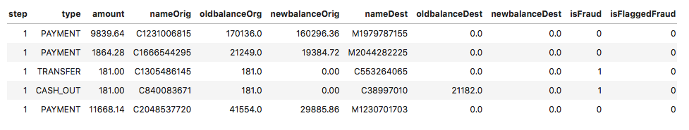
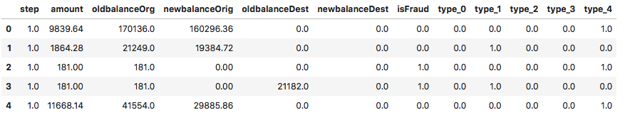
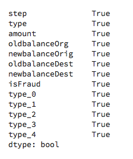
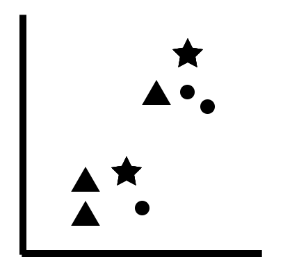
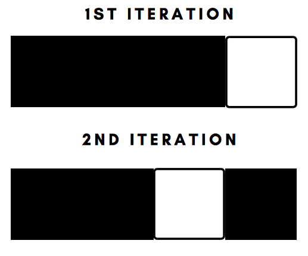
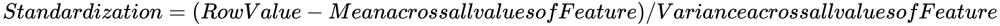

 Lab 10. Predicting Categories with K-Nearest Neighbors
---------------------------------------------------------

The **k-Nearest Neighbors** (**k-NN**) algorithm is a form of supervised
machine learning that is used to predict categories. In this lab,
you will learn about the following:

-   Preparing a dataset for machine learning with scikit-learn
-   How the k-NN algorithm works *under the hood*
-   Implementing your first k-NN algorithm to predict a fraudulent
    transaction
-   Fine-tuning the parameters of the k-NN algorithm
-   Scaling your data for optimized performance

The k-NN algorithm has a wide range of applications in the field of
classification and supervised machine learning. Some of the real-world
applications for this algorithm include predicting loan defaults and
credit-based fraud in the financial industry and predicting whether a
patient has cancer in the healthcare industry.

This course's design facilitates the implementation of a robust machine
learning pipeline for each and every algorithm mentioned in the course,
and a Jupyter Notebook will be required. 

### Note

Each lab in this course comes with a pipeline that is implemented in a
Jupyter Notebook on the official GitHub repository of this course, and as
such, it is highly recommended that you install Jupyter Notebook on your
local machine.

Let's get started.

#### Pre-reqs:
- Google Chrome (Recommended)

#### Lab Environment
Notebooks are ready to run. All packages have been installed. There is no requirement for any setup.

**Note:** Elev8ed Notebooks (powered by Jupyter) will be accessible at the port given to you by your instructor. Password for jupyterLab : `1234`

All Notebooks are present in `work/machine-learning-with-scikit-learn` folder.

You can access jupyter lab at `<host-ip>:<port>/lab/workspaces/lab2_K_Nearest_Neighbors`

To copy and paste: use **Control-C** and to paste inside of a terminal, use **Control-V**


Technical requirements
----------------------

* * * * *

You will be required to have Python 3.6 or greater, Pandas ≥
0.23.4, Scikit-learn ≥ 0.20.0, NumPy ≥ 1.15.1, and Matplotlib ≥
3.0.0 installed on your system.

Preparing a dataset for machine learning with scikit-learn
----------------------------------------------------------

* * * * *

The first step to implementing any machine learning algorithm with
scikit-learn is data preparation. Scikit-learn comes with a set of
constraints to implementation that will be discussed later in this
section. The dataset that we will be using is based on mobile payments
and is found on the world's most popular competitive machine learning
website – Kaggle.

## Dataset
Dataset is already downloaded from: [https://www.kaggle.com/ntnu-testimon/paysim1](https://www.kaggle.com/ntnu-testimon/paysim1).

<span style="color:red;">Extract Dataset!</span>

**Note:** Terminal is already running. You can also open new terminal by clicking:
`File` > `New` > `Terminal`.

Run the following commands in the terminal to extract dataset:

`cd ~/work && unzip dataset.zip`

`mv PS_20174392719_1491204439457_log.csv machine-learning-with-scikit-learn/Chapter02/`

The fundamental goal of this dataset is to predict whether a mobile
transaction is fraudulent. In order to do this, we need to first have a
brief understanding of the contents of our data. In order to explore the
dataset, we will use the `pandas` package in Python.


We can now read in the dataset into our Jupyter Notebook by using the
following code: 

```
# Package Imports

import pandas as pd

#Reading in the dataset

df = pd.read_csv('PS_20174392719_1491204439457_log.csv')

#Viewing the first 5 rows of the dataset

df.head()
```

This produces an output as illustrated in the following screenshot: 



### Dropping features that are redundant

From the dataset seen previously, there are a few columns that are
redundant to the machine learning process:

-   `nameOrig`: This column is a unique identifier that
    belongs to each customer. Since each identifier is unique with every
    row of the dataset, the machine learning algorithm will not be able
    to discern any patterns from this feature. 
-   `nameDest`: This column is also a unique identifier that
    belongs to each customer and as such provides no value to the
    machine learning algorithm. 
-   `isFlaggedFraud`: This column flags a transaction as
    fraudulent if a person tries to transfer more than 200,000 in a
    single transaction. Since we already have a feature
    called `isFraud` that flags a transaction as fraud, this
    feature becomes redundant. 

 

 

We can drop these features from the dataset by using the following
code: 

```
#Dropping the redundant features

df = df.drop(['nameOrig', 'nameDest', 'isFlaggedFraud'], axis = 1)
```

### Reducing the size of the data

The dataset that we are working with contains over 6 million rows of
data. Most machine learning algorithms will take a large amount of time
to work with a dataset of this size. In order to make our execution time
quicker, we will reduce the size of the dataset to 20,000 rows. We can
do this by using the following code:

```
#Storing the fraudulent data into a dataframe

df_fraud = df[df['isFraud'] == 1]

#Storing the non-fraudulent data into a dataframe 

df_nofraud = df[df['isFraud'] == 0]

#Storing 12,000 rows of non-fraudulent data

df_nofraud = df_nofraud.head(12000)

#Joining both datasets together 

df = pd.concat([df_fraud, df_nofraud], axis = 0)
```

In the preceding code, the fraudulent rows are stored in one dataframe.
This dataframe contains a little over 8,000 rows. The 12,000
non-fraudulent rows are stored in another dataframe, and the two
dataframes are joined together using the `concat` method
from pandas.

This results in a dataframe with a little over 20,000 rows, over which
we can now execute our algorithms relatively quickly. 

### Encoding the categorical variables

One of the main constraints of scikit-learn is that you cannot implement
the machine learning algorithms on columns that are categorical in
nature. For example, the `type` column in our dataset has
five categories:

 

-   `CASH-IN`
-   `CASH-OUT`
-   `DEBIT`
-   `PAYMENT`
-   `TRANSFER`

These categories will have to be encoded into numbers that scikit-learn
can make sense of. In order to do this, we have to implement a two-step
process. 

The first step is to convert each category into a number:
`CASH-IN = 0`, `CASH-OUT = 1`,
`DEBIT = 2`, `PAYMENT = 3`,
`TRANSFER = 4`. We can do this by using the following code:

```
#Package Imports

from sklearn.preprocessing import LabelEncoder
from sklearn.preprocessing import OneHotEncoder

#Converting the type column to categorical

df['type'] = df['type'].astype('category')

#Integer Encoding the 'type' column

type_encode = LabelEncoder()

#Integer encoding the 'type' column

df['type'] = type_encode.fit_transform(df.type)
```

The code first coverts the `type` column to a categorical
feature. We then use `LabelEncoder()` in order to initialize
an integer encoder object that is
called `type_encode`*. *Finally, we apply
the `fit_transform` method on the `type` column
in order to convert each category into a number.

Broadly speaking, there are two types of categorical variables:

-   Nominal 
-   Ordinal

Nominal categorical variables have no inherent order to them. An example
of the nominal type of categorical variable is
the `type` column. 

Ordinal categorical variables have an inherent order to them. An example
of the ordinal type of categorical variable is Education Level, in which
people with a Master's degree will have a higher order/value compared to
people with a Undergraduate degree only. 

In the case of ordinal categorical variables, integer encoding, as
illustrated previously, is sufficient and we do not need to one-hot
encode them. Since the `type` column is a nominal
categorical variable, we have to one-hot encode it after integer
encoding it. This is done by using the following code: 

```
#One hot encoding the 'type' column

type_one_hot = OneHotEncoder()

type_one_hot_encode = type_one_hot.fit_transform(df.type.values.reshape(-1,1)).toarray()

#Adding the one hot encoded variables to the dataset 

ohe_variable = pd.DataFrame(type_one_hot_encode, columns = ["type_"+str(int(i)) for i in range(type_one_hot_encode.shape[1])])

df = pd.concat([df, ohe_variable], axis=1)

#Dropping the original type variable 

df = df.drop('type', axis = 1)

#Viewing the new dataframe after one-hot-encoding 

df.head()
```

In the code, we first create a one-hot encoding object
called `type_one_hot`*. *We then transform
the `type` column into one-hot encoded columns by using
the `fit_transform` method. 

We have five categories that are represented by integers 0 to 4. Each of
these five categories will now get its own column. Therefore, we create
five columns called `type_0`, `type_1`,
`type_2`, `type_3`, and `type_4`. Each of
these five columns is represented by two values: `1`, which
indicates the presence of that category, and `0`, which
indicates the absence of that category. 

This information is stored in the `ohe_variable`*. *Since this
variable holds the five columns, we will join this to the original
dataframe by using the `concat` method
from `pandas`*. *

The ordinal `type` column is then dropped from the dataframe
as this column is now redundant post one hot encoding. The final
dataframe now looks like this:



### Missing values

Another constraint with scikit-learn is that it cannot handle data with
missing values. Therefore, we must check whether our dataset has any
missing values in any of the columns to begin with. We can do this by
using the following code: 

```
#Checking every column for missing values

df.isnull().any()
```

This produces this output: 



Here we note that every column has some amount of missing values. 

Missing values can be handled in a variety of ways, such as the
following:

-   Median imputation
-   Mean imputation
-   Filling them with the majority value

The amount of techniques is quite large and varies depending on the
nature of your dataset. This process of handling features with missing
values is called **feature engineering**.

Feature engineering can be done for both categorical and numerical
columns and would require an entire course to explain the various
methodologies that comprise the topic. 

Since this course provides you with a deep focus on the art of applying
the various machine learning algorithms that scikit-learn offers,
feature engineering will not be dealt with. 

So, for the purpose of aligning with the goals that this course intends to
achieve, we will impute all the missing values with a zero.

We can do this by using the following code: 

```
#Imputing the missing values with a 0

df = df.fillna(0)
```

We now have a dataset that is ready for machine learning with
scikit-learn. We will use this dataset for all the other chapters that
we will go through in the future. To make it easy for us, then, we will
export this dataset as a `.csv` file and store it in the same
directory that you are working in with the Jupyter Notebook.

We can do this by using the following code: 

```
df.to_csv('fraud_prediction.csv')
```

This will create a `.csv` file of this dataset in the
directory that you are working in, which you can load into the notebook
again using pandas. 


The k-NN algorithm
------------------

* * * * *

Mathematically speaking, the k-NN algorithm is one of the most simple
machine learning algorithms out there. See the following diagram for a
visual overview of how it works: 



How k-NN works under the hood

The stars in the preceding diagram represent new data points. If we
built a k-NN algorithm with three neighbors, then the stars would search
for the three data points that are closest to it. 

In the lower-left case, the star sees two triangles and one circle.
Therefore, the algorithm would classify the star as a triangle since the
number of triangles was greater than the number of circles. 

In the upper-right case, the star sees two circles and one circle.
Therefore, the algorithm will classify the star as a circle since the
number of circles was greater than the number of triangles. 

The real algorithm does this in a very probabilistic manner and picks
the category/shape with the highest probability. 


Implementing the k-NN algorithm using scikit-learn
--------------------------------------------------

* * * * *

In the following section, we will implement the first version of the
k-NN algorithm and assess its initial accuracy. When implementing
machine learning algorithms using scikit-learn, it is always a good
practice to implement algorithms without fine-tuning or optimizing any
of the associated parameters first in order to evaluate how well it
performs.

In the following section, you will learn how to do the following:

-   Split your data into training and test sets
-   Implement the first version of the algorithm on the data
-   Evaluate the accuracy of your model using a k-NN score

### Splitting the data into training and test sets

The idea of training and test sets is fundamental to every machine
learning problem. When thinking about this concept, it is easy to
understand why the concept was introduced. Think of machine learning as
the direct equivalent to the process of human learning; when learning a
concept in mathematics, we first learn how to solve a set of problems
with solutions attached to them so that we can understand the exact
methodology involved in solving these problems. We then take a test at
school or university and attempt to solve problems that we have not
encountered or seen before in order to test our understanding. 

The training set is a part of the dataset that a machine learning
algorithm uses to learn from. The test set is a part of the dataset that
the machine learning algorithm has not seen before and is used to assess
the performance of the machine learning algorithm. 

The first step to this process is to save all our features into one
variable and the target variable, which contains the labels into another
variable. 

In our dataset, the target variable is called `isFraud` and
contains two labels: 0 if the transaction is not a fraud and 1 if the
transaction is a fraud. The features are the remaining variables. We can
store these into two separate variables by using the following code: 

```
#Creating the features 

features = df.drop('isFraud', axis = 1).values
target = df['isFraud'].values
```

In the preceding code, .*values *is used to convert the values in the
features and target variables into NumPy arrays.

Next, we will split the features and target into training and test sets
by using the following code:

```
from sklearn.model_selection import train_test_split

X_train, X_test, y_train, y_test = train_test_split(features, target, test_size = 0.3, random_state = 42, stratify = target)
```

We use
the `train_test_split` from `sklearn.model_selection` in
order to perform this task. In the preceding code, we have four
variables. `X_train` and `X_test` correspond to the
training and test sets for the features, while `y_train` and
`y_test` correspond to training and test sets for the target
variable. 

 

The `train_test_split()` function takes in four arguments.
The first argument is the array containing the features, the second
argument is the array containing the target variable.
The ` test_size` argument* *is used to specify the amount of
data that will be split and stored into the test set. Since we specified
`0.3`, 30% of the original data will be stored in the test
set, while 70% of the original data will be used for training. 

There are two primary ways in which the `train_test_split()`
function shuffles data into training and test sets for the target
variable:

-   **Random sampling**: Randomly puts target labels into training and
    test sets (`y_train` and `y_test` in the
    preceding case).
-   **Stratified sampling**: Ensures that the target labels are
    represented adequately in the training and test sets. In the
    preceding code, the *stratify* argument has been set to the target
    labels to ensure that this happens.   

### Implementation and evaluation of your model

Now that we have the training and test splits, we can implement the k-NN
algorithm on the training sets and evaluate its score on the test sets.
We can do this by using the following code:

```
from sklearn.neighbors import KNeighborsClassifier

#Initializing the kNN classifier with 3 neighbors 

knn_classifier = KNeighborsClassifier(n_neighbors=3)

#Fitting the classifier on the training data 

knn_classifier.fit(X_train, y_train)

#Extracting the accuracy score from the test sets

knn_classifier.score(X_test, y_test)
```

In the preceding code, we first initialize a k-NN classifier with three
neighbors. The number of neighbors is chosen arbitrarily, and three is a
good starting number. Next, we use the `.fit()` method to
fit this classifier onto our training data. Finally, by using
the `.score()` method on the test data, we obtain a value
between 0 and 1 that indicates how accurate the classifier is. 

In our case, we obtained an accuracy score of `0.98`, which is
very good! 

 

There are many ways of assessing and evaluating the performance of the
classifier, and the accuracy score should not be the only way you
evaluate the performance of your classifier. Further methods of
evaluation will be discussed at a later stage in the lab. 


Fine-tuning the parameters of the k-NN algorithm
------------------------------------------------

* * * * *

In the previous section, we arbitrarily set the number of neighbors to
three while initializing the k-NN classifier. However, is this the
optimal value? Well, it could be, since we obtained a relatively high
accuracy score in the test set. 

Our goal is to create a machine learning model that does not overfit or
underfit the data. Overfitting the data means that the model has been
trained very specifically to the training examples provided and will not
generalize well to cases/examples of data that it has not encountered
before. For instance, we might have fit the model very specifically to
the training data, with the test cases being also very similar to the
training data. Thus, the model would have been able to perform very well
and produce a very high value of accuracy. 

Underfitting is another extreme case, in which the model fits the data
in a very generic way and does not perform well in predicting the
correct class labels in the test set. This is the exact opposite of
overfitting. 

Both these cases can be avoided by visualizing how well the model
performs in the training and test sets by using a different number of
neighbors. To do this, we first find the optimal number of neighbors by
using the `GridSearchCV` algorithm. 

`GridSearchCV` creates an empty grid and fills it with
possible values of the number of neighbors or any other machine learning
parameter that we want to optimize. It then uses each value in the grid
and tests its performance and determines the  optimal value of the
parameter. We can implement the `GridSearchCV` algorithm to
find the optimal number of neighbors by using the following code:

```
import numpy as np
from sklearn.model_selection import GridSearchCV

#Initializing a grid with possible number of neighbors from 1 to 24

grid = {'n_neighbors' : np.arange(1, 25)}

#Initializing a k-NN classifier 

knn_classifier = KNeighborsClassifier()

#Using cross validation to find optimal number of neighbors 

knn = GridSearchCV(knn_classifier, grid, cv = 10)

knn.fit(X_train, y_train)

#Extracting the optimal number of neighbors 

knn.best_params_

#Extracting the accuracy score for optimal number of neighbors

knn.best_score_
```

In this code, we first initialize a number array with values between 1
and 24. This range was chosen arbitrarily and you can increase or
decrease the range. However, increasing the range will mean that it will
take more computational time to compute and find the optimal number of
neighbors, especially when your dataset is large. 

Next, we initialize a k-NN classifier and use
the `GridSearchCV()` function on the classifier along with
the grid. We set the `cv` argument to 10, indicating that we
want to use 10-fold cross validation while doing this. Cross validation
is a technique in which the classifier first divides the data into 10
parts. The first nine parts are used as the training set while the
10^th^ part is used as the test set. In the second iteration, we use the
first eight parts and the 10^th^ part as the training set, while the
ninth part is used as the test set. This process is repeated until every
part of the data is used for testing. This creates a very robust
classifier, since we have used the entire dataset for training and
testing and have not left out any part of the data. 

Cross-validation is illustrated for you in the following diagram: 



Cross-validation in action

 

 

 

 

In the preceding diagram, the black boxes illustrate the training data
while the white box illustrates the test data. 

Finally, we use the `.best_params_` to extract the optimal
number of neighbors. In our case, the optimal number of neighbors was 1,
which resulted in an accuracy score of `0.985`. This is an
improvement of 0.002 from the original classifier that we built, which
had a score of `0.983` with three neighbors. 

Using cross-validation ensures that we do not overfit or underfit the
data as we have used the entire dataset for training and testing. 


Scaling for optimized performance
---------------------------------

* * * * *

The k-NN algorithm is an algorithm that works based on distance. When a
new data point is thrown into the dataset and the algorithm is given the
task of classifying this new data point, it uses distance to check the
points that are closest to it. 

If we have features that have different ranges of values – for example,
feature one has a range between 0 to 800 while feature two has a range
between one to five – this distance metric does not make sense anymore.
We want all the features to have the same range of values so that the
distance metric is on level terms across all features. 

One way to do this is to subtract each value of each feature by the mean
of that feature and divide by the variance of that feature. This is
called **standardization**:



We can do this for our dataset by using the following code: 

```
from sklearn.preprocessing import StandardScaler
from sklearn.pipeline import Pipeline

#Setting up the scaling pipeline 

pipeline_order = [('scaler', StandardScaler()), ('knn', KNeighborsClassifier(n_neighbors = 1))]

pipeline = Pipeline(pipeline_order)

#Fitting the classfier to the scaled dataset 

knn_classifier_scaled = pipeline.fit(X_train, y_train)

#Extracting the score 

knn_classifier_scaled.score(X_test, y_test)
```

In this code, we specify the order in which the pipeline has to be
executed. We store this order in a variable
called `pipeline_order` by specifying that we want to scale
our data first by using the `StandardScaler()` function and
then build a k-NN classifier with one neighbor. 

Next, we use the `Pipeline()` function and pass in the order
of the pipeline as the only argument. We then fit this pipeline to the
training set and extract the accuracy scores from the test set. 

The `Pipeline` function, as the name implies, is used to fit
multiple functions into a pipeline and execute them in a specified order
that we think is apt for the process. This function helps us streamline
and automate common machine learning tasks. 

This resulted in an accuracy score of `0.997`, which is a
substantial improvement from the score of `0.985`. Thus, we
see how scaling the data results in improved performance. 


Summary
-------

* * * * *

This lab was fundamental in helping you prepare a dataset for
machine learning with scikit-learn. You have learned about the
constraints that are imposed when you do machine learning with
scikit-learn and how to create a dataset that is perfect for
scikit-learn. 

You have also learned how the k-NN algorithm works behind the scenes and
have implemented a version of it using scikit-learn to predict whether a
transaction was fraudulent. You then learned how to optimize the
parameters of the algorithm using the popular `GridSearchCV`
algorithm. Finally, you have learnt how to standardize and scale your
data in order to optimize the performance of your model. 

In the next lab, you will learn how to classify fraudulent
transactions yet again with a new algorithm – the logistic regression
algorithm!


