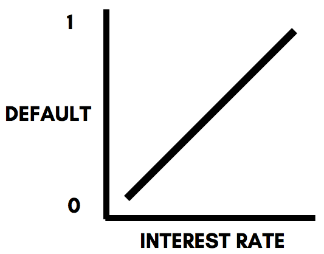
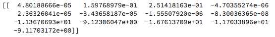
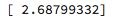

Lab 11. Predicting Categories with Logistic Regression
---------------------------------------------------------

The logistic regression algorithm is one of the most interpretable
algorithms in the world of machine learning, and although the word
"regression" implies predicting a numerical outcome, the logistic
regression algorithm is, used to predict categories and solve
classification machine learning problems. 

In this lab, you will learn about the following:

-   How the logistic regression algorithm works mathematically
-   Implementing and evaluating your first logistic regression algorithm
    with scikit-learn
-   Fine-tuning the hyperparameters using `GridSearchCV`
-   Scaling your data for a potential improvement in accuracy
-   Interpreting the results of the model

Logistic regression has a wide range of applications, especially in the
field of finance, where building interpretable machine learning models
is key in convincing both investors and regulators alike that your model
makes intuitive and logical sense. 

#### Pre-reqs:
- Google Chrome (Recommended)

#### Lab Environment
Notebooks are ready to run. All packages have been installed. There is no requirement for any setup.

**Note:** Elev8ed Notebooks (powered by Jupyter) will be accessible at the port given to you by your instructor. Password for jupyterLab : `1234`

All Notebooks are present in `work/datascience-ml-next-level` folder.

You can access jupyter lab at `http://<update-DNS>/lab/workspaces/lab11_Logistic_Regression`

To copy and paste: use **Control-C** and to paste inside of a terminal, use **Control-V**


Technical requirements
----------------------

* * * * *

You will be required to have Python 3.6 or greater, Pandas ≥
0.23.4, Scikit-learn ≥ 0.20.0, and Matplotlib ≥ 3.0.0  installed on your
system.


Understanding logistic regression mathematically 
-------------------------------------------------

* * * * *

As the name implies, logistic regression is fundamentally derived from
the linear regression algorithm. The linear regression algorithm will be
discussed in depth in the upcoming chapters. For now, let's consider a
hypothetical case in which we want to predict the probability that a
particular loan will default based on the loan's interest rate. Using
linear regression, the following equation can be constructed:

`Default = (Interest Rate × x) + c` 

In the preceding equation, *c *is the intercept and *x *is a coefficient
that will be the output from the logistic regression model. The
intercept and the coefficient will have numeric values. For the purpose
of this example, let's assume *c* is 5 and *x *is -0.2. The equation now
becomes this:

`Default = (Interest Rate × -0.2) + 5` 

The equation can be represented in a two-dimensional plot using the
following diagram: 



Assuming that the interest rate is 10%, the value of default produced by
the equation is as follows:

*Default = (10 × -0.2) + 5*

*Default = 3*

The logistic regression model now uses the `logit` function to
transform this value of 3 into a probability between 0 and 1: 


After evaluating the preceding equation, we get an answer of 0.95. In
other words, using the logistic regression model that we just built
mathematically, we obtained a probability of 95% that the loan would
default if the interest rate was 10%. 

After applying the `logit` function to the linear equation,
the two-dimensional plot shown previously changes to the following
diagram: 

 

In the preceding diagram, the following is happening:

-   The function approaches 1 as the interest rate nears infinity along
    the *x*-axis.
-   The function approaches 0 as the interest rate nears 0 along the
    *x*-axis.


Implementing logistic regression using scikit-learn
---------------------------------------------------

* * * * *

In this section, you will learn how you can implement and quickly
evaluate a logistic regression model for your dataset. We will be using
the same dataset that we have already cleaned and prepared for the
purpose of predicting whether a particular transaction was fraudulent.
In the previous lab, we saved this dataset as
`fraud_detection.csv`. The first step is to load this dataset
into your Jupyter Notebook. This can be done by using the following
code: 

```
import pandas as pd

# Reading in the dataset 

df = pd.read_csv('fraud_prediction.csv')
```

### Splitting the data into training and test sets

The first step to building any machine learning model with scikit-learn
is to split the data into training and test sets. This can be done by
using the following code: 

```
from sklearn.model_selection import train_test_split

#Creating the features and target

features = df.drop('isFraud', axis = 1).values
target = df['isFraud'].values

#Creating the training and testing data

X_train, X_test, y_train, y_test = train_test_split(features, target, test_size = 0.3, random_state = 42, stratify = target)
```

The next step is to implement a base logistic regression classifier and
evaluate its accuracy score. This can be done by using the following
code: 

```
from sklearn import linear_model

#Initializing an logistic regression object

logistic_regression = linear_model.LogisticRegression()

#Fitting the model to the training and test sets

logistic_regression.fit(X_train, y_train)
```

In the preceding code, the `linear_model` package is
imported from `sklearn` and is used to initialize the logistic
regression algorithm by calling the `LogisticRegression()` 
method. This logistic regression algorithm is then fit into the training
data. 

In order to extract the accuracy score, we use the following code on the
test data: 

```
#Accuracy score of the logistic regression model

logistic_regression.score(X_test, y_test)
```

This model has produced an accuracy of 58.9% on the test data. This
means that the base logistic regression model only performs slightly
better than an algorithm that randomly guesses the output. 


Fine-tuning the hyperparameters
-------------------------------

* * * * *

From the output of the logistic regression model implemented in the
preceding section, it is clear that the model performs slightly better
than random guessing. Such a model fails to provide value to us. In
order to optimize the model, we are going to optimize the
hyperparameters of the logistic regression model by using the
`GridSearchCV` algorithm that we used in the previous
lab. 

The hyperparameter that is used by the logistic regression model is
known as the inverse regularization strength. This is because we are
implementing a type of linear regression known as **l1** regression.
This type of linear regression will explained in detail in *Predicting Numeric Outcomes with Linear Regression*. 

In order to optimize the inverse regularization strength, or **C** as it
is called in short, we use the following code: 

```
#Building the model with L1 penality 

logistic_regression = linear_model.LogisticRegression(penalty='l1')

#Using GridSearchCV to search for the best parameter

grid = GridSearchCV(logistic_regression, {'C':[0.0001, 0.001, 0.01, 0.1, 10]})
grid.fit(X_train, y_train)

# Print out the best parameter

print("The most optimal inverse regularization strength is:", grid.best_params_)
```

This produces an output as illustrated in the following screenshot: 


In the preceding code, we first initialize a logistic regression model
with the penalty argument set to **l1**, indicating that we are using
**l1** regression. We then initialize a grid with the possible values of
inverse regularization strengths that go from 0.0001 to 10. 

### Note

The number of values that you initialize in a grid object for the
hyperparameter of a model is arbitrary. However, the more values, the
longer it takes for `GridSearchCV` to give you the optimal
value of the hyperparameter, therby making the process computationally
expensive. 

 

The grid object with the possible values of the inverse regularization
strengths are then fit into the training data and the optimal value is
printed out, which in this case is 10. We can now build a new logistic
regression model with this newly obtained optimal hyperparameter value
by using the following code: 

```
#Initializing an logistic regression object

logistic_regression = linear_model.LogisticRegression(C = 10, penalty = 'l1')

#Fitting the model to the training and test sets

logistic_regression.fit(X_train, y_train)
```

Evaluating the model on the test data by using the following code, we
obtain an accuracy score of 99.6%! That's quite the improvement. 

```
#Accuracy score of the logistic regression model

logistic_regression.score(X_test, y_test)
```

One way to check whether `GridSearchCV` is giving us accurate
results is to plot the accuracy scores along the *y*-axis for different
values of the inverse regularization strengths along the x-axis. This
can be done by using the following code: 

```
train_errors = []
test_errors = []

C_list = [0.0001, 0.001, 0.01, 0.1, 10, 100, 1000]

# Evaluate the training and test classification errors for each value of C

for value in C_list:

 # Create LogisticRegression object and fit
 logistic_regression = linear_model.LogisticRegression(C= value, penalty = 'l1')
 logistic_regression.fit(X_train, y_train)

 # Evaluate error rates and append to lists
 train_errors.append(logistic_regression.score(X_train, y_train) )
 test_errors.append(logistic_regression.score(X_test, y_test))

# Plot results
plt.semilogx(C_list, train_errors, C_list, test_errors)
plt.legend(("train", "test"))
plt.ylabel('Accuracy Score')
plt.xlabel('C (Inverse regularization strength)')
plt.show()
```

This results in a plot as illustrated in the following diagram: 


From the preceding plot, it is clear that an inverse regularization
strength of 10 provides a high value of accuracy for both the training
and testing sets. Such plots are also used to determine whether a
particular value of the hyperparameter is overfitting the data by giving
us a high accuracy score on the training set, but low accuracy scores on
the test set. Conversely, they can also be used to check whether a model
is undercutting the data by giving us low values of accuracy on the
training set itself. 


Scaling the data
----------------

* * * * *

Although the model has performed extremely well, scaling the data is
still a useful step in building machine learning models with logistic
regression, as it standardizes your data across the same range of
values. In order to scale your data, we will use the same
`StandardScaler()` function that we used in the previous
lab. This is done by using the following code: 

```
from sklearn.preprocessing import StandardScaler
from sklearn.pipeline import Pipeline

#Setting up the scaling pipeline 

pipeline_order = [('scaler', StandardScaler()), ('logistic_reg', linear_model.LogisticRegression(C = 10, penalty = 'l1'))]

pipeline = Pipeline(pipeline_order)

#Fitting the classfier to the scaled dataset 

logistic_regression_scaled = pipeline.fit(X_train, y_train)

#Extracting the score 

logistic_regression_scaled.score(X_test, y_test)
```

The preceding code resulted in the improvement in the accuracy score of
the model by 0.1%, which is good considering how the model had a very
high accuracy score in the first place. The code is similar to the
pipeline for scaling we built in the previous lab for the k-NN
algorithm, and there are no changes except for the fact that we have
used a logistic regression model instead of the k-NN model. 


Interpreting the logistic regression model
------------------------------------------

* * * * *

One of the key benefits of the logistic regression algorithm is that it
is highly interpretable. This means that the outcome of the model can be
interpreted as a function of the input variables. This allows us to
understand how each variable contributes to the eventual outcome of the
model. 

In the first section, we understood that the logistic regression model
consists of coefficients for each variable and an intercept that can be
used to explain how the model works. In order to extract the
coefficients for each variable in the model, we use the following code: 

```
#Printing out the coefficients of each variable 

print(logistic_regression.coef_)
```

This results in an output as illustrated by the following screenshot: 



The coefficients are in the order in which the variables were in the
dataset that was input into the model. In order to extract the intercept
from the model, we use the following code: 

```
#Printing out the intercept of the model

print(logistic_regression.intercept_)
```

This results in an output as shown in the following screenshot: 



Now that we have the coefficients for each variable along with the
intercept, we can construct an equation in the following form:

 


Summary
-------

* * * * *

In this lab, you have learned how the logistic regression model
works on a mathematical level. Although simplistic, the model proves to
be formidable in terms of interpretability, which is highly beneficial
in the financial industry. 

You have also learned how to build and evaluate logistic regression
algorithms using scikit-learn, and looked at hyperparameter optimization
using the `GridSearchCV` algorithm. Additionally, you have
learned to verify whether the results provided to you by the
`GridSearchCV` algorithm are accurate by plotting the accuracy
scores for different values of the hyperparameter. 

Finally, you have scaled your data in order make it standardized and
learned how to interpret your model on a mathematical level. 

In the next lab, you will learn how to implement tree-based
algorithms, such as decision trees, random forests, and gradient-boosted
trees, using scikit-learn.


