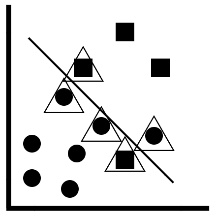
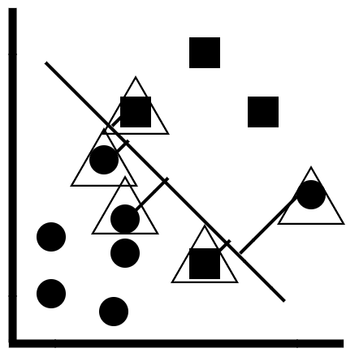
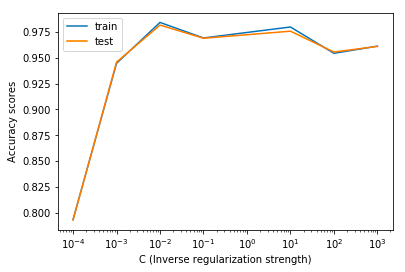

Lab 12. Predicting Categories with Naive Bayes and SVMs
----------------------------------------------------------

In this lab, you will learn about the following topics:

-   The theoretical concept behind the Naive Bayes algorithm, explained
    in mathematical terms
-   Implementing the Naive Bayes algorithm by using scikit-learn 
-   How the linear support vector machine algorithm works under the hood
-   Graphically optimizing the hyperparameters of the linear support
    vector machines

#### Pre-reqs:
- Google Chrome (Recommended)

#### Lab Environment
Notebooks are ready to run. All packages have been installed. There is no requirement for any setup.

**Note:** Elev8ed Notebooks (powered by Jupyter) will be accessible at the port given to you by your instructor. Password for jupyterLab : `1234`

All Notebooks are present in `work/datascience-ml-next-level` folder.

You can access jupyter lab at `http://<update-DNS>/lab/workspaces/lab12_Naive_Bayes_SVMs`


### Implementing the Naive Bayes algorithm in scikit-learn

Now that you have learned how the Naive Bayes algorithm generates
predictions, we will implement the same classifier using scikit-learn,
in order to predict whether a particular transaction is fraudulent.

The first step is to import the data, create the feature and target
arrays, and split the data into training and test sets.

We can do this by using the following code:

```
import pandas as pd
from sklearn.model_selection import train_test_split

df = pd.read_csv('fraud_prediction.csv')

df = df.drop(['Unnamed: 0'], axis = 1)

#Creating the features 

features = df.drop('isFraud', axis = 1).values
target = df['isFraud'].values

X_train, X_test, y_train, y_test = train_test_split(features, target, test_size = 0.3, random_state = 42, stratify = target)
```

 

 

The next step is to build the Naive Bayes classifier. We can do this by
using the following code:

```
from sklearn.naive_bayes import GaussianNB

#Initializing an NB classifier

nb_classifier = GaussianNB()

#Fitting the classifier into the training data

nb_classifier.fit(X_train, y_train)

#Extracting the accuracy score from the NB classifier

nb_classifier.score(X_test, y_test)
```

In the preceding code, the following applies:

1.  First, we import the `GaussianNB` module from
    scikit-learn
2.  Next, we initialize a Naive Bayes classifier and store it in the
    variable `nb_classifier`
3.  Then, we fit the classifier to the training data and evaluate its
    accuracy on the test data

The Naive Bayes classifier has only one hyperparameter, which is the
prior probability of the hypothesis, *p(h)***. **However, keep the
following in mind:

-   The prior probability will not be available to us in most problems
-   Even if it is, the value is usually fixed as a statistical fact,
    and therefore, hyperparameter optimization is not performed


Support vector machines
-----------------------

* * * * *

In this section, you will learn about **support vector machines
(SVMs),** or, to be more specific, **linear support vector machines**.
In order to understand support vector machines, you will need to know
what support vectors are. They are illustrated for you in the following
diagram:



The concept of support vectors

In the preceding diagram, the following applies:

-   The linear support vector machine is a form of linear classifier. A
    linear decision tree boundary is constructed, and the observations
    on one side of the boundary (the circles) belong to one class, while
    the observations on the other side of the boundary (the squares)
    belong to another class. 
-   The support vectors are the observations that have a triangle on
    them. 
-   These are the observations that are either very close to the linear
    decision boundary or have been incorrectly classified. 
-   We can define which observations we want to make support vectors by
    defining how close to the decision boundary they should be. 
-   This is controlled by the hyperparameter known as the **inverse
    regularization strength****.**

In order to understand how the linear support vector machines work,
consider the following diagram:



Concept of max-margins

In the preceding diagram, the following applies:

-   The line between the support vectors and the linear decision
    boundary is known as the **margin**
-   The goal of the support vector machines is to maximize this margin,
    so that a new data point will be correctly classified 
-   A low value of inverse regularization strength ensures that this
    margin is as big as possible

### Implementing the linear support vector machine algorithm in scikit-learn

In this section, you will learn how to implement the linear support
vector machines in scikit-learn. The first step is to import the data
and split it into training and testing sets. We can do this by using the
following code:

```
import pandas as pd
from sklearn.model_selection import train_test_split

df = pd.read_csv('fraud_prediction.csv')

df = df.drop(['Unnamed: 0'], axis = 1)

#Creating the features 

features = df.drop('isFraud', axis = 1).values
target = df['isFraud'].values

X_train, X_test, y_train, y_test = train_test_split(features, target, test_size = 0.3, random_state = 42, stratify = target)
```

The next step is to build the linear support vector machine classifier.
We can do this by using the following code:

```
from sklearn.svm import LinearSVC

#Initializing a SVM model 

svm = LinearSVC(random_state = 50)

#Fitting the model to the training data

svm.fit(X_train, y_train)

#Extracting the accuracy score from the training data

svm.score(X_test, y_test)
```

In the preceding code, the following applies:

1.  First, we import the `LinearSVC` module from
    scikit-learn
2.  Next, we initialize a linear support vector machine object with a
    random state of 50, so that the model produces the same result every
    time
3.  Finally, we fit the model to the training data and evaluate its
    accuracy on the test data

Now that we have built the model, we can find and optimize the most
ideal value for the hyperparameters. 

### Hyperparameter optimization for the linear SVMs

In this section, you will learn how to optimize the hyperparameters for
the linear support vector machines. In particular, there is one
hyperparameter of interest: the **inverse regularization strength**. 

We will explore how to optimize this hyperparameter, both graphically
and algorithmically.

#### Graphical hyperparameter optimization

In order to optimize the inverse regularization strength, we will plot
the accuracy scores for the training and testing sets, using the
following code:

```
import matplotlib.pyplot as plt 
from sklearn.svm import LinearSVC

training_scores = []
testing_scores = []

param_list = [0.0001, 0.001, 0.01, 0.1, 10, 100, 1000]

# Evaluate the training and test classification errors for each value of the parameter

for param in param_list:

    # Create SVM object and fit

    svm = LinearSVC(C = param, random_state = 42)
    svm.fit(X_train, y_train)

    # Evaluate the accuracy scores and append to lists

    training_scores.append(svm.score(X_train, y_train) )
    testing_scores.append(svm.score(X_test, y_test) )

# Plot results

plt.semilogx(param_list, training_scores, param_list, testing_scores)
plt.legend(("train", "test"))
plt.ylabel('Accuracy scores')
plt.xlabel('C (Inverse regularization strength)')
plt.show()
```

In the preceding code, the following applies:

1.  First, we initialize two empty lists, in order to store the accuracy
    scores for both the training and testing datasets
2.  The next step is to create a list of values of the hyperparameter,
    which, in this case, is the inverse regularization strength
3.  We then loop over each value in the hyperparameter list and build a
    linear support vector machine classifier with each inverse
    regularization strength value
4.  The accuracy scores for the training and testing datasets are then
    appended to the empty lists
5.  Using `matplotlib`, we then create a plot between the
    inverse regularization strength (along the *x *axis) and the
    accuracy scores for both the training and test sets (along
    the *y *axis)

This will produce a plot as shown in the following diagram:



Graphical hyperparameter optimization 

In the preceding diagram, the following applies:

-   We can observe that the accuracy score is highest for the training
    and testing sets for an inverse regularization strength of 10^-2^
-   It is important to pick a value that has a high value of accuracy
    for both the training and testing sets, and not just either one of
    the datasets 
-   This will help you to prevent both overfitting and underfitting

#### Hyperparameter optimization using GridSearchCV

In this section, you will learn how to optimize the inverse
regularization strength using the `GridSearchCV` algorithm. We
can do this using the following code:

```
from sklearn.model_selection import GridSearchCV

#Building the model 

svm = LinearSVC(random_state = 50)

#Using GridSearchCV to search for the best parameter

grid = GridSearchCV(svm, {'C':[0.00001, 0.0001, 0.001, 0.01, 0.1, 10]})
grid.fit(X_train, y_train)

# Print out the best parameter

print("The best value of the inverse regularization strength is:", grid.best_params_)
```

In the preceding code, the following applies:

1.  First, we import the `GridSearchCV` module from
    scikit-learn
2.  The next step is to initialize a linear support vector machine model
    with a random state of 50, in order to ensure that we obtain the
    same results every time we build the model
3.  We then initialize a grid of possible hyperparameter values for the
    inverse regularization strength
4.  Finally, we fit the grid of hyperparameter values to the training
    set, so that we can build multiple linear SVM models with the
    different values of the inverse regularization strength
5.  The `GridSearchCV` algorithm then evaluates the model that
    produces the fewest generalization errors and returns the optimal
    value of the hyperparameter

It's a good practice to compare and contrast the results of the
graphical method of hyperparameter optimization with that of
`GridSearchCV`, in order to validate your results. 

### Scaling the data for performance improvement

In this section, you will learn about how scaling and standardizing the
data can lead to an improvement in the overall performance of the linear
support vector machines. The concept of scaling remains the same as in
the case of the previous chapters, and it will not be discussed here. In
order to scale the data, we use the following code:

```
from sklearn.preprocessing import StandardScaler
from sklearn.pipeline import Pipeline

#Setting up the scaling pipeline 

order = [('scaler', StandardScaler()), ('SVM', LinearSVC(C = 0.1, random_state = 50))]

pipeline = Pipeline(order)

#Fitting the classfier to the scaled dataset 

svm_scaled = pipeline.fit(X_train, y_train)

#Extracting the score 

svm_scaled.score(X_test, y_test)
```

In the preceding code, the following applies:

1.  First, we import
    the `StandardScaler` the `Pipeline` modules
    from scikit-learn, in order to build a scaling pipeline
2.  We then set up the order of the pipeline, which specifies that we
    use the `StandardScaler()` function first, in order to
    scale the data and build the linear support vector machine on that
    scaled data
3.  The `Pipeline()` function is applied to the order of the
    pipeline which sets up the pipeline
4.  We then fit this pipeline to the training data and extract the
    scaled accuracy scores from the test data


Summary
-------

* * * * *

This lab introduced you to two fundamental supervised machine
learning algorithms: the Naive Bayes algorithm and linear support vector
machines. More specifically, you learned about the following topics:

-   How the Bayes theorem is used to produce a probability, to indicate
    whether a data point belongs to a particular class or category
-   Implementing the Naive Bayes classifier in scikit-learn
-   How the linear support vector machines work under the hood
-   Implementing the linear support vector machines in scikit-learn
-   Optimizing the inverse regularization strength, both graphically and
    by using the `GridSearchCV` algorithm
-   How to scale your data for a potential improvement in performance

In the next lab, you will learn about the other type of supervised
machine learning algorithm, which is used to predict numeric values,
rather than classes and categories: linear regression!


