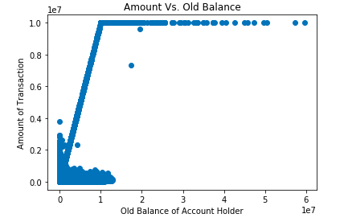
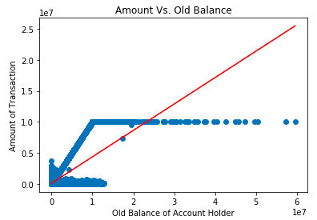
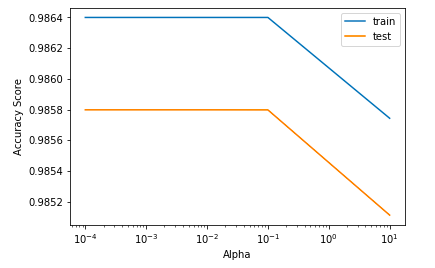
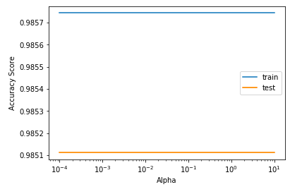

Lab 13. Predicting Numeric Outcomes with Linear Regression
-------------------------------------------------------------

In this lab, you will learn about the following topics:
-   The inner mechanics of the linear regression algorithm
-   Building and evaluating your first linear regression algorithm,
    using scikit-learn
-   Scaling your data for a potential performance improvement
-   Optimizing your linear regression model


#### Pre-reqs:
- Google Chrome (Recommended)

#### Lab Environment
Notebooks are ready to run. All packages have been installed. There is no requirement for any setup.

**Note:** Elev8ed Notebooks (powered by Jupyter) will be accessible at the port given to you by your instructor. Password for jupyterLab : `1234`

All Notebooks are present in `work/datascience-ml-next-level` folder.

You can access jupyter lab at `http://<update-DNS>/lab/workspaces/lab13_Linear_Regression`

To copy and paste: use **Control-C** and to paste inside of a terminal, use **Control-V**


### Linear regression in two dimensions 

The first step is to read in the dataset and define the feature and
target variable. This can be done by using the following code:

```
import pandas as pd

#Reading in the dataset

df = pd.read_csv('fraud_prediction.csv')

#Define the feature and target arrays

feature = df['oldbalanceOrg'].values
target = df['amount'].values
```

Next, we will create a simple scatter plot between the amount of the
mobile transaction on the *y *axis (which is the outcome of the linear
regression model) and the old balance of the account holder along the
*x *axis (which is the input feature). This can be done by using the
following code:

```
import matplotlib.pyplot as plt

#Creating a scatter plot

plt.scatter(feature, target)
plt.xlabel('Old Balance of Account Holder')
plt.ylabel('Amount of Transaction')
plt.title('Amount Vs. Old Balance')
plt.show()
```

In the preceding code, we use the `plt.scatter()` function to
create a scatter plot between the feature* *on the *x *axis and
the target* *on the *y *axis. This results in the scatter plot
illustrated in the following diagram:



Two-dimensional space of the linear regression model

Now, we will fit a linear regression model into the two-dimensional
space illustrated in the preceding diagram. Note that, in the preceding
diagram, the data is not entirely linear. In order to do this, we use
the following code:

```
#Initializing a linear regression model 

linear_reg = linear_model.LinearRegression()

#Reshaping the array since we only have a single feature

feature = feature.reshape(-1, 1)
target = target.reshape(-1, 1)

#Fitting the model on the data

linear_reg.fit(feature, target)

#Define the limits of the x axis 

x_lim = np.linspace(min(feature), max(feature)).reshape(-1, 1)

#Creating the scatter plot

plt.scatter(feature, target)
plt.xlabel('Old Balance of Account Holder')
plt.ylabel('Amount of Transaction')
plt.title('Amount Vs. Old Balance')

#Creating the prediction line 

plt.plot(x_lim, linear_reg.predict(x_lim), color = 'red')

#Show the plot

plt.show()
```

This results in a line of best fit, as illustrated in the following
diagram:



In the preceding code, first, we initialize a linear regression model
and fit the training data into that model. Since we only have a single
feature, we need to reshape the feature and target for scikit-learn.
Next, we define the upper and lower limits of the *x *axis, which
contains our feature variable. 

Finally, we create a scatter plot between the feature and the target
variable and include the line of best fit with the color red, as
indicated in the preceding diagram.

### Using linear regression to predict mobile transaction amount

Now that we have visualized how a simple linear regression model works
in two dimensions, we can use the linear regression algorithm to predict
the total amount of a mobile transaction, using all of the other
features in our mobile transaction dataset. 

The first step is to import our fraud prediction dataset into our
workspace and divide it into training and test sets. This can be done by
using the following code:

```
import pandas as pd
from sklearn.model_selection import train_test_split

# Reading in the dataset 

df = pd.read_csv('fraud_prediction.csv')

#Creating the features 

features = df.drop('isFraud', axis = 1).values
target = df['isFraud'].values

X_train, X_test, y_train, y_test = train_test_split(features, target, test_size = 0.3, random_state = 42, stratify = target)
```

We can now fit the linear regression model and evaluate the initial
accuracy score of the model by using the following code:

```
from sklearn import linear_model

#Initializing a linear regression model 

linear_reg = linear_model.LinearRegression()

#Fitting the model on the data

linear_reg.fit(X_train, y_train)

#Accuracy of the model

linear_reg.score(X_test, y_test)
```

In the preceding code, first, we initialize a linear regression model,
which we can then fit into the training data by using
the `.fit()` function. Then, we evaluate the accuracy score
on the test data by using the `.score()` function. This
results in an accuracy score of 98%, which is fantastic!

### Scaling your data

Scaling your data and providing a level of standardization is a vital
step in any linear regression pipeline, as it could offer a way to
enhance the performance of your model. In order to scale the data, we
use the following code:

```
from sklearn.preprocessing import StandardScaler
from sklearn.pipeline import Pipeline

#Setting up the scaling pipeline 

pipeline_order = [('scaler', StandardScaler()), ('linear_reg', linear_model.LinearRegression())]

pipeline = Pipeline(pipeline_order)

#Fitting the classfier to the scaled dataset 

linear_reg_scaled = pipeline.fit(X_train, y_train)

#Extracting the score 

linear_reg_scaled.score(X_test, y_test)
```

We use the same scaling pipeline that we used in all of the previous
chapters. In the preceding code, we replace the model name with the
linear regression model and evaluate the scaled accuracy scores on the
test data. 

In this case, scaling the data did not lead to any improvements in the
accuracy score, but it is vital to implement scaling into your linear
regression pipeline, as it does lead to an improvement in the accuracy
scores in most cases.


Model optimization 
-------------------

There are two broad types of regularization methods, as follows:

-   Ridge regression 
-   Lasso regression

In the following subsections, the two types of regularization techniques
will be discussed in detail, and you will learn about how you can
implement them into your model. 

### Ridge regression

The equation for ridge regression is as follows:


In the preceding equation, the ridge loss function is equal to the
ordinary least squares loss function, plus the product of the square of
*Parameter1* of each feature and `alpha`. 

`alpha` is a parameter that we can optimize in order to
control the amount by which the ridge loss function penalizes the
coefficients, in order to prevent overfitting. Obviously, if
`alpha` is equal to `0`, the ridge loss function is
equal to the ordinary least squares loss function, thereby making no
difference to the initial overfit model. 

Therefore, optimizing this value of `alpha` provides the
optimal model that can generalize beyond the data that it has trained
on. 

In order to implement ridge regression into the fraud prediction
dataset, we use the following code:

```
from sklearn.linear_model import Ridge
import pandas as pd
import numpy as np
from sklearn.model_selection import train_test_split
from sklearn.linear_model import Ridge

# Reading in the dataset 

df = pd.read_csv('fraud_prediction.csv')

#Creating the features 

features = df.drop('isFraud', axis = 1).values
target = df['isFraud'].values

X_train, X_test, y_train, y_test = train_test_split(features, target, test_size = 0.3, random_state = 42, stratify = target)

#Initialize a ridge regression model

ridge_reg = Ridge(alpha = 0, normalize = True)

#Fit the model to the training data 

ridge_reg.fit(X_train, y_train)

#Extract the score from the test data

ridge_reg.score(X_test, y_test)
```

In the preceding code, first, we read in the dataset and divide it into
training and test sets (as usual). Next, we initialize a ridge
regression model by using the `Ridge()` function, with the
parameters of `alpha` set to `0` and
`normalize` set to `True`, in order to standardize
the data. 

Next, the ridge model is fit into the training data, and the accuracy
score is extracted from the test data. The accuracy of this model is
exactly the same as the accuracy of the model that we built without the
ridge regression as the parameter that controls how the model is
optimized; `alpha` is set to `0`. 

In order to obtain the optimal value of `alpha` with the
`GridSearchCV` algorithm, we use the following code:

```
from sklearn.model_selection import GridSearchCV

#Building the model 

ridge_regression = Ridge()

#Using GridSearchCV to search for the best parameter

grid = GridSearchCV(ridge_regression, {'alpha':[0.0001, 0.001, 0.01, 0.1, 10]})
grid.fit(X_train, y_train)

# Print out the best parameter

print("The most optimal value of alpha is:", grid.best_params_)

#Initializing an ridge regression object

ridge_regression = Ridge(alpha = 0.01)

#Fitting the model to the training and test sets

ridge_regression.fit(X_train, y_train)

#Accuracy score of the ridge regression model

ridge_regression.score(X_test, y_test)
```

In the preceding code, the following applies:

1.  First, we initialize a ridge regression model, and then, we use the
    `GridSearchCV` algorithm to search for the optimal value
    of `alpha`, from a range of values.
2.  After we obtain this optimal value of `alpha`, we build a
    new ridge regression model with this optimal value in the training
    data, and we evaluate the accuracy score on the test data. 


In order to verify the results that the `GridSearchCV`
algorithm has provided us with, we will construct a plot between the
accuracy scores on the *y *axis and the different values of
`alpha` along the *x *axis, for both the training and test
data. In order to do this, we use the following code:

```
import matplotlib.pyplot as plt 

train_errors = []
test_errors = []

alpha_list = [0.0001, 0.001, 0.01, 0.1, 10]

# Evaluate the training and test classification errors for each value of alpha

for value in alpha_list:

    # Create Ridge object and fit
    ridge_regression = Ridge(alpha= value)
    ridge_regression.fit(X_train, y_train)

    # Evaluate error rates and append to lists
    train_errors.append(ridge_regression.score(X_train, y_train) )
    test_errors.append(ridge_regression.score(X_test, y_test))

# Plot results
plt.semilogx(alpha_list, train_errors, alpha_list, test_errors)
plt.legend(("train", "test"))
plt.ylabel('Accuracy Score')
plt.xlabel('Alpha')
plt.show()
```

This results in the following output:



Accuracy versus alpha 

In the preceding plot, it is clear that a value of 0.01 or
lower provides the highest value of accuracy for both the training and
test data, and therefore, the results from the `GridSearchCV`
algorithm make logical sense. 

In the preceding code, first, we initialize two empty lists, to store
the accuracy scores for both the training and test data. We then
evaluate the accuracy scores for both the training and test sets for
different values of `alpha`, and we create the preceding
plot. 

 

### Lasso regression

In order to implement lasso regression into the fraud prediction
dataset, we use the following code:

```
import pandas as pd
import numpy as np
from sklearn.model_selection import train_test_split
from sklearn.linear_model import Lasso
import warnings

# Reading in the dataset 

df = pd.read_csv('fraud_prediction.csv')

#Creating the features 

features = df.drop('isFraud', axis = 1).values
target = df['isFraud'].values

X_train, X_test, y_train, y_test = train_test_split(features, target, test_size = 0.3, random_state = 42, stratify = target)

#Initialize a lasso regression model

lasso_reg = Lasso(alpha = 0, normalize = True)

#Fit the model to the training data 

lasso_reg.fit(X_train, y_train)

warnings.filterwarnings('ignore')

#Extract the score from the test data

lasso_reg.score(X_test, y_test)
```

The preceding code is very similar to the code that we used to build the
ridge regression model; the only difference is
the `Lasso()` function which we use to initialize a lasso
regression model. Additionally, the `warnings` package is
used, in order to suppress the warning that is generated as we set the
value of `alpha` to `0`. 

In order to optimize the value of `alpha`, we use the
`GridSearchCV` algorithm. This is done by using the following
code:

```
from sklearn.model_selection import GridSearchCV

#Building the model 

lasso_regression = Lasso()

#Using GridSearchCV to search for the best parameter

grid = GridSearchCV(lasso_regression, {'alpha':[0.0001, 0.001, 0.01, 0.1, 10]})
grid.fit(X_train, y_train)

# Print out the best parameter

print("The most optimal value of alpha is:", grid.best_params_)

#Initializing an lasso regression object

lasso_regression = Lasso(alpha = 0.0001)

#Fitting the model to the training and test sets

lasso_regression.fit(X_train, y_train)

#Accuracy score of the lasso regression model

lasso_regression.score(X_test, y_test)
```

The preceding code is similar to the `alpha`optimization that
we implemented for the ridge regression. Here, we use the lasso
regression model instead of the ridge regression model.

 

In order to verify the results of the `GridSearchCV`
algorithm, we construct a plot between the accuracy scores and the value
of `alpha` for the training and test sets. This is shown in
the following code:

```
train_errors = []
test_errors = []

alpha_list = [0.0001, 0.001, 0.01, 0.1, 10]

# Evaluate the training and test classification errors for each value of alpha

for value in alpha_list:

    # Create Lasso object and fit
    lasso_regression = Lasso(alpha= value)
    lasso_regression.fit(X_train, y_train)

    # Evaluate error rates and append to lists
    train_errors.append(ridge_regression.score(X_train, y_train) )
    test_errors.append(ridge_regression.score(X_test, y_test))

# Plot results
plt.semilogx(alpha_list, train_errors, alpha_list, test_errors)
plt.legend(("train", "test"))
plt.ylabel('Accuracy Score')
plt.xlabel('Alpha')
plt.show()
```

This results in the following output:

 



Accuracy versus alpha

 

 

All of the values of `alpha` provide the same values of
accuracy scores, and we can thus pick the value given to us by the
`GridSearchCV` algorithm. 


Summary
-------

In this lab, you learned about how the linear regression algorithm
works internally, through key concepts such as residuals and ordinary
least squares. You also learned how to visualize a simple linear
regression model in two dimensions.

We also covered implementing the linear regression model to predict the
amount of a mobile transaction, along with scaling your data in an
effective pipeline, to bring potential improvements to
your performance. 
