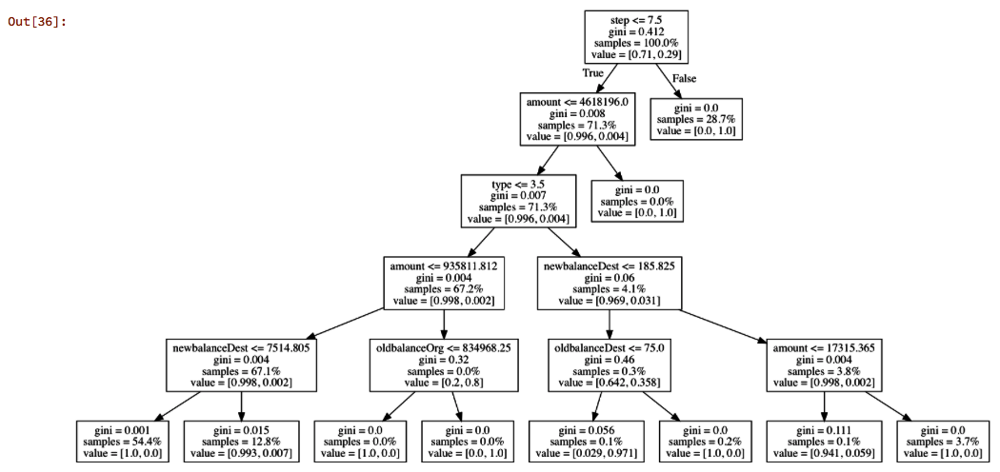
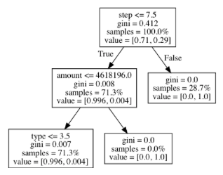
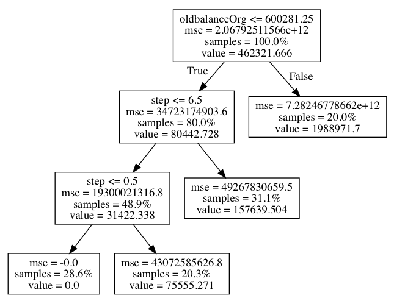
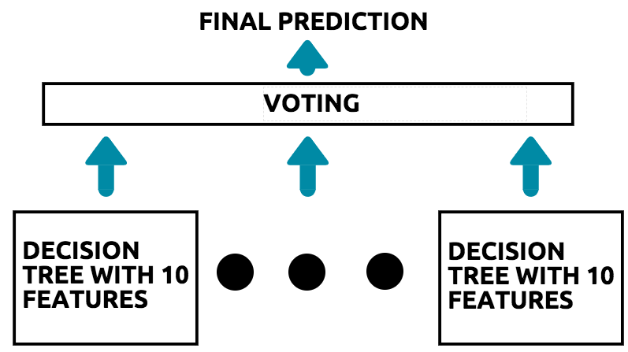
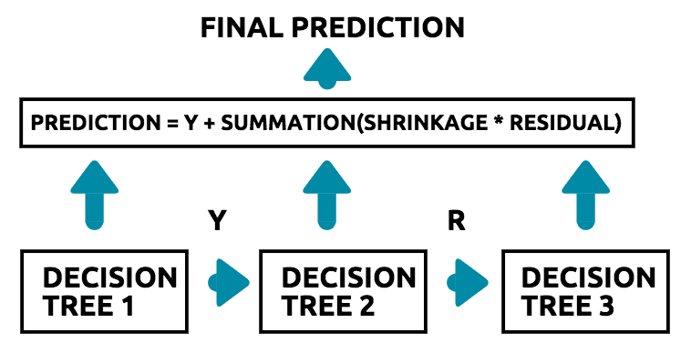

Lab 14. Classification and Regression with Trees
---------------------------------------------------


This lab is broadly divided into the following two sections:

-   Classification trees
-   Regression trees


#### Pre-reqs:
- Google Chrome (Recommended)

#### Lab Environment
Notebooks are ready to run. All packages have been installed. There is no requirement for any setup.

**Note:** Elev8ed Notebooks (powered by Jupyter) will be accessible at the port given to you by your instructor. Password for jupyterLab : `1234`

All Notebooks are present in `work/datascience-ml-next-level` folder.

You can access jupyter lab at `http://<update-DNS>/lab/workspaces/lab14_Trees`

To copy and paste: use **Control-C** and to paste inside of a terminal, use **Control-V**


Classification trees
--------------------

Broadly speaking, there are three tree based algorithms that are used to
solve classification problems:

-   The decision tree classifier
-   The random forest classifier
-   The AdaBoost classifier

In this section, you will learn how each of these tree based algorithms
works, in order to classify a row of data as a particular class or
category.


#### Implementing the decision tree classifier in scikit-learn

In this section, you will learn how to implement the decision tree
classifier in scikit-learn. We will work with the same fraud detection
dataset. The first step is to load the dataset into the Jupyter
Notebook. We can do this by using the following code:

```
import pandas as pd

df = pd.read_csv('fraud_prediction.csv')
```

The next step is to split the data into training and test sets. We can
do this using the following code:

```
#Creating the features 

features = df.drop('isFraud', axis = 1).values
target = df['isFraud'].values

X_train, X_test, y_train, y_test = train_test_split(features, target, test_size = 0.3, random_state = 42, stratify = target)
```

We can now build the initial decision tree classifier on the training
data, and test its accuracy on the test data, by using the following
code:

```
from sklearn.tree import DecisionTreeClassifier

dt = DecisionTreeClassifier(criterion = 'gini', random_state = 50)

#Fitting on the training data

dt.fit(X_train, y_train)

#Testing accuracy on the test data

dt.score(X_test, y_test)
```

 

In the preceding code, we do the following:

1.  First, we import `DecisionTreeClassifier` from
    scikit-learn.
2.  We then initialize a `DecisionTreeClassifier` object with
    two arguments. The first, `criterion`, is the metric with
    which the tree picks the most important features in a recursive
    manner, which, in this case, is the Gini coefficient. The second is
    `random_state`, which is set to 50 so that the model
    produces the same result every time we run it.
3.  Finally, we fit the model on the training data and evaluate its
    accuracy on the test data.

#### Hyperparameter tuning for the decision tree

In order to optimize the ideal hyperparameter and to extract the best
possible decision tree, we use the `GridSearchCV` module from
scikit-learn. We can set this up using the following code:

```
from sklearn.model_selection import GridSearchCV

#Creating a grid of different hyperparameters

grid_params = {
    'max_depth': [1,2,3,4,5,6],
    'min_samples_leaf': [0.02,0.04, 0.06, 0.08]
}

#Building a 10 fold Cross Validated GridSearchCV object

grid_object = GridSearchCV(estimator = dt, param_grid = grid_params, scoring = 'accuracy', cv = 10, n_jobs = -1)
```

 

In the preceding code, we do the following:

1.  We first import the `GridSearchCV` module from
    scikit-learn.
2.  Next, we create a dictionary of possible values for the
    hyperparameters and store it as `grid_params`.
3.  Finally, we create a `GridSearchCV` object with the
    decision tree classifier as the estimator; that is, the dictionary
    of hyperparameter values.
4.  We set the `scoring` argument as `accuracy`,
    since we want to extract the accuracy of the best model found by
    `GridSearchCV`.

We then fit this grid object to the training data using the following
code:

```
#Fitting the grid to the training data

grid_object.fit(X_train, y_train)
```

We can then extract the best set of parameters using the following code:

```
#Extracting the best parameters

grid_object.best_params_
```

The output of the preceding code indicates that a maximum depth of 1 and
a minimum number of samples at the leaf node of 0.02 are the best
parameters for this data. We can use these optimal parameters and
construct a new decision tree using the following code:

```
#Extracting the best parameters

grid_object.best_params_
```

#### Visualizing the decision tree

One of the best aspects of building and implementing a decision tree in
order to solve problems is that it can be interpreted quite easily,
using a decision tree diagram that explains how the algorithm that you
built works. In order to visualize a simple decision tree for the fraud
detection dataset, we use the following code:

```
#Package requirements 

import pandas as pd
from sklearn.tree import DecisionTreeClassifier
from sklearn.externals.six import StringIO 
from IPython.display import Image 
from sklearn.tree import export_graphviz
import pydotplus
from sklearn import tree
```

We start by importing the required packages. The new packages here are
the following:

-   `StringIO`
-   `Image`
-   `export_graphviz`
-   `pydotplus`
-   `tree`

The installations of the packages were covered in *Introducing Machine Learning with scikit-learn*.

Then, we read in the dataset and initialize a decision tree classifier,
as shown in the following code:

```
#Reading in the data

df = pd.read_csv('fraud_prediction.csv')
df = df.drop(['Unnamed: 0'], axis = 1)

#Creating the features 

features = df.drop('isFraud', axis = 1).values
target = df['isFraud'].values

#Initializing the DT classifier

dt = DecisionTreeClassifier(criterion = 'gini', random_state = 50, max_depth= 5)
```

Next, we fit the tree on the features and target, and then extract the
feature names separately:

```
#Fitting the classifier on the data

dt.fit(features, target)

#Extracting the feature names

feature_names = df.drop('isFraud', axis = 1)
```

We can then visualize the decision tree using the following code:

```
#Creating the tree visualization

data = tree.export_graphviz(dt, out_file=None, feature_names= feature_names.columns.values, proportion= True)

graph = pydotplus.graph_from_dot_data(data) 

# Show graph
Image(graph.create_png())
```

In the preceding code, we do the following:

1.  We use the `tree.export_graphviz()` function in order to
    construct the decision tree object, and store it in a variable
    called `data`.
2.  This function uses a couple of arguments: `dt` is the
    decision tree that you built;`out_file` is set to
    `None`, as we do not want to send the tree visualization
    to any file outside our Jupyter Notebook; the
    `feature_names` are those we defined earlier; and
    `proportion` is, set to `True` (this will be
    explained in more detail later).
3.  We then construct a graph of the data contained within the tree so
    that we can visualize this decision tree graph by using the
    `pydotplus. graph_from_dot_data()` function on the
    `data` variable, which contains data about the decision
    tree.
4.  Finally, we visualize the decision tree using the
    `Image()` function, by passing the graph of the decision
    tree to it.

This results in a decision tree like that illustrated in the following
diagram:



The resultant decision tree

The tree might seem pretty complex to interpret at first, but it's not!
In order to interpret this tree, let's consider the root node and the
first two children only. This is illustrated in the following diagram:



A snippet of the decision tree

In the preceding diagram, note the following:

-   In the root node, the tree has identified the 'step' feature as the
    feature with the highest Gini value.
-   The root node makes the split in such a way that 0.71, or 71%, of
    the data falls into the non-fraudulent transactions, while 0.29, or
    29%, of the transactions fall into the fraudulent transactions
    category.
-   If the step is greater than or equal to 7.5 (the right-hand side),
    then all of the transactions are classified as fraudulent.
-   If the step is less than or equal to 7.5 (the left-hand side), then
    0.996, or 99.6%, of the transactions are classified as
    non-fraudulent, while 0.004, or 0.4%, of the transactions are
    classified as fraudulent.
-   If the amount is greater than or equal to 4,618,196.0, then all of
    the transactions are classified as fraudulent.
-   If the amount is less than or equal to 4,618,196.0, then 0.996, or
    99.6%, of the transactions are classified as non-fraudulent, while
    0.004, or 0.4%, of the transactions are classified as fraudulent.

Note how the decision tree is simply a set of If-then rules, constructed
in a nested manner.


#### Implementing the random forest classifier in scikit-learn

In this section, we will implement the random forest classifier in
scikit-learn. The first step is to read in the data, and split it into
training and test sets. This can be done by using the following code:

```
import pandas as pd

#Reading in the dataset

df = pd.read_csv('fraud_prediction.csv')

#Dropping the index

df = df.drop(['Unnamed: 0'], axis = 1)

#Creating the features 

features = df.drop('isFraud', axis = 1).values
target = df['isFraud'].values

X_train, X_test, y_train, y_test = train_test_split(features, target, test_size = 0.3, random_state = 42, stratify = target)
```

The next step is to build the random forest classifier. We can do that
using the following code:

```
from sklearn.ensemble import RandomForestClassifier

#Initiliazing an Random Forest Classifier with default parameters

rf_classifier = RandomForestClassifier(random_state = 50)

#Fitting the classifier on the training data

rf_classifier.fit(X_train, y_train)

#Extracting the scores

rf_classifier.score(X_test, y_test)
```

In the preceding code block, we do the following:

1.  We first import `RandomForestClassifier` from
    scikit-learn.
2.  Next, we initialize a random forest classifier model.
3.  We then fit this model to our training data, and evaluate its
    accuracy on the test data.

#### Hyperparameter tuning for random forest algorithms

In this section, we will learn how to optimize the hyperparameters of
the random forest algorithm. Since random forests are fundamentally
based on multiple decision trees, the hyperparameters are very similar.
In order to optimize the hyperparameters, we use the following code:

```
from sklearn.model_selection import GridSearchCV

#Creating a grid of different hyperparameters

grid_params = {
 'n_estimators': [100,200, 300,400,5000],
 'max_depth': [1,2,4,6,8],
 'min_samples_leaf': [0.05, 0.1, 0.2]
}

#Building a 3 fold Cross-Validated GridSearchCV object

grid_object = GridSearchCV(estimator = rf_classifier, param_grid = grid_params, scoring = 'accuracy', cv = 3, n_jobs = -1)

#Fitting the grid to the training data

grid_object.fit(X_train, y_train)

#Extracting the best parameters

grid_object.bestparams

#Extracting the best model

rf_best = grid_object.bestestimator_
```

In the preceding code block, we do the following:

1.  We first import the `GridSearchCV` package.
2.  We initialize a dictionary of hyperparameter values. The
    `max_depth` and `min_samples_leaf` values are
    similar to those of the decision tree.
3.  However, `n_estimators` is a new parameter, covering the
    total number of trees that you want your random forest algorithm to
    consider while making the final prediction.
4.  We then build and fit the `gridsearch` object to the
    training data and extract the optimal parameters.
5.  The best model is then extracted using these optimal
    hyperparameters.


#### Implementing the AdaBoost classifier in scikit-learn

In this section, we will learn how we can implement the AdaBoost
classifier in scikit-learn in order to predict if a transaction is
fraudulent or not. As usual, the first step is to import the data and
split it into training and testing sets.

This can be done with the following code:

```
#Reading in the dataset

df = pd.read_csv('fraud_prediction.csv')

#Dropping the index

df = df.drop(['Unnamed: 0'], axis = 1)

#Creating the features 

features = df.drop('isFraud', axis = 1).values
target = df['isFraud'].values

X_train, X_test, y_train, y_test = train_test_split(features, target, test_size = 0.3, random_state = 42, stratify = target)
```

The next step is to build the AdaBoost classifier. We can do this using
the following code:

```
from sklearn.ensemble import AdaBoostClassifier

#Initialize a tree (Decision Tree with max depth = 1)

tree = DecisionTreeClassifier(max_depth=1, random_state = 42)

#Initialize an AdaBoost classifier with the tree as the base estimator

ada_boost = AdaBoostClassifier(base_estimator = tree, n_estimators=100)

#Fitting the AdaBoost classifier to the training set

ada_boost.fit(X_train, y_train)

#Extracting the accuracy scores from the classifier

ada_boost.score(X_test, y_test)
```

In the preceding code block, we do the following:

1.  We first import the `AdaBoostClassifier` package from
    scikit-learn.
2.  Next, we initialize a decision tree that forms the base of our
    AdaBoost classifier.
3.  We then build the AdaBoost classifier, with the base estimator as
    the decision tree, and we specify that we want 100 decision trees in
    total.
4.  Finally, we fit the classifier to the training data, and extract the
    accuracy scores from the test data.

#### Hyperparameter tuning for the AdaBoost classifier

In this section, we will learn how to tune the hyperparameters of the
AdaBoost classifier. The AdaBoost classifier has only one parameter of
interest—the number of base estimators, or decision trees.

We can optimize the hyperparameters of the AdaBoost classifier using the
following code:

```
from sklearn.model_selection import GridSearchCV

#Creating a grid of hyperparameters

grid_params = {
    'n_estimators': [100,200,300]
}

#Building a 3 fold CV GridSearchCV object

grid_object = GridSearchCV(estimator = ada_boost, param_grid = grid_params, scoring = 'accuracy', cv = 3, n_jobs = -1)

#Fitting the grid to the training data

grid_object.fit(X_train, y_train)

#Extracting the best parameters

grid_object.bestparams

#Extracting the best model

ada_best = grid_object.best_estimator_
```

In the preceding code, we do the following:

1.  We first import the `GridSearchCV` package.
2.  We initialize a dictionary of hyperparameter values. In this case,
    `n_estimators` is the number of decision trees.
3.  We then build and fit the `gridsearch` object to the
    training data and extract the best parameters.
4.  The best model is then extracted using these optimal
    hyperparameters.


Regression trees
----------------

* * * * *

You have learned how trees are used in order to classify a prediction as
belonging to a particular class or category. However, trees can also be
used to solve problems related to predicting numeric outcomes. In this
section, you will learn about the three types of tree based algorithms
that you can implement in scikit-learn in order to predict numeric
outcomes, instead of classes:

-   The decision tree regressor
-   The random forest regressor
-   The gradient boosted tree

### The decision tree regressor

When we have data that is non-linear in nature, a linear regression
model might not be the best model to choose. In such situations, it
makes sense to choose a model that can fully capture the non-linearity
of such data. A decision tree regressor can be used to predict numeric
outcomes, just like that of the linear regression model.

In the case of the decision tree regressor, we use the mean squared
error, instead of the Gini metric, in order to determine how the tree is
built. You will learn about the mean squared error in detail in *Performance Evaluation Methods*. In a nutshell, the mean squared error
is used to tell us about the prediction error rate.

Consider the tree shown in the following diagram:



An example decision tree for regression

When considering the preceding diagram of the decision tree, note the
following:

-   We are trying to predict the amount of a mobile transaction using
    the tree.
-   When the tree tries to decide on a split, it chooses the node in
    such a way that the target value is closest to the mean values of
    the target in that node.
-   You will notice that, as you go down the tree to the left, along the
    `True` cases, the mean squared error of the nodes
    decreases.
-   Therefore, the nodes are built in a recursive fashion, such that it
    reduces the overall mean squared error, thereby obtaining the
    `True` value.
-   In the preceding tree, if the old balance of origination is less
    than 600,281, then the amount (here, coded as `value`) is
    80,442, and if it's greater than 600,281, then the amount is
    1,988,971.

 

 

#### Implementing the decision tree regressor in scikit-learn

In this section, you will learn how to implement the decision tree
regressor in scikit-learn. The first step is to import the data, and
create the features and target variables. We can do this using the
following code:

```
import pandas as pd

#Reading in the dataset

df = pd.read_csv('fraud_prediction.csv')

#Dropping the index

df = df.drop(['Unnamed: 0'], axis = 1)

#Creating the features 

features = df.drop('amount', axis = 1).values
target = df['amount'].values
```

Note how, in the case of regression, the target variable is the amount,
and not the `isFraud` column.

Next, we split the data into training and test sets, and build the
decision tree regressor, as shown in the following code:

```
from sklearn.model_selection import train_test_split
from sklearn.tree import DecisionTreeRegressor

#Splitting the data into training and test sets

X_train, X_test, y_train, y_test = train_test_split(features, target, test_size = 0.3, random_state = 42)

#Building the decision tree regressor 

dt_reg = DecisionTreeRegressor(max_depth = 10, min_samples_leaf = 0.2, random_state= 50)

#Fitting the tree to the training data

dt_reg.fit(X_train, y_train)
```

 

 

In the preceding code, we do the following:

1.  We first import the required packages and split the data into
    training and test sets.
2.  Next, we build the decision tree regressor using the
    `DecisionTreeRegressor()` function.
3.  We specify two hyperparameter arguments: `max_depth`,
    which tells the algorithm how many branches the tree must have, and
    `min_sample_leaf`, which tells the tree about the minimum
    number of samples that each node must have. The latter is set to
    20%, or 0.2 of the total data, in this case.
4.  `random_state` is set to 50 to ensure that the same tree
    is built every time we run the code.
5.  We then fit the tree to the training data.

#### Visualizing the decision tree regressor

Just as we visualized the decision tree classifier, we can also
visualize the decision tree regressor. Instead of showing you the
classes or categories to which the node of a tree belongs, you will now
be shown the value of the target variable.

We can visualize the decision tree regressor by using the following
code:

```
#Package requirements 

from sklearn.tree import DecisionTreeClassifier
from sklearn.externals.six import StringIO 
from IPython.display import Image 
from sklearn.tree import export_graphviz
import pydotplus
from sklearn import tree

#Extracting the feature names

feature_names = df.drop('amount', axis = 1)

#Creating the tree visualization

data = tree.export_graphviz(dt_reg, out_file=None, feature_names= feature_names.columns.values, proportion= True)

graph = pydotplus.graph_from_dot_data(data) 

# Show graph
Image(graph.create_png())
```

The code follows the exact same methodology as that of the decision tree
classifier, and will not be discussed in detail here. This produces a
decision tree regressor like that in the following diagram:


A visualization of the decision tree regressor

### The random forest regressor

The random forest regressor takes the decision tree regressor as the
base estimator, and makes predictions in a method similar to that of the
random forest classifier, as illustrated by the following diagram:



Making the final prediction in the random forest regressor

The only difference between the random forest classifier and the random
forest regressor is the fact that, in the case of the latter, the base
estimator is a decision tree regressor.

#### Implementing the random forest regressor in scikit-learn

In this section, you will learn how you can implement the random forest
regressor in scikit-learn. The first step is to import the data and
split it into training and testing sets. This can be done using the
following code:

```
import pandas as pd
from sklearn.model_selection import train_test_split

#Reading in the dataset

df = pd.read_csv('fraud_prediction.csv')

#Dropping the index

df = df.drop(['Unnamed: 0'], axis = 1)

#Creating the features and target arrays

features = df.drop('amount', axis = 1).values
target = df['amount'].values

#Splitting the data into training and test sets

X_train, X_test, y_train, y_test = train_test_split(features, target, test_size = 0.3, random_state = 42)
```

The next step is to build the random forest regressor. We can do this
using the following code:

```
from sklearn.ensemble import RandomForestRegressor

#Initiliazing an Random Forest Regressor with default parameters

rf_reg = RandomForestRegressor(max_depth = 10, min_samples_leaf = 0.2, random_state = 50)

#Fitting the regressor on the training data

rf_reg.fit(X_train, y_train)
```

 

 

In the preceding code, we do the following:

1.  We first import the `RandomForestRegressor` module from
    scikit-learn.
2.  We then initialize a random forest regressor object, called
    `rf_reg`, with a maximum depth of 10 for each decision
    tree, and the minimum number of data and samples in each tree as 20%
    of the total data.
3.  We then fit the tree to the training set.

### The gradient boosted tree

In this section, you will learn how the gradient boosted tree is used
for regression, and how you can implement this using scikit-learn.

In the AdaBoost classifier that you learned about earlier in this
lab, weights are added to the examples that the classifier predicted
in correctly. In the gradient boosted tree, however, instead of weights,
the residual errors are used as labels in each tree in order to make
future predictions. This concept is illustrated for you in the following
diagram:



Here is what occurs in the preceding diagram:

1.  The first decision tree is trained with the data that you have, and
    the target variable **Y**.
2.  We then compute the residual error for this tree.
3.  The residual error is given by the difference between the predicted
    value and the actual value.
4.  The second tree is now trained, using the residuals as the target.
5.  This process of building multiple trees is iterative, and continues
    for the number of base estimators that we have.
6.  The final prediction is made by adding the target value predicted by
    the first tree to the product of the shrinkage and the residuals for
    all the other trees.

7.  The shrinkage is a factor with which we control the rate at which we
    want this gradient boosting process to take place.
8.  A small value of shrinkage (learning rate) implies that the
    algorithm will learn more quickly, and therefore, must be
    compensated with a larger number of base estimators (that is,
    decision trees) in order to prevent overfitting.
9.  A larger value of shrinkage (learning rate) implies that the
    algorithm will learn more slowly, and thus requires fewer trees in
    order to reduce the computational time.

#### Implementing the gradient boosted tree in scikit-learn

In this section, we will learn how we can implement the gradient boosted
regressor in scikit-learn. The first step, as usual, is to import the
dataset, define the features and target arrays, and split the data into
training and test sets. This can be done using the following code:

```
import pandas as pd
from sklearn.model_selection import train_test_split

#Reading in the dataset

df = pd.read_csv('fraud_prediction.csv')

#Dropping the index

df = df.drop(['Unnamed: 0'], axis = 1)

#Creating the features 

features = df.drop('amount', axis = 1).values
target = df['amount'].values

#Splitting the data into training and test sets

X_train, X_test, y_train, y_test = train_test_split(features, target, test_size = 0.3, random_state = 42)
```

The next step is to build the gradient boosted regressor. This can be
done using the following code:

```
from sklearn.ensemble import GradientBoostingRegressor

#Initializing an Gradient Boosted Regressor with default parameters

gb_reg = GradientBoostingRegressor(max_depth = 5, n_estimators = 100, learning_rate = 0.1, random_state = 50)

#Fitting the regressor on the training data

gb_reg.fit(X_train, y_train)
```

In the preceding code, we do the following:

1.  We first import `GradientBoostingRegressor` from
    scikit-learn.
2.  We the build a gradient boosted regressor object with three main
    arguments: the maximum depth of each tree, the total number of
    trees, and the learning rate.
3.  We then fit the regressor on the training data.


### Implementing the voting classifier in scikit-learn

In this section, you will learn how to implement the voting classifier
in scikit-learn. The first step is to import the data, create the
feature and target arrays, and create the training and testing splits.
This can be done using the following code:

```
import pandas as pd
from sklearn.model_selection import train_test_split

#Reading in the dataset

df = pd.read_csv('fraud_prediction.csv')

#Dropping the index

df = df.drop(['Unnamed: 0'], axis = 1)

#Splitting the data into training and test sets

X_train, X_test, y_train, y_test = train_test_split(features, target, test_size = 0.3, random_state = 42)
```

Next, we will build two classifiers that include the voting classifier:
the decision tree classifier and the random forest classifier. This can
be done using the following code:

```
from sklearn.tree import DecisionTreeClassifier
from sklearn.ensemble import RandomForestClassifier

#Initializing the DT classifier

dt = DecisionTreeClassifier(criterion = 'gini', random_state = 50)

#Fitting on the training data

dt.fit(X_train, y_train)

#Initiliazing an Random Forest Classifier with default parameters

rf_classifier = RandomForestClassifier(random_state = 50)

#Fitting the classifier on the training data

rf_classifier.fit(X_train, y_train)
```

Next, we will build the voting classifier by using the following code:

```
from sklearn.ensemble import VotingClassifier

#Creating a list of models

models = [('Decision Tree', dt), ('Random Forest', rf_classifier)]

#Initialize a voting classifier 

voting_model = VotingClassifier(estimators = models)

#Fitting the model to the training data

voting_model.fit(X_train, y_train)

#Evaluating the accuracy on the test data

voting_model.score(X_test, y_test)
```

In the preceding code, we do the following:

1.  We first import the `VotingClassifier` module from
    scikit-learn.
2.  Next, we create a list of all the models that we want to use in our
    voting classifier.
3.  In the list of classifiers, each model is stored in a tuple, along
    with the model's name in a string and the model itself.
4.  We then initialize a voting classifier with the list of models built
    in step 2.
5.  Finally, the model is fitted to the training data and the accuracy
    is extracted from the test data.


Summary
-------

While this lab was rather long, you have entered the world of tree
based algorithms, and left with a wide arsenal of tools that you can
implement in order to solve both small- and large-scale problems. To
summarize, you have learned the following:

-   How to use decision trees for classification and regression
-   How to use random forests for classification and regression
-   How to use AdaBoost for classification
-   How to use gradient boosted trees for regression
-   How the voting classifier can be used to build a single model out of
    different models
