Lab 15. Clustering Data with Unsupervised Machine Learning
-------------------------------------------------------------

In this lab, you will learn about the following topics:

-   The k-means algorithm and how it works internally, in order to
    cluster unlabeled data
-   Implementing the k-means algorithm in scikit-learn
-   Using feature engineering to optimize unsupervised machine learning 
-   Cluster visualization 
-   Going from unsupervised to supervised machine learning 

#### Pre-reqs:
- Google Chrome (Recommended)

#### Lab Environment
Notebooks are ready to run. All packages have been installed. There is no requirement for any setup.

**Note:** Elev8ed Notebooks (powered by Jupyter) will be accessible at the port given to you by your instructor. Password for jupyterLab : `1234`

All Notebooks are present in `work/datascience-ml-next-level` folder.

You can access jupyter lab at `http://<update-DNS>/lab/workspaces/lab15_Unsupervised`

To copy and paste: use **Control-C** and to paste inside of a terminal, use **Control-V**


The k-means algorithm
---------------------

* * * * *

In this section, you will learn about how the k-means algorithm works
under the hood, in order to cluster data into groups that make logical
sense. 

Let's consider a set of points, as illustrated in the following diagram:

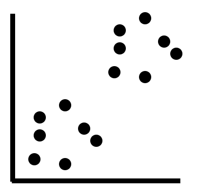

A random set of points 

### Assignment of centroids

The first step that the algorithm takes is to assign a set of random
centroids. Assuming that we want to find two distinct clusters or
groups, the algorithm can assign two centroids, as shown in the
following diagram:


Centroids, represented by stars

In the preceding diagram, the stars represent the centroids of the
algorithm. Note that in this case, the clusters' centers perfectly fit
the two distinct groups. This is the most ideal case. In reality, the
means (or centroids) are assigned randomly, and, with every iteration,
the cluster centroids move closer to the center of the two groups. 

The algorithm is known as the k-means algorithm, as we try to find the
mean of a group of points as the centroid. Since the mean can only be
computed for a set of numeric points, such clustering algorithms only
work with numerical data. 

In reality, the process of grouping these points into two distinct
clusters is not this straightforward. A visual representation of the
process can be illustrated as follows:

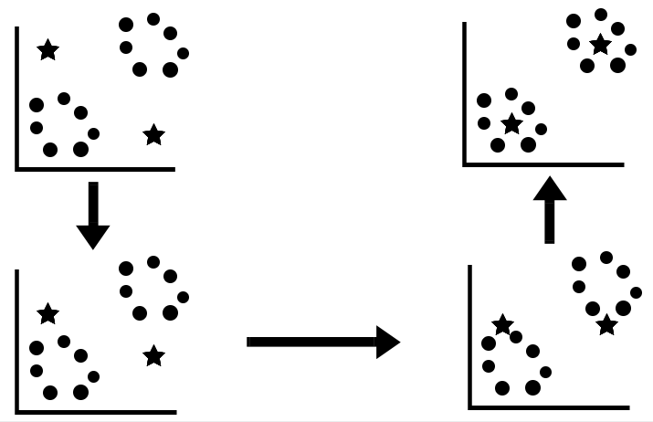

The process of assigning centroids in the k-means algorithm

In the preceding diagram, the process of assigning the random centroids
begins in the upper-left corner. As we go down and toward the
upper-right corner, note how the centroids move closer to the center of
the two distinct groups. In reality, the algorithm does not have an
optimal endpoint at which it stops the iteration.

### When does the algorithm stop iterating?

Typically, the algorithm looks for two metrics, in order to stop the
iteration process:

-   The distance between the distinct groups (or clusters) that are
    formed
-   The distance between each point and the centroid of a cluster

The optimal case of cluster formation is when the distance between the
distinct groups or clusters are as large as possible, while the
distances between each point and the centroid of a cluster are as small
as possible.


Implementing the k-means algorithm in scikit-learn
--------------------------------------------------

* * * * *

Now that you understand how the k-means algorithm works internally, we
can proceed to implement it in scikit-learn. We are going to work with
the same fraud detection dataset that we used in all of the previous
chapters. The key difference is that we are going to drop the target
feature, which contains the labels, and identify the two clusters that
are used to detect fraud.

### Creating the base k-means model

In order to load the dataset into our workspace and drop the target
feature with the labels, we use the following code:

```
import pandas as pd
#Reading in the dataset
df = pd.read_csv('fraud_prediction.csv')
#Dropping the target feature & the index
df = df.drop(['Unnamed: 0', 'isFraud'], axis = 1)
```

Next, we can implement the k-means algorithm with two cluster means. The
choice of using two cluster means is arbitrary in nature, since we know
that there should be two distinct clusters as a result of two labels:
fraud and not fraud transactions. We can do this by using the following
code:

```
from sklearn.cluster import KMeans
#Initializing K-means with 2 clusters
k_means = KMeans(n_clusters = 2)
#Fitting the model on the data
k_means.fit(df)
```

In the preceding code, first, we import the `KMeans` package
from scikit-learn and initialize a model with two clusters. We then fit
this model to the data by using the `.fit()` function. This
results in a set of labels as the output. We can extract the labels by
using the following code:

```
#Extracting labels 
target_labels = k_means.predict(df)
#Printing the labels
target_labels
```

The output produced by the preceding code is an array of labels for each
mobile transaction, as follows:

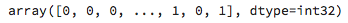

Array of labels

Now that we have a set of labels, we know which cluster each transaction
falls into. Mobile transactions that have a label of `0` fall
into one group, while transactions that have a label of `1`
fall into the second group. 

### The optimal number of clusters

While explaining how the k-means algorithm works, we mentioned how the
algorithm terminates once it finds the optimal number of clusters. When
picking clusters arbitrarily using scikit-learn, this is not always the
case. We need to find the optimal number of clusters, in this case. 

One way that we can do this is by a measure known
as** inertia. **Inertia measures how close the data points in a cluster
are to its centroid. Obviously, a lower inertia signifies that the
groups or clusters are tightly packed, which is good. 

In order to compute the inertia for the model, we use the following
code:

```
# Inertia of present model
k_means.inertia_
```

The preceding code produced an inertia value of *4.99 × 10 \^ 17*, which
is extremely large with respect to the other values of inertia produced
by different numbers of clusters (explained as follows), and is not a
good value of inertia. This suggests that the individual data points are
spread out, and are not tightly packed together.

In most cases, we do not really know what the optimal numbers of
clusters are, so we need to plot the inertia scores for different
numbers of clusters. We can do this by using the following code:

```
import matplotlib.pyplot as plt
import seaborn as sns

#Initialize a list of clusters from 1 to 10 clusters 

clusters = [1,2,3,4,5,6,7,8,9,10]

#Create an empty list in order to store the inertia values 

inertia_values = []

for cluster in clusters:

    #Build a k-means model for each cluster value

    k_means = KMeans(n_clusters = cluster)

    #Fit the model to the data

    k_means.fit(df)

    # Store inertia value of each model into the empty list 

    inertia_values.append(k_means.inertia_)

# Plot the result

plt.lineplot(x = clusters, y = inertia_values)
plt.xlabel('Number of Clusters')
plt.ylabel('Inertia Value')
plt.title('Number of Clusters Vs. Inertia Values')
plt.show()
```

This results in the following plot:

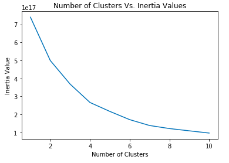

Inertia as a function of the number of clusters

In the preceding code, first, we create a list of clusters that have
values from 1 to 10. Each value denotes the number of clusters that will
be used in the machine learning model. Next, we create an empty list
that will store all of the inertia values that each model will produce. 

Next, we loop over the list of clusters and build and evaluate a k-means
model for each cluster value in the list. Each model now produces an
inertia, which is stored in the list that we initialized at the start of
the code block. A simple line plot is then constructed by using the list
of clusters along the x* *axis and the corresponding inertia values
along the y* *axis, using `matplotlib`. 

The plot tells us that the inertia values are the lowest when the number
of clusters is equal to 10. However, having a large number of clusters
is also something that we must aim at avoiding, as having too many
groups does not help us to generalize well, and the characteristics
about each group become very specific. 

Therefore, the ideal way to choose the best number of clusters for
a problem, given that we do not have prior information about the number
of groups that we want beforehand, is to identify the **elbow point** of
the plot.

The elbow point is the point at which the rate of decrease in inertia
values slows down. The elbow point is illustrated in the following
diagram:

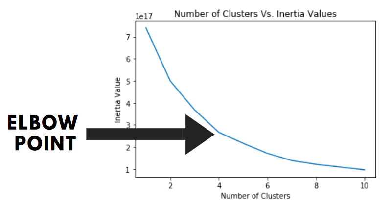

Elbow point of the graph

In the preceding plot, it is clear that the elbow point corresponds to
four clusters. This could mean that there are four distinct types of
fraudulent transactions, apart from the standard categorizations of
fraud and not fraud. However, since we know beforehand that the dataset
has a binary target feature with two categories, we will dig too deeply
into why four is the ideal number of groups/clusters for this dataset. 


Feature engineering for optimization
------------------------------------

* * * * *

Engineering the features in your dataset is a concept that is
fundamentally used to improve the performance of your model. Fine-tuning
the features to the algorithm's design is beneficial, because it can
lead to an improvement in accuracy, while reducing the generalization
errors at the same time. The different kinds of feature engineering
techniques for optimizing your dataset that you will learn are as
follows:

-   Scaling
-   Principal component analysis 

### Scaling

Scaling is the process of standardizing your data so that the values
under every feature fall within a certain range, such as -1 to +1. In
order to scale the data, we subtract each value of a particular feature
with the mean of that feature, and divide it by the variance of that
feature. In order to scale the features in our fraud detection dataset,
we use the following code:

```
from sklearn.preprocessing import StandardScaler

#Setting up the standard scaler 

scale_data = StandardScaler()

#Scaling the data

scale_data.fit(df)

df_scaled = scale_data.transform(df)

#Applying the K-Means algorithm on the scaled data

#Initializing K-means with 2 clusters

k_means = KMeans(n_clusters = 2)

#Fitting the model on the data

k_means.fit(df_scaled)

# Inertia of present model

k_means.inertia_
```

In the preceding code, we use
the `StandardScalar()` function to scale our dataframe, and
then we build a k-means model with two clusters on the scaled data.
After evaluating the inertia of the model, the value output is 295,000,
which is substantially better than the value of *4.99 × 10^17^*,
produced by the model without scaling. 

We can then create a new plot of the number of clusters versus the
inertia values, using the same code that we did earlier, with the only
difference being replacing the original dataframe with the scaled
dataframe:

```
#Initialize a list of clusters from 1 to 10 clusters 

clusters = [1,2,3,4,5,6,7,8,9,10]

#Create an empty list in order to store the inertia values 

inertia_values = []

for cluster in clusters:

    #Build a k-means model for each cluster value

    k_means = KMeans(n_clusters = cluster)

    #Fit the model to the data

    k_means.fit(df_scaled)

    # Store inertia value of each model into the empty list 

    inertia_values.append(k_means.inertia_)

# Plot the result

sns.lineplot(x = clusters, y = inertia_values)
plt.xlabel('Number of Clusters')
plt.ylabel('Inertia Value')
plt.title('Number of Clusters Vs. Inertia Values')
plt.show()
```

This produces the following output:

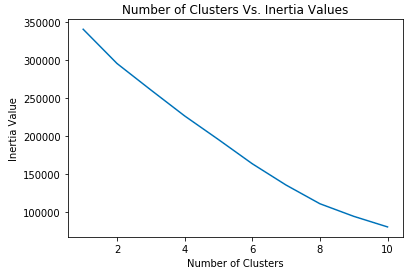

Optimal number of clusters, post-scaling

We notice that the preceding plot does not have a very clear elbow
point, where the rate of decrease in the inertia values is lower.
However, if we look closely, we can find this point at **`8`**
clusters. 

### Principal component analysis

The **principal component analysis** (**PCA**) is a subset of
dimensionality reduction. **Dimensionality reduction** is the process of
reducing the number of features that provide no predictive value to a
predictive model. We also optimize and improve the computational
efficiency of processing the algorithms. This is because a dataset with
a smaller number of features will make it easier for the algorithm to
detect patterns more quickly.

The first step in PCA is called **decorrelation**. Features that are
highly correlated with each other provide no value to the predictive
model. Therefore, in the decorrelation step, the PCA takes two highly
correlated features and spreads their data points such that it's aligned
across the axis, and is not correlated anymore. This process can be
illustrated as follows:


The process of decorrelation

Once the features are decorrelated, the principal components (or
features) are extracted from the data. These features are the ones that
have high variance, and, in turn, provide the most value to a predictive
model. The features with low variance are discarded, and thus, the
number of dimensions in the dataset is reduced.

In order to perform dimensionality reduction using PCA, we use the
following code:

```
from sklearn.decomposition import PCA

#Initialize a PCA model with 5 features 

pca_model = PCA(n_components = 5)

#Fit the model to the scaled dataframe

pca_model.fit(df_scaled)

#Transform the features so that it is de-correlated

pca_transform = pca_model.transform(df_scaled)

#Check to see if there are only 5 features

pca_transform.shape
```

In the preceding code, first, we import the `PCA` method
from scikit-learn. Next, we initialize a PCA* *model with five
components. Here, we are specifying that we want the PCA to reduce the
dataset to only the five most important features.

We then fit the PCA model to the dataframe and transform it, in order to
obtain the decorrelated features. Checking the shape of the final array
of features, we can see that it only has five features. Finally, we
create a new k-means model with only the principal component features,
as shown in the following code:

```
#Applying the K-Means algorithm on the scaled data

#Initializing K-means with 2 clusters

k_means = KMeans(n_clusters = 2)#Fitting the model on the data

k_means.fit(pca_transform)

# Inertia of present model

k_means.inertia_
```

Evaluating the inertia of the new model improved its performance. We
obtained a lower value of inertia than in the case of the scaled model.
Now, let's evaluate the inertia scores for different numbers of
principal components or features. In order to this, we use the following
code:

```
#Initialize a list of principal components

components = [1,2,3,4,5,6,7,8,9,10]

#Create an empty list in order to store the inertia values 

inertia_values = []

for comp in components:

    #Initialize a PCA model

    pca_model = PCA(n_components = comp)

    #Fit the model to the dataframe

    pca_model.fit(df_scaled)

    #Transform the features so that it is de-correlated

    pca_transform = pca_model.transform(df_scaled)

    #Build a k-means model 

    k_means = KMeans(n_clusters = 2)

    #Fit the model to the data

    k_means.fit(pca_transform)

    # Store inertia value of each model into the empty list 

    inertia_values.append(k_means.inertia_)

# Plot the result

sns.lineplot(x = components, y = inertia_values)
plt.xlabel('Number of Principal Components')
plt.ylabel('Inertia Value')
plt.title('Number of Components Vs. Inertia Values')
plt.show()
```

In the preceding code, the following applies:

1.  First, we initialize a list to store the different principal
    component values that we want to build our models with. These values
    are from 1 to 10.
2.  Next, we initialize an empty list, in order to store the inertia
    values from each and every model. 
3.  Using each principal component value, we build a new k-means model
    and append the inertia value for that model into the empty list. 
4.  Finally, a plot is constructed between the inertia values and the
    different values of components.

This plot is illustrated as follows:

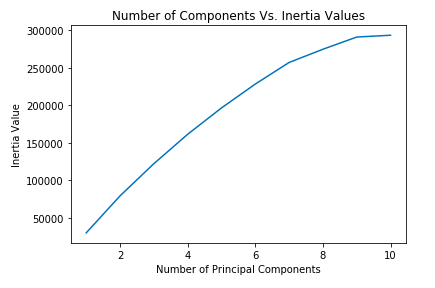

Inertia values versus the numbers of principal components

In the preceding plot, it is clear that the inertia value is lowest for
one component. 


Cluster visualization
---------------------

* * * * *

Visualizing how your clusters are formed is no easy task when the number
of variables/dimensions in your dataset is very large. There are two
main methods that you can use in order to visualize how the clusters are
distributed, as follows:

-   **t-SNE**: This creates a map of the dataset in two-dimensional
    space
-   **Hierarchical clustering**: This uses a tree-based visualization,
    known as a **dendrogram**, in order to create hierarchies

In this section, you will learn how to implement these visualization
techniques, in order to create compelling cluster visuals. 

 

### t-SNE

The **t-SNE** is an abbreviation that stands for **t-distributed
stochastic neighbor embedding**. The fundamental concept behind the
t-SNE is to map a higher dimension to a two-dimensional space. In simple
terms, if your dataset has more than two features, the t-SNE does a
great job at showing you how your entire dataset can be visualized on
your computer screen!

The first step is to implement the k-means algorithm and create a set of
prediction labels that we can merge into the unlabeled dataset. We can
do this by using the following code:

```
#Reading in the dataset

df = pd.read_csv('fraud_prediction.csv')

#Dropping the target feature & the index

df = df.drop(['Unnamed: 0', 'isFraud'], axis = 1)

#Initializing K-means with 2 clusters

k_means = KMeans(n_clusters = 2)

#Fitting the model on the data

k_means.fit(df)

#Extracting labels 

target_labels = k_means.predict(df)

#Converting the labels to a series 

target_labels = pd.Series(target_labels)

#Merging the labels to the dataset

df = pd.merge(df, pd.DataFrame(target_labels), left_index=True, right_index=True)

#Renaming the target 

df['fraud'] = df[0]
df = df.drop([0], axis = 1)
```

 

 

Don't worry about how the preceding segment of code works for the
moment, as this will be explained in detail in a later section within
this lab, when we deal with converting an unsupervised machine
learning problem into a supervised learning one. 

Next, we will create a t-SNE object and fit that into our array of data
points that consists of only the features. We will then transform the
features at the same time so that we can view all the features on a
two-dimensional space. This is done in the following code segment:

```
from sklearn.manifold import TSNE

#Creating the features

features = df.drop('fraud', axis = 1).values

target = df['fraud'].values

#Initialize a TSNE object

tsne_object = TSNE()

#Fit and transform the features using the TSNE object

transformed = tsne_object.fit_transform(features)
```

In the preceding code, the following applies:

1.  First, we initialize the t-SNE object by using the
    `TSNE()` function.
2.  Using the t-SNE object, we fit and transform the data in our
    features, using the `fit_transform()` method. 

Next, we create the t-SNE visualization by using the following code:

```
#Creating a t-SNE visualization

x_axis = transformed[:,0]


y_axis = transformed[:,1]


plt.scatter(x_axis, y_axis, c = target)

plt.show()
```

In the preceding code, the following applies:

1.  We extract the first and second features from the set of transformed
    features for the x axis and *y *axis, respectively.
2.  We then plot a scatter plot and color it by the target labels, which
    were generated earlier, using the k-means algorithm. This generates
    the following plot:

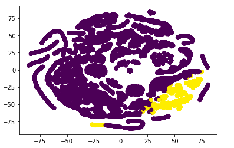

t-SNE visualization

In the preceding plot, the yellow color represents the transactions that
have been assigned the fraud label, while the purple color represents
the transactions that have been assigned the non-fraudulent label.
(Please refer to the color version of the image.)

### Hierarchical clustering

As discussed initially, the hierarchical clustering technique uses the
dendrogram to visualize clusters or groups. In order to explain how the
dendrogram works, we will consider a dataset with four features. 

#### Step 1 – Individual features as individual clusters

In the first step, each feature in the dataset is considered to be its
own cluster. This is illustrated in the following diagram:

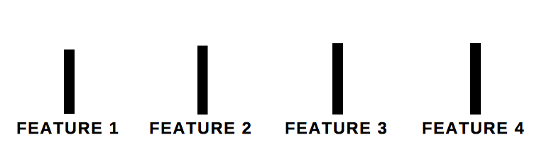

Each feature as a single cluster in the dendrogram

Each feature in the preceding diagram is one single cluster, at this
point in time. The algorithm now searches to find the two features that
are closest to each other, and merges them into a single cluster. 

#### Step 2 – The merge

In this step, the algorithm merges the data points in the two closest
features together, into one single cluster. This is illustrated in the
following diagram:

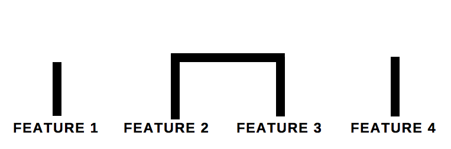

The process in which features merge into a single cluster

In the preceding diagram, it is clear that the algorithm has now chosen
**Feature 2** and **Feature 3**, and has decided that the data under
these two features are the closest to each other. 

 

#### Step 3 – Iteration

The algorithm now continues the process of merging features together
iteratively, until no more clusters can be formed. The final dendrogram
that is formed is as follows:

In the preceding diagram, **Feature 2** and **Feature 3** were grouped
into a single cluster. The algorithm then decided that **Feature 1** and
the cluster of **Feature 2** and **3** were closest to each other.
Therefore, these three features were clustered into one group. Finally,
**Feature 4** was grouped together with **Feature 3**.

#### Implementing hierarchical clustering

Now that you have learned how hierarchical clustering works, we
can implement this concept. In order to create a hierarchical cluster,
we use the following code:

```
from scipy.cluster.hierarchy import linkage
from scipy.cluster.hierarchy import dendrogram
import numpy as np
import matplotlib.pyplot as plt 

#Creating an array of 4 features

array = np.array([[1,2,3,4], [5,6,7,8], [2,3,4,5], [5,6,4,3]])

feature_names = ['a', 'b', 'c', 'd']

#Creating clusters

clusters = linkage(array, method = 'complete')

#Creating a dendrogram

dendrogram(clusters, labels = feature_names, leaf_rotation = 90)

plt.show()
```

The preceding code results in a dendrogram, as illustrated in the
following diagram:

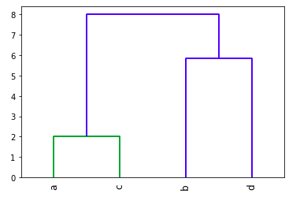

Dendrogram

In the preceding code, the following applies:

1.  First, we create an array with four columns.
2.  We then use the `linkage` function to create the clusters.
    Within the function, we specify the `method` argument as
    complete, in order to indicate that we want the entire dendrogram. 
3.  Finally, we use the `dendrogram` function to create the
    dendrogram with the clusters. We set the label names to the list of
    feature names that was created earlier in the code.


Going from unsupervised to supervised learning
----------------------------------------------

* * * * *

The eventual goal of unsupervised learning is to take a dataset with no
labels and assign labels to each row of the dataset, so that we can run
a supervised learning algorithm through it. This allows us to create
predictions that make use of the labels. 

In this section, you will learn how to convert the labels generated by
the unsupervised machine learning algorithm into a decision tree that
makes use of those labels. 

### Creating a labeled dataset 

The first step is to convert the labels generated by an unsupervised
machine learning algorithm, such as the k-means algorithm, and append it
to the dataset. We can do this by using the following code:

```
#Reading in the dataset

df = pd.read_csv('fraud_prediction.csv')

#Dropping the target feature & the index

df = df.drop(['Unnamed: 0', 'isFraud'], axis = 1)
```

In the preceding code, we read in the fraud detection dataset and drop
the target and index columns:

```
#Initializing K-means with 2 clusters

k_means = KMeans(n_clusters = 2)

#Fitting the model on the data

k_means.fit(df)
```

Next, in the preceding code we initialize and fit a k-means model with
two clusters:

```
#Extracting labels 

target_labels = k_means.predict(df)

#Converting the labels to a series 

target_labels = pd.Series(target_labels)

#Merging the labels to the dataset

df = pd.merge(df, pd.DataFrame(target_labels), left_index=True, right_index=True)
```

Finally, we create the target labels by using
the `predict()` method, and convert it into a
`pandas` series. We then merge this series into the dataframe,
in order to create our labeled dataset. 

### Building the decision tree

Now that we have the labeled dataset, we can create a decision tree, in
order to convert the unsupervised machine learning problem into a
supervised machine learning one. 

In order to do this, we start with all of the necessary package imports,
as shown in the following code:

```
from sklearn.tree import DecisionTreeClassifier
from sklearn.externals.six import StringIO
from IPython.display import Image
from sklearn.tree import export_graphviz
import pydotplus
from sklearn import tree
```

Next, we rename the target column to a name that is appropriate (when we
merged the target labels created by the k-means algorithm, it produced
`0` as the default name). We can do this by using the
following code:

```
#Renaming the target 

df['fraud'] = df[0]
df = df.drop([0], axis = 1)
```

Next, we build the decision tree classification algorithm, using the
following code:

```
#Creating the features

features = df.drop('fraud', axis = 1).values

target = df['fraud'].values

#Initializing an empty DT classifier with a random state value of 42

dt_classifier = DecisionTreeClassifier(criterion = 'gini', random_state = 42)

#Fitting the classifier on the training data 

dt_classifier.fit(features, target)
```

In the preceding code, first, we create the features and target
variables and initialize a decision tree classifier. We then fit the
classifier onto the features and target.

Finally, we want to visualize the decision tree. We can do this by using
the following code: 

```
#Creating a data frame with the features only

features = df.drop('fraud', axis = 1)

dot_data = tree.export_graphviz(dt_classifier, out_file=None, feature_names= features.columns)

# Draw graph

graph = pydotplus.graph_from_dot_data(dot_data)

#Show graph 

Image(graph.create_png())
```

This results in the decision tree shown in the following diagram:

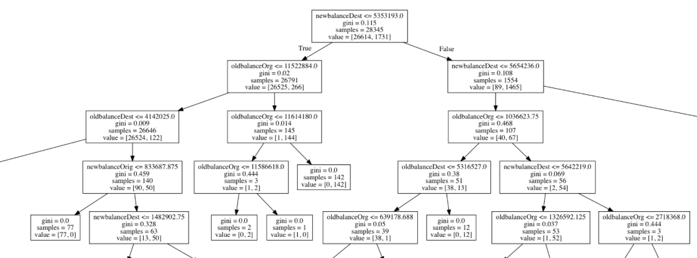

A part of the decision tree that was created 

 
Summary
-------

* * * * *

In this lab, you learned about how the k-means algorithm works, in
order to cluster unlabeled data points into clusters or groups. You then
learned how to implement the same using scikit-learn, and we expanded
upon the feature engineering aspect of the implementation. 

Having learned how to visualize clusters using hierarchical clustering
and t-SNE, you then learned how to map a multi-dimensional dataset into
a two-dimensional space. Finally, you learned how to convert an
unsupervised machine learning problem into a supervised learning one,
using decision trees. 

In the next (and final) lab, you will learn how to formally evaluate
the performance of all of the machine learning algorithms that you have
built so far!
