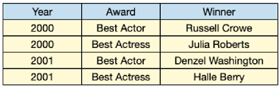
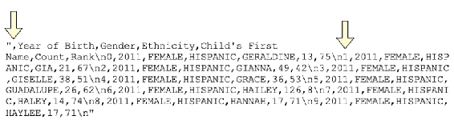

Imports and exports
======================

### This lab covers:

- Importing JSON data
- Flattening a nested collection of records
- Downloading a CSV from an online website
- Reading from and writing to Excel workbooks


##### Figure: A table of Oscar winners

{width="566" height="176"}


##### Figure: A Python dictionary (key-value store) with the same data

```
12345678910111213141516171819202122{
    2000: [
        {
            "Award": "Best Actor",
            "Winner": "Russell Crowe"
        },
        {
            "Award": "Best Actress",
            "Winner": "Julia Roberts"
        }
    ],
    2001: [
        {
            "Award": "Best Actor",
            "Winner": "Denzel Washington"
        },
        {
            "Award": "Best Actress",
            "Winner": "Halle Berry"
        }
    ]
}
```

In This lab, we\'ll also learn how to use pandas to *export* data
structures to various file types and data structures. Let\'s kick things
off with one of the most popular data storage formats available today,
JSON.


Reading From and Writing to JSON Files
--------------------------------------------


JSON is a popular response format for many modern APIs (application
programming interfaces, i.e., a website server). A raw JSON response
from an API looks like a plain string.


```
1{"name":"Harry Potter","age":17,"wizard":true}
```


Software programs called linters format JSON responses by placing each
key-value on a separate line. One example is
JSONLint https://jsonlint.com/.
Running the JSON above through JSONLint produces the following output:

```
12345{
       "name": "Harry Potter",
       "age": 17,
       "wizard": true,
}
```


There is no technical difference between the two previous code samples,
but the latter is more readable.


The JSON response holds three key-value pairs:


- The `"name"` key has a string value of
    `"Harry Potter"`.
- The `"age"` key has an integer value of 17.
- The `"wizard"` key has a Boolean value of `true`.


A key can also point to an **array**, an ordered collection of elements
equivalent to a Python list. The `"friends"` key in the next JSON
example maps to an array with two strings.


```
123456{
       "name": "Harry Potter",
       "age": 17,
       "wizard": true,
       "friends": ["Ron Weasley", "Hermione Granger"],
}
```


JSON can store additional key-value pairs within nested objects, such as
`"address"` below. Think of it as a dictionary nested within another
dictionary.


```
12345678910{
       "name": "Harry Potter",
       "age": 17,
       "wizard": true,
       "friends": ["Ron Weasley", "Hermione Granger"],
       "address": {
           "street": "4 Privet Drive",
           "town": "Little Whinging"
       }
}
```


#### Loading a JSON File Into a DataFrame


We can store JSON in a plain text file with a `.json` extension. The
`prizes.json` file for this lab is a JSON response from the Nobel
Prize API. It contains a list of Nobel Prize laureates dating back to
1901. You can view the raw JSON response in your web browser by
navigating to `http://api.nobelprize.org/v1/prize.json`.


Here\'s a preview of the JSON shape.


```
{
  "prizes": [
    {
      "year": "2019",
      "category": "chemistry",
      "laureates": [
        {
          "id": "976",
          "firstname": "John",
          "surname": "Goodenough",
          "motivation": "\"for the development of lithium-ion batteries\"",
          "share": "3"
        },
        {
          "id": "977",
          "firstname": "M. Stanley",
          "surname": "Whittingham",
          "motivation": "\"for the development of lithium-ion batteries\"",
          "share": "3"
        },
        {
          "id": "978",
          "firstname": "Akira",
          "surname": "Yoshino",
          "motivation": "\"for the development of lithium-ion batteries\"",
          "share": "3"
        }
      ]
    },
```


The JSON consists of a top-level `prizes` key tied to an array of
dictionaries, one for each combination of year and category (i.e.,
`"chemistry"`, `"physics"`, `"literature"`). The keys \"`year"` and
\"`category"` are present in each dictionary, while the keys
`"laureates"` and `"overallMotivation"` are only present for some prize
winners. Here\'s a sample dictionary with an `"overallMotivation"` key.


```
{
    year: "1972",
    category: "peace",
    overallMotivation: ""No Nobel Prize was awarded this year. The prize   
    money for 1972 was allocated to the Main Fund.""
}
```


The `"laureates"` key holds an array of dictionaries, each with its own
`"id"`, `"firstname"`, `"surname",` `"motivation"`, and `"share"` keys.
The `"laureates"` key stores an array because some years saw multiple
individuals awarded a Nobel prize in the same category. The
`"laureates"` key uses a list even if there was only one winner for a
category in a given year.


```
123456789101112131415{
    year: "2019",
    category: "literature",
    laureates: [
        {
             id: "980",
             firstname: "Peter",
             surname: "Handke",
             motivation: ""for an influential work that with linguistic  
             ingenuity has explored the periphery and the specificity of  
             human experience"",
             share: "1"
        }
    ]
},
```


Pandas\' import functions have a similar naming scheme. They consist of
the `read_` prefix followed by a file type. For example, we\'ve used the
`read_csv` function many times throughout the course. To import a JSON
file, we\'ll use the complementary `read_json` function. The next
example invokes the function with the `nobel.json` file. Pandas returns
a one-column `DataFrame` with a **prizes** column.


```
In  [1] import pandas as pd
 
In  [2] nobel = pd.read_json("nobel.json")
        nobel.head()
 
Out [2]
 
                                                                  prizes
0  {'year': '2019', 'category': 'chemistry', 'laureates': [{'id': '97...
1  {'year': '2019', 'category': 'economics', 'laureates': [{'id': '98...
2  {'year': '2019', 'category': 'literature', 'laureates': [{'id': '9...
3  {'year': '2019', 'category': 'peace', 'laureates': [{'id': '981', ...
4  {'year': '2019', 'category': 'physics', 'overallMotivation': '"for...
```


We\'ve successfully imported the file into pandas, but this format is
not ideal for analysis. Pandas identified the top-level `prizes` key in
the JSON and set it as the column name. It also created a row with a
plain Python dictionary for each key-value pair parsed from the JSON.


```
In  [3] type(nobel.loc[0, "prizes"])
 
Out [3] dict
 
 
 
In  [4] nobel.loc[0, "prizes"].keys()
 
Out [4] dict_keys(['year', 'category', 'laureates'])
```


To effectively work with this data, we\'ll need to extract the top-level
key-value pairs (**year**, **category**) to separate `DataFrame`
columns. Additionally, we\'ll need to iterate over each dictionary in
the `"laureates"` list and extract its *nested* information. Our goal is
a *separate row* for each Nobel laureate, connected to their year and
category. The ideal `DataFrame` shape looks like this:


```
id   firstname      surname           motivation share  year   category
0  976        John   Goodenough  "for the develop...     3  2019  chemistry
1  977  M. Stanley  Whittingham  "for the develop...     3  2019  chemistry
2  978       Akira      Yoshino  "for the develop...     3  2019  chemistry
```


Extracting nested records of data into a single, one-dimensional list is
called **flattening** or **normalizing**. The pandas library includes a
built-in `json_normalize` function to take care of the heavy lifting.
Let\'s try it out on a sample dictionary from the `nobel` `DataFrame`.
We\'ll use the `loc` accessor to access the first row\'s dictionary and
assign it to a `chemistry_2019` variable.


```
In  [5] chemistry_2019 = nobel.loc[0, "prizes"]
        chemistry_2019
 
Out [5] {'year': '2019',
         'category': 'chemistry',
         'laureates': [{'id': '976',
           'firstname': 'John',
           'surname': 'Goodenough',
           'motivation': '"for the development of lithium-ion batteries"',
           'share': '3'},
          {'id': '977',
           'firstname': 'M. Stanley',
           'surname': 'Whittingham',
           'motivation': '"for the development of lithium-ion batteries"',
           'share': '3'},
          {'id': '978',
           'firstname': 'Akira',
           'surname': 'Yoshino',
           'motivation': '"for the development of lithium-ion batteries"',
           'share': '3'}]}
```


Let\'s pass the `chemistry_2019` dictionary to the `data` parameter of
`json_normalize` function. Pandas extracts the three top-level
dictionary keys `("year"`, `"category"`, and `"laureates"`) to separate
columns in a new `DataFrame`. Unfortunately, the library does not
transfer the nested dictionaries in the `"laureates"` list to separate
columns and individual rows.


```
In  [6] pd.json_normalize(data = chemistry_2019)
 
Out [6] 
 
   year   category                                          laureates
0  2019  chemistry  [{'id': '976', 'firstname': 'John', 'surname':...
```


We can utilize the `record_path` parameter to normalize the nested
`"laureates"` records. We pass it a string that indicates *which* key in
the dictionary holds the nested records. Let\'s pass it `"laureates".`


```
In  [7] pd.json_normalize(data = chemistry_2019, record_path = "laureates")
 
Out [7]
 
    id   firstname      surname                     motivation share
0  976        John   Goodenough  "for the development of li...     3
1  977  M. Stanley  Whittingham  "for the development of li...     3
2  978       Akira      Yoshino  "for the development of li...     3
```


One step forward, one step back. This dataset has the nested
`"laureates"` fields we want, but now we\'ve lost the original year and
category columns. To preserve these top-level key-value pairs, we can
pass a list with their names to the `meta` parameter.


```
In  [8] pd.json_normalize(
            data = chemistry_2019,
            record_path = "laureates",
            meta = ["year", "category"],
        )
 
Out [8]
 
    id   firstname      surname           motivation share  year   category
0  976        John   Goodenough  "for the develop...     3  2019  chemistry
1  977  M. Stanley  Whittingham  "for the develop...     3  2019  chemistry
2  978       Akira      Yoshino  "for the develop...     3  2019  chemistry
```


Our normalization strategy has worked successfully for a single
dictionary in the **prizes** column. Luckily, the `json_normalize`
function is smart enough to accept a `Series` of dictionaries and repeat
the extraction logic for each entry. Let\'s see what happens when we
pass it the `prizes` `Series`.


```
In  [9] pd.json_normalize(
            data = nobel["prizes"],
            record_path = "laureates",
            meta = ["year", "category"]
        )
 
Out [9]
 
---------------------------------------------------------------------------
KeyError                                  Traceback (most recent call last)
<ipython-input-49-e09a24c19e5b> in <module>
      2     data = nobel["prizes"],
      3     record_path = "laureates",
----> 4     meta = ["year", "category"]
      5 )
 
KeyError: 'laureates'
```


Unfortunately, Pandas raises a `KeyError` exception. Some dictionaries
in the **prizes** `Series` do *not* have a `"laureates"` key. The
`json_normalize` function is unable to extract nested laureates
information from a non-existent list. One solution to this problem is
identifying the dictionary records lacking a `"laureates"` key and
manually assigning the key to them with a value of an empty list.


Let\'s take a second to review the `setdefault` method on a Python
dictionary. Consider the dictionary below.


```
In  [10] cheese_consumption = {
             "France": 57.9,
             "Germany": 53.2,
             "Luxembourg": 53.2
         }
```


The `setdefault` method assigns a key-value pair to a dictionary, but
only *if* the key does not already exist. If the key *does* exist, the
method returns its existing value. The method\'s first argument is the
key, and its second argument is the value.


The following example attempts to add the key `"France"` to the
`cheese_consumption` dictionary with a value of 100. The key already
exists, so nothing changes. Python keeps the original value of 57.9.


```
In  [11] cheese_consumption.setdefault("France", 100)
 
Out [11] 57.9
 
In  [12] cheese_consumption["France"]
 
Out [12] 57.9
```


In comparison, the next example invokes `setdefault` with an argument of
`"Italy"`. The key `"Italy"` does *not* exist in the dictionary, so
Python adds it and assigns it a value of 48.


```
In  [13] cheese_consumption.setdefault("Italy", 48)
 
Out [13] 48
 
In  [14] cheese_consumption
 
Out [14] {'France': 57.9, 'Germany': 53.2, 'Luxembourg': 53.2, 'Italy': 48}
```


Let\'s apply this technique to each nested dictionary within **prizes**.
If a dictionary does *not* have a `laureates` key, we\'ll use the
`setdefault` method to add it with a value of an empty list. As a
reminder, we can use the `apply` method to iterate individually over
each `Series` element. The method accepts a function as an argument and passes each
`Series` row to the function in sequence.


```
In  [15] def add_laureates_key(entry):
             entry.setdefault("laureates", [])
 
         nobel["prizes"].apply(add_laureates_key)
 
Out [15] 0      [{'id': '976', 'firstname': 'John', 'surname':...
         1      [{'id': '982', 'firstname': 'Abhijit', 'surnam...
         2      [{'id': '980', 'firstname': 'Peter', 'surname'...
         3      [{'id': '981', 'firstname': 'Abiy', 'surname':...
         4      [{'id': '973', 'firstname': 'James', 'surname'...
                                      ...                        
         641    [{'id': '160', 'firstname': 'Jacobus H.', 'sur...
         642    [{'id': '569', 'firstname': 'Sully', 'surname'...
         643    [{'id': '462', 'firstname': 'Henry', 'surname'...
         644    [{'id': '1', 'firstname': 'Wilhelm Conrad', 's...
         645    [{'id': '293', 'firstname': 'Emil', 'surname':...
         Name: prizes, Length: 646, dtype: object
```


The `setdefault` method mutates the dictionaries within **prizes**, so
there is no need to overwrite the original `Series`.


Now that all nested dictionaries have a `laureates` key, we can reinvoke
the `json_normalize` function. Once again, we\'ll pass a list to the
`meta` parameter with the two top-level dictionary keys we\'d like to
keep.


```
In  [16] winners = pd.json_normalize(
             data = nobel["prizes"],
             record_path = "laureates",
             meta = ["year", "category"]
         )
 
         winners
 
Out [16]
 
      id     firstname      surname      motivation share  year    category
0    976          John   Goodenough  "for the de...     3  2019   chemistry
1    977    M. Stanley  Whittingham  "for the de...     3  2019   chemistry
2    978         Akira      Yoshino  "for the de...     3  2019   chemistry
3    982       Abhijit     Banerjee  "for their ...     3  2019   economics
4    983        Esther        Duflo  "for their ...     3  2019   economics
  …    …             …            …               …     …     …           …
945  569         Sully    Prudhomme  "in special...     1  1901  literature
946  462         Henry       Dunant  "for his hu...     2  1901       peace
947  463      Frédéric        Passy  "for his li...     2  1901       peace
948    1  Wilhelm Con…      Röntgen  "in recogni...     1  1901     physics
949  293          Emil  von Behring  "for his wo...     1  1901    medicine
```


And there we go! The nested data has been normalized and stored in a
2-dimensional table structure.


####    Exporting a DataFrame to a JSON File


Let\'s now attempt the process in reverse: converting a `DataFrame` to a
JSON representation and writing it to a JSON file. The `to_json` method
creates a JSON string from a pandas data structure. Its `orient`
parameter customizes the format in which pandas returns the data. The
next example uses an argument of `"records"` to return a JSON array of
key-value objects. Pandas stores the column names as dictionary keys
pointing to the row\'s respective values.


```
In  [17] winners.head(2)
 
Out [17]
 
    id   firstname      surname           motivation share  year   category
0  976        John   Goodenough  "for the develop...     3  2019  chemistry
1  977  M. Stanley  Whittingham  "for the develop...     3  2019  chemistry
 
In  [18] winners.head(2).to_json(orient = "records")
 
Out [18]   
  '[{"id":"976","firstname":"John","surname":"Goodenough","motivation":"\\"for the development of lithium-ion batteries\\"","share":"3","year":"2019","category":"chemistry"},{"id":"977","firstname":"M. Stanley","surname":"Whittingham","motivation":"\\"for the development of lithium-ion batteries\\"","share":"3","year":"2019","category":"chemistry"}]'
```


In comparison, an argument of `"split"` returns a dictionary with
separate `columns`, `index`, and `data` keys. This option avoids the
duplication of column names for each row.


```
In  [19] winners.head(2).to_json(orient = "split")
 
Out [19]
 
'{"columns":["id","firstname","surname","motivation","share","year","category"],"index":[0,1],"data":[["976","John","Goodenough","\\"for the development of lithium-ion batteries\\"","3","2019","chemistry"],["977","M. Stanley","Whittingham","\\"for the development of lithium-ion batteries\\"","3","2019","chemistry"]]}'
```


There are a few additional arguments available for the `orient`
parameter including `"index"`, `"columns"`, `"values"`, and `"table"`.


Once the JSON format fits your expectations, pass the JSON file name as
the first argument to the `to_json` method. Pandas will write the string
to a JSON file in the same directory as the Jupyter Notebook.


```
In  [20] winners.to_json("winners.json", orient = "records")
```


Reading from and Writing to CSV Files
-------------------------------------------


Our next dataset is a collection of baby names in New York City. Each
row includes the name, birth year, gender, ethnicity, count, and
popularity rank. The CSV file is hosted on New York City\'s government
website and is available at
[https://data.cityofnewyork.us/api/views/25th-nujf/rows.csv](https://data.cityofnewyork.us/api/views/25th-nujf/rows.csv).


We can access the website in our web browser and download the dataset to
our computer for local storage. As an alternative, we can also pass the
URL directly to the `read_csv` function as its first argument. Pandas
will fetch the dataset from the website. A hardcoded URL is helpful when
hosted data changes frequently; it saves us the manual work of
downloading the dataset.


```
In  [21] url = "https://data.cityofnewyork.us/api/views/25th-nujf/rows.csv"
         baby_names = pd.read_csv(url)
         baby_names.head()
 
Out [21]
 
   Year of Birth  Gender Ethnicity Child's First Name  Count  Rank
0           2011  FEMALE  HISPANIC          GERALDINE     13    75
1           2011  FEMALE  HISPANIC                GIA     21    67
2           2011  FEMALE  HISPANIC             GIANNA     49    42
3           2011  FEMALE  HISPANIC            GISELLE     38    51
4           2011  FEMALE  HISPANIC              GRACE     36    53
```


Note that pandas will raise an `HTTPError` exception if the link is
invalid or does not have a file to download.


`Let's try writing the baby_names DataFrame to a plain CSV file with the to_csv method.`
Without an argument, the method outputs the CSV string directly in your
Jupyter Notebook. Following CSV conventions, pandas separates row values
with commas and different rows with line breaks. As a reminder, a `\n`
character marks a line break in Python. Here\'s a small preview of the
method\'s output.


```
In  [22] baby_names.head(10).to_csv()
 
Out [22] 
 
",Year of Birth,Gender,Ethnicity,Child's First Name,Count,Rank\n0,2011,FEMALE,HISPANIC,GERALDINE,13,75\n1,2011,FEMALE,HISPANIC,GIA,21,67\n2,2011,FEMALE,HISPANIC,GIANNA,49,42\n3,2011,FEMALE,HISPANIC,GISELLE,38,51\n4,2011,FEMALE,HISPANIC,GRACE,36,53\n5,2011,FEMALE,HISPANIC,GUADALUPE,26,62\n6,2011,FEMALE,HISPANIC,HAILEY,126,8\n7,2011,FEMALE,HISPANIC,HALEY,14,74\n8,2011,FEMALE,HISPANIC,HANNAH,17,71\n9,2011,FEMALE,HISPANIC,HAYLEE,17,71\n"
```


Notice the comma at the beginning of the string and the numeric values
(0, 1, 2, etc.) after each `\n` symbol. By default, pandas includes the
`DataFrame` index in the CSV string.


##### Figure: The CSV output with arrows highlighting the index labels

{width="566" height="150"}


We can exclude the index by passing the `index` parameter an argument of
`False`.


```
In  [23] baby_names.head(10).to_csv(index = False)
 
Out [23]
 
"Year of Birth,Gender,Ethnicity,Child's First Name,Count,Rank\n2011,FEMALE,HISPANIC,GERALDINE,13,75\n2011,FEMALE,HISPANIC,GIA,21,67\n2011,FEMALE,HISPANIC,GIANNA,49,42\n2011,FEMALE,HISPANIC,GISELLE,38,51\n2011,FEMALE,HISPANIC,GRACE,36,53\n2011,FEMALE,HISPANIC,GUADALUPE,26,62\n2011,FEMALE,HISPANIC,HAILEY,126,8\n2011,FEMALE,HISPANIC,HALEY,14,74\n2011,FEMALE,HISPANIC,HANNAH,17,71\n2011,FEMALE,HISPANIC,HAYLEE,17,71\n"
```


To write the string to a CSV file, pass its filename as the first
argument to the method.  Make sure to include the `.csv` extension. If
we do not provide a specific path, pandas will write the file to the
same directory as the Jupyter Notebook.


```
In  [24] baby_names.to_csv("NYC_Baby_Names.csv", index = False)
```


The method produces no output below the Notebook cell. However, if we
flip back to the Jupyter Notebook navigation interface, we can see that
pandas has created the CSV file.


By default, pandas writes *all* `DataFrame` columns to the CSV file. We
can limit the columns by passing a subset of column names to the
`columns` parameter. The next example generates a CSV with only the
**Gender**, **Child\'s First Name**, and **Count** columns. Note that
executing the Jupyter Notebook cell *overwrites* the existing
`NYC_Baby_Names.csv` file in the directory. Pandas does not warn the
user that it is replacing the file.


```
In  [25] baby_names.to_csv(
             "NYC_Baby_Names.csv",
             index = False, 
             columns = ["Gender", "Child's First Name", "Count"]
         )
```


Reading from and Writing to Excel Workbooks
-------------------------------------------------


Excel is the most popular spreadsheet application in use today. Pandas
makes it easy to read from and write to Excel workbooks and even
specific worksheets. But first, we\'ll need to do a little housekeeping
to integrate the two pieces of software together.


####    Importing Excel Workbooks


The `read_excel` function at the top level of pandas imports an Excel
workbook into a `DataFrame`. Its first parameter, `io`, accepts a string
with the path to the workbook. Make sure to include the `xlsx` extension
in the file name. By default, pandas will import only the first
worksheet in the workbook.


The `Single Worksheet.xlsx` Excel workbook is a good place to start. It
contains only a single **Data** worksheet.


```
In  [26] pd.read_excel("Single Worksheet.xlsx")
 
Out [26]
 
  First Name Last Name           City Gender
0    Brandon     James          Miami      M
1       Sean   Hawkins         Denver      M
2       Judy       Day    Los Angeles      F
3     Ashley      Ruiz  San Francisco      F
4  Stephanie     Gomez       Portland      F
```


The `read_excel` function supports many of the same parameters as
`read_csv,` including `index_col` to set the index columns, `usecols` to
select the columns, and `squeeze` to coerce a one-column worksheet into
a `Series` object. In the next example, we set the **City** column as
the index and keep only 3 of the dataset\'s 4 columns. Note that if we
provide a column to the `index_col` parameter, we must also include the
column in the `usecols` list.


```
In  [27] pd.read_excel(
             io = "Single Worksheet.xlsx",
             usecols = ["City", "First Name", "Last Name"],
             index_col = "City"
         )
 
Out [27]
 
              First Name Last Name
City______________________________
Miami            Brandon     James
Denver              Sean   Hawkins
Los Angeles         Judy       Day
San Francisco     Ashley      Ruiz
Portland       Stephanie     Gomez
```


The complexity increases slightly when a workbook contains multiple
worksheets. The `Multiple Worksheets.xlsx` file holds three worksheets:
**Data 1**, **Data 2**, and **Data 3**. By default, pandas only imports
the *first* worksheet in the workbook.


```
In  [28] pd.read_excel("Multiple Worksheets.xlsx")
 
Out [28] 
 
  First Name Last Name           City Gender
0    Brandon     James          Miami      M
1       Sean   Hawkins         Denver      M
2       Judy       Day    Los Angeles      F
3     Ashley      Ruiz  San Francisco      F
4  Stephanie     Gomez       Portland      F
```


During import, pandas assigns each worksheet an index position starting
at 0. To import a specific worksheet, we can pass the `sheet_name`
parameter either the worksheet\'s index position or its name. The
parameter\'s default argument is 0 (the first worksheet). The two
statements below return the same `DataFrame` as above.


```
In  [29] # The two lines below are equivalent
         pd.read_excel("Multiple Worksheets.xlsx", sheet_name = 0)
         pd.read_excel("Multiple Worksheets.xlsx", sheet_name = "Data 1")
 
Out [29]
 
  First Name Last Name           City Gender
0    Brandon     James          Miami      M
1       Sean   Hawkins         Denver      M
2       Judy       Day    Los Angeles      F
3     Ashley      Ruiz  San Francisco      F
4  Stephanie     Gomez       Portland      F
```


To import *all* worksheets, pass an argument of `None` to the
`sheet_name` parameter. The `read_excel` function returns a dictionary
with the worksheets\' names as keys and the respective `DataFrames` as
values.


```
In  [30] workbook = pd.read_excel(
             "Multiple Worksheets.xlsx", sheet_name = None
         )
 
         workbook
 
Out [30] {'Data 1':   First Name Last Name           City Gender
          0    Brandon     James          Miami      M
          1       Sean   Hawkins         Denver      M
          2       Judy       Day    Los Angeles      F
          3     Ashley      Ruiz  San Francisco      F
          4  Stephanie     Gomez       Portland      F,
          'Data 2':   First Name Last Name           City Gender
          0     Parker     Power        Raleigh      F
          1    Preston  Prescott   Philadelphia      F
          2    Ronaldo   Donaldo         Bangor      M
          3      Megan   Stiller  San Francisco      M
          4     Bustin    Jieber         Austin      F,
          'Data 3':   First Name  Last Name     City Gender
          0     Robert     Miller  Seattle      M
          1       Tara     Garcia  Phoenix      F
          2    Raphael  Rodriguez  Orlando      M}
 
In  [31] type(workbook)
 
Out [31] dict
```


To access a `DataFrame`/worksheet, we access a key in the dictionary.


```
In  [32] workbook["Data 2"]
 
Out [32]
 
  First Name Last Name           City Gender
0     Parker     Power        Raleigh      F
1    Preston  Prescott   Philadelphia      F
2    Ronaldo   Donaldo         Bangor      M
3      Megan   Stiller  San Francisco      M
4     Bustin    Jieber         Austin      F
```


To limit the worksheets that pandas imports, pass the `sheet_name`
parameter a *list* of index positions or worksheet names. Pandas will
return a dictionary whose keys match the strings in the `sheet_name`
list. The next example imports only the **Data 1** and **Data 3**
worksheets.


```
In  [33] pd.read_excel(
             "Multiple Worksheets.xlsx",
             sheet_name = ["Data 1", "Data 3"]
         )
 
Out [33] {'Data 1':   First Name Last Name           City Gender
          0    Brandon     James          Miami      M
          1       Sean   Hawkins         Denver      M
          2       Judy       Day    Los Angeles      F
          3     Ashley      Ruiz  San Francisco      F
          4  Stephanie     Gomez       Portland      F,
          'Data 3':   First Name  Last Name     City Gender
          0     Robert     Miller  Seattle      M
          1       Tara     Garcia  Phoenix      F
          2    Raphael  Rodriguez  Orlando      M}
```


The next example targets index positions 1 and 2 or, equivalently, the
second and third worksheets.


```
In  [34] pd.read_excel("Multiple Worksheets.xlsx", sheet_name = [1, 2])
 
Out [34] {1:   First Name Last Name           City Gender
          0     Parker     Power        Raleigh      F
          1    Preston  Prescott   Philadelphia      F
          2    Ronaldo   Donaldo         Bangor      M
          3      Megan   Stiller  San Francisco      M
          4     Bustin    Jieber         Austin      F,
          2:   First Name  Last Name     City Gender
          0     Robert     Miller  Seattle      M
          1       Tara     Garcia  Phoenix      F
          2    Raphael  Rodriguez  Orlando      M}
```


####    Exporting Excel Workbooks


Let\'s return to the `baby_names` `DataFrame`. Here\'s a reminder of
what it looks like.


```
In  [35] baby_names.head()
 
Out [35]
 
   Year of Birth  Gender Ethnicity Child's First Name  Count  Rank
0           2011  FEMALE  HISPANIC          GERALDINE     13    75
1           2011  FEMALE  HISPANIC                GIA     21    67
2           2011  FEMALE  HISPANIC             GIANNA     49    42
3           2011  FEMALE  HISPANIC            GISELLE     38    51
4           2011  FEMALE  HISPANIC              GRACE     36    53
```


Let\'s say we wanted to split the dataset into 2 `DataFrames`, one for
each gender. Then, we\'d like to write each `DataFrame` to a separate
worksheet in a new Excel workbook.


We can begin by filtering the `baby_names` `DataFrame`.


```
In  [36] girls = baby_names[baby_names["Gender"] == "FEMALE"]
         boys = baby_names[baby_names["Gender"] == "MALE"]
```


Writing to an Excel workbook requires a few more steps than writing to a
CSV. First up, we need to create an `ExcelWriter` object. This object
serves as the foundation of the workbook. We\'ll attach individual
worksheets to it in just a moment.


The `ExcelWriter` constructor is available at the top-level of the
pandas library. Its first parameter, `path`, accepts a string with the
new workbook\'s filename. If we do not provide a path, pandas will
create the Excel file in the same directory as the Jupyter Notebook.
Make sure to save the `ExcelWriter` object to a variable.


```
In  [37] excel_file = pd.ExcelWriter("Baby_Names.xlsx")
         excel_file
 
Out [37] <pandas.io.excel._openpyxl._OpenpyxlWriter at 0x118a7bf90>
```


Next up, we need to connect our `girls` and `boys` `DataFrames` to
individual worksheets in the workbook. The `DataFrame` object\'s
`to_excel` method accepts an `ExcelWriter` object for its first
parameter, `excel_writer`. The `sheet_name` parameter accepts a string
with the desired worksheet name. Finally, we can pass the `index`
parameter a value of `False` to exclude the `DataFrame` index.


```
In  [38] girls.to_excel(
             excel_writer = excel_file, sheet_name = "Girls", index = False
         )
```


Note that pandas has *not* created the Excel workbook yet.


Let\'s connect our second `DataFrame` to the Excel workbook. We\'ll
invoke the `to_excel` method on the `boys DataFrame`, passing the
`excel_writer` parameter the same `ExcelWriter` object. Now, pandas
knows that it should write the two datasets to the *same* workbook.
Let\'s also alter the string argument to the  `sheet_name` parameter to
a different name. To filter the columns that pandas will include, pass a
list of their names to the `columns` parameter. The next example tells
pandas to include only the **Child\'s First Name**, **Count**, and
**Rank** columns.


```
In  [39] boys.to_excel(
             excel_file,
             sheet_name = "Boys",
             index = False,
             columns = ["Child's First Name", "Count", "Rank"]
         )
```


Now that we\'ve configured the Excel workbook\'s plumbing, we\'re good
to write it to disk. Invoke the `save` method on the `excel_file`
`ExcelWriter` object to complete the process.


```
In  [40] excel_file.save()
```


Check out the Jupyter Notebook interface; pandas has created the
`Baby_Names.xlsx` file in the same folder.


Coding Challenge
----------------------


Let\'s practice the concepts introduced in This lab. The
`tv_shows.json` file is an aggregate collection of TV show episodes
pulled from the Episodate.com
API: https://www.episodate.com/api.
It includes data for 3 TV shows: The X-Files, Lost, and Buffy the
Vampire Slayer.


```
In  [41] tv_shows_json = pd.read_json("tv_shows.json")
         tv_shows_json
 
Out [41]
 
                                                         shows
0  {'show': 'The X-Files', 'runtime': 60, 'network': 'FOX',...
1  {'show': 'Lost', 'runtime': 60, 'network': 'ABC', 'episo...
2  {'show': 'Buffy the Vampire Slayer', 'runtime': 60, 'net...
```


The JSON response consists of a top-level `"shows"` key connected to an
array of three dictionaries, one for each show. Each dictionary includes
`"show"`, `"runtime"`, `"network"`, and `"episodes"` keys. The
`"episodes"` key maps to an array of dictionaries, one for each episode
of the show. Here\'s a preview of the first row\'s dictionary.


```
In  [42] tv_shows_json.loc[0, "shows"]
 
Out [42] {'show': 'The X-Files',
          'runtime': 60,
          'network': 'FOX',
          'episodes': [{'season': 1,
            'episode': 1,
            'name': 'Pilot',
            'air_date': '1993-09-11 01:00:00'},
           {'season': 1,
            'episode': 2,
            'name': 'Deep Throat',
            'air_date': '1993-09-18 01:00:00'},
```


Your challenges are:


1.  [Normalize the nested episode data for each dictionary in the shows
    column. The goal is a `DataFrame` that lists each episode
    on a separate row. Each row should include the episode\'s relevant
    metadata (`season`, `episode`,
    `name`, `air_date`) as well as the show\'s
    top-level information (`show`, `runtime`, and
    `network`).
2.  [Filter the resulting normalized dataset into three separate
    `DataFrames`, one for each of the shows `("The X-Files"`, `"Lost"`,
    and `"Buffy the Vampire Slayer"`).
3.  [Write the three `DataFrames` to an `episodes.xlsx` Excel workbook.
    Save each TV show\'s episode data to a separate worksheet (the
    worksheet names are up to you).


For challenge \#1, we\'ll have to utilize the `json_normalize` function
to extract each TV show\'s nested batch of episodes. They are available
under the `"episodes"` key, which we can pass to the method\'s
`record_path` parameter. To preserve the top-level show data, we can
pass the `meta` parameter a list of keys to keep.


```
In  [43] tv_shows = pd.json_normalize(
             data = tv_shows_json["shows"],
             record_path = "episodes",
             meta = ["show", "runtime", "network"]
         )
 
         tv_shows
 
Out [43]
 
  season  episode          name      air_date          show runtime network
0      1        1         Pilot  1993-09-1...   The X-Files      60     FOX
1      1        2   Deep Throat  1993-09-1...   The X-Files      60     FOX
2      1        3       Squeeze  1993-09-2...   The X-Files      60     FOX
3      1        4       Conduit  1993-10-0...   The X-Files      60     FOX
4      1        5  The Jerse...  1993-10-0...   The X-Files      60     FOX
  …    …        …             …             …             …       …       …
477    7       18   Dirty Girls  2003-04-1...  Buffy the...      60     UPN
478    7       19  Empty Places  2003-04-3...  Buffy the...      60     UPN
479    7       20       Touched  2003-05-0...  Buffy the...      60     UPN
480    7       21   End of Days  2003-05-1...  Buffy the...      60     UPN
481    7       22        Chosen  2003-05-2...  Buffy the...      60     UPN
```


Challenge \#2 asks to split the dataset into three `DataFrames`, one for
each TV show. We can filter the rows in `tv_shows` based on the values
in the **show** column.


```
In  [44] xfiles = tv_shows[tv_shows["show"] == "The X-Files"]
         lost = tv_shows[tv_shows["show"] == "Lost"]
         buffy = tv_shows[tv_shows["show"] == "Buffy the Vampire Slayer"]
```


Finally, Challenge \#3 asks us to write the 3 `DataFrames` to an Excel
workbook. Let\'s begin by instantiating an `ExcelWriter` object and
saving it to a variable. We can pass in the workbook name as the first
argument.


```
In  [45] episodes = pd.ExcelWriter("episodes.xlsx")
         episodes
 
Out [45] <pandas.io.excel._openpyxl._OpenpyxlWriter at 0x11e5cd3d0>
```


Next, invoke the `to_excel` method on each of the 3 `DataFrames` to
connect them to individual worksheets in the workbook. We\'ll pass the
same `episodes` `ExcelWriter` object to the `excel_writer` parameter in
each invocation. We\'ll make sure to provide a unique name for each
worksheet via the `sheet_name` parameter. Finally, we\'ll pass the
`index` parameter a value of `False` to exclude the index.


```
In  [46] xfiles.to_excel(
             excel_writer = episodes, sheet_name = "X-Files", index = False
         )
 
 
 
In  [47] lost.to_excel(
             excel_writer = episodes, sheet_name = "Lost", index = False
         )
 
In  [48] buffy.to_excel(
             excel_writer = episodes,
             sheet_name = "Buffy the Vampire Slayer",
             index = False
         )
```


With the worksheets wired up, we can invoke the `save` method on the
`episodes` `ExcelWriter` object to create the workbook.


```
In  [49] episodes.save()
```


Summary
-------------


- The `read_json` function parses a JSON file into a
    `DataFrame`.
- The `json_normalize` function normalizes and extracts nested JSON
    data into a `DataFrame`.
- We can pass URLs to import functions like `read_csv`, `read_json`,
    and `read_excel`. Pandas will download the dataset from the provided
    link.
- The `read_excel` function imports an Excel workbook. The method\'s
    `sheet_name` parameter sets the worksheets to import. When importing
    more than 1 worksheet, pandas stores the resulting `DataFrames` in a
    dictionary.
- To write one or more `DataFrames` to an Excel workbook, instantiate
    an `ExcelWriter` object, attach the `DataFrames` to it via the
    `to_excel` method, then invoke the `save` method on the
    `ExcelWriter` object.

