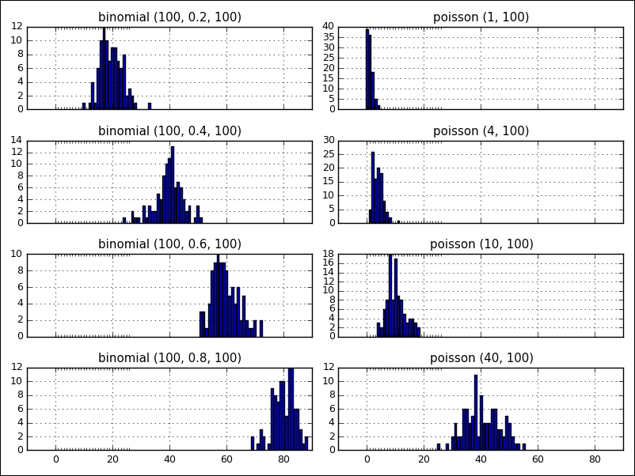

Lab 2. NumPy Arrays and Vectorized Computation 
----------------------------------------------


**NumPy arrays**

The latitude of the Eiffel Tower, Paris is 48.858598 and the longitude is 2.294495. It
can be presented in a NumPy array object as `p`:

```
>>> import numpy as np
>>> p = np.array([48.858598, 2.294495])
>>> p
Output: array([48.858598, 2.294495])
```

This is a manual construction of an array using the
`np.array` function. The standard convention to import NumPy
is as follows:

```
>>> import numpy as np
```

There are two requirements of a NumPy array: a fixed size at creation
and a uniform, fixed data type, with a fixed size in memory. The
following functions help you to get information on the `p`
matrix:

```
>>> p.ndim    # getting dimension of array p
1
>>> p.shape   # getting size of each array dimension
(2,)
>>> len(p)    # getting dimension length of array p
2
>>> p.dtype    # getting data type of array p
dtype('float64')
```


### Data types

We can easily or cast an array from one `dtype` to another using the `astype` method:

```
>>> a = np.array([1, 2, 3, 4])
>>> a.dtype
dtype('int64')
>>> float_b = a.astype(np.float64)
>>> float_b.dtype
dtype('float64')
```


### Array creation

Let's use some of NumPy\'s common functions and their use by examples for array creation.

Create a new array of the given shape and type, without initializing elements:

```
>>> np.empty([3,2], dtype=np.float64)
array([[0., 0.], [0., 0.], [0., 0.]])
>>> a = np.array([[1, 2], [4, 3]])
>>> np.empty_like(a)
array([[0, 0], [0, 0]])
```

Create a NxN identity matrix with ones on the diagonal and zero elsewhere

```
>>> np.eye(2, dtype=np.int)
array([[1, 0], [0, 1]])
```


Create a new array with the given shape and type, filled with 1s for all elements

```
>>> np.ones(5)
array([1., 1., 1., 1., 1.])
>>> np.ones(4, dtype=np.int)
array([1, 1, 1, 1])
>>> x = np.array([[0,1,2], [3,4,5]])
>>> np.ones_like(x)
array([[1, 1, 1],[1, 1, 1]])
```

This is similar to ones, ones_like, but initializing elements with 0s instead

```
>>> np.zeros(5)
array([0., 0., 0., 0-, 0.])
>>> np.zeros(4, dtype=np.int)
array([0, 0, 0, 0])
>>> x = np.array([[0, 1, 2], [3, 4, 5]])
>>> np.zeros_like(x)
array([[0, 0, 0],[0, 0, 0]])
```

Create an array with even spaced values in a given interval

```
>>> np.arange(2, 5)
array([2, 3, 4])
>>> np.arange(4, 12, 5)
array([4, 9])
```

Create a new array with the given shape and type, filled with a selected value

```
>>> np.full((2,2), 3, dtype=np.int)
array([[3, 3], [3, 3]])
>>> x = np.ones(3)
>>> np.full_like(x, 2)
array([2., 2., 2.])
```

Create an array from the existing data

```
>>> np.array([[1.1, 2.2, 3.3], [4.4, 5.5, 6.6]])
array([1.1, 2.2, 3.3], [4.4, 5.5, 6.6]])
```

Convert the input to an array

```
>>> a = [3.14, 2.46]
>>> np.asarray(a)
array([3.14, 2.46])
```

Return an array copy of the given object

```
>>> a = np.array([[1, 2], [3, 4]])
>>> np.copy(a)
array([[1, 2], [3, 4]])
```

Create 1-D array from a string or text

```
>>> np.fromstring('3.14 2.17', dtype=np.float, sep=' ')
array([3.14, 2.17])
```

### Indexing and slicing

As with other Python sequence types, such as lists,
it is very easy to access and assign a value of each
array\'s element:

```
>>> a = np.arange(7)
>>> a
array([0, 1, 2, 3, 4, 5, 6])
>>> a[1], a [4], a[-1]
(1, 4, 6)
```

As another example, if our array is multidimensional, we need tuples of
integers to index an item:

```
>>> a = np.array([[1, 2, 3], [4, 5, 6], [7, 8, 9]])
>>> a[0, 2]      # first row, third column
3
>>> a[0, 2] = 10
>>> a
array([[1, 2, 10], [4, 5, 6], [7, 8, 9]])
>>> b = a[2]
>>> b
array([7, 8, 9])
>>> c = a[:2]
>>> c
array([[1, 2, 10], [4, 5, 6]])
```

We call `b` and `c` as array
slices, which are views on the original one. It means that the data is not copied to `b` or `c`, and
whenever we modify their values, it will be reflected in the array
`a` as well:

```
>>> b[-1] = 11
>>> a
array([[1, 2, 10], [4, 5, 6], [7, 8, 11]])
```


### Fancy indexing

First, we take a look at an example of indexing with a Boolean mask
array:

```
>>> a = np.array([3, 5, 1, 10])
>>> b = (a % 5 == 0)
>>> b
array([False, True, False, True], dtype=bool)
>>> c = np.array([[0, 1], [2, 3], [4, 5], [6, 7]])
>>> c[b]
array([[2, 3], [6, 7]])
```

The second example is an illustration of using integer masks on arrays:

```
>>> a = np.array([[1, 2, 3, 4], 
 [5, 6, 7, 8], 
 [9, 10, 11, 12],
 [13, 14, 15, 16]])
>>> a[[2, 1]]
array([[9, 10, 11, 12], [5, 6, 7, 8]])
>>> a[[-2, -1]]          # select rows from the end
array([[ 9, 10, 11, 12], [13, 14, 15, 16]])
>>> a[[2, 3], [0, 1]]    # take elements at (2, 0) and (3, 1)
array([9, 14])
```

### Numerical operations on arrays

Scalar operations will propagate the value to each element of the array:

```
>>> a = np.ones(4)
>>> a * 2
array([2., 2., 2., 2.])
>>> a + 3
array([4., 4., 4., 4.])
```

All arithmetic operations between arrays apply the operation element
wise:

```
>>> a = np.ones([2, 4])
>>> a * a
array([[1., 1., 1., 1.], [1., 1., 1., 1.]])
>>> a + a
array([[2., 2., 2., 2.], [2., 2., 2., 2.]])
```

Also, here are some examples of comparisons and logical operations:

```
>>> a = np.array([1, 2, 3, 4])
>>> b = np.array([1, 1, 5, 3])
>>> a == b
array([True, False, False, False], dtype=bool)

>>> np.array_equal(a, b)      # array-wise comparison
False

>>> c = np.array([1, 0])
>>> d = np.array([1, 1])
>>> np.logical_and(c, d)      # logical operations
array([True, False])
```

Array functions
---------------------------------

Many helpful array functions are supported in NumPy
for analyzing data. We will list some part of them that are common in
use. Firstly, the transposing function is another kind of reshaping form
that returns a view on the original data array without copying anything:

```
>>> a = np.array([[0, 5, 10], [20, 25, 30]])
>>> a.reshape(3, 2)
array([[0, 5], [10, 20], [25, 30]])
>>> a.T
array([[0, 20], [5, 25], [10, 30]])
```

In general, we have the `swapaxes` method that takes a pair of
axis numbers and returns a view on the data, without making a copy:

```
>>> a = np.array([[[0, 1, 2], [3, 4, 5]], 
 [[6, 7, 8], [9, 10, 11]]])
>>> a.swapaxes(1, 2)
array([[[0, 3],
    [1, 4],
    [2, 5]],
   [[6, 9],
    [7, 10],
    [8, 11]]])
```

The transposing function is used to do matrix computations; for example,
computing the inner matrix product `XT.X` using
`np.dot`:

```
>>> a = np.array([[1, 2, 3],[4,5,6]])
>>> np.dot(a.T, a)
array([[17, 22, 27],
   [22, 29, 36],
   [27, 36, 45]])
```

Sorting data in an array is also an important demand in processing data.
Let\'s take a look at some sorting functions and their use:

```
>>> a = np.array ([[6, 34, 1, 6], [0, 5, 2, -1]])

>>> np.sort(a)     # sort along the last axis
array([[1, 6, 6, 34], [-1, 0, 2, 5]])

>>> np.sort(a, axis=0)    # sort along the first axis
array([[0, 5, 1, -1], [6, 34, 2, 6]])

>>> b = np.argsort(a)    # fancy indexing of sorted array
>>> b
array([[2, 0, 3, 1], [3, 0, 2, 1]])
>>> a[0][b[0]]
array([1, 6, 6, 34])

>>> np.argmax(a)    # get index of maximum element
1
```

Try the following array functions:

Trigonometric and hyperbolic functions

```
>>> a = np.array([0.,30., 45.])
>>> np.sin(a * np.pi / 180)
array([0., 0.5, 0.7071678])
```

Rounding elements of an array to the given or nearest number

```
>>> a = np.array([0.34, 1.65])
>>> np.round(a)
array([0., 2.])
```

Computing the exponents and logarithms of an array

```
>>> np.exp(np.array([2.25, 3.16]))
array([9.4877, 23.5705])
```

Set of arithmetic functions on arrays

```
>>> a = np.arange(6)
>>> x1 = a.reshape(2,3)
>>> x2 = np.arange(3)
>>> np.multiply(x1, x2)
array([[0,1,4],[0,4,10]])
```

Perform elementwise comparison: **>, >=, <, <=, ==, !=**

```
>>> np.greater(x1, x2)
array([[False, False, False], [True, True, True]], dtype = bool)
```

#### Data processing using arrays
Try the following mathematical and statistical functions:

Calculate the sum of all the elements in an array or along the axis

```
>>> a = np.array([[2,4], [3,5]])
>>> np.sum(a, axis=0)
array([5, 9])
```

Compute the product of array elements over the given axis

```
>>> np.prod(a, axis=1)
array([8, 15])
```

Calculate the discrete difference along the given axis

```
>>> np.diff(a, axis=0)
array([[1,1]])
```

Return the gradient of an array

```
>>> np.gradient(a)
[array([[1., 1.], [1., 1.]]), array([[2., 2.], [2., 2.]])]
```

Return the cross product of two arrays

```
>>> b = np.array([[1,2], [3,4]])
>>> np.cross(a,b)
array([0, -3])
```

Return standard deviation and variance of arrays

```
>>> np.std(a)
1.1180339
>>> np.var(a)
1.25
```

Calculate arithmetic mean of an array

```
>>> np.mean(a)
3.5
```

Return elements, either from x or y, that satisfy a condition

```
>>> np.where([[True, True], [False, True]], [[1,2],[3,4]], [[5,6],[7,8]])
array([[1,2], [7, 4]])
```

Return the sorted unique values in an array

```
>>> id = np.array(['a', 'b', 'c', 'c', 'd'])
>>> np.unique(id)
array(['a', 'b', 'c', 'd'], dtype='|S1')
```

Compute the sorted and common elements in two arrays

```
>>> a = np.array(['a', 'b', 'a', 'c', 'd', 'c'])
>>> b = np.array(['a', 'xyz', 'klm', 'd'])
>>> np.intersect1d(a,b)
array(['a', 'd'], dtype='|S3')
```

#### Loading and saving data

**Saving an array**

Arrays are saved by default in an uncompressed raw
binary format, with the file extension `.npy` by the
`np.save` function:

```
>>> a = np.array([[0, 1, 2], [3, 4, 5]])
>>> np.save('test1.npy', a)
```

If we want to store several arrays into a single file in an uncompressed
`.npz` format, we can use the `np.savez` function,
as shown in the following example:

```
>>> a = np.arange(4)
>>> b = np.arange(7)
>>> np.savez('test2.npz', arr0=a, arr1=b)
```

The `.npz` file is a zipped archive of files named after the
variables they contain. When we load an `.npz` file, we get
back a dictionary-like object that can be queried for its lists of
arrays:

```
>>> dic = np.load('test2.npz')
>>> dic['arr0']
array([0, 1, 2, 3])
```

Another way to save array data into a file is using the
`np.savetxt` function that allows us to set format properties
in the output file:

```
>>> x = np.arange(4)
>>> # e.g., set comma as separator between elements
>>> np.savetxt('test3.out', x, delimiter=',')
```


### Loading an array


We have two common functions such
as` np.load` and `np.loadtxt`, which correspond to
the saving functions, for loading an array:

```
>>> np.load('test1.npy')
array([[0, 1, 2], [3, 4, 5]])
>>> np.loadtxt('test3.out', delimiter=',')
array([0., 1., 2., 3.])
```


Linear algebra with NumPy
--------------------------

NumPy has a package called **linalg** that supports
powerful linear algebra functions. We can use these
functions to find eigenvalues and eigenvectors or to perform singular
value decomposition:

```
>>> A = np.array([[1, 4, 6],
    [5, 2, 2],
    [-1, 6, 8]])
>>> w, v = np.linalg.eig(A)
>>> w                           # eigenvalues
array([-0.111 + 1.5756j, -0.111 – 1.5756j, 11.222+0.j])
>>> v                           # eigenvector
array([[-0.0981 + 0.2726j, -0.0981 – 0.2726j, 0.5764+0.j],
    [0.7683+0.j, 0.7683-0.j, 0.4591+0.j],
    [-0.5656 – 0.0762j, -0.5656 + 0.00763j, 0.6759+0.j]])
```

The function is implemented using the geev Lapack routines that compute
the eigenvalues and eigenvectors of general square matrices.

Another common problem is solving linear systems such as
`Ax = b` with `A` as a matrix and `x` and
`b` as vectors. The problem can be solved easily using the
`numpy.linalg.solve` function:

```
>>> A = np.array([[1, 4, 6], [5, 2, 2], [-1, 6, 8]])
>>> b = np.array([[1], [2], [3]])
>>> x = np.linalg.solve(A, b)
>>> x
array([[-1.77635e-16], [2.5], [-1.5]])
```

NumPy random numbers
--------------------------------------

First, we need to define a seed that makes the random numbers
predictable. When the value is reset, the same numbers will appear every
time. If we do not assign the seed, NumPy automatically selects a random
seed value based on the system\'s random number generator device or on
the clock:

```
>>> np.random.seed(20)
```

An array of random numbers in the `[0.0, 1.0]` interval can be
generated as follows:

```
>>> np.random.rand(5)
array([0.5881308, 0.89771373, 0.89153073, 0.81583748, 
         0.03588959])
>>> np.random.rand(5)
array([0.69175758, 0.37868094, 0.51851095, 0.65795147,  
       0.19385022])

>>> np.random.seed(20)    # reset seed number
>>> np.random.rand(5)
array([0.5881308, 0.89771373, 0.89153073, 0.81583748,  
       0.03588959])
```

If we want to generate random integers in the half-open interval
`[min, max]`, we can user the
`randint`(`min`, `max`,
`length`) function:

```
>>> np.random.randint(10, 20, 5)
array([17, 12, 10, 16, 18])
```

We can also use the random number generation to shuffle items in a list.
Sometimes this is useful when we want to sort a list in a random order:

```
>>> a = np.arange(10)
>>> np.random.shuffle(a)
>>> a
array([7, 6, 3, 1, 4, 2, 5, 0, 9, 8])
```

The following figure shows two distributions,
`binomial` and `poisson` , side by side with various parameters:




Summary
-------


In this lab, we covered a lot of information related to the NumPy
package. Firstly, we learned the
properties and data type of `ndarray` in the NumPy package.
Secondly, we focused on how to create and manipulate an
`ndarray` in different ways. Thirdly, we studied how to access and control the
value of each element in `ndarray` by using indexing and
slicing.

Then, we are getting familiar with some common functions and operations on `ndarray`.

And finally, we continue with some advance functions that are related to
statistic, linear algebra and sampling data.


**Practice exercises**

**Exercise 1**: Using an array creation function, let\'s try
to create arrays variable in the following situations:

- Create `ndarray` from the existing data
- Initialize `ndarray` which elements are filled with ones,
    zeros, or a given interval
- Loading and saving data from a file to an `ndarray`

**Exercise 2**: What is the difference between
`np.dot(a, b)` and `(a*b)`?

**Exercise 3**: Consider the vector \[1, 2, 3, 4, 5\]
building a new vector with four consecutive zeros interleaved between
each value.

**Exercise 4**: Taking the data example file
`chapter2-data.txt`, which includes information on a system
log, solves the following tasks:

- Try to build an `ndarray` from the data file
- Statistic frequency of each device type in the built matrix
- List unique OS that appears in the data log
- Sort user by `provinceID` and count the number of users in each province
