Lab 3: SciPy
============


**Basic Functionality**

As SciPy is built on top of NumPy arrays, understanding of NumPy
basics is necessary. As most parts of linear algebra deals with matrices
only.

NumPy Vector
------------

A Vector can be created in multiple ways. Some of them are described
below.

### Converting Python array-like objects to NumPy

Let us consider the following example.

```
import numpy as np
list = [1,2,3,4]
arr = np.array(list)
print (arr)
```

The output of the above program will be as follows.

```
[1 2 3 4]
```

Intrinsic NumPy Array Creation
------------------------------

NumPy has built-in functions for creating arrays from scratch. Some of
these functions are explained below.

### Using zeros()

The zeros(shape) function will create an array filled with 0 values with
the specified shape. The default dtype is float64. Let us consider the
following example.

```
import numpy as np
print (np.zeros((2, 3)))
```

The output of the above program will be as follows.

```
array([[ 0., 0., 0.],
[ 0., 0., 0.]])
```

### Using ones()

The ones(shape) function will create an array filled with 1 values. It
is identical to zeros in all the other respects. Let us consider the
following example.

```
import numpy as np
print (np.ones((2, 3)))
```

The output of the above program will be as follows.

```
array([[ 1., 1., 1.],
[ 1., 1., 1.]])
```

### Using arange()

The arange() function will create arrays with regularly incrementing
values. Let us consider the following example.

```
import numpy as np
print (np.arange(7))
```

The above program will generate the following output.

```
array([0, 1, 2, 3, 4, 5, 6])
```

### Defining the data type of the values

Let us consider the following example.

```
import numpy as np
arr = np.arange(2, 10, dtype = np.float)
print (arr)
print ("Array Data Type :" , arr.dtype)
```

The above program will generate the following output.

```
[ 2. 3. 4. 5. 6. 7. 8. 9.]
Array Data Type : float64
```

### Using linspace()

The linspace() function will create arrays with a specified number of
elements, which will be spaced equally between the specified beginning
and end values. Let us consider the following example.

```
import numpy as np
print (np.linspace(1., 4., 6))
```

The above program will generate the following output.

```
array([ 1. , 1.6, 2.2, 2.8, 3.4, 4. ])
```

Matrix
------

A matrix is a specialized 2-D array that retains its 2-D nature through
operations. It has certain special operators, such as \* (matrix
multiplication) and \*\* (matrix power). Let us consider the following
example.

```
import numpy as np
print (np.matrix('1 2; 3 4'))
```

The above program will generate the following output.

```
matrix([[1, 2],
[3, 4]])
```

### Conjugate Transpose of Matrix

This feature returns the (complex) conjugate transpose of **self**. Let
us consider the following example.

```
import numpy as np
mat = np.matrix('1 2; 3 4')
print (mat.H)
```

The above program will generate the following output.

```
matrix([[1, 3],
        [2, 4]])
```

### Transpose of Matrix

This feature returns the transpose of self. Let us consider the
following example.

```
import numpy as np
mat = np.matrix('1 2; 3 4')
mat.T
```

The above program will generate the following output.

```
matrix([[1, 3],
        [2, 4]])
```

When we transpose a matrix, we make a new matrix whose rows are the
columns of the original. A conjugate transposition, on the other hand,
interchanges the row and the column index for each matrix element. The
inverse of a matrix is a matrix that, if multiplied with the original
matrix, results in an identity matrix.

SciPy - Cluster
===============


We will understand how to implement K-Means in SciPy.

### Import K-Means

We will see the implementation and usage of each imported function.

```
from scipy.cluster.vq import kmeans,vq,whiten
```

### Data generation

We have to simulate some data to explore the clustering.

```
from numpy import vstack,array
from numpy.random import rand

# data generation with three features
data = vstack((rand(100,3) + array([.5,.5,.5]),rand(100,3)))

data
```

Now, we have to check for data. The above program will generate the
following output.

```
array([[ 1.48598868e+00, 8.17445796e-01, 1.00834051e+00],
       [ 8.45299768e-01, 1.35450732e+00, 8.66323621e-01],
       [ 1.27725864e+00, 1.00622682e+00, 8.43735610e-01],
       …………….
```

We have to use the following code to whiten the data.

```
# whitening of data
data = whiten(data)
print(data)
```

Compute K-Means with Three Clusters
-----------------------------------

Let us now compute K-Means with three clusters using the following code.

```
# computing K-Means with K = 3 (2 clusters)
centroids,_ = kmeans(data,3)
```

The above code performs K-Means on a set of observation vectors forming
K clusters. The K-Means algorithm adjusts the centroids until sufficient
progress cannot be made, i.e. the change in distortion, since the last
iteration is less than some threshold. Here, we can observe the centroid
of the cluster by printing the centroids variable using the code given
below.

```
print(centroids)
```

The above code will generate the following output.

```
print(centroids)[ [ 2.26034702  1.43924335  1.3697022 ]
                  [ 2.63788572  2.81446462  2.85163854]
                  [ 0.73507256  1.30801855  1.44477558] ]
```

Assign each value to a cluster by using the code given below.

```
# assign each sample to a cluster
clx,_ = vq(data,centroids)
```

The **vq** function compares each observation vector in the 'M' by 'N'
**obs** array with the centroids and assigns the observation to the
closest cluster. It returns the cluster of each observation and the
distortion. We can check the distortion as well. Let us check the
cluster of each observation using the following code.

```
# check clusters of observation
print(clx)
```

The above code will generate the following output.

```
array([1, 1, 0, 1, 1, 1, 0, 1, 0, 0, 1, 1, 1, 0, 0, 1, 1, 0, 0, 1, 0, 2, 0, 2, 0, 1, 1, 1,
0, 0, 1, 1, 0, 0, 1, 1, 0, 0, 0, 0, 1, 1, 0, 0, 1, 1, 0, 0, 1, 0, 1, 0, 0, 0, 1, 1, 0, 0,
0, 1, 0, 1, 0, 0, 1, 0, 0, 0, 0, 0, 0, 0, 0, 0, 1, 0, 0, 1, 0, 0, 1, 0, 0, 0, 0, 0, 0, 0,
0, 1,  0, 0, 0, 0, 1, 0, 0, 1, 2, 1, 2, 2, 2, 2, 2, 2, 2, 2, 0, 2, 0, 2, 2, 2, 2, 2, 0, 0,
2, 2, 2, 1, 0, 2, 0, 2, 2, 2, 2, 2, 2, 2, 2, 2, 0, 2, 2, 1, 2, 2, 2, 2, 2, 2, 2, 2, 2, 2, 
2, 2, 0, 2, 0, 2, 2, 2, 2, 2, 2, 2, 2, 2, 0, 2, 2, 2, 2, 0, 2, 2, 2, 2, 2, 2, 2, 2, 2, 2,
2, 2, 2, 2, 2, 2, 1, 2, 2, 2, 2, 2, 2, 2, 2, 2, 2, 2, 2, 2, 2, 2], dtype=int32)
```

The distinct values 0, 1, 2 of the above array indicate the clusters.

SciPy - Constants
=================


To start with, let us compare the 'pi' value by considering the following example.

```
#Import pi constant from both the packages
from scipy.constants import pi
from math import pi

print("sciPy - pi = " + str(scipy.constants.pi))
print("math -  pi = " + str(pi))
```

The above program will generate the following output.

```
sciPy - pi = 3.1415926535897931
math - pi = 3.1415926535897931
```

The easy way to get which key is for which function is with the **scipy.constants.find()** method. Let
us consider the following example.

```
import scipy.constants
res = scipy.constants.physical_constants["alpha particle mass"]
print(res)
```

The above program will generate the following output.

```
[
   'alpha particle mass',
   'alpha particle mass energy equivalent',
   'alpha particle mass energy equivalent in MeV',
   'alpha particle mass in u',
   'electron to alpha particle mass ratio'
]
```

This method returns the list of keys, else nothing if the keyword does not match.


SciPy - FFTpack
===============

#### One Dimensional Discrete Fourier Transform

The FFT y\[k\] of length N of the length-N sequence x\[n\] is calculated
by fft() and the inverse transform is calculated using ifft(). Let us
consider the following example

```
#Importing the fft and inverse fft functions from fftpackage
from scipy.fftpack import fft, ifft
import numpy as np

#create an array with random n numbers
x = np.array([1.0, 2.0, 1.0, -1.0, 1.5])

#Applying the fft function
y = fft(x)
print(y)
```

The above program will generate the following output.

```
[ 4.50000000+0.j           2.08155948-1.65109876j   -1.83155948+1.60822041j
 -1.83155948-1.60822041j   2.08155948+1.65109876j ]
```

Let us look at another example

```
#FFT is already in the workspace, using the same workspace to for inverse transform

yinv = ifft(y)

print (yinv)
```

The above program will generate the following output.

```
[ 1.0+0.j   2.0+0.j   1.0+0.j   -1.0+0.j   1.5+0.j ]
```

The **scipy.fftpack** module allows computing fast Fourier transforms.
As an illustration, a (noisy) input signal may look as follows −

```
import numpy as np
time_step = 0.02
period = 5.
time_vec = np.arange(0, 20, time_step)
sig = np.sin(2 * np.pi / period * time_vec) + 0.5 *np.random.randn(time_vec.size)
print(sig.size)
```

We are creating a signal with a time step of 0.02 seconds. The last
statement prints the size of the signal sig. The output would be as
follows −

```
1000
```

We do not know the signal frequency; we only know the sampling time step
of the signal sig. The signal is supposed to come from a real function,
so the Fourier transform will be symmetric. The
**scipy.fftpack.fftfreq()** function will generate the sampling
frequencies and **scipy.fftpack.fft()** will compute the fast Fourier
transform.

Let us understand this with the help of an example.

```
from scipy import fftpack
sample_freq = fftpack.fftfreq(sig.size, d = time_step)
sig_fft = fftpack.fft(sig)
print(sig_fft)
```

The above program will generate the following output.

```
array([ 
   25.45122234 +0.00000000e+00j,   6.29800973 +2.20269471e+00j,
   11.52137858 -2.00515732e+01j,   1.08111300 +1.35488579e+01j,
   …….])
```

Discrete Cosine Transform
-------------------------

Let us consider the following example.

```
from scipy.fftpack import dct
print(dct(np.array([4., 3., 5., 10., 5., 3.])))
```

The above program will generate the following output.

```
array([ 60.,  -3.48476592,  -13.85640646,  11.3137085,  6.,  -6.31319305])
```

The inverse discrete cosine transform reconstructs a sequence from its
discrete cosine transform (DCT) coefficients. The idct function is the
inverse of the dct function. Let us understand this with the following
example.

```
from scipy.fftpack import idct
print(idct(np.array([4., 3., 5., 10., 5., 3.])))
```

The above program will generate the following output.

```
array([ 39.15085889, -20.14213562, -6.45392043, 7.13341236,
8.14213562, -3.83035081])
```

SciPy - Integrate
=================


Single Integrals
----------------

```
import scipy.integrate
from numpy import exp
f= lambda x:exp(-x**2)
i = scipy.integrate.quad(f, 0, 1)
print(i)
```

The above program will generate the following output.

```
(0.7468241328124271, 8.291413475940725e-15)
```

The quad function returns the two values, in which the first number is
the value of integral and the second value is the estimate of the
absolute error in the value of integral.


Double Integrals
----------------

We define the functions f, g, and h, using the lambda expressions. Note
that even if g and h are constants, as they may be in many cases, they
must be defined as functions, as we have done here for the lower limit.

```
import scipy.integrate
from numpy import exp
from math import sqrt
f = lambda x, y : 16*x*y
g = lambda x : 0
h = lambda y : sqrt(1-4*y**2)
i = scipy.integrate.dblquad(f, 0, 0.5, g, h)
print(i)
```

The above program will generate the following output.

```
(0.5, 1.7092350012594845e-14)
```

In addition to the routines described above, scipy.integrate has a
number of other integration routines, including nquad, which performs
n-fold multiple integration, as well as other routines that implement
various integration algorithms. However, quad and dblquad will meet most
of our needs for numerical integration.

SciPy - Interpolate
===================

In this lab, we will discuss how interpolation helps in SciPy.


Let us create some data and see how this interpolation can be done using
the **scipy.interpolate** package.

```
import numpy as np
from scipy import interpolate
import matplotlib.pyplot as plt
x = np.linspace(0, 4, 12)
y = np.cos(x**2/3+4)
print (x,y)
```

The above program will generate the following output.

```
(
   array([0.,  0.36363636,  0.72727273,  1.09090909,  1.45454545, 1.81818182, 
          2.18181818,  2.54545455,  2.90909091,  3.27272727,  3.63636364,  4.]),
            
   array([-0.65364362,  -0.61966189,  -0.51077021,  -0.31047698,  -0.00715476,
           0.37976236,   0.76715099,   0.99239518,   0.85886263,   0.27994201,
          -0.52586509,  -0.99582185])
)
```

Now, we have two arrays. Assuming those two arrays as the two dimensions
of the points in space, let us plot using the following program and see
how they look like.

```
plt.plot(x, y,'o')
plt.show()
```

The above program will generate the following output.

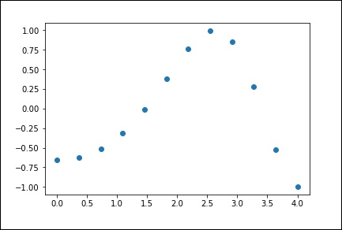

1-D Interpolation
-----------------

By using the above data, let us create a interpolate function and draw a
new interpolated graph.

```
f1 = interpolate.interp1d(x, y,kind = 'linear')

f2 = interpolate.interp1d(x, y, kind = 'cubic')
```

Now, let us create a new input of more length to see the clear
difference of interpolation. We will use the same function of the old
data on the new data.

```
xnew = np.linspace(0, 4,30)

plt.plot(x, y, 'o', xnew, f1(xnew), '-', xnew, f2(xnew), '--')

plt.legend(['data', 'linear', 'cubic','nearest'], loc = 'best')

plt.show()
```

The above program will generate the following output.

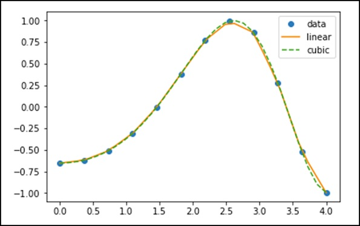


### Univariate Spline

Let us consider the following example.

```
import matplotlib.pyplot as plt
from scipy.interpolate import UnivariateSpline
x = np.linspace(-3, 3, 50)
y = np.exp(-x**2) + 0.1 * np.random.randn(50)
plt.plot(x, y, 'ro', ms = 5)
plt.show()
```

Use the default value for the smoothing parameter.

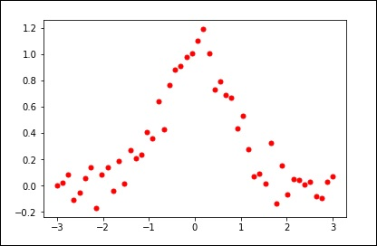

```
spl = UnivariateSpline(x, y)
xs = np.linspace(-3, 3, 1000)
plt.plot(xs, spl(xs), 'g', lw = 3)
plt.show()
```

Manually change the amount of smoothing.

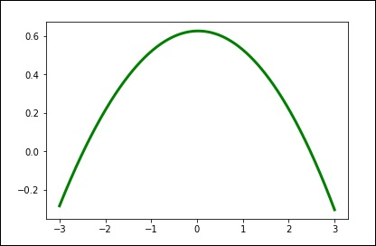

```
spl.set_smoothing_factor(0.5)
plt.plot(xs, spl(xs), 'b', lw = 3)
plt.show()
```

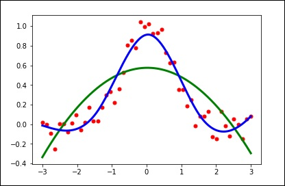

SciPy - Linalg
==============

Let us consider the following example.

```
#importing the scipy and numpy packages
from scipy import linalg
import numpy as np

#Declaring the numpy arrays
a = np.array([[3, 2, 0], [1, -1, 0], [0, 5, 1]])
b = np.array([2, 4, -1])

#Passing the values to the solve function
x = linalg.solve(a, b)

#printing the result array
print(x)
```

The above program will generate the following output.

```
array([ 2., -2., 9.])
```

Finding a Determinant
---------------------

Let us consider the following example.

```
#importing the scipy and numpy packages
from scipy import linalg
import numpy as np

#Declaring the numpy array
A = np.array([[1,2],[3,4]])

#Passing the values to the det function
x = linalg.det(A)

#printing the result
print(x)
```

The above program will generate the following output.

```
-2.0
```

Eigenvalues and Eigenvectors
----------------------------

Let us consider the following example.

```
#importing the scipy and numpy packages
from scipy import linalg
import numpy as np

#Declaring the numpy array
A = np.array([[1,2],[3,4]])

#Passing the values to the eig function
l, v = linalg.eig(A)

#printing the result for eigen values
print(l)

#printing the result for eigen vectors
print(v)
```

The above program will generate the following output.

```
array([-0.37228132+0.j, 5.37228132+0.j]) #--Eigen Values
array([[-0.82456484, -0.41597356], #--Eigen Vectors
       [ 0.56576746, -0.90937671]])
```

Singular Value Decomposition
----------------------------

Let us consider the following example.

```
#importing the scipy and numpy packages
from scipy import linalg
import numpy as np

#Declaring the numpy array
a = np.random.randn(3, 2) + 1.j*np.random.randn(3, 2)

#Passing the values to the eig function
U, s, Vh = linalg.svd(a)

# printing the result
print (U, Vh, s)
```

The above program will generate the following output.

```
(
   array([
      [ 0.54828424-0.23329795j, -0.38465728+0.01566714j,
      -0.18764355+0.67936712j],
      [-0.27123194-0.5327436j , -0.57080163-0.00266155j,
      -0.39868941-0.39729416j],
      [ 0.34443818+0.4110186j , -0.47972716+0.54390586j,
      0.25028608-0.35186815j]
   ]),

   array([ 3.25745379, 1.16150607]),

   array([
      [-0.35312444+0.j , 0.32400401+0.87768134j],
      [-0.93557636+0.j , -0.12229224-0.33127251j]
   ])
)
```

SciPy - Ndimage
===============


Opening Image Files
----------------------------------

The **misc package** in SciPy comes with some images. We use those
images to learn the image manipulations. Let us consider the following
example.

```
import numpy as np
from scipy import misc
f = misc.face()

import matplotlib.pyplot as plt
plt.imshow(f)
plt.show()
```

The above program will generate the following output.

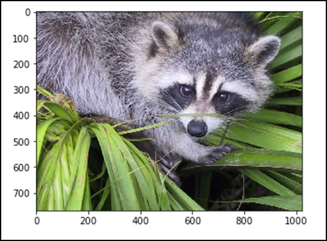


Let us see the statistical information of the above image.

```
from scipy import misc
face = misc.face(gray = False)
print (face.mean(), face.max(), face.min())
```

The above program will generate the following output.

```
110.16274388631184, 255, 0
```


We can also perform some basic operations such as turning the image
upside down as described below.

```
# up <-> down flip
from scipy import misc
face = misc.face()
flip_ud_face = np.flipud(face)

import matplotlib.pyplot as plt
plt.imshow(flip_ud_face)
plt.show()
```

The above program will generate the following output.

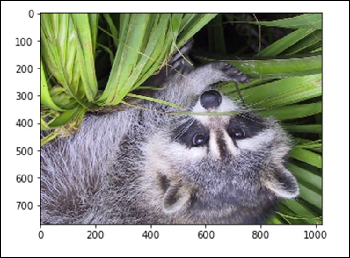

Besides this, we have the **rotate() function**, which rotates the image
with a specified angle.

```
# rotation
from scipy import misc,ndimage
face = misc.face()
rotate_face = ndimage.rotate(face, 45)

import matplotlib.pyplot as plt
plt.imshow(rotate_face)
plt.show()
```

The above program will generate the following output.

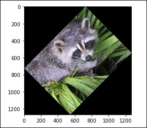


### Blurring

Blurring is widely used to reduce the noise in the image. We can perform
a filter operation and see the change in the image. Let us consider the
following example.

```
from scipy import misc
face = misc.face()
blurred_face = ndimage.gaussian_filter(face, sigma=3)
import matplotlib.pyplot as plt
plt.imshow(blurred_face)
plt.show()
```

The above program will generate the following output.

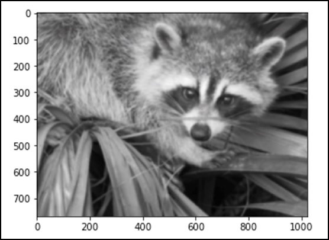

The sigma value indicates the level of blur on a scale of five. We can
see the change on the image quality by tuning the sigma value. For more
details of blurring, click on → DIP (Digital Image Processing) Tutorial.

Edge Detection
--------------

Let us consider the following example.

```
import scipy.ndimage as nd
import numpy as np

im = np.zeros((256, 256))
im[64:-64, 64:-64] = 1
im[90:-90,90:-90] = 2
im = ndimage.gaussian_filter(im, 8)

import matplotlib.pyplot as plt
plt.imshow(im)
plt.show()
```

The above program will generate the following output.

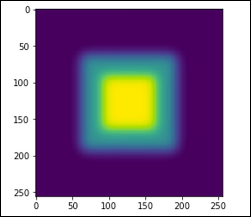

Let us consider the following example.

```
import scipy.ndimage as nd
import matplotlib.pyplot as plt

im = np.zeros((256, 256))
im[64:-64, 64:-64] = 1
im[90:-90,90:-90] = 2
im = ndimage.gaussian_filter(im, 8)

sx = ndimage.sobel(im, axis = 0, mode = 'constant')
sy = ndimage.sobel(im, axis = 1, mode = 'constant')
sob = np.hypot(sx, sy)

plt.imshow(sob)
plt.show()
```

The above program will generate the following output.

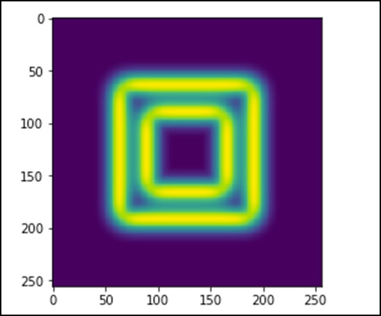


SciPy - Spatial
===============


Let us understand what Delaunay Triangulations are and how they are used
in SciPy.

We can the compute through SciPy. Let us consider the following example.

```
from scipy.spatial import Delaunay
import numpy as np

points = np.array([[0, 4], [2, 1.1], [1, 3], [1, 2]])
tri = Delaunay(points)
import matplotlib.pyplot as plt
plt.triplot(points[:,0], points[:,1], tri.simplices.copy())
plt.plot(points[:,0], points[:,1], 'o')
plt.show()
```

The above program will generate the following output.

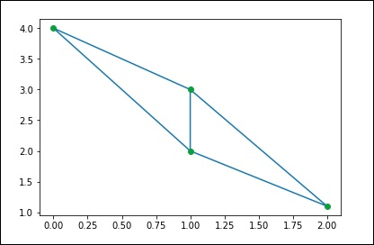

Coplanar Points
---------------

Let us see how we can find this using SciPy. Let us consider the
following example.

```
#### Coplanar Points
from scipy.spatial import Delaunay
points = np.array([[0, 0], [0, 1], [1, 0], [1, 1], [1, 1]])
tri = Delaunay(points)
print(tri.coplanar)
```

The above program will generate the following output.

```
array([[4, 0, 3]], dtype = int32)
```

This means that point 4 resides near triangle 0 and vertex 3, but is not
included in the triangulation.

Convex hulls
------------

Let us consider the following example to understand it in detail.

```
from scipy.spatial import ConvexHull
points = np.random.rand(10, 2) # 30 random points in 2-D
hull = ConvexHull(points)
import matplotlib.pyplot as plt
plt.plot(points[:,0], points[:,1], 'o')

for simplex in hull.simplices:
    plt.plot(points[simplex,0], points[simplex,1], 'k-')
plt.show()
```

The above program will generate the following output.

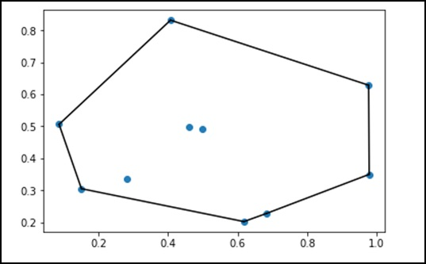


SciPy - Special Package
=======================

The functions available in the special package are universal functions,
which follow broadcasting and automatic array looping.

Let us look at some of the most frequently used special functions −

-   Cubic Root Function
-   Exponential Function
-   Relative Error Exponential Function
-   Log Sum Exponential Function
-   Permutations and Combinations Function

Let us now understand each of these functions in brief.

### Cubic Root Function

The syntax of this cubic root function is -- scipy.special.cbrt(x). This
will fetch the element-wise cube root of **x**.

Let us consider the following example.

```
from scipy.special import cbrt
res = cbrt([10, 9, 0.1254, 234])
print res
```

The above program will generate the following output.

```
[ 2.15443469 2.08008382 0.50053277 6.16224015]
```

### Exponential Function

The syntax of the exponential function is -- scipy.special.exp10(x). Let us consider the following example.

```
from scipy.special import exp10
res = exp10([2, 9])
print res
```

The above program will generate the following output.

```
[1.00000000e+02  1.00000000e+09]
```

### Log Sum Exponential Function

The syntax for this function is -- scipy.special.logsumexp(x). It helps
to compute the log of the sum of exponentials of input elements.

Let us consider the following example.

```
from scipy.special import logsumexp
import numpy as np
a = np.arange(10)
res = logsumexp(a)
print res
```

The above program will generate the following output.

```
9.45862974443
```

### Permutations & Combinations

Let us discuss permutations and combinations separately for
understanding them clearly.

**Combinations** − The syntax for combinations function is --
scipy.special.comb(N,k). Let us consider the following example −

```
from scipy.special import comb
res = comb(10, 3, exact = False,repetition=True)
print res
```

The above program will generate the following output.

```
220.0
```

**Permutations** − The syntax for combinations function is --
scipy.special.perm(N,k). Permutations of N things taken k at a time,
i.e., k-permutations of N. This is also known as "partial permutations".

Let us consider the following example.

```
from scipy.special import perm
res = perm(10, 3, exact = True)
print res
```

The above program will generate the following output.

```
720
```

