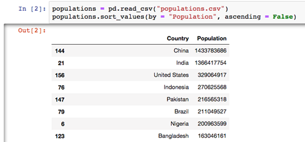

Introducing pandas
====================

### This lab covers:

- The introduction of the pandas library for data analysis
- The advantages and disadvantages of pandas relative to its competitors
- The differences between working in Excel vs. a programming language
- The basics of the DataFrame and the Series, the two primary objects in pandas
- A tour of the library's features through a working example

Introducing pandas
------------------------


What makes `pandas` special is the balance it strikes between processing
power and user productivity. By relying on lower-level languages for
many of its calculations, it can efficiently perform operations on data
sets with millions of rows in mere seconds. At the same time, it
maintains a simple, terse, and intuitive set of commands. It is easy to
accomplish a lot with a little code in `pandas`. The library works
seamlessly with numbers, text, dates and times, missing data, disparate
data, and more. We\'ll explore its incredible versatility as we proceed
through the datasets packaged with this course.


##### Sample pandas DataFrame, a 2-dimensional table of data

{width="504" height="235"}


Importing a Dataset
-------------------------

Our dataset is contained in a `movies.csv` file. The **CSV**
(comma-separated values) file format is a plain text file that separates
each row of data with a line break and each row value with a comma. The
first row in the file holds the column headers for the data. For
example, the first three rows in `movies.csv` are:


```
Rank,Title,Studio,Gross,Year
1,Avengers: Endgame,Buena Vista,"$2,796.30",2019
2,Avatar,Fox,"$2,789.70",2009
```


The first movie has a **Rank** of 1, a **Title** of
`"Avengers: Endgame"`, a **Studio** of Buena Vista, a **Gross** **of**
`"2,796.30"` and a **Year** of 2019. The same pattern repeats for the
other 750+ rows.


Let\'s begin by creating a new Jupyter Notebook inside the same
directory as the `movies.csv` file. Our first step is to import the
`pandas` library to get access to its features. We\'ll assign it to the
popular community alias `pd`.


```
In  [1] import pandas as pd
```


The square box to the left of the code (displaying the number 1 in the
previous example) marks the cell execution order relative to the launch
or restart of the Jupyter Notebook. Cells can be executed in any order
and any cell can be executed multiple times.


As you read through this course, you are encouraged to experiment by
executing different snippets of code in your Jupyter cells. It is OK if
your input / output numbers do not match up with those in the text.


`Pandas` can import a variety of file types include `xlsx` (Excel),
`sql` (SQL), and `hdf` (Hierarchical Data Format). Each file type has
its associated import method available at the top-level of the library.
Think of a **method** as a command that we can issue, either to the
library or an entity within it. For now, we\'ll use the `read_csv`
method here to tell `Pandas` to open up the `movies.csv` file.


```
In  [2] pd.read_csv("movies.csv")
 
Out [2]
 
     Rank                         Title            Studio      Gross   Year
  0     1             Avengers: Endgame       Buena Vista  $2,796.30   2019
  1     2                        Avatar               Fox  $2,789.70   2009
  2     3                       Titanic         Paramount  $2,187.50   1997
  3     4  Star Wars: The Force Awakens       Buena Vista  $2,068.20   2015
  4     5        Avengers: Infinity War       Buena Vista  $2,048.40   2018
…       …                             …                 …          …      …
777   778                     Yogi Bear   Warner Brothers    $201.60   2010
778   779           Garfield: The Movie               Fox    $200.80   2004
779   780                   Cats & Dogs   Warner Brothers    $200.70   2001
780   781      The Hunt for Red October         Paramount    $200.50   1990
781   782                      Valkyrie               MGM    $200.30   2008
 
782 rows × 5 columns
```


`Pandas` imports the CSV file\'s contents into an object called a
`DataFrame`, a two-dimensional grid. To avoid cluttering up the screen,
`pandas` truncates the `DataFrame` to show only the first 5 and the last
5 rows of data, with a row of ellipses in between. Excel users should
feel at home here; a `DataFrame` is comparable to a multi-column table
in the spreadsheet software.


This movies `DataFrame` consists of five columns and an index. The
**index** is the sequence of labels that appears on the leftmost side of
the `DataFrame`. Index labels serve as identifiers for rows of data.
When the user does not explicitly state which column from a dataset
should serve as the index, `pandas` generates an ascending numeric index
starting at 0.


Let\'s swap the default numeric index with the values in the **Title**
column. We can do so during the import.


```
In  [3] pd.read_csv("movies.csv", index_col = "Title")
 
Out [3]
 
                              Rank            Studio       Gross   Year
Title__________________________________________________________________
           Avengers: Endgame     1       Buena Vista   $2,796.30   2019
                      Avatar     2               Fox   $2,789.70   2009
                     Titanic     3         Paramount   $2,187.50   1997
Star Wars: The Force Awakens     4       Buena Vista   $2,068.20   2015
      Avengers: Infinity War     5       Buena Vista   $2,048.40   2018
…                                …                 …           …      …
                   Yogi Bear   778   Warner Brothers     $201.60   2010
         Garfield: The Movie   779               Fox     $200.80   2004
                 Cats & Dogs   780   Warner Brothers     $200.70   2001
    The Hunt for Red October   781         Paramount     $200.50   1990
                    Valkyrie   782               MGM     $200.30   2008
```


Let\'s assign the `DataFrame` to a variable so that we can use the
object after import. A **variable** is just a user-assigned name for an
object.


```
In  [4] movies = pd.read_csv("movies.csv", index_col = "Title")
```


Manipulating a DataFrame
------------------------------


There are a variety of perspectives from which we can look at the
dataset. We can ask `pandas` for a few rows from the start of the
`DataFrame`...


```
In  [5] movies.head(4)
 
Out [5]
 
                              Rank        Studio      Gross   Year
Title_____________________________________________________________
Avengers: Endgame                1   Buena Vista  $2,796.30   2019
Avatar                           2           Fox  $2,789.70   2009
Titanic                          3     Paramount  $2,187.50   1997
Star Wars: The Force Awakens     4   Buena Vista  $2,068.20   2015
 
…or view a slice of the end.
 
In  [6] movies.tail(6)
 
Out [6]
 
                          Rank           Studio     Gross   Year
Title___________________________________________________________
21 Jump Street             777             Sony   $201.60   2012
Yogi Bear                  778  Warner Brothers   $201.60   2010
Garfield: The Movie        779              Fox   $200.80   2004
Cats & Dogs                780  Warner Brothers   $200.70   2001
The Hunt for Red October   781        Paramount   $200.50   1990
Valkyrie                   782              MGM   $200.30   2008
```


We can find out how many rows are in the `DataFrame`.


```
In  [7] len(movies)
   
Out [7] 782
```


We can ask for the shape of the `DataFrame` (the number of rows and
columns) as well as the total number of cell values contained within it.


```
In  [8] movies.shape
   
Out [8] (782, 4)
 
In  [9] movies.size
   
Out [9] 3128
```


We can ask about the data types stored in each column. The `int64`
values below mark columns of integers while the `object` values mark
columns of text.


```
In  [10] movies.dtypes
 
Out [10]
 
Rank       int64
Studio    object
Gross     object
Year       int64
dtype: object
```


We can extract a row from the dataset by its numeric order in line,
which is also called its **index position**. In most programming
languages, the index starts counting at 0 instead of 1. So if we wanted
to pull out the 500^th^ movie in the list, we would target index
position 499.


```
In  [11] movies.iloc[499]
 
Out [11] Rank           500
         Studio         Fox
         Gross      $288.30
         Year          2018
         Name: Maze Runner: The Death Cure, dtype: object
```


`Pandas` returns a new object here called a `Series`. A `Series` stores
a single column of values. Like a `DataFrame`, a `Series` contains an
index. Notice that the index labels for the `Series` (**Rank**,
**Studio**, **Gross**, and **Year**) are the column names from the
original `movies` `DataFrame`. The *values* for each of the four index
labels are pulled from the corresponding row of data in `movies`.


An index label can be used to access a `DataFrame` row. Let's find out
the information for the classic 1994 tearjerker Forrest Gump.


```
In  [12] movies.loc["Forrest Gump"]
 
Out [12] Rank            119
         Studio    Paramount
         Gross       $677.90
         Year           1994
         Name: Forrest Gump, dtype: object
```


Index labels in a `DataFrame` *can* contain duplicates. There are two
entries for `101 Dalmatians` on the list, the 1961 original and the 1996
remake.


```
In  [13] movies.loc["101 Dalmatians"]
 
Out [13]
                Rank        Studio     Gross   Year
Title______________________________________________                                           
101 Dalmatians   425   Buena Vista   $320.70   1996
101 Dalmatians   708   Buena Vista   $215.90   1961
```


As it currently stands, the dataset is sorted by the values in the
**Rank** column. What if we wanted to see the five entries on the list
with the most recent release date? We can sort a `DataFrame` by a single
column, such as **Year**.


```
In  [14] movies.sort_values(by = "Year", ascending = False).head()
 
Out [14]
 
                                 Rank       Studio       Gross  Year
Title_______________________________________________________________
Avengers: Endgame                   1  Buena Vista   $2,796.30  2019
John Wick: Chapter 3 - Parab…     458  Lionsgate       $304.70  2019
The Wandering Earth               114  China Film …    $699.80  2019
Toy Story 4                       198  Buena Vista     $519.80  2019
How to Train Your Dragon: The …   199  Universal       $519.80  2019
```


We can also sort by values across multiple columns. Let's sort `movies`
first by the values in the **Studio** column, then by the values in the
**Year** **column**.


```
In  [15] movies.sort_values(by = ["Studio", "Year"]).head()
 
Out [15]
 
                         Rank       Studio    Gross  Year
Title____________________________________________________
The Blair Witch Project   588      Artisan  $248.60  1999
101 Dalmatians            708  Buena Vista  $215.90  1961
The Jungle Book           755  Buena Vista  $205.80  1967
Who Framed Roger Rabbit   410  Buena Vista  $329.80  1988
Dead Poets Society        636  Buena Vista  $235.90  1989
```


The index can also be sorted. That's helpful if we want the movies in
alphabetical order.


```
In  [16] movies.sort_index().head()
 
Out [16]
 
                  Rank           Studio    Gross  Year
Title_________________________________________________
10,000 B.C.        536  Warner Brothers  $269.80  2008
101 Dalmatians     708      Buena Vista  $215.90  1961
101 Dalmatians     425      Buena Vista  $320.70  1996
2 Fast 2 Furious   632        Universal  $236.40  2003
2012                93             Sony  $769.70  2009
```


Each of these methods returns a *new* `DataFrame` object. The shape of
the original `DataFrame` is not modified. The non-mutational nature of
these methods encourages active experimentation; we can confirm an
operation is correct before we make it permanent. We\'ll explore ways to
permanently modify a `DataFrame` later in the course.


Counting Values in a Series
---------------------------------


We can extract a single column of data from a `DataFrame` as a `Series`.
Once again, the data is truncated to show a limited number of rows.
Notice that the index of the original `DataFrame`, the movie titles, has
been preserved in the `Series`.


```
In  [17] movies["Studio"]
 
Out [17] Title
         Avengers: Endgame                   Buena Vista
         Avatar                                      Fox
         Titanic                               Paramount
         Star Wars: The Force Awakens        Buena Vista
         Avengers: Infinity War              Buena Vista
                                              ...      
         Yogi Bear                       Warner Brothers
         Garfield: The Movie                         Fox
         Cats & Dogs                     Warner Brothers
         The Hunt for Red October              Paramount
         Valkyrie                                    MGM
         Name: Studio, Length: 782, dtype: object
```


Now, we can count the number of occurrences of each value in the
`Studio` column. Let\'s limit our results to the top 10 studios.


```
In  [18] movies["Studio"].value_counts().head(10)
 
Out [18] Warner Brothers    132
         Buena Vista        125
         Fox                117
         Universal          109
         Sony                86
         Paramount           76
         Dreamworks          27
         Lionsgate           21
         New Line            16
         TriStar             11
         Name: Studio, dtype: int64
```


The return value from `value_counts` is yet *another* `Series` object!
Now, `pandas` uses the studios from the **Studio** column as the index
labels and their counts as the `Series` values.


Filtering a Column by One or More Criteria
------------------------------------------------


A common operation in data analysis is extracting a subset of rows from
an original dataset based on one or more criteria. Microsoft Excel
offers the **Filter** tool for this exact purpose.


Let's say we wanted to limit our `movies` dataset to only the films
released by the studio **Universal**. We can accomplish this in `pandas`
with one line of code.


```
In  [19] movies[movies["Studio"] == "Universal"]
 
Out [19]
 
                                Rank     Studio      Gross  Year
Title___________________________________________________________
Jurassic World                     6  Universal  $1,671.70  2015
Furious 7                          8  Universal  $1,516.00  2015
Jurassic World: Fallen Kingdom    13  Universal  $1,309.50  2018
The Fate of the Furious           17  Universal  $1,236.00  2017
Minions                           19  Universal  $1,159.40  2015
                             …     …          …          …     …
The Break-Up                     763  Universal    $205.00  2006
Everest                          766  Universal    $203.40  2015
Patch Adams                      772  Universal    $202.30  1998
Kindergarten Cop                 775  Universal    $202.00  1990
Straight Outta Compton           776  Universal    $201.60  2015
 
109 rows × 4 columns
```


We can also assign the condition to a variable to provide context to
other readers.


```
In  [20] released_by_universal = movies["Studio"] == "Universal"
         movies[released_by_universal]
```


Rows can also be selected based on multiple criteria. For example, let's
look at all the movies that were released by Universal Pictures **and**
released in the year 2015.


```
In  [21] released_by_universal = movies["Studio"] == "Universal"
         released_in_2015 = movies["Year"] == 2015
         movies[released_by_universal & released_in_2015]
 
Out [21]
 
                        Rank     Studio      Gross  Year
Title___________________________________________________
Jurassic World             6  Universal  $1,671.70  2015
Furious 7                  8  Universal  $1,516.00  2015
Minions                   19  Universal  $1,159.40  2015
Fifty Shades of Grey     165  Universal    $571.00  2015
Pitch Perfect 2          504  Universal    $287.50  2015
Ted 2                    702  Universal    $216.70  2015
Everest                  766  Universal    $203.40  2015
Straight Outta Compton   776  Universal    $201.60  2015
```


The previous example lists all movies that satisfied both conditions. We
can also filter for movies that fit *either* condition: released by
Universal *or* released in the year 2015.


```
In  [22] released_by_universal = movies["Studio"] == "Universal"
         released_in_2015 = movies["Year"] == 2015
         movies[released_by_universal | released_in_2015]
 
Out [22]
 
                                Rank       Studio      Gross  Year
Title_____________________________________________________________
Star Wars: The Force Awakens       4  Buena Vista  $2,068.20  2015
Jurassic World                     6    Universal  $1,671.70  2015
Furious 7                          8    Universal  $1,516.00  2015
Avengers: Age of Ultron            9  Buena Vista  $1,405.40  2015
Jurassic World: Fallen Kingdom    13    Universal  $1,309.50  2018
                             …     …            …          …     …
The Break-Up                     763    Universal    $205.00  2006
Everest                          766    Universal    $203.40  2015
Patch Adams                      772    Universal    $202.30  1998
Kindergarten Cop                 775    Universal    $202.00  1990
Straight Outta Compton           776    Universal    $201.60  2015
 
140 rows × 4 columns
```


As expected, this `DataFrame` is longer because more films have a chance
of satisfying one of the two conditions instead of both.


`Pandas` offers many other ways to filter a `DataFrame`. We can use
mathematical comparisons to see if the numeric values in a column are
less than or greater than a specific value. For example, we can explore
all motion pictures on the list released before 1975.


```
In  [23] before_1975 = movies["Year"] < 1975
         movies[before_1975]
 
Out [23]
 
                    Rank           Studio     Gross  Year
Title____________________________________________________
The Exorcist         252  Warner Brothers  $441.30   1973
Gone with the Wind   288              MGM  $402.40   1939
Bambi                540              RKO  $267.40   1942
The Godfather        604        Paramount  $245.10   1972
101 Dalmatians       708      Buena Vista  $215.90   1961
The Jungle Book      755      Buena Vista  $205.80   1967
```


We can specify a range of values to target. The next example pulls out
all films with a **Year** value between 1983 and 1986.


```
In  [24] time_range = movies["Year"].between(1983, 1986)
         movies[time_range]
 
Out [24]
 
                                      Rank     Studio     Gross  Year
Title________________________________________________________________
Return of the Jedi                     222        Fox  $475.10   1983
Back to the Future                     311  Universal  $381.10   1985
Top Gun                                357  Paramount  $356.80   1986
Indiana Jones and the Temple of Doom   403  Paramount  $333.10   1984
Crocodile Dundee                       413  Paramount  $328.20   1986
Beverly Hills Cop                      432  Paramount  $316.40   1984
Rocky IV                               467        MGM  $300.50   1985
Rambo: First Blood Part II             469    TriStar  $300.40   1985
Ghostbusters                           485   Columbia  $295.20   1984
Out of Africa                          662  Universal  $227.50   1985
```


The index of the `DataFrame` can also be filtered. `Pandas` ships with
many helper methods for working with strings. In the example below, we
transform the movie titles in the index to lowercase characters and then
find all movies with the word **dark** in the title.


```
In  [25] has_dark_in_title = movies.index.str.lower().str.contains("dark")
         movies[has_dark_in_title]
 
Out [25]
 
                                Rank           Studio       Gross  Year
Title__________________________________________________________________
Transformers: Dark of the Moon    23        Paramount  $1,123.80   2011
The Dark Knight Rises             27  Warner Brothers  $1,084.90   2012
The Dark Knight                   39  Warner Brothers  $1,004.90   2008
Thor: The Dark World             132      Buena Vista    $644.60   2013
Star Trek Into Darkness          232        Paramount    $467.40   2013
Fifty Shades Darker              309        Universal    $381.50   2017
Dark Shadows                     600  Warner Brothers    $245.50   2012
Dark Phoenix                     603              Fox    $245.10   2019
```


Grouping Data
-------------------


Our next challenge is the most complex one yet. Let\'s find out the
aggregate total of movie grosses *per* studio.


Our first problem is that the **Gross** column values are stored as text
rather than as numbers. `Pandas` imported the column values as strings
to preserve the dollar sign and comma symbols in the original CSV. The
column can be converted to a proper numeric data type if we can remove
both of those characters. One solution is to replace all occurrences of
`"$"` and `","` with an empty space (i.e., no text). This operation is
accomplished with **Find and Replace** in Excel.


```
In  [26] movies["Gross"].str.replace("$", "").str.replace(",", "")
 
Out [26] Title
         Avengers: Endgame               2796.30
         Avatar                          2789.70
         Titanic                         2187.50
         Star Wars: The Force Awakens    2068.20
         Avengers: Infinity War          2048.40
                                           ...  
         Yogi Bear                        201.60
         Garfield: The Movie              200.80
         Cats & Dogs                      200.70
         The Hunt for Red October         200.50
         Valkyrie                         200.30
         Name: Gross, Length: 782, dtype: object
```


Next, we convert the column values from strings to floating-point
numbers.


```
In  [27] movies["Gross"].str.replace("$", "")
                        .str.replace(",", "")
                        .astype(float)
 
Out [27] Title
         Avengers: Endgame               2796.3
         Avatar                          2789.7
         Titanic                         2187.5
         Star Wars: The Force Awakens    2068.2
         Avengers: Infinity War          2048.4
                                          ... 
         Yogi Bear                        201.6
         Garfield: The Movie              200.8
         Cats & Dogs                      200.7
         The Hunt for Red October         200.5
         Valkyrie                         200.3
         Name: Gross, Length: 782, dtype: float64
```


All of these operations are temporary and do not mutate the original
**Gross** `Series`. Each time, `pandas` creates a copy of the original
data, performs the operation, and returns the resulting object. We have
to explicitly overwrite the **Gross** column in the `movies` `DataFrame`
with the *new* `Series` object to make these changes permanent.


```
In  [28] movies["Gross"] = movies["Gross"].str.replace("$", "")
                                          .str.replace(",", "")
                                          .astype(float)
```


Data type conversions open the door to new methods on columns of numeric
values. For example, we can find out the mean (i.e., the average) box
office gross of a movie on the list \-- it\'s over 439 million dollars!


```
In  [29] movies["Gross"].mean()
 
Out [29] 439.0308184143222
```


Let\'s come back to our original problem: calculating the aggregate
total of box office grosses per film studio. We need to identify all of
the unique studios and isolate the specific movies (or rows) that belong
to each. This process is called **grouping**. In the next example, we
ask `Pandas` to group the values in the **Studio** column.


```
In  [30] studios = movies.groupby("Studio")
```


We can now add the totals of the **Gross** column per studio. `Pandas`
will identify the subset of movies that belong to each studio, pull out
their respective **Gross** values, and add them together. This method
return yet another `Series` object, sorted alphabetically by the index
of studio names.


```
In  [31] studios["Gross"].sum().head()
 
Out [31] Studio
         Artisan                     248.6
         Buena Vista               73585.0
         CL                          228.1
         China Film Corporation      699.8
         Columbia                   1276.6
         Name: Gross, dtype: float64
```


We can sort by the movie grosses instead. Below, the results are
organized by descending gross amount.


```
In  [32] studios["Gross"].sum().sort_values(ascending = False).head()
 
Out [32] Studio
         Buena Vista        73585.0
         Warner Brothers    58643.8
         Fox                50420.8
         Universal          44302.3
         Sony               32822.5
         Name: Gross, dtype: float64
```


With just a few lines of code, we can already derive insights from this
complex dataset. For example, Warner Brothers has more movies on the
list than Buena Vista, but Buena Vista has a higher cumulative gross.
This fact indicates that the average gross of Buena Vista\'s pictures is
higher than the average gross of Warner Brother\'s movies.


Summary
-------------


- `Pandas` is a data analysis library built on top of the
    Python programming language.
- `Pandas` excels at performing complex operations on large data sets
    with a terse syntax.
- `Competitors` to `Pandas` include the statistical programming
    language R and the proprietary software suite SAS.
- `Pandas` can import a variety of different file formats including
    CSV, XLSX, SQL, and more.
- Any row in a dataset can be accessed by its row number or a label
    identifier.
- Datasets can be sorted by the values in one or more columns.
- One or more conditions can be used to extract a subset of data from
    a larger dataset.
- `Pandas` can aggregate data by grouping together identical values
    across a column.

