Lab 18 : Visualization Using Matplotlib
-------------------------------------


We'll be covering the following topics in this lab:

- Using the matplotlib package to plot graphs
- Understanding covariance and correlation to determine the relationship between data


#### Pre-reqs:
- Google Chrome (Recommended)

#### Lab Environment
Notebooks are ready to run. All packages have been installed. There is no requirement for any setup.

You can access jupyter lab at `http://<host-ip>/lab/workspaces/lab18_Matplotlib`


#### Open Notebook
The Notebook opens in a new browser window. You can create a new notebook or open a local one. Check out the local folder `work` for notebooks. Open and run `MatPlotLib.ipynb` in the `work` folder.


```
%matplotlib inline 
 
from scipy.stats import norm 
import matplotlib.pyplot as plt 
import numpy as np 

x = np.arange(-3, 3, 0.001) 
 
plt.plot(x, norm.pdf(x)) 
plt.show() 
```

So in this example, I import matplotlib.pyplot as plt, and with this, we can refer to it as plt from now on in this notebook. Then, I use np.arange(-3, 3, 0.001) to create an x-axis filled with values between -3 and 3 at increments of 0.001, and use pyplot's plot() function to plot x. The y function will be norm.pdf(x). So We are going to create a probability density function with a normal distribution based on the x values, and use the scipy.stats norm package to do that.

So tying it back into last lab's look at probability density functions, here we are plotting a normal probability density function using matplotlib. So we just call pyplot's plot() method to set up our plot, and then we display it using plt.show(). When we run the previous code, we get the following output:

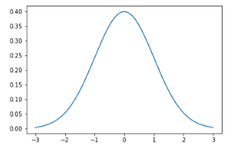

That's what we get: a pretty little graph with all the default formatting.

### Generating multiple plots on one graph

Let's say I want to plot more than one thing at a time. You can actually call plot multiple times before calling show to actually add more than one function to your graph. Let's look at the following code:

```
plt.plot(x, norm.pdf(x)) 
plt.plot(x, norm.pdf(x, 1.0, 0.5)) 
plt.show() 
```

In this example, I'm calling my original function of just a normal distribution, but I'm going to render another normal distribution here as well, with a mean around 1.0 and a standard deviation of 0.5. Then, I'm going to show those two together so you can see how they compare to each other.

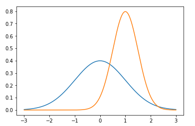

You can see that by default, matplotlib chooses different colors for each graph automatically for you, which is very nice and handy of it.

### Saving graphs as images

If I want to save this graph to a file, maybe I want to include it in a document or something, I can do something like the following code:

```
plt.plot(x, norm.pdf(x)) 
plt.plot(x, norm.pdf(x, 1.0, 0.5)) 
plt.savefig('\MyPlot.png', format='png')
```

Instead of just calling plt.show(), I can call plt.savefig() with a path to where I want to save this file and what format I want it in.


That's pretty cool. One other quick thing to note is that depending on your setup, you may have permissions issues when you come to save the file. You'll just need to find the folder that works for you. On Windows, your Users\Name folder is usually a safe bet. Alright, let's move on.

### Adjusting the axes

Let's say that I don't like the default choices of the axes of this value in the previous graph. It's automatically fitting it to the tightest set of the axis values that you can find, which is usually a good thing to do, but sometimes you want things on an absolute scale. Look at the following code:

```
axes = plt.axes() 
axes.set_xlim([-5, 5]) 
axes.set_ylim([0, 1.0]) 
axes.set_xticks([-5, -4, -3, -2, -1, 0, 1, 2, 3, 4, 5]) 
axes.set_yticks([0, 0.1, 0.2, 0.3, 0.4, 0.5, 0.6, 0.7, 0.8, 0.9, 1.0]) 
plt.plot(x, norm.pdf(x)) 
plt.plot(x, norm.pdf(x, 1.0, 0.5)) 
plt.show() 
```

In this example, first I get the axes using plt.axes. Once I have these axes objects, I can adjust them. By calling set_xlim, I can set the x range from -5 to 5 and with set set_ylim, I set the y range from 0 to 1. You can see in the below output, that my x values are ranging from -5 to 5, and y goes from 0 to 1. I can also have explicit control over where the tick marks on the axes are. So in the previous code, I'm saying I want the x ticks to be at -5, -4, - 3, etc., and y ticks from 0 to 1 at 0.1 increments using the set_xticks() and set_yticks() functions. Now I could use the arange function to do that more compactly, but the point is you have explicit control over where exactly those tick marks happen, and you can also skip some. You can have them at whatever increments you want or whatever distribution you want. Beyond that, it's the same thing.

Once I've adjusted my axes, I just called plot() with the functions that I want to plot and called show() to display it. Sure enough, there you have the result.

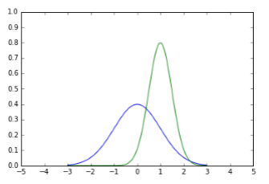

### Adding a grid


What if I want grid lines in my graphs? Well, same idea. All I do is call grid() on the axes that I get back from plt.axes().

```
axes = plt.axes() 
axes.set_xlim([-5, 5]) 
axes.set_ylim([0, 1.0]) 
axes.set_xticks([-5, -4, -3, -2, -1, 0, 1, 2, 3, 4, 5]) 
axes.set_yticks([0, 0.1, 0.2, 0.3, 0.4, 0.5, 0.6, 0.7, 0.8, 0.9, 1.0]) 
axes.grid() 
plt.plot(x, norm.pdf(x)) 
plt.plot(x, norm.pdf(x, 1.0, 0.5)) 
plt.show() 
```

By executing the above code, I get nice little grid lines. That makes it a little bit easier to see where a specific point is, although it clutters things up a little bit. It's a little bit of a stylistic choice there.

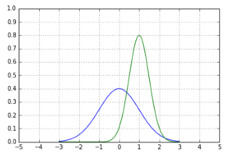

### Changing line types and colors

What if I want to play games with the line types and colors? You can do that too.

```
axes = plt.axes() 
axes.set_xlim([-5, 5]) 
axes.set_ylim([0, 1.0]) 
axes.set_xticks([-5, -4, -3, -2, -1, 0, 1, 2, 3, 4, 5]) 
axes.set_yticks([0, 0.1, 0.2, 0.3, 0.4, 0.5, 0.6, 0.7, 0.8, 0.9, 1.0]) 
axes.grid() 
plt.plot(x, norm.pdf(x), 'b-') 
plt.plot(x, norm.pdf(x, 1.0, 0.5), 'r:') 
plt.show() 
```

So you see in the preceding code, there's actually an extra parameter on the plot() functions at the end where I can pass a little string that describes the style of a line. In this first example, what b- indicates is I want a blue, solid line. The b stands for blue, and the dash means a solid line. For my second plot() function, I'm going to plot it in red, that's what the r means, and the colon means I'm going to plot it with a dotted line.

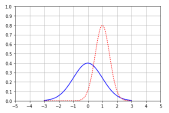

If I run that, you can see in the above graph what it does, and you can change different types of line styles.

In addition, you can do a double dash (--).

```
axes = plt.axes() 
axes.set_xlim([-5, 5]) 
axes.set_ylim([0, 1.0]) 
axes.set_xticks([-5, -4, -3, -2, -1, 0, 1, 2, 3, 4, 5]) 
axes.set_yticks([0, 0.1, 0.2, 0.3, 0.4, 0.5, 0.6, 0.7, 0.8, 0.9, 1.0]) 
axes.grid() 
plt.plot(x, norm.pdf(x), 'b-') 
plt.plot(x, norm.pdf(x, 1.0, 0.5), 'r--') 
plt.show() 
```

The preceding code gives you dashed red line as a line style as shown in the following graph image:

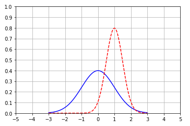


I can also do a dash dot combination (-.).

```
axes = plt.axes() 
axes.set_xlim([-5, 5]) 
axes.set_ylim([0, 1.0]) 
axes.set_xticks([-5, -4, -3, -2, -1, 0, 1, 2, 3, 4, 5]) 
axes.set_yticks([0, 0.1, 0.2, 0.3, 0.4, 0.5, 0.6, 0.7, 0.8, 0.9, 1.0]) 
axes.grid() 
plt.plot(x, norm.pdf(x), 'b-') 
plt.plot(x, norm.pdf(x, 1.0, 0.5), 'r-.') 
plt.show() 
```

You get an output that looks like the following graph image:

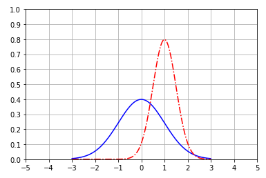

So, those are the different choices there. I could even make it green with vertical slashes (g:).

```
axes = plt.axes() 
axes.set_xlim([-5, 5]) 
axes.set_ylim([0, 1.0]) 
axes.set_xticks([-5, -4, -3, -2, -1, 0, 1, 2, 3, 4, 5]) 
axes.set_yticks([0, 0.1, 0.2, 0.3, 0.4, 0.5, 0.6, 0.7, 0.8, 0.9, 1.0]) 
axes.grid() 
plt.plot(x, norm.pdf(x), 'b-') 
plt.plot(x, norm.pdf(x, 1.0, 0.5), ' g:') 
plt.show() 
```

I'll get the following output:

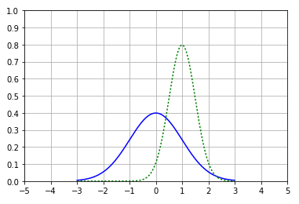

Have some fun with that if you want, experiment with different values, and you can get different line styles.

### Labeling axes and adding a legend

Something you'll do more often is labeling your axes. You never want to present data in a vacuum. You definitely want to tell people what it represents. To do that, you can use the xlabel() and ylabel() functions on plt to actually put labels on your axes. I'll label the x axis Greebles and the y axis Probability. You can also add a legend inset. Normally, this would be the same thing, but just to show that it's set independently, I'm also setting up a legend in the following code:

```
axes = plt.axes() 
axes.set_xlim([-5, 5]) 
axes.set_ylim([0, 1.0]) 
axes.set_xticks([-5, -4, -3, -2, -1, 0, 1, 2, 3, 4, 5]) 
axes.set_yticks([0, 0.1, 0.2, 0.3, 0.4, 0.5, 0.6, 0.7, 0.8, 0.9, 1.0]) 
axes.grid() 
plt.xlabel('Greebles') 
plt.ylabel('Probability') 
plt.plot(x, norm.pdf(x), 'b-') 
plt.plot(x, norm.pdf(x, 1.0, 0.5), 'r:') 
plt.legend(['Sneetches', 'Gacks'], loc=4) 
plt.show() 
```

Into the legend, you pass in basically a list of what you want to name each graph. So, my first graph is going to be called Sneetches, and my second graph is going to be called Gacks, and the loc parameter indicates what location you want it at, where 4 represents the lower right-hand corner. Let's go ahead and run the code, and you should see the following:

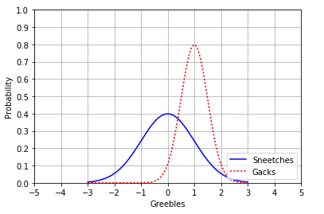

You can see that I'm plotting Greebles versus Probability for both Sneetches and Gacks. A little Dr. Seuss reference for you there. So that's how you set axes labels and legends.

### A fun example

A little fun example here. If you're familiar with the webcomic XKCD, there's a little bit of an Easter egg in Matplotlib, where you can actually plot things in XKCD style. The following code shows how you can do that.

```
plt.xkcd() 
 
fig = plt.figure() 
ax = fig.add_subplot(1, 1, 1) 
ax.spines['right'].set_color('none') 
ax.spines['top'].set_color('none') 
plt.xticks([]) 
plt.yticks([]) 
ax.set_ylim([-30, 10]) 
 
data = np.ones(100) 
data[70:] -= np.arange(30) 
 
plt.annotate( 
    'THE DAY I REALIZED\nI COULD COOK BACON\nWHENEVER I WANTED', 
    xy=(70, 1), arrowprops=dict(arrowstyle='->'), xytext=(15, -10)) 
 
plt.plot(data) 
 
plt.xlabel('time') 
plt.ylabel('my overall health') 
```

In this example, you call plt.xkcd(), which puts Matplotlib in XKCD mode. After you do that, things will just have a style with kind of a comic book font and squiggly lines automatically. This little simple example will show a funny little graph where we are plotting your health versus time, where your health takes a steep decline once you realize you can cook bacon whenever you want to. All we're doing there is using the xkcd() method to go into that mode. You can see the results below:

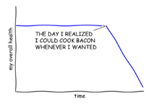


### Generating pie charts

Now, to go back to the real world, we can remove XKCD mode by calling rcdefaults() on Matplotlib, and we can get back to normal mode here.

If you want a pie chart, all you have to do is call plt.pie and give it an array of your values, colors, labels, and whether or not you want items exploded, and if so, by how much. Here's the code:

```
# Remove XKCD mode: 
plt.rcdefaults() 
 
values = [12, 55, 4, 32, 14] 
colors = ['r', 'g', 'b', 'c', 'm'] 
explode = [0, 0, 0.2, 0, 0] 
labels = ['India', 'United States', 'Russia', 'China', 'Europe'] 
plt.pie(values, colors= colors, labels=labels, explode = explode) 
plt.title('Student Locations') 
plt.show() 
```

You can see in this code that I'm creating a pie chart with the values 12, 55, 4, 32, and 14. I'm assigning explicit colors to each one of those values, and explicit labels to each one of those values. I'm exploding out the Russian segment of the pie by 20%, and giving this plot a title of Student Locations and showing it. The following is the output you should see:

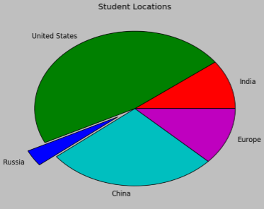

That's all there is to it.

### Generating bar charts

If I want to generate a bar chart, that is also very simple. It's a kind of a similar idea to the pie chart. Let's look at the following code.

```
values = [12, 55, 4, 32, 14] 
colors = ['r', 'g', 'b', 'c', 'm'] 
plt.bar(range(0,5), values, color= colors) 
plt.show() 
```

I've defined an array of values and an array of colors, and just plot the data. The above code plots from the range of 0 to 5, using the y values from the values array and using the explicit list of colors listed in the colors array. Go ahead and show that, and there you have your bar chart:

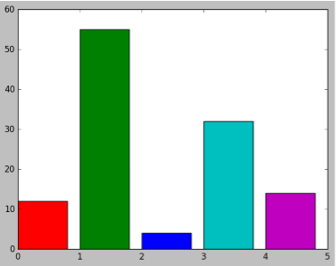

### Generating scatter plots


Let's say we have a random distribution in X and Y and I scatter those on the scatter plot, and I show it:

```
from pylab import randn 
 
X = randn(500) 
Y = randn(500) 
plt.scatter(X,Y) 
plt.show() 
```

You get the following scatter plot as output:

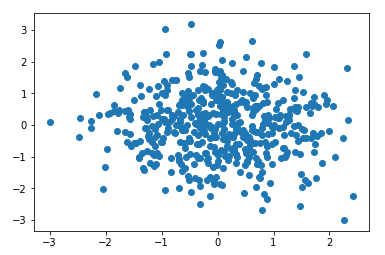


This is what it looks like, pretty cool. You can see the sort of a concentration in the center here, because of the normal distribution that's being used in both axes, but since it is random, there's no real correlation between those two.

### Generating histograms


Finally, we'll remind ourselves how a histogram works. We've already seen this plenty of times in the book. Let's look at the following code:

```
incomes = np.random.normal(27000, 15000, 10000) 
plt.hist(incomes, 50) 
plt.show() 
```

In this example, I call a normal distribution centered on 27,000, with a standard deviation of 15,000 with 10,000 data points. Then, I just call pyplot's histogram function, that is, hist(), and specify the input data and the number of buckets that we want to group things into in our histogram. Then I call show() and the rest is magic.

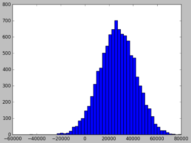

### Generating box-and-whisker plots


Now, just to give you an example here, we have created a fake dataset. The following example creates uniformly distributed random numbers between -40 and 60, plus a few outliers above 100 and below -100:

```
uniformSkewed = np.random.rand(100) * 100 - 40 
high_outliers = np.random.rand(10) * 50 + 100 
low_outliers = np.random.rand(10) * -50 - 100 
data = np.concatenate((uniformSkewed, high_outliers, low_outliers)) 
plt.boxplot(data) 
plt.show() 
```

In the code, we have a uniform random distribution of data (uniformSkewed). Then we added a few outliers on the high end (high_outliers) and a few negative outliers (low_outliers) as well. Then we concatenated these lists together and created a single dataset from these three different sets that we created using NumPy. We then took that combined dataset of uniform data and a few outliers and we plotted using plt.boxplot(), and that's how you get a box-and-whisker plot. Call show() to visualize it, and there you go.

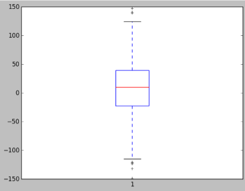

You can see that the graph is showing the box that represents the inner 50% of all data, and then we have these outlier lines where we can see little crosses (they may be circles in your version) for each individual outlier that lies in that range.


### Computing covariance and correlation in Python

Let's write some actual python code to implement covariance and correlation.


#### Computing correlation – The hard way

The Notebook opens in a new browser window. You can create a new notebook or open a local one. Check out the local folder `work` for several notebooks. Open and run `CovarianceCorrelation.ipynb` in the `work` folder.


**Note:** NumPy does have a method to just compute the covariance for you, and we'll talk about that later, but for now I want to show that you can actually do this from first principles:

```
%matplotlib inline 
 
import numpy as np 
from pylab import * 
 
def de_mean(x): 
    xmean = mean(x) 
    return [xi - xmean for xi in x] 
 
def covariance(x, y): 
    n = len(x) 
    return dot(de_mean(x), de_mean(y)) / (n-1) 
```

de_mean(), our deviation from the mean function is taking in a set of data, x, actually a list, and it's computing the mean of that set of data. The return line contains a little bit of Python trickery for you. The syntax is saying, I'm going to create a new list, and go through every element in x, call it xi, and then return the difference between xi and the mean, xmean, for that entire dataset. This function returns a new list of data that represents the deviations from the mean for each data point.

To expand this example, I'm going to fabricate some data that is going to try to find a relationship between page speeds, that, is how quickly a page renders on a website, and how much people spend. For example, at Amazon we were very concerned about the relationship between how quickly pages render and how much money people spend after that experience. We wanted to know if there is an actual relationship between how fast the website is and how much money people actually spend on the website. This is one way you might go about figuring that out. Let's just generate some normally distributed random data for both page speeds and purchase amounts, and since it's random, there's not going to be a real correlation between them.

```
pageSpeeds = np.random.normal(3.0, 1.0, 1000) 
purchaseAmount = np.random.normal(50.0, 10.0, 1000) 
 
scatter(pageSpeeds, purchaseAmount) 
 
covariance (pageSpeeds, purchaseAmount) 
```

So just as a sanity check here we'll start off by scatter plotting this stuff:

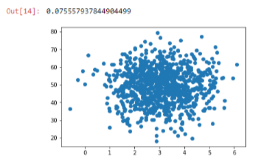

You'll see that it tends to cluster around the middle because of the normal distribution on each attribute, but there's no real relationship between the two. For any given page speed is a wide variety of amount spent, and for any given amount spent there's a wide variety of page speeds, so no real correlation there except for ones that are coming out the randomness or through the nature of the normal distribution. Sure enough, if we compute the covariance in these two sets of attributes, we end up with a very small value, -0.07. So that's a very small covariance value, close to zero. That implies there's no real relationship between these two things.


Now let's make life a little bit more interesting. Let's actually make the purchase amount a real function of page speed.

```
purchaseAmount = np.random.normal(50.0, 10.0, 1000) / pageSpeeds 
 
scatter(pageSpeeds, purchaseAmount) 
 
covariance (pageSpeeds, purchaseAmount) 
```

Here, we are keeping things a little bit random, but we are creating a real relationship between these two sets of values. For a given user, there's a real relationship between the page speeds they encounter and the amount that they spend. If we plot that out, we can see the following output:

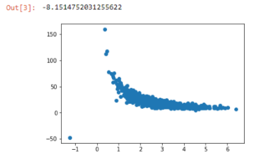

You can see that there's actually this little curve where things tend to be tightly aligned. Things get a little bit wonky near the bottom, just because of how random things work out. If we compute the covariance, we end up with a much larger value, -8, and it's the magnitude of that number that matters. The sign, positive or negative, just implies a positive or negative correlation, but that value of 8 says that's a much higher value than zero. So there's something going on there, but again it's hard to interpret what 8 actually means.

That's where the correlation comes in, where we normalize everything by the standard deviations as shown in the following code:

```
def correlation(x, y): 
stddevx = x.std() 
stddevy = y.std() 
return covariance(x,y) / stddevx / stddevy  #In real life you'd check for divide by zero here 
 
correlation(pageSpeeds, purchaseAmount) 
```

Again, doing that from first principles, we can take the correlation between two sets of attributes, compute the standard deviation of each, then compute the covariance between these two things, and divide by the standard deviations of each dataset. That gives us the correlation value, which is normalized to -1 to 1. We end up with a value of -0.4, which tells us there is some correlation between these two things in the negative direction:

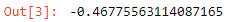

It's not a perfect line, that would be -1, but there's something interesting going on there.

**Note:**

A -1 correlation coefficient means perfect negative correlation, 0 means no correlation, and 1 means perfect positive correlation.

### Computing correlation – The NumPy way

Now, NumPy can actually compute correlation for you using the corrcoef() function. Let's look at the following code:

```
np.corrcoef(pageseeds, purchaseAmount) 
```

This single line gives the following output:

```
array([(1.         ,-046728788], 
      [-0.46728788], 1.       ]) 
```

So, if we wanted to do this the easy way, we could just use np.corrcoef(pageSpeeds, purchaseAmount), and what that gives you back is an array that gives you the correlation between every possible combination of the sets of data that you pass in. The way to read the output is: the 1 implies there is a perfect correlation between comparing pageSpeeds to itself and purchaseAmount to itself, which is expected. But when you start comparing pageSpeeds to purchaseAmount or purchaseAmount to the pageSpeeds, you end up with the -0.4672 value, which is roughly what we got when we did it the hard way. There's going to be little precision errors, but it's not really important.

Now we could force a perfect correlation by fabricating a totally linear relationship, so let's take a look at an example of that:

```
purchaseAmount = 100 - pageSpeeds * 3 
 
scatter(pageSpeeds, purchaseAmount) 
 
correlation (pageSpeeds, purchaseAmount) 
```

And again, here we would expect the correlation to come out to -1 for a perfect negative correlation, and in fact, that's what we end up with:

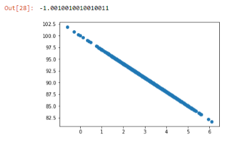

Again, a reminder: Correlation does not imply causality. Just because people might spend more if they have faster page speeds, maybe that just means that they can afford a better Internet connection. Maybe that doesn't mean that there's actually a causation between how fast your pages render and how much people spend, but it tells you there's an interesting relationship that's worth investigating more. You cannot say anything about causality without running an experiment, but correlation can tell you what experiments you might want to run.
