Lab 10 : Visualization Using SeaBorn
-------------------------------------

By the end of this lab, you will be able to:

- Use the basic functionalities of the pandas DataFrame
- Create distributional plots using matplotlib
- Generate visually appealing plots using seaborn


Handling Data with pandas DataFrame
===================================


The datasets used here can be found in `datasets` directory.

Exercise 1: Reading Data from Files
-----------------------------------

In this exercise, we will read from a dataset. The example here uses the
`diamonds` dataset:

1.  Open a jupyter notebook and load the `pandas` and
    `seaborn` libraries:
    ```
    #Load pandas library
    import pandas as pd 
    import seaborn as sns
    ```


2.  Specify the URL of the dataset:
    ```
    #URL of the dataset 
    diamonds_url = "https://raw.githubusercontent.com/fenago/datascience-ml-next-level/master/Lab10-SeaBorn/datasets/diamonds.csv"
    ```


3.  Read files from the URL into the `pandas` DataFrame:

    ```
    #Yes, we can read files from a URL straight into a pandas DataFrame!
    diamonds_df = pd.read_csv(diamonds_url)
    # Since the dataset is available in seaborn, we can alternatively read it in using the following line of code
    diamonds_df = sns.load_dataset('diamonds')
    ```


    The dataset is read directly from the URL!

    ### Note

    Use the `usecols` parameter if only specific columns need
    to be read.

The syntax can be followed for other datatypes using, as shown here:

```
diamonds_df_specific_cols = pd.read_csv(diamonds_url, usecols=['carat','cut','color','clarity'])
```


Observing and Describing Data
-----------------------------

Now that we know how to read from a dataset, let\'s go ahead with
observing and describing data from a dataset. `pandas` also
offers a way to view the first few rows in a DataFrame using the
`head()` function. By default, it shows `5` rows. To
adjust that, we can use the argument `n`---for instance,
`head(n=5)`.


Exercise 2: Observing and Describing Data
-----------------------------------------

In this exercise, we\'ll see how to observe and describe data in a
DataFrame. We\'ll be again using the `diamonds` dataset:

1.  Load the `pandas` and `seaborn` libraries:
    ```
    #Load pandas library
    import pandas as pd 
    import seaborn as sns
    ```


2.  Specify the URL of the dataset:
    ```
    #URL of the dataset 
    diamonds_url = "https://raw.githubusercontent.com/fenago/datascience-ml-next-level/master/Lab10-SeaBorn/datasets/diamonds.csv"
    ```


3.  Read files from the URL into the `pandas` DataFrame:
    ```
    #Yes, we can read files from a URL straight into a pandas DataFrame!
    diamonds_df = pd.read_csv(diamonds_url)
    # Since the dataset is available in seaborn, we can alternatively read it in using the following line of code
    diamonds_df = sns.load_dataset('diamonds')
    ```


4.  Observe the data by using the `head` function:

    ```
    diamonds_df.head()
    ```


The output is as follows:

    
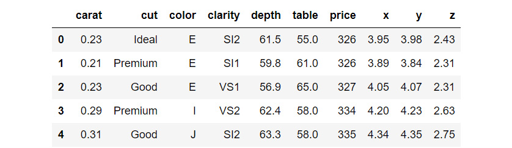


    The data contains different features of diamonds, such as
    `carat`, `cut` `quality`,
    `color`, and `price`, as columns. Now,
    `cut`, `clarity`, and `color` are
    **categorical variables**, and `x`, `y`,
    `z`, `depth`, `table`, and
    `price` are **continuous variables**. While categorical
    variables take unique categories/names as values, continuous values
    take real numbers as values.

    `cut`, `color`, and `clarity` are
    ordinal variables with `5`, `7`, and
    `8` unique values (can be obtained by
    `diamonds_df.cut.nunique()`,
    `diamonds_df.color.nunique()`,
    `diamonds_df.clarity.nunique()` -- try it!), respectively.
    `cut` is the quality of the cut, described as
    `Fair`, `Good`, `Very Good`,
    `Premium`, or `Ideal`; `color`
    describes the diamond color from `J (worst)` to
    `D (best)`. There\'s also `clarity`, which
    measures how clear the diamond is---the degrees are
    `I1 (worst)`, `SI1`, `SI2`,
    `VS1`, `VS2`, `VVS1`,
    `VVS2`, and `IF (best)`.

5.  Count the number of rows and columns in the DataFrame using the
    `shape` function:

    ```
    diamonds_df.shape
    ```


The output is as follows:

    ```
    (53940, 10)
    ```


    The first number, `53940`, denotes the number of rows and
    the second, `10`, denotes the number of columns.

6.  Summarize the columns using `describe()` to obtain the
    distribution of variables, including `mean`,
    `median`, `min`, `max`, and the
    different quartiles:

    ```
    diamonds_df.describe()
    ```


The output is as follows:

    
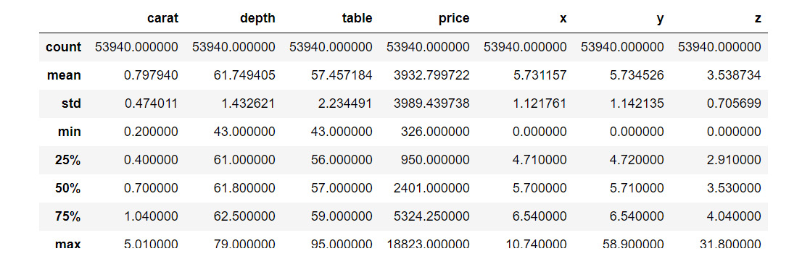


    This works for continuous variables. However, for categorical
    variables, we need to use the `include=object` parameter.

7.  Use `include=object` inside the `describe`
    function for categorical variables ( `cut`,
    `color`, `clarity`):

    ```
    diamonds_df.describe(include=object)
    ```


The output is as follows:

    


    Now, what if you would want to see the column types and how much
    memory a DataFrame occupies?

8.  To obtain information on the dataset, use the `info()`
    method:

    ```
    diamonds_df.info()
    ```


The output is as follows:


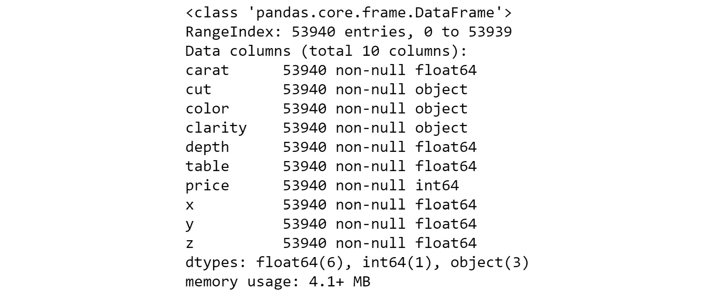


The preceding figure shows the data type (`float64`,
`object`, `int64`..) of each of the columns, and
memory (`4.1MB`) that the DataFrame occupies. It also tells
the number of rows (`53940`) present in the DataFrame.


Selecting Columns from a DataFrame
----------------------------------

Let\'s see how to select specific columns from a dataset. A column in a
`pandas` DataFrame can be accessed in two simple ways: with
the `.` operator or the `[ ]` operator. For example,
we can access the `cut` column of the `diamonds_df`
DataFrame with `diamonds_df.cut` or
`diamonds_df['cut']`. However, there are some scenarios where
the `.` operator cannot be used:

-   When the column name contains spaces
-   When the column name is an integer
-   When creating a new column

Now, how about selecting all rows corresponding to diamonds that have
the `Ideal` cut and storing them in a separate DataFrame? We
can select them using the `loc` functionality:

```
diamonds_low_df = diamonds_df.loc[diamonds_df['cut']=='Ideal']
diamonds_low_df.head()
```


The output is as follows:


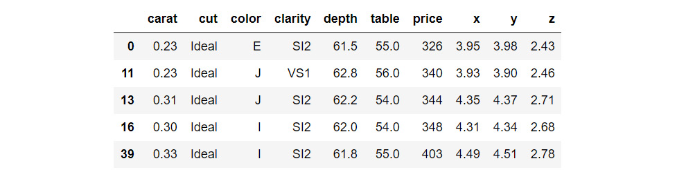


Here, we obtain indices of rows that meet the criterion:

`[diamonds_df['cut']=='Ideal'` and then select them using
`loc`.


Adding New Columns to a DataFrame
---------------------------------

Now, we\'ll see how to add new columns to a
DataFrame. We can add a column, such as, `price_per_carat`, in
the `diamonds` DataFrame. We can divide the values of two
columns and populate the data fields of the newly added column.


Exercise 3: Adding New Columns to the DataFrame
-----------------------------------------------

In this exercise, we are going to add new columns to the
`diamonds` dataset in the `pandas` library. We\'ll
start with the simple addition of columns and then move ahead and look
into the conditional addition of columns. To do so, let\'s go through
the following steps:

1.  Load the `pandas` and `seaborn` libraries:
    ```
    #Load pandas library
    import pandas as pd 
    import seaborn as sns
    ```


2.  Specify the URL of the dataset:
    ```
    #URL of the dataset 
    diamonds_url = "https://raw.githubusercontent.com/fenago/datascience-ml-next-level/master/Lab10-SeaBorn/datasets/diamonds.csv"
    ```


3.  Read files from the URL into the `pandas` DataFrame:

    ```
    #Yes, we can read files from a URL straight into a pandas DataFrame!
    diamonds_df = pd.read_csv(diamonds_url)
    # Since the dataset is available in seaborn, we can alternatively read it in using the following line of code
    diamonds_df = sns.load_dataset('diamonds')
    ```


    Let\'s look at simple addition of columns.

4.  Add a `price_per_carat` column to the DataFrame:
    ```
    diamonds_df['price_per_carat'] = diamonds_df['price']/diamonds_df['carat']
    ```


5.  Call the DataFrame `head` function to check whether the
    new column was added as expected:

    ```
    diamonds_df.head()
    ```


The output is as follows:

    


    Similarly, we can also use addition, subtraction, and other
    mathematical operators on two numeric columns.

    Now, we\'ll look at *conditional addition of
    columns*. Let\'s try and add a column based on the value in
    `price_per_carat`, say anything more than `3500`
    as high (coded as `1`) and anything less than
    `3500` as low (coded as `0`).

6.  Use the `np.where` function from Python\'s
    `numpy` package:

    ```
    #Import numpy package for linear algebra
    import numpy as np
    diamonds_df['price_per_carat_is_high'] = np.where(diamonds_df['price_per_carat']>3500,1,0)
    diamonds_df.head()
    ```


The output is as follows:


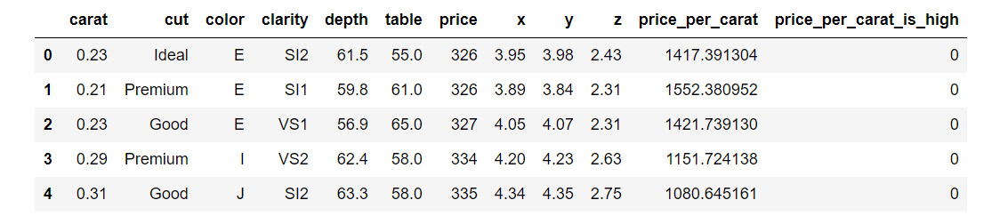


Therefore, we have successfully added two new columns to the dataset.


Applying Functions on DataFrame Columns
---------------------------------------

You can apply *simple functions* on a DataFrame
column---such as, addition, subtraction, multiplication, division,
squaring, raising to an exponent, and so on. It is also possible to
apply more *complex functions* on single and multiple columns in a
`pandas` DataFrame. As an example, let\'s say we want to round
off the price of diamonds to its ceil (nearest integer equal to or
higher than the actual price). Let\'s explore this through an exercise.


Exercise 4: Applying Functions on DataFrame columns
---------------------------------------------------

In this exercise, we\'ll consider a scenario where the price of diamonds
has increased and we want to apply an increment factor of
`1.3` to the price of all the diamonds in our record. We can
achieve this by applying a simple function. Next, we\'ll round off the
price of diamonds to its ceil. We\'ll achieve that by applying a complex
function.Let\'s go through the following steps:

1.  Load the `pandas` and `seaborn` libraries:
    ```
    #Load pandas library
    import pandas as pd 
    import seaborn as sns
    ```


2.  Specify the URL of the dataset:
    ```
    #URL of the dataset 
    diamonds_url = "https://raw.githubusercontent.com/fenago/datascience-ml-next-level/master/Lab10-SeaBorn/datasets/diamonds.csv"
    ```


3.  Read files from the URL into the `pandas` DataFrame:
    ```
    #Yes, we can read files from a URL straight into a pandas DataFrame!
    diamonds_df = pd.read_csv(diamonds_url)
    # Since the dataset is available in seaborn, we can alternatively read it in using the following line of code
    diamonds_df = sns.load_dataset('diamonds')
    ```


4.  Add a `price_per_carat` column to the DataFrame:
    ```
    diamonds_df['price_per_carat'] = diamonds_df['price']/diamonds_df['carat']
    ```


5.  Use the `np.where` function from Python\'s
    `numpy` package:
    ```
    #Import numpy package for linear algebra
    import numpy as np
    diamonds_df['price_per_carat_is_high'] = np.where(diamonds_df['price_per_carat']>3500,1,0)
    ```


6.  Apply a simple function on the columns using the following code:
    ```
    diamonds_df['price']= diamonds_df['price']*1.3
    ```


7.  Apply a complex function to round off the price of diamonds to its
    ceil:

    ```
    import math
    diamonds_df['rounded_price']=diamonds_df['price'].apply(math.ceil)
    diamonds_df.head()
    ```


The output is as follows:

    
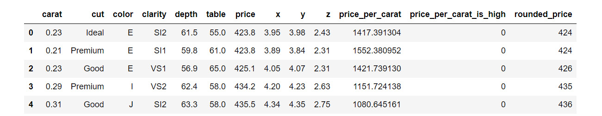


    In this case, the function we wanted for rounding off to the ceil
    was already present in an existing library. However, there might be
    times when you have to write your own function to perform the task
    you want to accomplish. In the case of small functions, you can also
    use the `lambda` operator, which acts as a one-liner
    function taking an argument. For example, say you want to add
    another column to the DataFrame indicating the rounded-off price of
    the diamonds to the nearest multiple of `100` (equal to or
    higher than the price).

8.  Use the `lambda` function as follows to round off the
    price of the diamonds to the nearest multiple of `100`:

    ```
    import math
    diamonds_df['rounded_price_to_100multiple']=diamonds_df['price'].apply(lambda x: math.ceil(x/100)*100)
    diamonds_df.head()
    ```


The output is as follows:

    
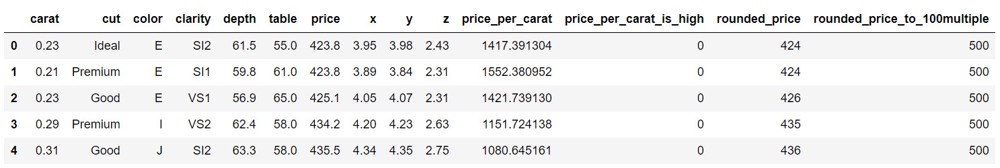


    Not all functions can be written as one-liners and it is
    important to know how to include user-defined functions in the
    `apply` function. Let\'s write the same code with a
    *user-defined function* for illustration.

9.  Write code to create a user-defined function to round off the price
    of the diamonds to the nearest multiple of `100`:

    ```
    import math
    def get_100_multiple_ceil(x):
        y = math.ceil(x/100)*100
        return y
        
    diamonds_df['rounded_price_to_100multiple']=diamonds_df['price'].apply(get_100_multiple_ceil)
    diamonds_df.head()
    ```


The output is as follows:

    
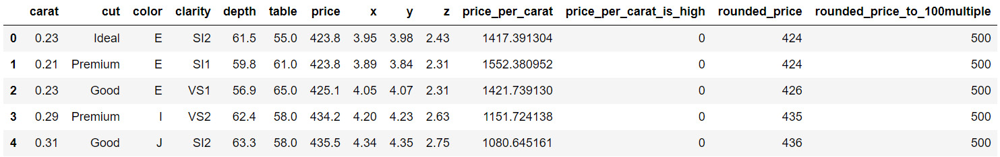


Interesting! Now, we had created an user-defined function to add a
column to the dataset.


Exercise 5: Applying Functions on Multiple Columns
--------------------------------------------------

When applying a function on multiple columns of a DataFrame, we can
similarly use `lambda` or user-defined functions. We will
continue to use the `diamonds` dataset. Suppose we are
interested in buying diamonds that have an `Ideal` cut and a
`color` of `D` (entirely colorless). This exercise
is for adding a new column, `desired` to the DataFrame, whose
value will be `yes` if our criteria are satisfied and
`no` if not satisfied. Let\'s see how we do it:

1.  Import the necessary modules:
    ```
    import seaborn as sns
    import pandas as pd
    ```


2.  Import the `diamonds` dataset from `seaborn`:
    ```
    diamonds_df_exercise = sns.load_dataset('diamonds')
    ```


3.  Write a function to determine whether a record, `x`, is
    desired or not:
    ```
    def is_desired(x):
        bool_var = 'yes' if (x['cut']=='Ideal' and x['color']=='D') else 'no'
        return bool_var
    ```


4.  Use the `apply` function to add the new column,
    `desired`:

    ```
    diamonds_df_exercise['desired']=diamonds_df_exercise.apply(is_desired, axis=1)
    diamonds_df_exercise.head()
    ```


The output is as follows:

    
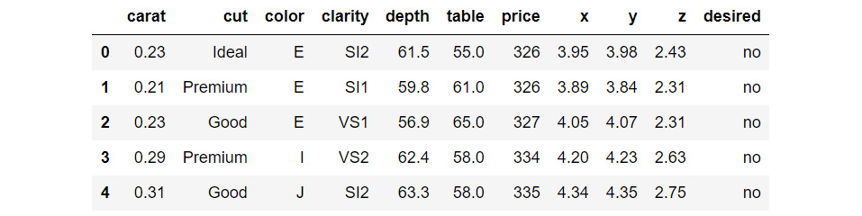


The new column `desired` is added!


Deleting Columns from a DataFrame
---------------------------------

Finally, let\'s see how to delete columns from a `pandas`
DataFrame. For example, we will delete the `rounded_price` and
`rounded_price_to_100multiple` columns. Let\'s go through the
following exercise.


Exercise 6: Deleting Columns from a DataFrame
---------------------------------------------

In this exercise, we will delete columns from a `pandas`
DataFrame. Here, we\'ll be using the `diamonds` dataset:

1.  Import the necessary modules:
    ```
    import seaborn as sns
    import pandas as pd
    ```


2.  Import the `diamonds` dataset from `seaborn`:
    ```
    diamonds_df = sns.load_dataset('diamonds')
    ```


3.  Add a `price_per_carat` column to the DataFrame:
    ```
    diamonds_df['price_per_carat'] = diamonds_df['price']/diamonds_df['carat']
    ```


4.  Use the `np.where` function from Python\'s
    `numpy` package:
    ```
    #Import numpy package for linear algebra
    import numpy as np
    diamonds_df['price_per_carat_is_high'] = np.where(diamonds_df['price_per_carat']>3500,1,0)
    ```


5.  Apply a *complex function* to round off the price of diamonds to its
    ceil:
    ```
    import math
    diamonds_df['rounded_price']=diamonds_df['price'].apply(math.ceil)
    ```


6.  Write a code to create a *user-defined function*:
    ```
    import math
    def get_100_multiple_ceil(x):
        y = math.ceil(x/100)*100
        return y
        
    diamonds_df['rounded_price_to_100multiple']=diamonds_df['price'].apply(get_100_multiple_ceil)
    ```


7.  Delete the `rounded_price` and
    `rounded_price_to_100multiple` columns using the
    `drop` function:

    ```
    diamonds_df=diamonds_df.drop(columns=['rounded_price', 'rounded_price_to_100multiple'])
    diamonds_df.head()
    ```


The output is as follows:

    
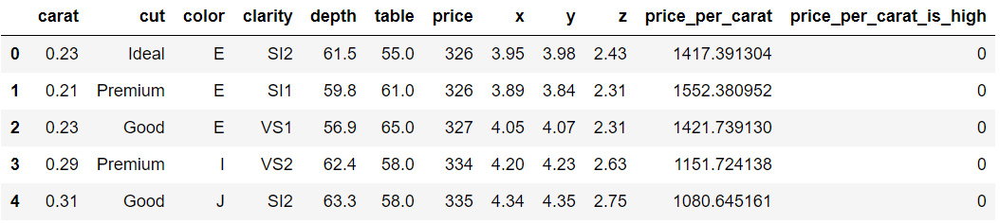


### Note

By default, when the `apply` or
`drop` function is used on a `pandas` DataFrame, the
original DataFrame is not modified. Rather, a copy of the DataFrame post
modifications is returned by the functions. Therefore, you should assign
the returned value back to the variable containing the DataFrame (for
example,
`diamonds_df=diamonds_df.drop(columns=['rounded_price', 'rounded_price_to_100multiple'])`).

In the case of the `drop` function, there is also a provision
to avoid assignment by setting an `inplace=True` parameter,
wherein the function performs the column deletion on the original
DataFrame and does not return anything.


Writing a DataFrame to a File
-----------------------------

The last thing to do is write a DataFrame to a file. We will be using
the `to_csv()` function. The output is usually a
`.csv` file that will include column and row headers. Let\'s
see how to write our DataFrame to a `.csv` file.


Exercise 7: Writing a DataFrame to a File
-----------------------------------------

In this exercise, we will write a `diamonds` DataFrame to a
`.csv` file. To do so, we\'ll be using the following code:

1.  Import the necessary modules:
    ```
    import seaborn as sns
    import pandas as pd
    ```


2.  Load the `diamonds` dataset from `seaborn`:
    ```
    diamonds_df = sns.load_dataset('diamonds')
    ```


3.  Write the diamonds dataset into a .csv file:
    ```
    diamonds_df.to_csv('diamonds_modified.csv')
    ```


4.  Let\'s look at the first few rows of the DataFrame:

    ```
    print(diamonds_df.head())
    ```


The output is as follows:

    
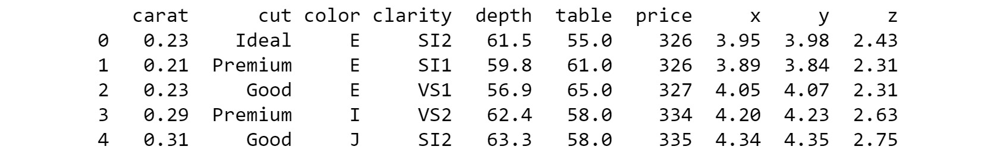


    By default, the `to_csv` function outputs a file that
    includes column headers as well as row numbers. Generally, the row
    numbers are not desirable, and an `index` parameter is
    used to exclude them:

5.  Add a parameter `index=False` to exclude the row numbers:
    ```
    diamonds_df.to_csv('diamonds_modified.csv', index=False)
    ```


And that\'s it! You can find this `.csv` file in the source
directory. You are now equipped to perform all the basic functions on
`pandas` DataFrames required to get started with data
visualization in Python.

In order to prepare the ground for using various visualization
techniques, we went through the following aspects of handling
`pandas` DataFrames:

-   Reading data from files using the `read_csv( )`,
    `read_excel( )`, and `readjson( )` functions
-   Observing and describing data using the
    `dataframe.head( )`, `dataframe.tail( )`,
    `dataframe.describe( )`, and `dataframe.info( )`
    functions
-   Selecting columns using the `dataframe.column__name` or
    `dataframe['column__name']` notation
-   Adding new columns using the
    `dataframe['newcolumnname']=...` notation
-   Applying functions to existing columns using the
    `dataframe.apply(func)` function
-   Deleting columns from DataFrames using the
    `_dataframe.drop(column_list)` function
-   Writing DataFrames to files using the `_dataframe.tocsv()`
    function

These functions are useful for preparing data in a format suitable for
input to visualization functions in Python libraries such as
`seaborn`.


Plotting with pandas and seaborn
================================


Now that we have a basic sense of how to load and handle data in a
`pandas` DataFrame object, let\'s get started with making some
simple plots from data. While there are several plotting libraries in
Python (including `matplotlib`, `plotly`, and
`seaborn`), in this lab, we will mainly explore the
`pandas` and `seaborn` libraries, which are
extremely useful, popular, and easy to use.


Creating Simple Plots to Visualize a Distribution of Variables
--------------------------------------------------------------

To illustrate certain key concepts and explore the `diamonds`
dataset, we will start with two simple visualizations in this
lab---histograms and bar plots.

**Histograms**

A histogram of a feature is a plot with the range
of the feature on the *x*-axis and the count of data points with the
feature in the corresponding range on the *y*-axis.

Let\'s look at the following exercise of plotting a histogram with
`pandas`.


Exercise 8: Plotting and Analyzing a Histogram
----------------------------------------------

In this exercise, we will create a histogram of the frequency of
diamonds in the dataset with their respective `carat`
specifications on the *x*-axis:

1.  Import the necessary modules:
    ```
    import seaborn as sns
    import pandas as pd
    ```


2.  Import the `diamonds` dataset from `seaborn`:
    ```
    diamonds_df = sns.load_dataset('diamonds')
    ```


3.  Plot a histogram using the `diamonds` dataset where
    `x axis = carat`:

    ```
    diamonds_df.hist(column='carat')
    ```


The output is as follows:

    
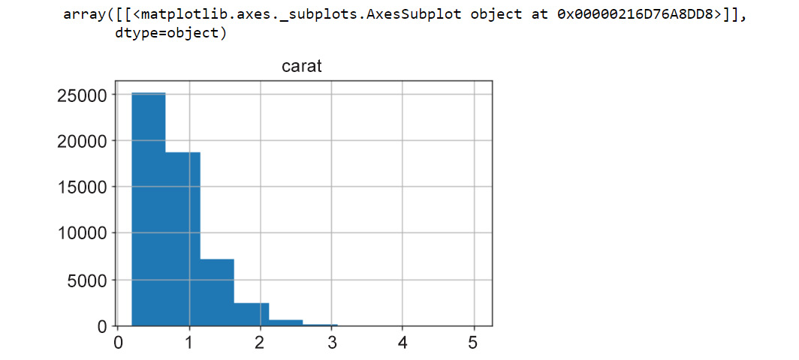


    The *y* axis in this plot denotes the number of diamonds in the
    dataset with the `carat` specification on the *x*-axis.

    The `hist` function has a parameter called
    `bins`, which literally refers to the number of equally
    sized `bins` into which the data points are divided. By
    default, the bins parameter is set to `10` in
    `pandas`. We can change this to a different number, if we
    wish.

4.  Change the `bins` parameter to `50`:

    ```
    diamonds_df.hist(column='carat', bins=50)
    ```


The output is as follows:

    
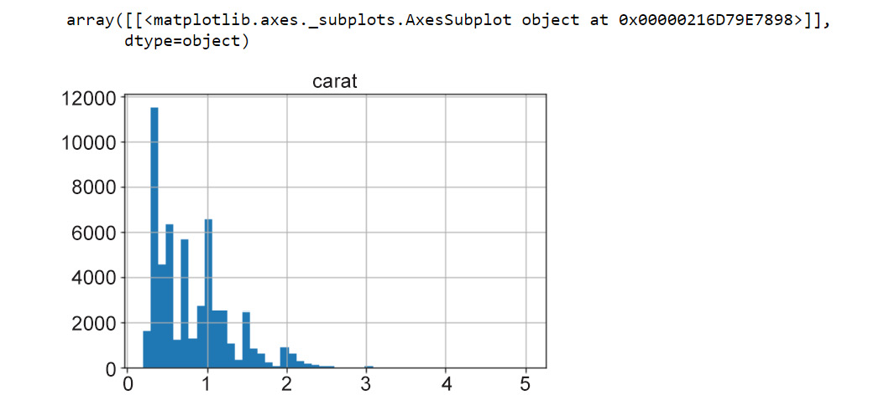


    This is a histogram with `50` bins. Notice how we can see
    a more fine-grained distribution as we increase the number of bins.
    It is helpful to test with multiple bin sizes to know the exact
    distribution of the feature. The range of `bin` sizes
    varies from `1` (where all values are in the same bin) to
    the number of values (where each value of the feature is in one
    bin).

5.  Now, let\'s look at the same function using `seaborn`:

    ```
    sns.distplot(diamonds_df.carat)
    ```


The output is as follows:

    
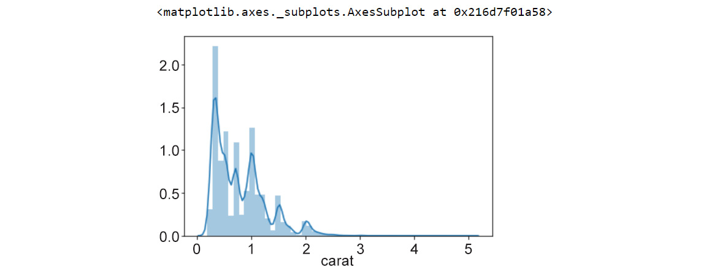


    There are two noticeable differences between the `pandas`
    `hist` function and `seaborn`
    `distplot`:

    -   `pandas` sets the `bins` parameter to a
        default of `10`, but `seaborn` infers an
        appropriate bin size based on the statistical distribution of
        the dataset.

    -   By default, the `distplot` function also includes a
        smoothed curve over the histogram, called a **kernel density
        estimation**.

        The **kernel density estimation** (**KDE**)
        is a non-parametric way to estimate the probability density
        function of a random variable. Usually, a KDE doesn\'t tell us
        anything more than what we can infer from the histogram itself.
        However, it is helpful when comparing multiple histograms on the
        same plot. If we want to remove the KDE and look at the
        histogram alone, we can use the `kde=False` parameter.

6.  Change `kde=False` to remove the KDE:

    ```
    sns.distplot(diamonds_df.carat, kde=False)
    ```


The output is as follows:

    
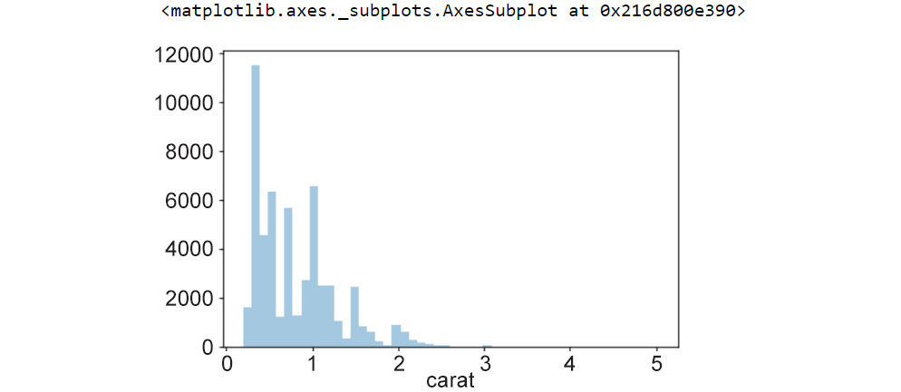


    Also note that the `bins` parameter seemed to render a
    more detailed plot when the bin size was increased from
    `10` to `50`. Now, let\'s try to increase it
    to 100.

7.  Increase the `bins` size to `100`:

    ```
    sns.distplot(diamonds_df.carat, kde=False, bins=100)
    ```


The output is as follows:

    
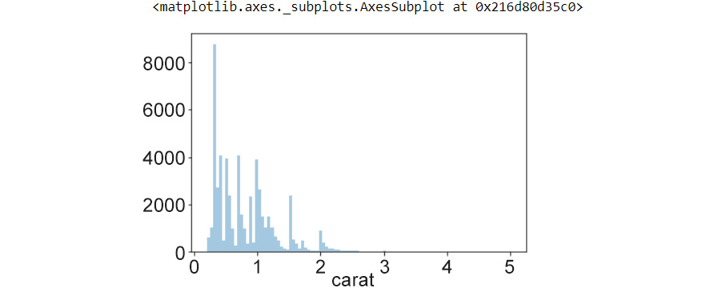


    The histogram with `100` bins shows a better visualization
    of the distribution of the variable---we see there are several peaks
    at specific carat values. Another observation is that most
    `carat` values are concentrated toward lower values and
    the `tail` is on the right---in other words, it is
    right-skewed.

    A log transformation helps in identifying more trends. For instance,
    in the following graph, the *x*-axis shows log-transformed values of
    the `price` variable, and we see that there are two peaks
    indicating two kinds of diamonds---one with a high price and another
    with a low price.

8.  Use a log transformation on the histogram:

    ```
    import numpy as np
    sns.distplot(np.log(diamonds_df.price), kde=False)
    ```


The output is as follows:


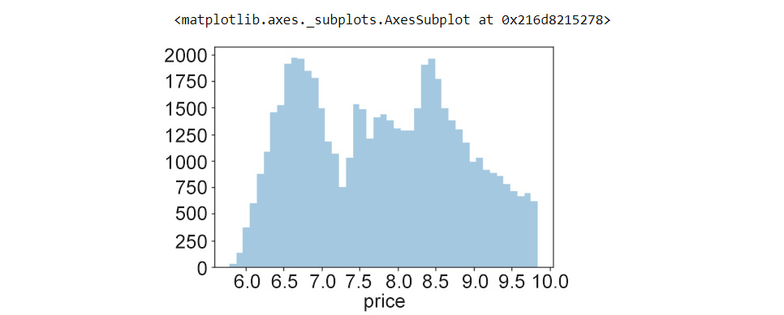


That\'s pretty neat. Looking at the histogram, even
a naive viewer immediately gets a picture of the distribution of the
feature. Specifically, three observations are important in a histogram:

-   Which feature values are more frequent in the dataset (in this case,
    there is a peak at around 6.8 and another peak between
    `8.5` and `9`---note that
    `log(price) = values`, in this case,
-   How many *peaks* exist in the data (the peaks need to be further
    inspected for possible causes in the context of the data)
-   Whether there are any outliers in the data


Bar Plots
---------

Another type of plot we will look at in this lab is the bar plot.

In their simplest form, *bar plots* display counts of categorical
variables. More broadly, bar plots are used to depict the relationship
between a categorical variable and a numerical variable. Histograms,
meanwhile, are plots that show the statistical distribution of a
continuous numerical feature.

Let\'s see an exercise of bar plots in the `diamonds` dataset.
First, we shall present the counts of diamonds of each cut quality that
exist in the data. Second, we shall look at the price associated with
the different types of cut quality (`Ideal`, `Good`,
`Premium`, and so on) in the dataset and find out the mean
price distribution. We will use both `pandas` and
`seaborn` to get a sense of how to use the built-in plotting
functions in both libraries.

Before generating the plots, let\'s look at the unique values in the
`cut` and `clarity` columns, just to refresh our
memory.


Exercise 9: Creating a Bar Plot and Calculating the Mean Price Distribution
---------------------------------------------------------------------------

In this exercise, we\'ll learn how to create a table using the
`pandas` `crosstab` function. We\'ll use a table to
generate a bar plot. We\'ll then explore a bar plot generated using the
`seaborn` library and calculate the mean price distribution.
To do so, let\'s go through the following steps:

1.  Import the necessary modules and dataset:
    ```
    import seaborn as sns
    import pandas as pd
    ```


2.  Import the `diamonds` dataset from `seaborn`:
    ```
    diamonds_df = sns.load_dataset('diamonds')
    ```


3.  Print the unique values of the `cut` column:

    ```
    diamonds_df.cut.unique()
    ```


    The output will be as follows:

    ```
    array(['Ideal', 'Premium', 'Good', 'Very Good', 'Fair'], dtype=object)
    ```


4.  Print the unique values of the `clarity` column:

    ```
    diamonds_df.clarity.unique()
    ```


    The output will be as follows:

    ```
    array(['SI2', 'SI1', 'VS1', 'VS2', 'VVS2', 'VVS1', 'I1', 'IF'],
          dtype=object)
    ```


    ### Note

    `unique()` returns an array. There are five unique
    `cut` qualities and eight unique values in
    `clarity`. The number of unique values can be obtained
    using `nunique()` in `pandas`.

5.  To obtain the counts of diamonds of each cut quality, we first
    create a table using the `pandas` `crosstab()`
    function:

    ```
    cut_count_table = pd.crosstab(index=diamonds_df['cut'],columns='count')
    cut_count_table
    ```


    The output will be as follows:

    


6.  Pass these counts to another `pandas` function,
    `plot(kind='bar')`:

    ```
    cut_count_table.plot(kind='bar')
    ```


    The output will be as follows:

    
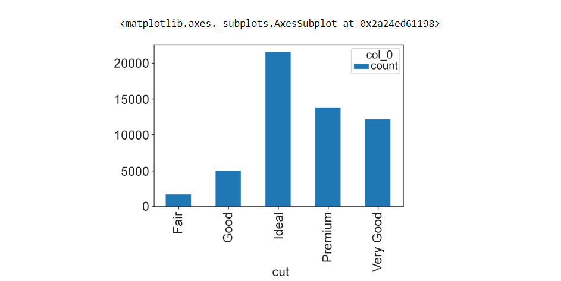


    We see that most of the diamonds in the dataset are of the
    `Ideal` cut quality, followed by `Premium`,
    `Very Good`, `Good`, and `Fair`. Now,
    let\'s see how to generate the same plot using `seaborn`.

7.  Generate the same bar plot using `seaborn`:

    ```
    sns.catplot("cut", data=diamonds_df, aspect=1.5, kind="count", color="b")
    ```


    The output will be as follows:

    
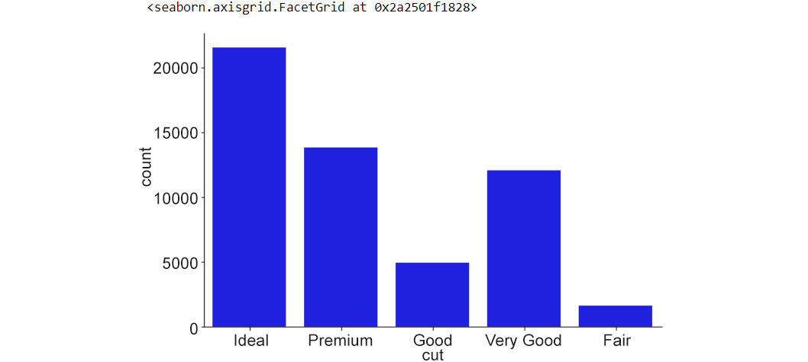


    Notice how the `catplot()` function does not require us to
    create the intermediate count table (using
    `pd.crosstab()`), and reduces one step in the plotting
    process.

8.  Next, here is how we obtain the mean price distribution of different
    cut qualities using `seaborn`:

    ```
    import seaborn as sns
    from numpy import median, mean
    sns.set(style="whitegrid")
    ax = sns.barplot(x="cut", y="price", data=diamonds_df,estimator=mean)
    ```


    The output will be as follows:

    
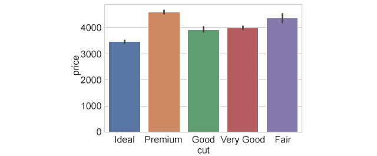


    Here, the black lines (*error bars*) on the rectangles indicate the
    uncertainty (or spread of values) around the mean estimate. By
    default, this value is set to `95%` confidence. How do we
    change it? We use the `ci=68` parameter, for instance, to
    set it to `68%`. We can also plot the standard deviation
    in the prices using `ci=sd`.

9.  Reorder the *x* axis bars using `order`:

    ```
    ax = sns.barplot(x="cut", y="price", data=diamonds_df, estimator=mean, ci=68, order=['Ideal','Good','Very Good','Fair','Premium'])
    ```


    The output will be as follows:

    
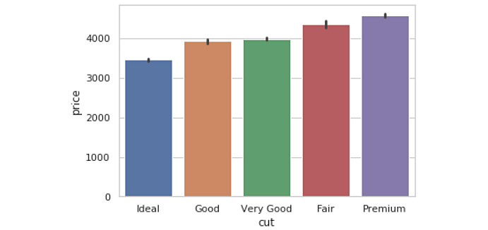


Grouped bar plots can be very useful for
visualizing the variation of a particular feature within different
groups. Now that you have looked into tweaking the plot parameters in a
grouped bar plot, let\'s see how to generate a bar plot grouped by a
specific feature.


Exercise 10: Creating Bar Plots Grouped by a Specific Feature
-------------------------------------------------------------

In this exercise, we will use the `diamonds` dataset to
generate the distribution of prices with respect to `color`
for each `cut` quality. In *Exercise 9*, *Creating a Bar Plot
and Calculating the Mean Price Distribution*, we looked at the price
distribution for diamonds of different cut qualities. Now, we would like
to look at the variation in each color:

1.  Import the necessary modules---in this case, only
    `seaborn`:
    ```
    #Import seaborn
    import seaborn as sns
    ```


2.  Load the dataset:
    ```
    diamonds_df = sns.load_dataset('diamonds')
    ```


3.  Use the `hue` parameter to plot nested groups:

    ```
    ax = sns.barplot(x="cut", y="price", hue='color', data=diamonds_df)
    ```


The output is as follows:


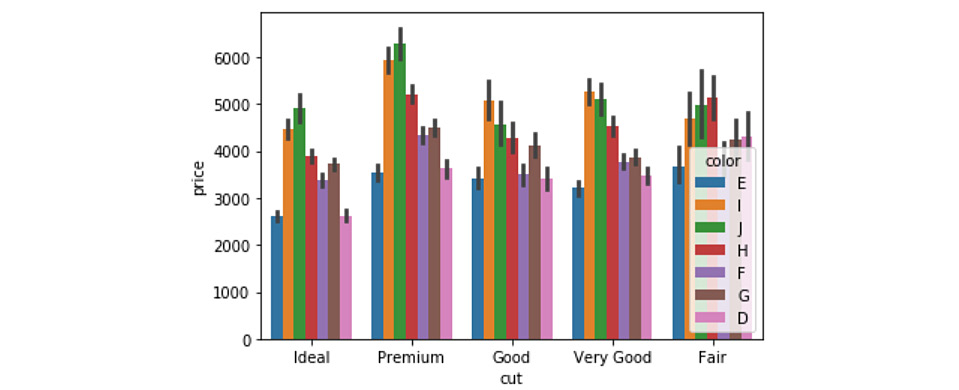


Here, we can observe that the price patterns for diamonds of different
colors are similar for each cut quality. For instance, for
`Ideal` diamonds, the price distribution of diamonds of
different colors is the same as that for `Premium`, and other
diamonds.


Tweaking Plot Parameters
========================


Looking at the last figure in our previous section,
we find that the legend is not appropriately placed. We can tweak the
plot parameters to adjust the placements of the legends and the axis
labels, as well as change the font-size and rotation of the tick labels.


Exercise 11: Tweaking the Plot Parameters of a Grouped Bar Plot
---------------------------------------------------------------

In this exercise, we\'ll tweak the plot parameters, for example,
`hue`, of a grouped bar plot. We\'ll see how to place legends
and axis labels in the right places and also explore the rotation
feature:

1.  Import the necessary modules---in this case, only
    `seaborn`:
    ```
    #Import seaborn
    import seaborn as sns
    ```


2.  Load the dataset:
    ```
    diamonds_df = sns.load_dataset('diamonds')
    ```


3.  Use the `hue` parameter to plot nested groups:

    ```
    ax = sns.barplot(x="cut", y="price", hue='color', data=diamonds_df)
    ```


The output is as follows:

    
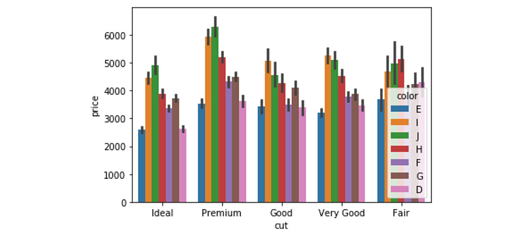


4.  Place the legend appropriately on the bar plot:

    ```
    ax = sns.barplot(x='cut', y='price', hue='color', data=diamonds_df)
    ax.legend(loc='upper right',ncol=4)
    ```


The output is as follows:

    
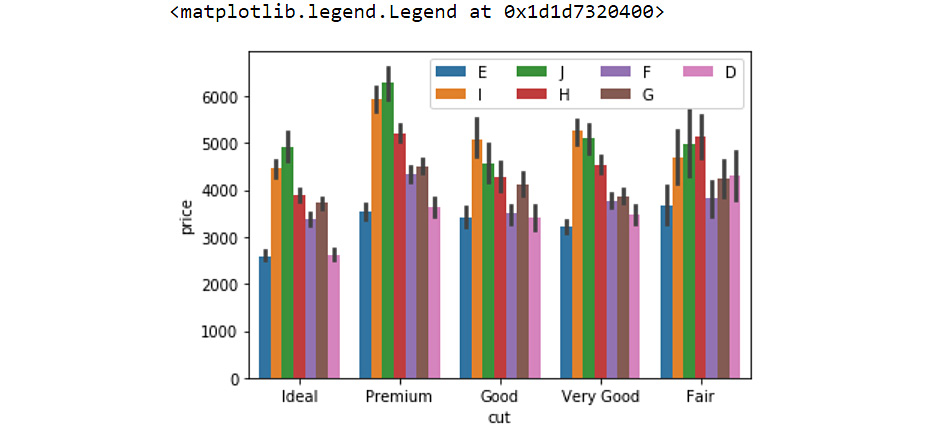


    In the preceding `ax.legend()` call, the `ncol`
    parameter denotes the number of columns into which values in the
    legend are to be organized, and the `loc` parameter
    specifies the location of the legend and can take any one of eight
    values (*upper left*, *lower center*, and so on).

5.  To modify the axis labels on the *x* axis and
    *y* axis, input the following code:

    ```
    ax = sns.barplot(x='cut', y='price', hue='color', data=diamonds_df)
    ax.legend(loc='upper right', ncol=4)
    ax.set_xlabel('Cut', fontdict={'fontsize' : 15})
    ax.set_ylabel('Price', fontdict={'fontsize' : 15})
    ```


The output is as follows:

    
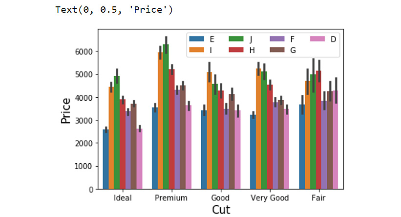


6.  Similarly, use this to modify the font-size and
    rotation of the *x* axis of the tick labels:

    ```
    ax = sns.barplot(x='cut', y='price', hue='color', data=diamonds_df)
    ax.legend(loc='upper right',ncol=4)
    # set fontsize and rotation of x-axis tick labels
    ax.set_xticklabels(ax.get_xticklabels(), fontsize=13, rotation=30)
    ```


The output is as follows:


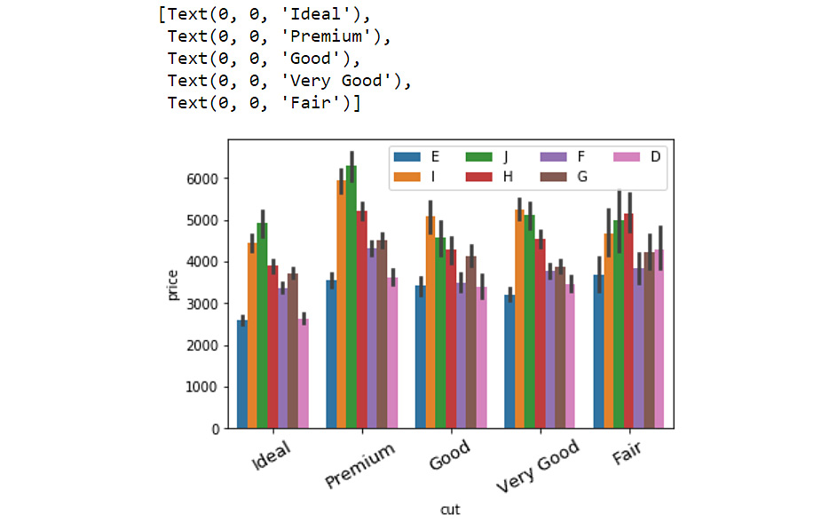


The *rotation feature* is particularly useful when the tick labels are
long and crowd up together on the *x* axis.


Annotations
-----------

Another useful feature to have in plots is the annotation feature. In
the following exercise, we\'ll make a simple bar plot more informative
by adding some annotations.Suppose we want to add more information to
the plot about *ideally* cut diamonds. We can do this in the following
exercise:


Exercise 12: Annotating a Bar Plot
----------------------------------

In this exercise, we will annotate a bar plot, generated using the
`catplot` function of `seaborn`, using a note right
above the plot. Let\'s see how:

1.  Import the necessary modules:
    ```
    import matplotlib.pyplot as plt
    import seaborn as sns
    ```


2.  Load the `diamonds` dataset:
    ```
    diamonds_df = sns.load_dataset('diamonds')
    ```


3.  Generate a bar plot using `catplot` function of the
    `seaborn` library:

    ```
    ax = sns.catplot("cut", data=diamonds_df, aspect=1.5, kind="count", color="b")
    ```


The output is as follows:

    
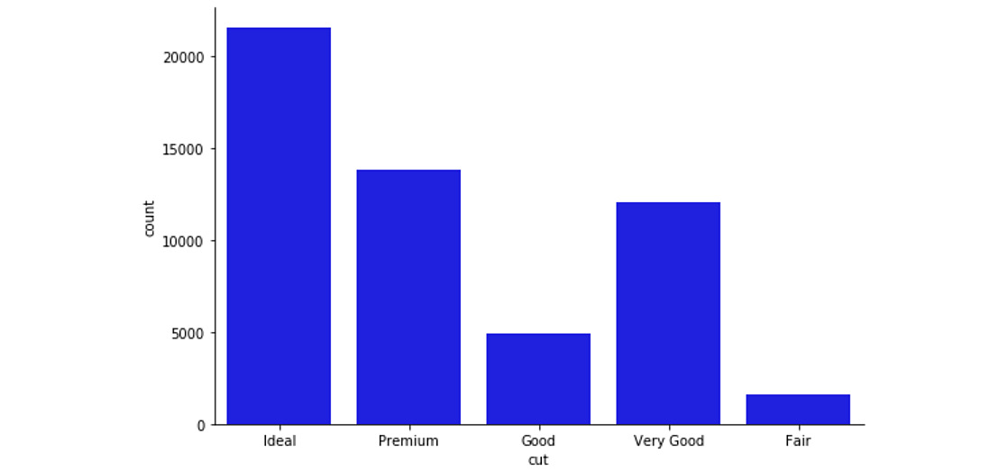


4.  Annotate the column belonging to the `Ideal` category:
    ```
    # get records in the DataFrame corresponding to ideal cut
    ideal_group = diamonds_df.loc[diamonds_df['cut']=='Ideal']
    ```


5.  Find the location of the *x* coordinate where the annotation has to
    be placed:
    ```
    # get the location of x coordinate where the annotation has to be placed
    x = ideal_group.index.tolist()[0]
    ```


6.  Find the location of the *y* coordinate where the annotation has to
    be placed:
    ```
    # get the location of y coordinate where the annotation has to be placed
    y = len(ideal_group)
    ```


7.  Print the location of the *x* and *y* co-ordinates:

    ```
    print(x)
    print(y)
    ```


    The output is:

    ```
    0
    21551
    ```


8.  Annotate the plot with a note:

    ```
    # annotate the plot with any note or extra information
    sns.catplot("cut", data=diamonds_df, aspect=1.5, kind="count", color="b")
    plt.annotate('excellent polish and symmetry ratings;\nreflects almost all the light that enters it', xy=(x,y), xytext=(x+0.3, y+2000), arrowprops=dict(facecolor='red'))
    ```


The output is as follows:

    
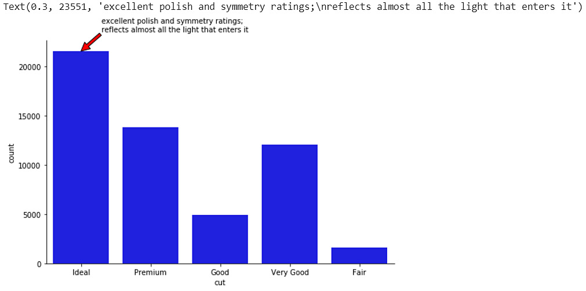


At this stage, we will go through a lab activity to revise the
concepts in this lab.


Activity 1: Analyzing Different Scenarios and Generating the Appropriate Visualization
--------------------------------------------------------------------------------------

We\'ll be working with the `120 years of`
`Olympic History` dataset acquired by Randi Griffin from
<https://www.sports-reference.com/> . Your assignment is to identify the top five
sports based on the largest number of medals awarded in the year 2016,
and then perform the following analysis:

1.  Generate a plot indicating the number of medals awarded in each of
    the top five sports in 2016.
2.  Plot a graph depicting the distribution of the age of medal winners
    in the top five sports in 2016.
3.  Find out which national teams won the largest number of medals in
    the top five sports in 2016.
4.  Observe the trend in the average weight of male and female athletes
    winning in the top five sports in 2016.

**High-Level Steps**

1.  Download the dataset and format it as a pandas
    DataFrame.
2.  Filter the DataFrame to only include the rows corresponding to medal
    winners from 2016.
3.  Find out the medals awarded in 2016 for each sport.
4.  List the top five sports based on the largest number of medals
    awarded. Filter the DataFrame one more time to only include the
    records for the top five sports in 2016.
5.  Generate a bar plot of record counts corresponding to each of the
    top five sports.
6.  Generate a histogram for the `Age` feature of all medal
    winners in the top five sports (2016).
7.  Generate a bar plot indicating how many medals were won by each
    country\'s team in the top five sports in 2016.
8.  Generate a bar plot indicating the average weight of players,
    categorized based on gender, winning in the top five sports in 2016.

The expected output should be:

After Step 1:


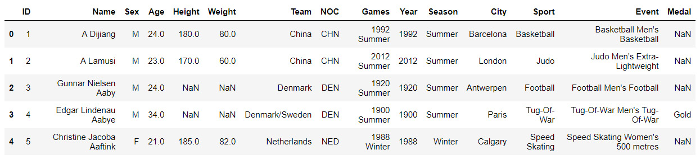


After Step 2:


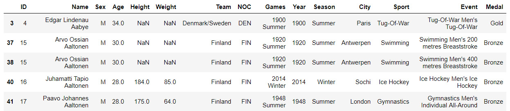


After Step 3:


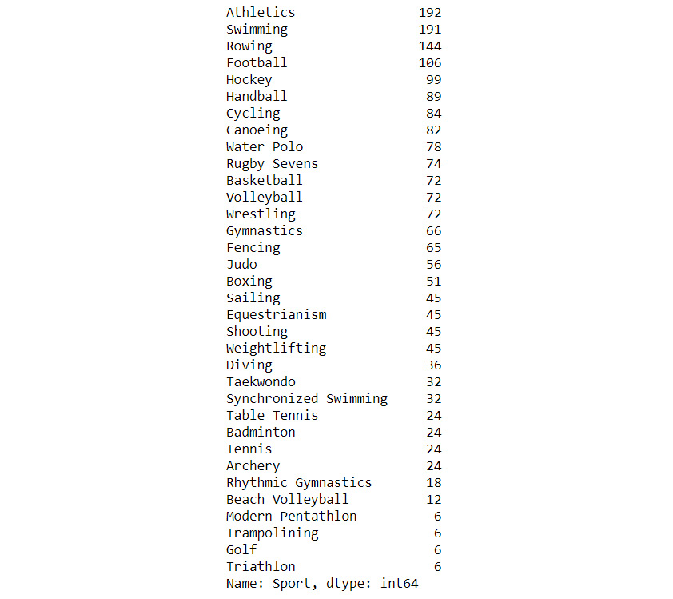


After Step 4:


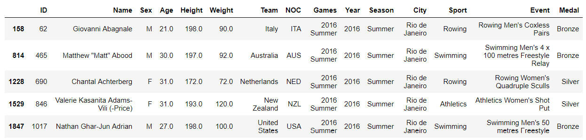


After Step 5:


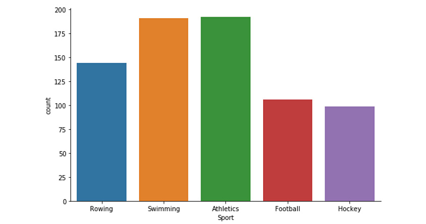


After Step 6:


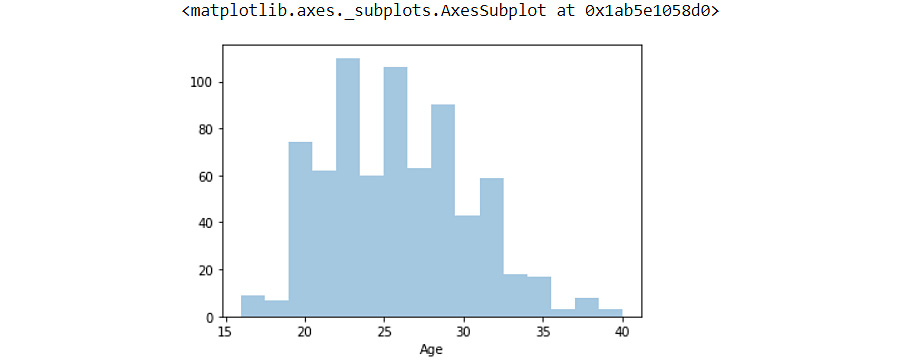


After Step 7:


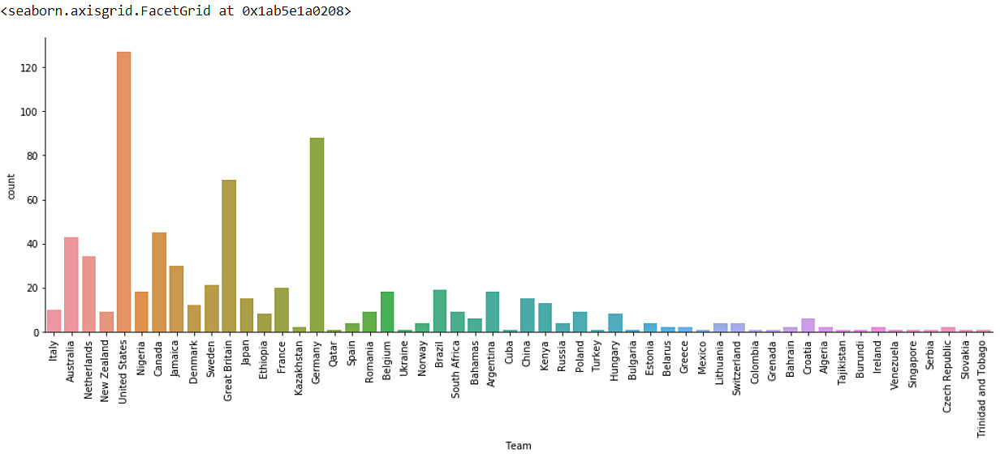


After Step 8:


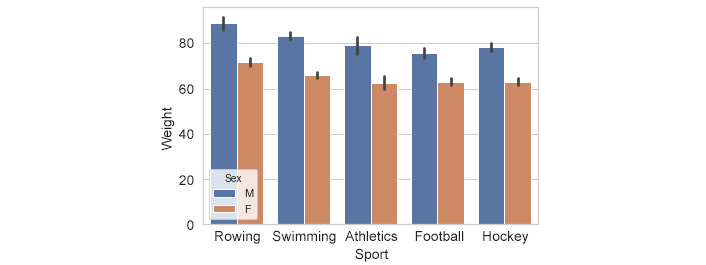


The bar plot indicates the highest athlete weight in rowing, followed by
swimming, and then the other remaining sports. The trend is similar
across both male and female players.

**Note** The solution notebook for this activity is available in the lab environment.

Summary
=======


In this lab, we covered handling `pandas`
DataFrames to format them as inputs for different visualization
functions in libraries such as `pandas` , `seaborn`
and more, and we covered some essential concepts in generating and
modifying plots to create pleasing figures.