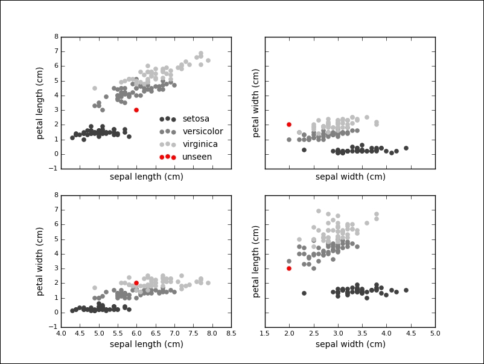
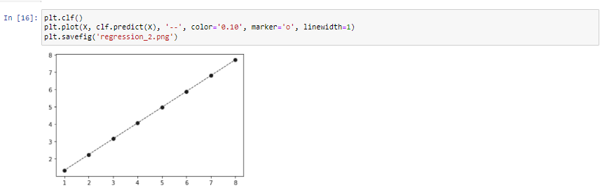
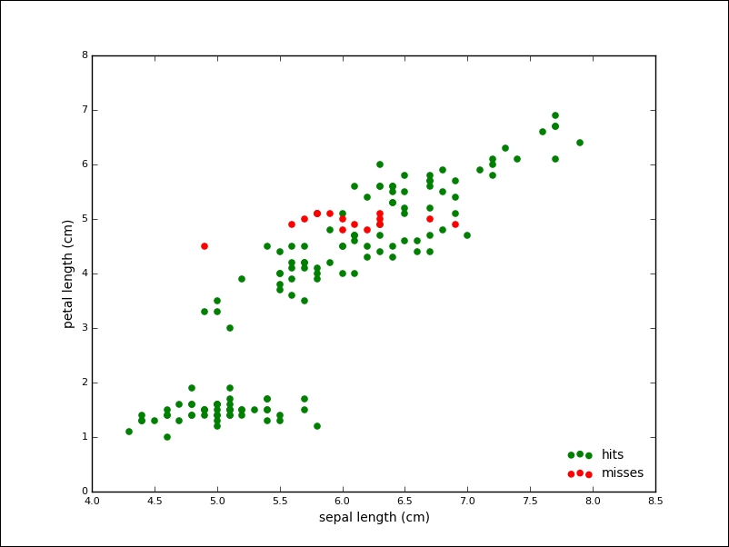
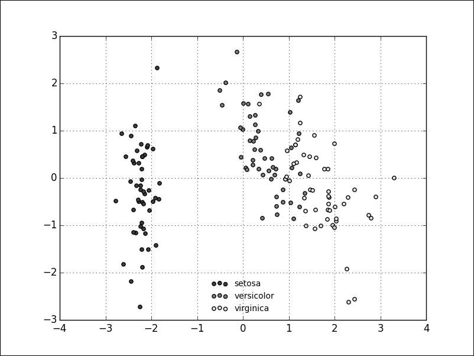

Lab 11. Machine Learning with scikit-learn 
-----------------------------------------


Data representation in scikit-learn
-----------------------------------

With the standard installation of scikit-learn, you already have access to a couple of datasets,
including Iris that consists of 150 samples, each consisting of four
measurements taken from three different Iris flower species:

```
>>> import numpy as np
>>> from sklearn import datasets
>>> iris = datasets.load_iris()
```

The dataset is packaged as a bunch, which is only a thin wrapper around
a dictionary:

```
>>> type(iris)
sklearn.datasets.base.Bunch
>>> iris.keys()
['target_names', 'data', 'target', 'DESCR', 'feature_names']
```

Under the `data` key, we can find the matrix of samples and
features, and can confirm its shape:

```
>>> type(iris.data)
numpy.ndarray
>>> iris.data.shape
(150, 4)
```

Each entry in the `data` matrix has been labeled, and these
labels can be looked up in the `target` attribute:

```
>>> type(iris.target)
numpy.ndarray
>>> iris.target.shape
(150,)
>>> iris.target[:10]
array([0, 0, 0, 0, 0, 0, 0, 0, 0, 0])
>>> np.unique(iris.target)
array([0, 1, 2])
```

The target names are encoded. We can look up the corresponding names in
the `target_names` attribute:

```
>>> iris.target_names
>>> array(['setosa', 'versicolor', 'virginica'], dtype='|S10')
```

This is the basic anatomy of many datasets, such as example data, target
values, and target names.

What are the features of a single entry in this dataset?:

```
>>> iris.data[0]
array([ 5.1,  3.5,  1.4,  0.2])
```

The four features are the measurements taken of real flowers: their
sepal length and width, and petal length and width. Three different
species have been examined: the **Iris-Setosa**,
**Iris-Versicolour**, and **Iris-Virginica**.

Machine learning tries to answer the following
question: can we predict the species of the flower, given only the
measurements of its sepal and petal length?

In the next section, we will see how to answer this question with
scikit-learn.

A few datasets are not included, but they can easily be fetched on
demand (as these are usually a bit bigger). Among these datasets, you
can find a real estate dataset and a news corpus:

```
>>> ds = datasets.fetch_california_housing()
downloading Cal. housing from http://lib.stat.cmu.edu/modules.php?op=...
>>> ds.data.shape
(20640, 8)
>>> ds = datasets.fetch_20newsgroups()
>>> len(ds.data)
11314
>>> ds.data[0][:50]
u"From: lerxst@wam.umd.edu (where's my thing)\nSubjec"
>>> sum([len([w for w in sample.split()]) for sample in ds.data])
3252437
```


Supervised learning -- classification and regression
----------------------------------------------------------------------


Let's use a supervised
method called a **Support Vector Machine** (**SVM**) to learn
about a classifier for the Iris data. The API separates models and data,
therefore, the first step is to instantiate the model. In this case, we
pass an optional keyword parameter to be able to query the model for
probabilities later:

```
>>> from sklearn.svm import SVC
>>> clf = SVC(probability=True)
```

The next step is to fit the model according to our training data:

```
>>> clf.fit(iris.data, iris.target)
SVC(C=1.0, cache_size=200, class_weight=None, coef0=0.0,
    degree=3, gamma=0.0, kernel='rbf', max_iter=-1,
    probability=True, random_state=None, shrinking=True,
    tol=0.001, verbose=False)
```

With this one line, we have trained our first
machine learning model on a dataset. This model can
now be used to predict the species of unknown data.
If given some measurement that we have never seen before, we can use the
predict method on the model:

```
>>> unseen = [6.0, 2.0, 3.0, 2.0]
>>> clf.predict(unseen)
array([1])
>>> iris.target_names[clf.predict(unseen)]
array(['versicolor'],
      dtype='|S10')
```

We see that the classifier has given the `versicolor` label to
the measurement. If we visualize the unknown point in our plots, we see
that this seems like a sensible prediction:




In fact, the classifier is relatively sure about
this label, which we can inquire into by using the
`predict_proba` method on the classifier:

```
>>> clf.predict_proba(unseen)
array([[ 0.03314121,  0.90920125,  0.05765754]])
```

Our example consisted of four features, but many
problems deal with higher-dimensional datasets and many algorithms work
fine on these datasets as well.

We want to show another algorithm for supervised learning problems:
linear regression. In linear regression, we try to predict one or more
continuous output variables, called regress ands, given a D-dimensional
input vector. Regression means that the output is continuous. It is
called linear since the output will be modeled with a linear function of
the parameters.

We first create a sample dataset as follows:

```
>>> import matplotlib.pyplot as plt
>>> X = [[1], [2], [3], [4], [5], [6], [7], [8]]
>>> y = [1, 2.5, 3.5, 4.8, 3.9, 5.5, 7, 8]
>>> plt.scatter(X, y, c='0.25')
>>> plt.show()
```

Given this data, we want to learn a linear function that approximates
the data and minimizes the prediction error, which is defined as the sum
of squares between the observed and predicted responses:

```
>>> from sklearn.linear_model import LinearRegression
>>> clf = LinearRegression()
>>> clf.fit(X, y)
```

Many models will learn parameters during training. These parameters are
marked with a single underscore at the end of the attribute name. In
this model, the `coef_` attribute will hold the estimated
coefficients for the linear regression problem:

```
>>> clf.coef_
array([ 0.91190476])
```

We can plot the prediction over our data as well:

```
>>> plt.plot(X, clf.predict(X), '--', color='0.10', linewidth=1)
```

The output of the plot is as follows:





Unsupervised learning -- clustering and dimensionality reduction
-----------------------------------------------------------------

For example, we instantiate the `KMeans` model with
`n_clusters` equal to `3`:

```
>>> from sklearn.cluster import KMeans
>>> km = KMeans(n_clusters=3)
```

Similar to supervised algorithms, we can use the `fit` methods
to train the model, but we only pass the data and not target labels:

```
>>> km.fit(iris.data)
KMeans(copy_x=True, init='k-means++', max_iter=300, n_clusters=3, n_init=10, n_jobs=1, precompute_distances='auto', random_state=None, tol=0.0001, verbose=0)
```

We already saw attributes ending with an underscore. In this case, the
algorithm assigned a label to the training data, which can be inspected
with the `labels_` attribute:

```
>>> km.labels_
array([1, 1, 1, 1, 1, 1, ..., 0, 2, 0, 0, 2], dtype=int32)
```

We can already compare the result of these
algorithms with our known target labels:

```
>>> iris.target
array([0, 0, 0, 0, 0, 0, ..., 2, 2, 2, 2, 2])
```

We quickly `relabel` the result to
simplify the prediction error calculation:

```
>>> tr = {1: 0, 2: 1, 0: 2}
>>> predicted_labels = np.array([tr[i] for i in km.labels_])
>>> sum([p == t for (p, t) in zip(predicted_labels, iris.target)])
134
```

From 150 samples, K-Mean assigned the correct label to 134 samples,
which is an accuracy of about 90 percent. The following plot shows the
points of the algorithm predicted correctly in grey and the mislabeled
points in red:





It is simple to run PCA with scikit-learn. We will not go into the
implementation details, but instead try to give you an intuition of PCA
by running it on the Iris dataset, in order to give you yet another
angle.

The process is similar to the ones we implemented
so far. First, we instantiate our model; this time, the PCA from the
decomposition submodule. We also import a standardization method, called
`StandardScaler`, that will remove the mean from our data and
scale to the unit variance. This step is a common requirement for many
machine learning algorithms:

```
>>> from sklearn.decomposition import PCA
>>> from sklearn.preprocessing import StandardScaler
```

First, we instantiate our model with a parameter (which specifies the
number of dimensions to reduce to), standardize our input, and run the
`fit_transform` function that will take care of the mechanics
of PCA:

```
>>> pca = PCA(n_components=2)
>>> X = StandardScaler().fit_transform(iris.data)
>>> Y = pca.fit_transform(X)
```

The result is a dimensionality reduction in the Iris dataset from four
(sepal and petal width and length) to two dimensions. It is important to
note that this projection is not onto the two existing dimensions, so
our new dataset does not consist of, for example, only petal length and
width. Instead, the two new dimensions will represent a mixture of the
existing features.

The following scatter plot shows the transformed dataset; from a glance
at the plot, it looks like we still kept the essence of our dataset,
even though we halved the number of dimensions:





Measuring prediction performance
---------------------------------

The basic approach is to split the available data into a training and
test set, and scikit-learn helps to create this split with the
`train_test_split` function.

We go back to the Iris dataset and perform SVC again. This time we will
evaluate the performance of the algorithm on a training set. We set
aside 40 percent of the data for testing:

```
>>> from sklearn.cross_validation import train_test_split
>>> X_train, X_test, y_train, y_test = train_test_split(iris.data, iris.target, test_size=0.4, random_state=0)
>>> clf = SVC()
>>> clf.fit(X_train, y_train)
```

The score function returns the mean accuracy of the given data and
labels. We pass the test set for evaluation:

```
>>> clf.score(X_test, y_test)
 0.94999999999999996
```

The model seems to perform well, with about 94 percent accuracy on
unseen data. We can now start to tweak model parameters (also called
hyper parameters) to increase prediction performance. This cycle would
bring back the problem of overfitting. One solution is to split the
input data into three sets: one for training, validation, and testing.
The iterative model of hyper-parameters tuning would take place between
the training and the validation set, while the final evaluation would be
done on the test set. Splitting the dataset into three reduces the
number of samples we can learn from as well.

We will show a five-fold cross-validation on the Iris dataset, using SVC
again:

```
>>> from sklearn.cross_validation import cross_val_score
>>> clf = SVC()
>>> scores = cross_val_score(clf, iris.data, iris.target, cv=5)
>>> scores
array([ 0.96666667,  1.    ,  0.96666667,  0.96666667,  1.    ])
>>> scores.mean()
0.98000000000000009
```

There are various strategies implemented by
different classes to split the dataset for cross-validation:
`KFold`, `StratifiedKFold`, `LeaveOneOut`,
`LeavePOut`, `LeaveOneLabelOut`,
`LeavePLableOut`, `ShuffleSplit`,
`StratifiedShuffleSplit`, and `PredefinedSplit`.


Summary
-------------------------

In this lab, we took a whirlwind tour through one of the most
popular Python machine learning libraries: scikit-learn. We saw what
kind of data this library expects.
During this lab, we looked at a canonical dataset, the Iris dataset.

In total, we have looked at four different algorithms: the Support
Vector Machine, Linear Regression, K-Means clustering, and Principal
Component Analysis.

**Practice exercises**

Are the following problems supervised or unsupervised? Regression or
classification problems?:


-   Recognizing coins inside a vending machine

-   Recognizing handwritten digits

-   If given a number of facts about people and economy, we want to
    estimate consumer spending

-   If given the data about geography, politics, and historical events,
    we want to predict when and where a human right violation will
    eventually take place

-   If given the sounds of whales and their species, we want to label
    yet unlabeled whale sound recordings

Look up one of the first machine learning models and algorithms: the
perceptron. Try the perceptron on the Iris dataset and estimate the
accuracy of the model. How does the perceptron compare to the SVC from
this lab?
