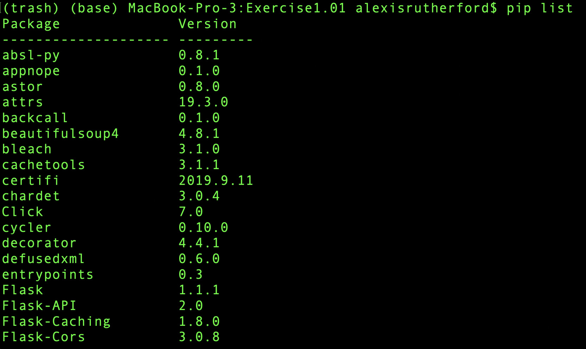
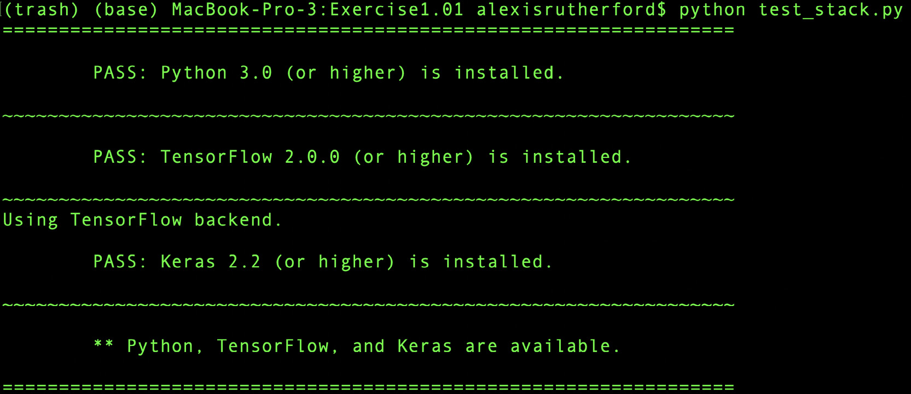
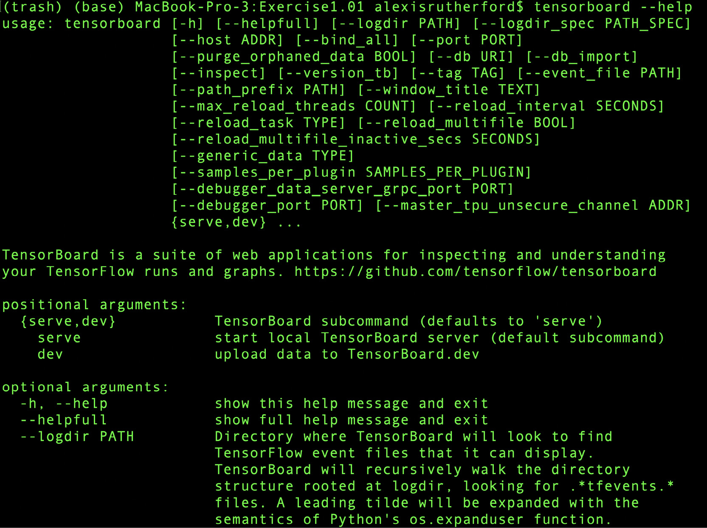
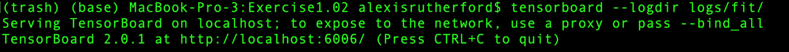
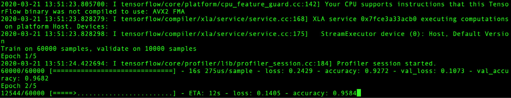
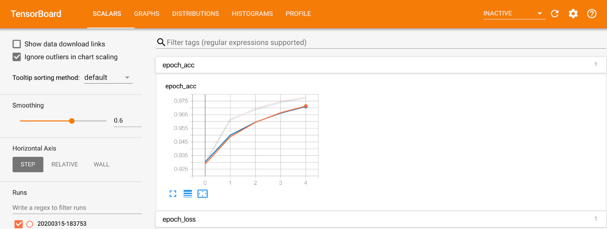

Lab 12: TensorFlow Overview
===========================


Exercise 1.01: Verifying the Software Components
------------------------------------------------

Before we explore a trained neural network, let\'s verify whether all
the software components that we need are available. We have included a
script that verifies whether these components work. Let\'s take a moment
to run the script and deal with any eventual problems we may find. We
will now be testing whether the software components required for this
book are available in your working environment.


1.  To check the available libraries installed, please use the following command:

    ```
    $ pip list
    ```

    The output will be as follows:




4.  As a final step in this exercise, execute the notebook
    `test_stack.ipynb`. This can be found in `Exercise1.01` folder. It verifies that all the required
    packages for this book are installed and available in your system.

5.  Run the following script to check if the dependencies of Python 3,
    TensorFlow, and Keras are available.
    



6.  Run the following script command in your Terminal to find more
    information on how to configure TensorBoard:

    ```
    $ tensorboard –help
    ```

    The output is as follows:





Training a Neural Network with TensorFlow
-----------------------------------------

Now, let\'s train a neural network to recognize new digits using the
MNIST dataset. We will be implementing a special-purpose neural network
called a **Convolutional Neural Network**(**CNN**) to solve this problem
(we will discuss those in more detail in later sections). Our complete
network contains three hidden layers: two fully connected layers and a
convolutional layer. The model is defined by the following TensorFlow
snippet of Python code:


```
model = Sequential()
model.add(Convolution2D(filters = 10, kernel_size = 3, input_shape=(28,28,1)))
model.add(Flatten())
model.add(Dense(128, activation = 'relu'))
model.add(Dropout(0.2))
model.add(Dense(10, activation = 'softmax'))
```

Note

Use the `mnist.py` file for your reference in `Exercise1.02`. Follow along by opening the script in your
code editor.

We execute the preceding snippet of code only once during the training
of our network.


Now let\'s train that network to evaluate how it performs in the MNIST dataset.


Exercise 1.02: Training a Neural Network Using the MNIST Dataset
----------------------------------------------------------------

In this exercise, we will train a neural network for detecting
handwritten digits from the MNIST dataset. Execute the following steps
to set up this exercise:

1.  Open two Terminal instances.

2.  Navigate to `Exercise1.02` folder. 

3.  In one of them, start a TensorBoard server with the following
    command:

    ```
    $ tensorboard --logdir logs/fit
    ```

    The output is as follows:
 


    In the other, run the `mnist.py` script from within that
    directory with the following command:

    ```
    $ python mnist.py
    ```

    When you start running the script, you will see the progress bar as
    follows:

    



4.  Open your browser and navigate to the TensorBoard URL provided when
    you start the server in *step 3*, it might be
    `http://localhost:6006/` or similar. In the Terminal where
    you ran the `mnist.py` script, you will see a progress bar
    with the epochs of the model. When you open the browser page, you
    will see a couple of graphs, `epoch_accuracy` and
    `epoch_loss` graphs. Ideally, the accuracy should improve
    with each iteration and the loss should decrease with each
    iteration. You can confirm this visually with the graphs.

5.  Click the `epoch_accuracy` graph, enlarge it, and let the
    page refresh (or click on the `refresh` icon). You will
    see the model gaining accuracy as the epochs go by:





We can see that after about 5 epochs (or steps), the network surpassed
97% accuracy. That is, the network is getting 97% of the digits in the
test set correct by this point.


This section does not currently have an online interactive example, and
will need to be run locally.

Now, let\'s also test how well those networks perform with unseen data.


Activity 1.01: Training a Neural Network with Different Hyperparameters
-----------------------------------------------------------------------

In this section, we will explore the neural network that we trained
during our work on *Exercise 1.02*, *Training a Neural Network Using the
MNIST Dataset*, where we trained our own CNN on the MNIST dataset. We
have provided that same trained network as binary files in the directory
of this book. In this activity, we will just cover the things that you
can do using TensorBoard and we will train several other networks by
just changing some hyperparameters.

Here are the steps you need to follow:

1.  Open TensorBoard by writing the appropriate command.

2.  Open the TensorBoard accuracy graph and play with the values of
    smoothening sliders in scalar areas.

3.  Train another model by changing the hyperparameters.

4.  Try decreasing the learning rate and increasing the number of
    epochs.

5.  Now try to understand what effect this hyperparameter tuning has on
    the graphs generated on TensorBoard.

6.  Try increasing the learning rate and decreasing the number of epochs
    and repeat *step 5*.


Summary
=======

In this lab, we explored a TensorFlow-trained neural network using
TensorBoard and trained our own modified version of that network with
different epochs and learning rates. This gave you hands-on experience
of how to train a highly performant neural network and allowed you to
explore some of its limitations.
